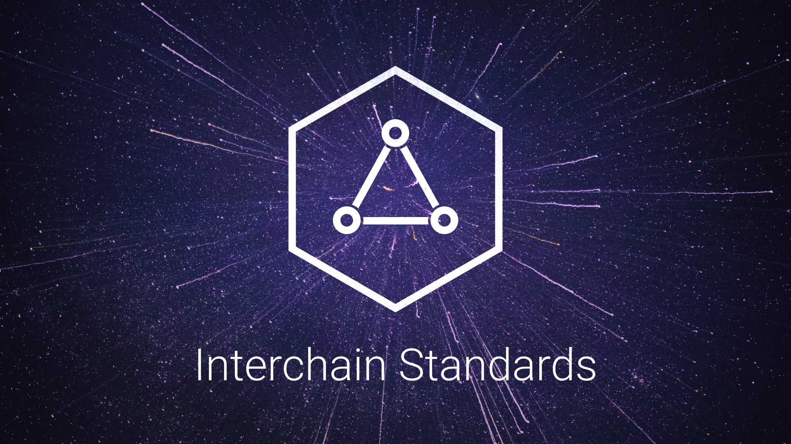

# IBC

## Synopsis

This repository is the canonical location for development and documentation of the inter-blockchain communication protocol (IBC).

It shall be used to consolidate design rationale, protocol semantics, and encoding descriptions for IBC, including both the core transport, authentication, & ordering layer (IBC/TAO) and the application layers describing packet encoding & processing semantics (IBC/APP).

Contributions are welcome. See [CONTRIBUTING.md](meta/CONTRIBUTING.md) for contribution guidelines.

See [ROADMAP.md](meta/ROADMAP.md) for a public up-to-date version of our roadmap.

## What is IBC?

<!-- markdown-link-check-disable-next-line -->
For a high-level explanation of what IBC is and how it works, please read [this blog post](https://medium.com/the-interchain-foundation/eli5-what-is-ibc-def44d7b5b4c).

## Interchain Standards

All standards at or past the "Draft" stage are listed here in order of their ICS numbers, sorted by category.

### Meta

| Interchain Standard Number               | Standard Title             | Stage |
| ---------------------------------------- | -------------------------- | ----- |
| [1](spec/ics-001-ics-standard/README.md) | ICS Specification Standard | N/A   |

### Core

| Interchain Standard Number                                    | Standard Title             | Stage     | Implementations |
| ------------------------------------------------------------- | -------------------------- | --------- | --------------- |
| [2](spec/core/ics-002-client-semantics/README.md)             | Client Semantics           | Candidate | [ibc-go](https://github.com/cosmos/ibc-go) |
| [3](spec/core/ics-003-connection-semantics/README.md)         | Connection Semantics       | Candidate | [ibc-go](https://github.com/cosmos/ibc-go) |
| [4](spec/core/ics-004-channel-and-packet-semantics/README.md) | Channel & Packet Semantics | Candidate | [ibc-go](https://github.com/cosmos/ibc-go) |
| [5](spec/core/ics-005-port-allocation/README.md)              | Port Allocation            | Candidate | [ibc-go](https://github.com/cosmos/ibc-go) |
| [23](spec/core/ics-023-vector-commitments/README.md)          | Vector Commitments         | Candidate | [ibc-go](https://github.com/cosmos/ibc-go) |
| [24](spec/core/ics-024-host-requirements/README.md)           | Host Requirements          | Candidate | [ibc-go](https://github.com/cosmos/ibc-go) |
| [25](spec/core/ics-025-handler-interface/README.md)           | Handler Interface          | Candidate | [ibc-go](https://github.com/cosmos/ibc-go) |
| [26](spec/core/ics-026-routing-module/README.md)              | Routing Module             | Candidate | [ibc-go](https://github.com/cosmos/ibc-go) |
| [33](spec/core/ics-033-multi-hop/README.md)                   | Multi-hop Messaging        | Candidate | [ibc-go](https://github.com/cosmos/ibc-go) |

### Client

| Interchain Standard Number                                      | Standard Title             | Stage | Implementations |
| --------------------------------------------------------------- | -------------------------- | ----- | --------------- |
| [6](spec/client/ics-006-solo-machine-client/README.md)          | Solo Machine Client        | Candidate | [ibc-go](https://github.com/cosmos/ibc-go/tree/main/modules/light-clients/06-solomachine) |
| [7](spec/client/ics-007-tendermint-client/README.md)            | Tendermint Client          | Candidate | [ibc-go](https://github.com/cosmos/ibc-go/tree/main/modules/light-clients/07-tendermint) |
| [8](spec/client/ics-008-wasm-client/README.md)                  | Wasm Client                | Draft | |
| [10](spec/client/ics-010-grandpa-client/README.md)              | GRANDPA Client             | Draft | |

### Relayer

| Interchain Standard Number                                       | Standard Title             | Stage | Implementations |
| ---------------------------------------------------------------- | -------------------------- | ----- | --------------- |
| [18](spec/relayer/ics-018-relayer-algorithms/README.md)          | Relayer Algorithms         | Finalised | [go-relayer](https://github.com/cosmos/relayer), [rust-relayer](https://github.com/informalsystems/ibc-rs), [ts-relayer](https://github.com/confio/ts-relayer) |

### App

| Interchain Standard Number                               | Standard Title          | Stage | Implementations |
| -------------------------------------------------------- | ----------------------- | ----- | --------------- |
| [20](spec/app/ics-020-fungible-token-transfer/README.md) | Fungible Token Transfer | Candidate | [ibc-go](https://github.com/cosmos/ibc-go/tree/main/modules/apps/transfer) |
| [27](spec/app/ics-027-interchain-accounts/README.md)     | Interchain Accounts     | Candidate | [ibc-go](https://github.com/cosmos/ibc-go/tree/main/modules/apps/27-interchain-accounts) |
| [28](spec/app/ics-028-cross-chain-validation/README.md)  | Cross-Chain Validation  | Draft | |
| [29](spec/app/ics-029-fee-payment) | General Relayer Incentivisation Mechanism | Candidate | [ibc-go](https://github.com/cosmos/ibc-go/tree/main/modules/apps/29-fee) |
| [30](spec/app/ics-030-middleware) | IBC Application Middleware | N/A | N/A |
| [31](spec/app/ics-031-crosschain-queries) | Cross-Chain Queries | Draft | N/A |
| [721](spec/app/ics-721-nft-transfer) | Non-Fungible Token Transfer | Candidate | [bianjieai](https://github.com/bianjieai/ibc-go/tree/ics-721-nft-transfer) |

## Translations

The Interchain Standards are also translated into the following languages:

- [Chinese](https://github.com/octopus-network/ibc-spec-cn)
