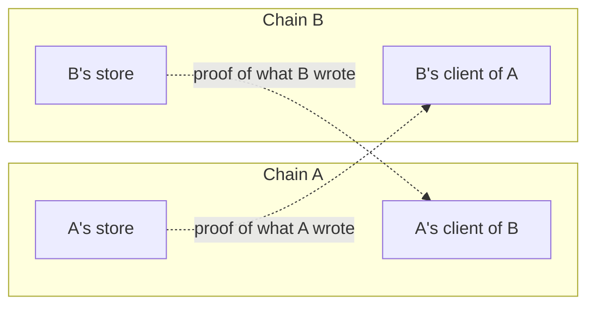

A client is how one chain verifies another. It is the verification layer of IBC: an on-chain snapshot of a counterparty chain that lets a chain check claims about that counterparty's state for itself. This page covers what a client holds, what it can be asked to verify, how it stays current, and how two chains connect before any packet moves.

## What a client is

Every claim that crosses between two chains has to be proven to the chain receiving it. Receiving a packet needs proof that the sender committed it, acknowledging needs proof that the receiver wrote an acknowledgement, and settling a timeout needs proof that the packet was never received. A client is what checks those proofs.

A client does not follow the counterparty's whole block history to do this. Instead, a client holds only what it needs to check a claim, one height at a time.

For packets to move both between chains, each chain holds a client of the other. Each client records the other as its counterparty. That mirrored pair is a connection, and it is what lets two chains verify each other.



Each client lives under a client identifier in the [router's](/how-ibc-works/core-router-and-store) client registry, which is how the router reaches it. In IBC-solidity each registry entry is two things: the address of the light-client contract that does the verifying, and a record of the counterparty client on the counterparty chain.

## Client state and consensus state

A client keeps two kinds of state:

- **Client state** is its configuration and status: how it decides what to trust, the latest height it has verified, and whether it has been frozen. A client reports it on request. For the [attestation light client](/light-clients/attestation-light-client) that is four fields: the fixed attestor list, the quorum threshold, the latest known height, and a frozen flag.
- **Consensus state** is what the client has accepted as true about the counterparty at one height, and it keeps one entry per height. What an entry holds depends on the client type. For example, the attestation light client stores a trusted timestamp.

There is one client state, and it changes in place as its latest height advances. Consensus states accumulate. So a client trusts a set of individually verified heights rather than the counterparty as a whole, and a proof can be checked only at a height the client already holds an entry for. That is why an update is part of every relay.

## What a light client verifies

A proof is evidence that a claim about the counterparty's state is true. A client answers five calls, and in IBC-solidity they are the whole `ILightClient` interface.

```solidity
function updateClient(bytes calldata updateMsg) external returns (ILightClientMsgs.UpdateResult);
function verifyMembership(ILightClientMsgs.MsgVerifyMembership calldata msg_) external returns (uint256);
function verifyNonMembership(ILightClientMsgs.MsgVerifyNonMembership calldata msg_) external returns (uint256);
function misbehaviour(bytes calldata misbehaviourMsg) external;
function getClientState() external view returns (bytes memory);
```

The paths a client is asked about are in the counterparty's [store](/how-ibc-works/core-router-and-store), and the values are the commitments, receipts, and acknowledgements the router writes there.

```solidity
struct MsgVerifyMembership {
    bytes proof;
    IICS02ClientMsgs.Height proofHeight;
    bytes[] path;
    bytes value;
}
```

On an arriving packet the router fills that request in itself. The location of a packet commitment is derived deterministically from a packet's source client and sequence, and it recomputes the commitment path from the packet's own fields rather than trusting any value it was handed. The client then uses the attached proof and counterparty state it stores to verify the existence of state at that commitment path. If the proof holds, so does the claim.

Alter any part of the packet and the commitment no longer matches what the source chain stored. Alter the source client or the sequence and the router looks at a different path. Either way, verification fails.

A non-membership request is the same without `value`, because there is nothing to expect. It proves that the counterparty held no record at a path, at the height proven. That is how a timeout is settled: no receipt for the packet, at a height whose timestamp is already past the packet's timeout.

Either call returns the counterparty's timestamp at the verified height, which the router uses only when settling a timeout.

## Client types

IBC supports many client types. What differs between them is only how each one decides what to trust. They all have the same job: verify a claim about a record in the counterparty's [store](/how-ibc-works/core-router-and-store). In addition, they all must implement [the interface above](#what-a-light-client-verifies).

The [attestation light client](/light-clients/attestation-light-client) is one example. It trusts a fixed set of attestors, and accepts a claim signed by a quorum of them at a height it already holds.

Because a proof is opaque bytes to IBC, the router never needs to know how a client decides what to trust. That is what lets IBC connect chains with different security models.

## Updating a client

An update advances a client's view of the counterparty to a later height, so a packet proven at that height has something to be checked against. It usually travels with the packet it serves, submitted in the same transaction.

[Relayers](/how-ibc-works/relayer) do the updating. In IBC-solidity they call the router's `updateClient`, which is role-gated and forwards the update to the client as opaque bytes. The contracts' role library names a relayer role for that selector, and no deployment path that ships leaves it there. `ibc deploy core` binds that selector to the [public role](/ibc-solidity-contracts/permissions-and-upgrades#the-access-manager-and-its-roles) instead, so any address may relay on a chain the IBC CLI brings up.

```solidity
enum UpdateResult { Update, Misbehaviour, NoOp }
```

An update returns one of three results:

- `Update`: the evidence held, and a new trusted height was added.
- `NoOp`: the client already knew that height, so nothing changed.
- `Misbehaviour`: the evidence contradicted something the client already trusted. The [attestation light client](/light-clients/attestation-light-client) freezes when that happens, and a frozen client verifies nothing afterwards.

Evidence is anything that shows the counterparty violated what its client trusts it on. A client can also be handed it directly, through the `misbehaviour` call. The attestation light client rejects that call, so the `Misbehaviour` result above is the only way it learns of misbehaviour.

## Connecting two chains

Before any packet moves, each chain adds a client of its counterparty. Each side gains a verified view of the other, and the two views are paired into a connection.

```solidity
function addClient(
    IICS02ClientMsgs.CounterpartyInfo calldata counterpartyInfo,
    address client
) external returns (string memory);

struct CounterpartyInfo {
    string clientId;
    bytes[] merklePrefix;
}
```

- `clientId` is the counterparty's own identifier for the client on its side. It pairs the two clients into one connection, and the router reads it for two purposes: to fill in a packet's destination client on a send, and to check that every incoming message names the client recorded as the counterparty on this side, on receive, acknowledge, and timeout alike .
- `merklePrefix` is where the counterparty keeps its IBC state. The router puts it in front of every path before asking the client to verify. Without it a path would point at the wrong place in the counterparty's state, and verification would fail.

What a client checks claims against is fixed when it is deployed. The attestation light client takes its attestor set and threshold as constructor arguments, so a different set means a new deployment.

After deploying IBC to two chains, an IBC client connection between them involves the following:

1. Deploy the light client for the counterparty chain, configured with whatever it will check that chain's claims against. The attestation light client also takes a [role manager](/ibc-solidity-contracts/attestation-light-client#roles-and-permissions), the address that may submit proofs to it and that administers its roles afterwards. `ibc deploy client` names the router there, which grants the router that permission at deployment. The zero address opens submission to anyone.
2. Register it with `addClient`, naming the counterparty's client identifier and merkle prefix.
3. Register each application on a port, so the router can deliver payloads to it. See [ports and registration](/how-ibc-works/packets-and-applications#ports-and-registration).

