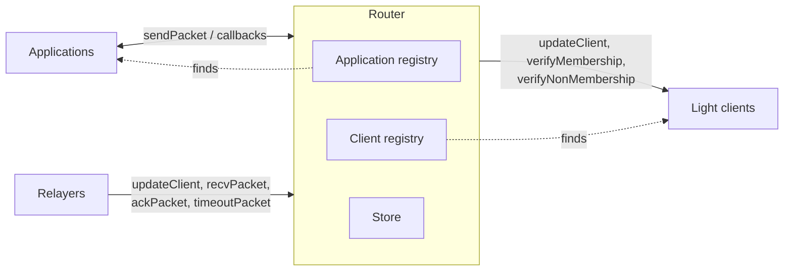

IBC core is the on-chain machinery the rest of the protocol runs on. Every IBC-connected chain runs its own router and store.

## The router

The router is the single on-chain entry point for IBC packet operations, outbound or inbound. It sits between the [applications](/how-ibc-works/packets-and-applications) that own payloads and the [light clients](/how-ibc-works/clients-and-counterparties) that verify proofs. It is the only component that talks to both. In IBC-solidity the router is the [`ICS26Router` contract](/ibc-solidity-contracts/ics26-router).

The router exposes four packet operations:

- `sendPacket`: takes an outbound message from an application, fills in the destination client and sequence, and records the packet.
- `recvPacket`: accepts an inbound packet, records that it arrived, calls the application it is addressed to, and records the acknowledgement it returns.
- `ackPacket`: closes out a delivered packet on the source chain and hands the answer to the sending application.
- `timeoutPacket`: closes out an undelivered packet on the source chain once its deadline has passed, and tells the sending application.

An application calls `sendPacket`. A relayer calls the other three and, when needed, `updateClient` to bring the client that verifies the proof up to date. Those relay calls are [role-gated](/ibc-solidity-contracts/permissions-and-upgrades#the-access-manager-and-its-roles), although on a chain IBC Link brings up that gate admits any address.

For what each operation checks, and the order they run in, see the [packet lifecycle](/how-ibc-works/packet-lifecycle).

## Router registries

The router owns an application registry and a client registry. It finds every application and every client it needs through them.



The application registry maps a port to its application, and the client registry maps a client identifier to the light client that verifies a counterparty chain, along with the [counterparty information](/how-ibc-works/clients-and-counterparties) recorded for it. Between them the router can find which application an arriving payload belongs to, and which client can verify the proof that came with it.

Anyone can register an application under its address-derived port or a client under a generated identifier. Custom identifiers and client migration are role-gated. For how an application claims a port, see [ports and registration](/how-ibc-works/packets-and-applications#ports-and-registration). For the client side, see [connecting two chains](/how-ibc-works/clients-and-counterparties#connecting-two-chains).

## The store

The store is part of the router's state. It holds the commitments, receipts, and acknowledgements that a light client on the counterparty chain verifies.

In IBC-solidity, the store has two maps: records by hashed path, and a send-sequence counter per client.

```solidity
struct IBCStoreStorage {
    mapping(bytes32 hashedPath => bytes32 commitment) commitments;
    mapping(string clientId => uint64 prevSeqSend) prevSequenceSends;
}
```

The counter assigns each packet a sequence number, starting at 1. The sequence becomes part of the path where the packet's records are stored, giving each packet its own place in the store.

## The three kinds of record

- **Commitment**: written on the source chain when an application sends. A commitment is a fingerprint of the packet: a fixed-length hash over the destination client, the timeout, and the payload. The path it sits at carries the source client and the sequence, so the two together pin one packet. The full fields reach a relayer through the send event the router emits. The source chain deletes it once the packet is acknowledged or timed out, and that deletion is what marks the packet settled.
- **Receipt**: written on the destination chain when a packet is received. Its stored value is non-zero, but the protocol depends only on whether a value is present. Its presence stops the packet being delivered twice. Its provable absence is what lets the source chain time the packet out.
- **Acknowledgement**: written on the destination chain once the receiving application has been called, and written only once. When the call succeeds, it records a hash over the bytes that application returned, which is what lets the source chain verify those bytes once a relayer delivers them. When the call reverts with a reason, the router hashes a [reserved error acknowledgement](/ibc-solidity-contracts/ics26-router#acknowledgements-and-callback-failures) instead.

## Record paths

A record's protocol path has three parts: the client identifier's bytes, a one-byte tag for the kind of record, and the packet sequence as an eight-byte big-endian integer.

| Record | Path |
|--------|------|
| Commitment | source client + 0x01 + big-endian sequence |
| Receipt | destination client + 0x02 + big-endian sequence |
| Acknowledgement | destination client + 0x03 + big-endian sequence |

Each chain records the other's client identifier as part of its counterparty information, so the counterparty can rebuild the exact path for a specific record.

IBC-solidity hashes the raw path with keccak256 for its local commitments mapping. To verify a record in the counterparty's store, the router prefixes the raw path with the [merkle prefix](/how-ibc-works/clients-and-counterparties) recorded for that counterparty and hands it to the client, which verifies the record's presence or absence.
