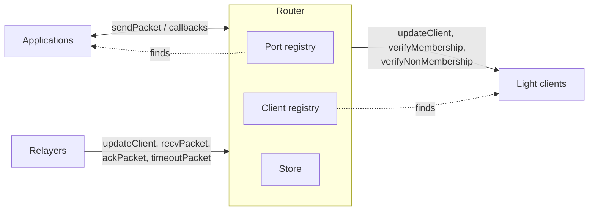

IBC core is the on-chain machinery the rest of the protocol runs on. Every IBC-connected chain runs its own deployment of it.

IBC core contains:

- The **router**: the entry point and coordinator.
- The **store**: the provable record the counterparty verifies against.

This page covers where the router sits and what it owns, then the store's shape and the records it holds.

## The router

The router is the single on-chain entry point for IBC. Every packet operation on the chain goes through it, outbound or inbound. It sits between the [applications](/how-ibc-works/packets-and-applications) that own payloads and the [light clients](/how-ibc-works/clients-and-counterparties) that verify proofs. It is the only component that talks to both. In IBC-solidity the router is the [`ICS26Router` contract](/ibc-solidity-contracts/ics26-router).

Everything the router does with a packet is one of four calls:

- `sendPacket`: takes an outbound packet from an application, fills in its destination client from the counterparty recorded for the source client, and records it.
- `recvPacket`: accepts an inbound packet, records that it arrived, and calls the application it is addressed to.
- `ackPacket`: closes out a delivered packet on the source chain and hands the answer to the sending application.
- `timeoutPacket`: closes out an undelivered packet on the source chain once its deadline has passed, and tells the sending application.

An application calls `sendPacket`. A relayer calls the other three, and `updateClient` alongside them to keep whichever client verifies the proof current .

For what each operation checks, and the order they run in, see the [packet lifecycle](/how-ibc-works/packet-lifecycle).

## Router registries

The router owns a port registry and a client registry. It finds every application and every client it needs through them.



The port registry maps a port to its application, and the client registry maps a client identifier to the light client that verifies that counterparty, along with the [counterparty information](/how-ibc-works/clients-and-counterparties) recorded for it. Between them the router can find which application an arriving payload belongs to, and which client can verify the proof that came with it.

Anyone can add to either registry. An admin can replace a client entry with `migrateClient`. For how an application claims a port, see [ports and registration](/how-ibc-works/packets-and-applications#ports-and-registration). For the client side, see [connecting two chains](/how-ibc-works/clients-and-counterparties#connecting-two-chains).

Three lookups read these registries: the application for a port, the client for a client identifier, and the counterparty for a client identifier.

```solidity
function getIBCApp(string calldata portId) external view returns (IIBCApp);
function getClient(string calldata clientId) external view returns (ILightClient);
function getCounterparty(string calldata clientId) external view returns (IICS02ClientMsgs.CounterpartyInfo memory);
```

## The store

The store is the router's own state, and it holds the provable records a counterparty verifies against: commitments, receipts, and acknowledgements. Those records are what a light client on the counterparty chain verifies when it checks a claim.

In IBC-solidity, the router holds two maps: records by hashed path, and a send-sequence counter per client.

```solidity
struct IBCStoreStorage {
    mapping(bytes32 hashedPath => bytes32 commitment) commitments;
    mapping(string clientId => uint64 prevSeqSend) prevSequenceSends;
}
```

The counter gives each packet its sequence number, and the router increments it on every send. The sequence becomes part of the path where the packet's records are stored, giving each packet its own place in the store. That is what lets another chain verify a claim about one specific packet.

A record is read by looking up its hashed path.

## The three kinds of record

The store holds three kinds of record, distinguished by the path each sits at.

- **Commitment**: written on the source chain when an application sends. A commitment is a fingerprint of the packet: a fixed-length hash over the destination client, the timeout, and the payload. The path it sits at carries the source client and the sequence, so the two together pin one packet. The full fields reach a relayer through the send event the router emits. The source chain deletes it once the packet is acknowledged or timed out, and that deletion is what marks the packet settled.
- **Receipt**: written on the destination chain when a packet is received. Its stored value is a non-zero marker, so only presence or absence matters. Its presence stops the packet being delivered twice. Its provable absence is what lets the source chain time the packet out.
- **Acknowledgement**: written on the destination chain once the receiving application has been called, and written only once. When the call succeeds, it records a hash over the bytes that application returned, which is what lets the source chain verify those bytes once a relayer delivers them. When the call reverts with a reason, the router hashes a [reserved error acknowledgement](/ibc-solidity-contracts/ics26-router#acknowledgements-and-callback-failures) instead.

## Record paths

A record's path has three parts: a client identifier, a one-byte tag for the kind of record, and the packet's sequence number. That path is hashed, and the hash is the key the record sits under.

| Record | Path | Key |
|--------|------|-----|
| Commitment | source client + 0x01 + packet sequence | keccak256 of the path |
| Receipt | destination client + 0x02 + packet sequence | keccak256 of the path |
| Acknowledgement | destination client + 0x03 + packet sequence | keccak256 of the path |

Each chain records the other's client identifier as part of its counterparty information, so every record sits where the counterparty knows to look for it.

The tag keeps the three kinds from colliding at the same client and sequence. Because every part is known in advance, any party can rebuild the exact path of a record it has never seen. That is what makes a proof of one specific record possible.

A chain reaches a record in its counterparty's store through its own client. Its router prefixes the path with the [merkle prefix](/how-ibc-works/clients-and-counterparties) recorded for that counterparty. It then hands the prefixed path to the client, which proves the record present or absent.
