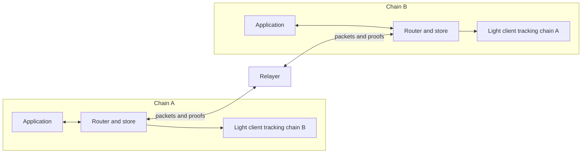
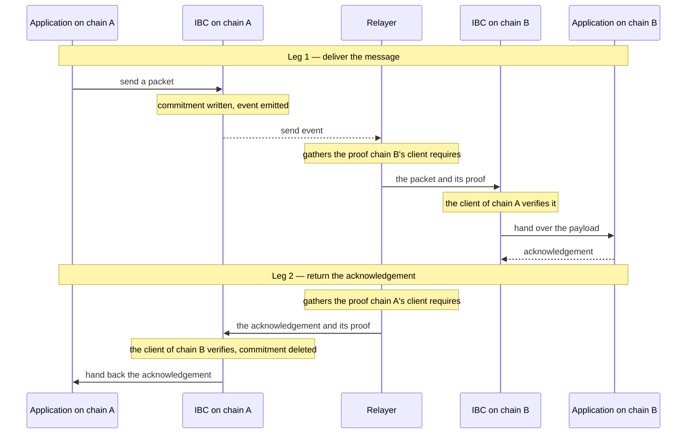

IBC lets two independent chains exchange messages; each side verifies for itself what the counterparty wrote before acting on it. Applications decide what a message means, and IBC delivers it and proves the counterparty sent it.

A single cross-chain message relies on a set of on-chain and off-chain components working together:

- **Applications** define what a message means and what happens when it arrives.
- **Packets** are the containers that carry a message.
- **IBC core** is the on-chain router and store: it routes packets and records their state.
- **Relayers** are off-chain services that carry packets and proofs between chains.
- **Clients** are the on-chain verification layer: a light client of each counterparty that checks claims about its state.

This page introduces each one, then walks a packet from send to settlement.

Two chains implement the IBC stack with applications, the IBC core, and a client. On each chain the router records its client's counterparty, the client identifier on the other side. That mirrored pair of clients is what creates a connection.

## Applications

An application owns what a message means. It decides what to send, how to encode it, and what to do when one arrives. It initiates a send message, and it receives a callback on every outcome.

Every application on a chain registers with the IBC Core router under a port identifier. Ports are how the router knows which application a packet is for. Applications can be anything, as long as they implement the necessary interface. [GMP](/applications/gmp), short for general message passing, is an IBC application that carries a contract call to the other chain. An [IFT](/applications/ift), an interchain fungible token, is an issuer's token that moves by sending GMP calls. The [Packets and applications](/how-ibc-works/packets-and-applications) page covers applications in more detail.

## Packets

A packet is the container that carries a message between chains.
Packets contain the following information:
- `sequence`: the packet's number, assigned by the router when it accepts the send.
- `sourceClient` and `destClient`: the client identifiers on each side of the connection.
- `timeoutTimestamp`: a deadline in unix seconds, after which the packet can no longer be received.
- `payloads`: the application's message as bytes.

Packets travel alongside proofs which are used to verify the packet on the counterparty chain.

The payload carries the message content and names the destination application that will handle the message.
## IBC core: the router and the store

IBC core is the on-chain machinery every packet operation goes through. It has two parts:

- The [router](/how-ibc-works/core-router-and-store) is the single entry point. It accepts a send from an application, routes an arriving packet to the application its payload names, and calls a light client for every claim about the other chain. In IBC-solidity it is the `ICS26Router` contract.

- The [store](/how-ibc-works/core-router-and-store#the-store) is the provable record of what a chain wrote about each packet. A send writes a commitment there, a hash over the destination client, the timeout, and the payload. That hash is the evidence every later step is checked against.

## Relayers

A relayer is the off-chain courier. Chains cannot call each other, so every cross-chain step arrives as a transaction a relayer submits. For one packet it:

- Reads the send event from the source chain and waits for the send to be final.
- Gathers the proof the destination chain's client needs.
- Submits the packet and that proof to the destination chain.
- Repeats those steps in the other direction, to return the acknowledgement.
- Proves the timeout on the source chain instead, if the packet timed out. That path waits for the deadline to pass rather than for a transaction to be final.

A relayer is trusted for liveness alone: it can never forge or alter a packet, because changing any of its contents breaks the proof the client checks. Visit the [Relayer](/how-ibc-works/relayer) page for more information.

## Clients

Each chain runs a client of its counterparty: the verifier that decides whether a claim about the other chain is true. On the source chain, the router stores a hashed record of each packet. On the destination chain, the client tracking the source chain checks a proof of that record against the packet it received. A proof that holds shows the source chain committed that packet.

A client can also check a proof that no record exists at a path. That is how a timeout settles: the destination chain wrote no receipt for the packet.

So when a packet arrives claiming to come from chain A, chain B checks it against its own client of chain A rather than trusting the relayer that delivered it.

Every client answers the same interface, and each one implements verification the way its trust model requires. There can be many different client types. One example is an [attestation light client](/light-clients/attestation-light-client), which accepts a claim a quorum of a fixed [attestor set](/light-clients/attestors) signed at a height it already holds.

## The flow

IBC packets travel in two legs. The first leg delivers the packet to the destination chain. The second leg returns an acknowledgement (the destination application's answer) to the sender. Every cross chain step is carried by a relayer:

1. An application calls the router to send a packet.
2. The router fills in the destination client from the counterparty registered for the source client, assigns the next sequence number, writes the commitment, and emits the send event.
3. The relayer waits for the send transaction to be final on the source chain.
4. It gathers the proof of that commitment that the destination chain's client requires.
5. It submits the packet and that proof to the destination router in one transaction.
6. The destination client is brought up to a height that covers the send, then verifies the commitment against the proof at that height.
7. The router writes a receipt, calls the application named by the payload's destination port, and commits that application's answer as an acknowledgement.
8. The relayer gathers the matching proof from the destination chain and submits the acknowledgement to the source router, where the source chain's client verifies the destination chain wrote it.
9. The source router deletes the commitment and calls the sending application back with the acknowledgement bytes.

A failure still comes back as an answer. When the destination application fails, the router substitutes a reserved error acknowledgement for its bytes, and that reaches the sender at step 9. A few failures produce no acknowledgement at all, where the router rejects the whole receive. One of those leaves the packet to be relayed again, and the rest leave a timeout as the only ending. See [acknowledgements and callback failures](/ibc-solidity-contracts/ics26-router#acknowledgements-and-callback-failures) for more information.

A packet that never arrives ends the other way. Once its timeout has passed, the relayer proves on the source chain that the destination chain holds no receipt for it, and the router deletes the commitment and calls the sending application's timeout callback. The receiving side rejects a packet whose timeout has passed, so a delivered packet can never time out and a timed-out packet can never be delivered. The [packet lifecycle](/how-ibc-works/packet-lifecycle) follows both endings step by step.

Every chain trusts only what its own client has verified. Neither side trusts the relayer, and neither takes the other's claims directly.
