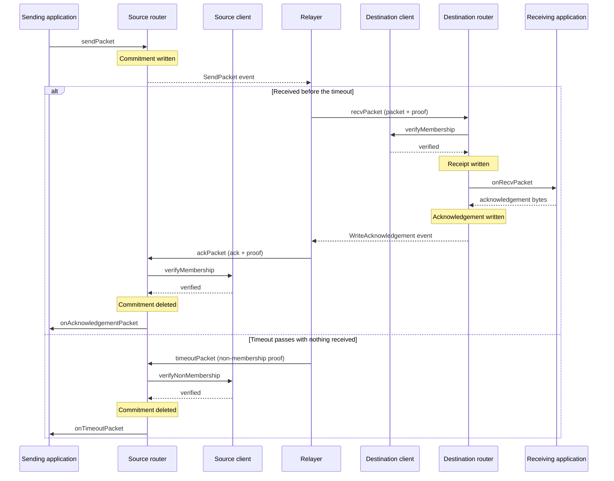

IBC is a protocol for moving data verifiably between two chains. That data travels in packets, which a relayer carries between the chains.

The packet lifecycle is the set of steps that carries a packet from an application on a source chain to a destination chain, and then back to the source chain with a settled outcome.

## IBC calls

Four calls move a packet in IBC:

| Call | Submitted by | Submitted to | Application callback |
|---|---|---|---|
| `sendPacket` | the sending application | the source router | none |
| `recvPacket` | a relayer | the destination router | `onRecvPacket`, on the receiving application |
| `ackPacket` | a relayer | the source router | `onAcknowledgementPacket`, on the sending application |
| `timeoutPacket` | a relayer | the source router | `onTimeoutPacket`, on the sending application |

 `sendPacket` is an application's own call, and the [router](/how-ibc-works/core-router-and-store) accepts it only from the application registered on the payload's source port. The other three are role-gated: a [relayer](/how-ibc-works/relayer) submits them, and each chain's [role map](/ibc-solidity-contracts/permissions-and-upgrades#the-access-manager-and-its-roles) decides which addresses it admits to those calls. On a chain the IBC CLI brings up, that map admits any address.

A relayer stands between every pair of steps. Each chain learns what the other wrote only through a proof its own [client](/how-ibc-works/clients-and-counterparties) verifies, and the store keeps only a hash of the packet, so the send event is what carries its fields to a relayer. That client has to be current for the proof to verify. So a relayer packs `updateClient` into the same transaction, ahead of the call it is relaying.

## Sending a packet

Sending a packet begins inside the application. The application runs its own logic first, then calls `sendPacket` on the source [router](/how-ibc-works/core-router-and-store) with a source client, a timeout, and a [payload](/how-ibc-works/packets-and-applications#the-payload) which carries the application's message. The source router then runs the following:

1. **Check the caller**: it must be the application registered on the payload's source port.
2. **Look up the counterparty**: it reads the counterparty registered for the source client.
3. **Check the deadline**: the timeout must be in the future and not past a maximum.
4. **Fill in the packet**: it sets that counterparty as the destination client and takes a sequence from a per-client counter.
5. **Write the commitment**: it writes a fixed-length hash over the destination client, the timeout, and the payload, at a path built from the source client and the sequence. This is written to the commitment store.
6. **Emit `SendPacket`**: the event carries all packet fields, which is how a relayer reconstructs the packet.

A relayer then reconstructs the packet from the event and submits it to the destination router.

## Receiving a packet

A relayer submits `recvPacket` to the destination router, with the packet, a proof of the packet commitment, and the height that proof is against.

Then the destination router runs the following steps:
1. **Check the route**: ensure the packet's source client is the counterparty registered for its destination client.
2. **Check the deadline**: ensure the packet's timeout is still in the future.
3. **Verify the proof**: the destination client confirms that the packet's commitment matches the commitment in the router store on the source chain, at the packet's path under the counterparty's merkle prefix.
4. **Write the receipt**: a receipt is written to the router store proving the packet was delivered. If a receipt is already written, the handler records a no-op and returns without calling the application, preventing the same packet from being delivered twice.
5. **Call the application**: the router passes the payload to the destination application. The destination application's `onRecvPacket` runs and returns acknowledgement bytes to the router.
6. **Commit the acknowledgement**: the destination router writes an acknowledgement commitment to its store. It then emits `WriteAcknowledgement`, carrying the full packet and the acknowledgement bytes for the relayer to carry back to the source chain.

If the application fails, the router commits a single reserved error value in place of its bytes, and emits the reason as `IBCAppRecvPacketCallbackError` on the destination chain. The reserved value is the same for every failure, so the reason never crosses to the source chain.

A few failures produce no acknowledgement at all. One of those leaves the packet to be relayed again, and the rest leave a timeout as the only ending. See [acknowledgements and callback failures](/ibc-solidity-contracts/ics26-router#acknowledgements-and-callback-failures).

## Acknowledging on the source chain

The relayer carries the packet, the acknowledgement bytes, and a proof back to the source chain, and submits them to `ackPacket` on the source router. The source router then runs the following:

1. **Check the route**: the packet's destination client must be the counterparty registered for its source client.
2. **Verify the proof**: the router recomputes the acknowledgement commitment locally, and its client must prove the destination chain stored exactly that value at the acknowledgement path.
3. **Delete the commitment**: the router first hashes the relayer-supplied packet and requires it to match what is stored, so an acknowledgement only ever applies to the packet that was sent. If no commitment is there, the handler records a no-op, which is what makes a repeated relay harmless.
4. **Call the application**: the sending application's `onAcknowledgementPacket` runs with the payload and the acknowledgement bytes, and the router emits `AckPacket`.

An acknowledgement tells the source chain how the receive went, whether the application succeeded or failed. Each application decides for itself what an error acknowledgement means. It compares the bytes against the reserved error value, then implements its own logic.

## Timing out a packet

A timeout is a proof of absence: the destination chain never wrote a receipt, and its clock has already passed the packet's deadline. After the deadline, a relayer calls `timeoutPacket` on the source router with a non-existence proof in place of an acknowledgement. The source router then runs the following:

1. **Check the route**: the packet's destination client must be the counterparty registered for its source client.
2. **Verify the absence**: the client proves non-membership of the receipt path on the destination chain, and returns the counterparty's timestamp at that height. The router requires that timestamp to have reached the packet's timeout.
3. **Delete the commitment**: the router first hashes the relayer-supplied packet and requires it to match what is stored, so a timeout only ever applies to the packet that was sent. If no commitment is there, the handler records a no-op.
4. **Call the application**: the sending application's `onTimeoutPacket` runs, and the router emits `TimeoutPacket`.

## What the protocol guarantees

The lifecycle rests on three proofs:

- **Receive**: the source committed the packet.
- **Acknowledge**: the destination committed an answer.
- **Timeout**: the destination recorded no receipt before the deadline.

With receipts and packet commitments, those proofs give the lifecycle its guarantees. A packet is delivered at most once and settles at most once. Neither chain acts on a claim about the other without verifying it first.

Acknowledgement and timeout are mutually exclusive. Both delete the packet commitment on the source chain, but they establish opposite facts about the destination. One proves an answer exists. The other proves a receipt does not.

The receipt is written before the receiving application runs, in the same transaction. So a proof that no receipt exists also proves nothing that application did was committed.

A packet can also settle never. `recvPacket` wraps the receiving application's callback, so a revert there carrying a reason becomes an error acknowledgement. `ackPacket` and `timeoutPacket` call the sending application with no such wrapper. If that callback always reverts, the call reverts with it, the commitment is never deleted, and neither ending can complete.

