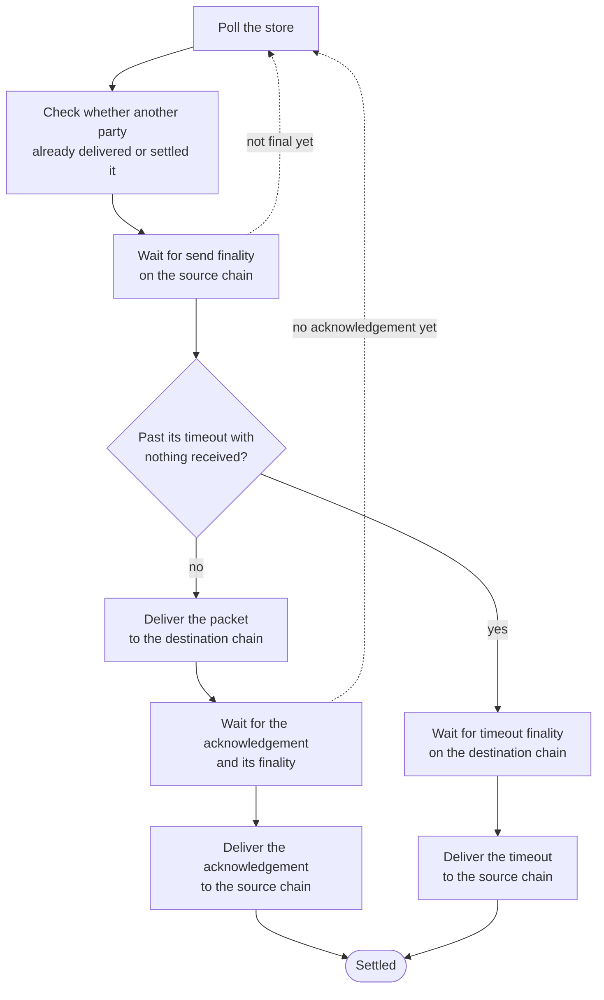

A relayer is the off-chain service that moves IBC packets between chains. It takes a packet already sent on a source chain, assembles the proof to update the destination chain's light client, and submits it to the destination router. It also delivers acknowledgements and timeouts back to the source chain.

A relayer is trusted for liveness alone: it decides when packets move, not what counts as true. Everything it carries is verified by the light client on the chain it delivers to, so an altered packet or proof would be rejected during verification.

## What a relayer does

Chains cannot interact with each other directly. Each one keeps a [light client](/how-ibc-works/clients-and-counterparties) of the other, but these only contain a snapshot of the counterparty's chain state that must be updated by external input. A relayer delivers everything a chain needs to accept state updates and packets from a counterparty.

- **The client update** The relayer calls `updateClient` with a proof of some state on the source chain to advance the destination client's snapshot. Every client type works this way, but the type of state and proof vary by client: for an [attestation light client](/light-clients/attestation-light-client) it is the source chain's height and timestamp proved by a quorum of attestor signatures.
- **The packet**: This is state committed on the source chain that the relayer delivers to the destination chain's [router](/how-ibc-works/core-router-and-store) along with a proof.
- **The answer.** To complete the packet lifecycle, there is a symmetric flow where the relayer relays state from the destination chain back to the source. This is either an acknowledgement created during packet receipt or a proof that packet receipt never occurred.

## Connections

The relayer must be configured with the details of a connection between two clients to relay it. Each connection in the relayer's configuration contains:

- Client information for each side, `clientA` and `clientB`, each identifying a client by its on-chain identifier, its type, and additional parameters that vary by client type.
- A signing key on each end, used to submit relay transactions on that end's own chain. Each key pays the gas for the transactions it submits, so it has to be funded on that chain. Relaying in both directions submits to both chains, so there must be a funded key on each chain.

Each configured connection is relayed bidirectionally so packets originating from either end are relayed.

## What starts a relay

Once an application sends a packet to the router on the source chain, the router commits it and emits its `SendPacket` event, which means it is ready to be relayed. The relayer configuration allows two options for packet discovery - if auto-relay is enabled the relayer detects the packet automatically and if it is disabled the transaction containing the packet must be submitted to the relayer api.

When a transaction creating packets is identified, the relayer reads the packet events, and stores packet details for configured connections in its database. Chain state holds only a 32-byte commitment, so a packet's contents live in the event the send emitted. Relaying depends on the ability to read transaction events, so relying on nodes that have pruned relevant transaction data stalls delivery.

## The relay pipeline

Every packet moves through the same fixed sequence of stages.

1. Check whether another party already delivered the packet or settled it.
2. Wait for the send to reach finality on the source chain.
3. Deliver the packet to the destination chain.
4. Wait for the acknowledgement, and for it to reach finality.
5. Deliver the acknowledgement back to the source chain.

A packet past its timeout with no receipt or acknowledgement gets a timeout delivered instead.

A packet that cannot finish in one pass stays in the store and is picked up on the next poll. That is how the relayer retries.

The two waiting periods are finality gates. Each gate asks what height can be proven right now, then compares. A send is gated on the destination client's attestors, because that client is the one that will verify the packet. The send transaction's height on the source chain must be at or below the height they can prove. An acknowledgement is gated the other way, on the source client's attestors, because the acknowledgement is proven back on the sending chain.

A timeout waits on nothing that was submitted, because no transaction carries it. Its gate reads the source client's attestors too, but compares a timestamp instead of a height. The destination chain's timestamp at the provable height must have passed the packet's timeout.

## Building a proof

What a proof contains depends on the client type it is built for. For [attestation light clients](/light-clients/attestation-light-client), a proof is the attested data plus the signatures over it.

The relayer runs one proof generator per configured client. To build an attestation proof it queries the attestors from the client's set that its own configuration lists, all at once. It keeps the responses whose signatures check out, and groups them by byte-identical attestation data. A group that reaches the client's threshold in distinct signers becomes the proof.

It proves against the highest height a threshold of attestors have reached, so one lagging attestor cannot hold the quorum back. If the threshold is out of reach the packet stays pending, and relaying resumes when the quorum returns.

Relaying a batch produces a state proof for the client update, plus one attestation covering every packet in the batch, both at a single height.

## Submitting the transaction

The relayer batches by call: packets ready for the same call go out together as one transaction to the router's `multicall`. The transaction carries one `updateClient` call, then one call per packet. The update carries the state proof, and every packet call carries the same attestation. The client scans the attested packets for the one the call names. The update goes first because the client rejects a proof at any height it holds no consensus timestamp for.

Where a call goes depends on what it is:

- Packets go to the [router](/how-ibc-works/core-router-and-store) on the destination chain.
- Acknowledgements and timeouts go back to the router on the source chain, which is where their proofs are checked.

What each call does once it lands is covered in the [packet lifecycle](/how-ibc-works/packet-lifecycle).

Relay transactions are EIP-1559 transactions, so a chain reporting no base fee is refused before one is built.

A transaction that fails, or stays pending past a time limit, is cleared by the retry stage and delivered again on a later poll.

## Tracking a packet

The relayer's API reports one entry for each packet it stored from a send transaction: the state, the sequence, the source client, and the transaction hashes recorded on each leg.

A packet's state reads as one of:

- **Not selected**: the relay request left this packet out. A later request naming it moves it to pending.
- **Pending**: the packet is still somewhere in the pipeline.
- **Succeeded**: an acknowledgement came back and settled the packet.
- **Timed out**: a timeout settled it instead.
- **Rejected**: the acknowledgement that came back carried an error.
- **Relay failed**: the relayer could not take the packet into a pipeline at all, which means its own configuration is wrong rather than the delivery having failed.

The pipeline's stages stay internal: a packet reads Pending through all of them until it settles.

## What a relayer is trusted for

A relayer is trusted for liveness, and for nothing else. Every packet and proof is verified by the light client on the chain that receives it, so a relayer's own account of a packet never enters the check.

That bounds what a relayer cannot do:

- It cannot forge or alter a proof. Any change to the signed bytes breaks the digest the signatures are checked against.
- It cannot alter a packet's contents. The packet it submits has to hash to the commitment the source chain stored.

The only thing a relayer can do is withhold: refusing to deliver packets, acknowledgements, or timeouts. However, a withholding relayer is replaceable. Attestations are not tied to one relayer, so another party can query the same attestors and submit the same proofs.

Replacement is not free, though. Nothing reimburses a relayer for the gas it spends, so packets nobody is willing to pay for stop moving.

A relayer is a courier: it can be slow, and it can be replaced, but it cannot alter what it carries.
