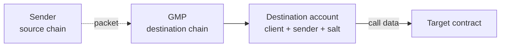

General Message Passing (GMP) is an IBC application that enables arbitrary contract calls between chains. A sender supplies the target contract's address and the call data to run against it.

On the destination chain the call executes from a deterministic address unique to the caller.

A call ends when the target returns data, when the call fails, or when the packet times out.

[IFT](/applications/ift) is built on GMP, and moves tokens between chains using GMP calls.

## The GMP application

A GMP call travels as a packet carrying the call data to the other chain. A GMP application is registered on a chain's [router](/how-ibc-works/core-router-and-store) under a single [port](/how-ibc-works/packets-and-applications), and a chain generally runs one GMP contract per IBC deployment.

In IBC-solidity, GMP is the ICS27GMP contract, which implements the ics-027-gmp specification on the port `gmpport`.

## Sending a call

A sender starts a call with one message that names where the call goes, what to run there, and how long it may take. In IBC-solidity, that message is a `SendCallMsg`:

```solidity
struct SendCallMsg {
    string sourceClient;
    string receiver;
    bytes salt;
    bytes payload;
    uint64 timeoutTimestamp;
    string memo;
}
```

- `sourceClient`: the local client identifier to send over.
- `receiver`: the target contract's address, as a string.
- `salt`: bytes that pick which of the sender's destination accounts makes the call.
- `payload`: the call data for the target, encoded the way the destination chain's GMP implementation expects.
- `timeoutTimestamp`: an absolute time, in unix seconds. The timeout must be in the future.
- `memo`: an optional string carried with the call.

The sender declares where the call goes, and GMP supplies who is calling. It stamps the packet with the address that called it, so a call always arrives under its true sender. The sender can be a contract or an externally owned account.

The salt picks which of the sender's accounts makes the call. GMP mixes it into the account derivation along with the client and the sender, so the same sender arrives from a different address under a different salt. Leaving it empty gives the sender one account.

The payload is opaque to GMP. GMP carries it to the destination chain and hands it to the target without interpreting it, so encoding it in the form the destination chain's GMP implementation can execute is the sender's job. In IBC-solidity that form is an ABI-encoded Solidity call: a four-byte function selector followed by its ABI-encoded arguments, which the destination account passes to the target verbatim.

That is separate from how the packet itself is encoded. Every GMP packet uses the same port, version, and encoding, and in IBC-solidity the packet data is ABI-encoded under the encoding string `application/x-solidity-abi`.

## The destination account

GMP deploys an account on the destination chain that makes the call on the sender's behalf. The target sees that account as its caller, so the address it reads maps to one sender, on one client, under one salt:

```solidity
struct AccountIdentifier {
    string clientId;  // the destination chain's client for the source chain
    string sender;    // the sender from the packet, stamped by GMP
    bytes salt;       // the salt from the packet
}
```

GMP hashes the identifier and uses that hash as the CREATE2 salt for the account contract.

```solidity
bytes32 accountIdHash = keccak256(abi.encode(accountId));
address accountAddress = Create2.deploy(0, accountIdHash, bytecode);
```

The account contract is deployed on the first call that arrives for its identifier. Its address is settled before that, because the identifier fixes it, so a sender can grant its account roles or fund it ahead of any call.

The derivation also runs backwards. GMP maps a deployed account to its identifier, so a target contract can authenticate its caller by reading the sender and salt behind it.

An account calls nothing on its own. GMP is the only outside caller it obeys, so every call it makes must come from a packet.



## Executing the call on the destination

Once the packet reaches the destination chain, the router hands it to that chain's GMP application, which turns it into a call:

1. Checks the packet's version, encoding, and both port identifiers against its own constants.
2. Confirms the payload carries call data.
3. Builds the account identifier from the destination client identifier plus the packet's sender and salt, and gets or deploys that account.
4. Reads the target's address out of the receiver string.
5. Asks the account to call the target with the payload as call data.
6. Wraps whatever the target returned as the acknowledgement.

If one of those checks fails, the call never runs, and the acknowledgement carries an error instead. Either way the call runs at most once, because the [receive step](/how-ibc-works/packet-lifecycle) records a receipt for the packet on the destination chain and the same packet cannot be received twice.

A relayer delivers the packet and pays for it. The destination call runs on whatever gas remains in the relayer's transaction, and neither the send message nor the packet carries a gas field, so gas budgeting belongs to the relayer. A delivery that reverts before the destination chain records the packet's receipt leaves the packet in flight, so a relayer can submit it again, with more gas if that was the problem, until the timeout passes. Once the receipt is written the packet is consumed, and the outcome comes back as an acknowledgement whether the call succeeded or not.

## Acknowledgements and callbacks

The outcome comes back as an acknowledgement. A relayer submits it with a proof back to the source chain, and the source chain router verifies it with the light client before clearing the packet's commitment. The source chain GMP application then reads the outcome from the acknowledgement bytes, comparing them against the one value that means failure.

A sending application hears an outcome only if it implements the sender callbacks. In IBC-solidity, that means two functions plus the ERC165 interface detection:

```solidity
function onAckPacket(bool success, IIBCAppCallbacks.OnAcknowledgementPacketCallback calldata msg_) external;

function onTimeoutPacket(IIBCAppCallbacks.OnTimeoutPacketCallback calldata msg_) external;
```

The acknowledgement callback reports success or failure in its `success` argument. Its message carries what an application needs to act on that outcome: the packet's sequence number, the payload it originally sent, and the acknowledgement bytes. It also carries both client identifiers and the relayer's address. The timeout callback takes no success argument, and its message is the same one without the acknowledgement. [ICS27GMP and accounts](/ibc-solidity-contracts/ics27-gmp-and-accounts) describes both callback structs.

An application matches a callback to the call it made by client and sequence number together. Sequences are counted per client, so a sender that sends over two clients can hold two packets with the same sequence.

## What comes back

Each ending hands the sender something different. The callbacks reach only a sender that implements them:

- **Success**: an acknowledgement carrying the target's return data, which the sender decodes to read the result.
- **Failure**: a fixed error acknowledgement, and the acknowledgement callback runs with success false.
- **Timeout**: no acknowledgement at all, and the timeout callback runs instead.

On success the acknowledgement is whatever the target contract returned, wrapped as it stands:

```solidity
struct GMPAcknowledgement {
    bytes result;  // the target's return data, unchanged
}
```

On failure the router writes one fixed value in place of any result, the same value for every failed packet on every chain:

```solidity
bytes internal constant UNIVERSAL_ERROR_ACK =
    hex"4774d4a575993f963b1c06573736617a457abef8589178db8d10c94b4ab511ab";
```

The acknowledgement reports that the call failed. The destination chain's router emits the revert reason as an `IBCAppRecvPacketCallbackError` event, so finding out why means reading that chain's logs.

The account forwards the destination call through `Address.functionCall`, which turns an empty revert into a `FailedCall` error. A target that runs out of gas reverts with a four-byte `FailedCall`, so the router writes the error acknowledgement and the packet is consumed. Empty revert data reaches the router only when the callback frame itself dies, and that is the case the router rejects outright, leaving the packet in flight. A relayer can then retry that packet with more gas.

A packet that is never received ends in a timeout. Once the deadline passes, a relayer proves non-receipt on the source chain, and GMP fires the timeout callback if the sender implements it. A packet cannot be both executed and timed out, because the destination refuses a packet whose deadline has passed.

GMP keeps no per-packet state, so a failure or a timeout leaves it nothing to undo. Reversing anything is the sender's job, which is why [IFT](/applications/ift) keeps a pending record and refunds from it.

## Build on GMP

Any contract can use GMP to act across chains. [IFT](/applications/ift) is an example of a contract built on GMP: one token contract is the sender on its own chain and the target on the other, and it moves tokens with nothing but GMP calls.

What GMP gives you is an authenticated caller on the destination chain, execution at most once, and an outcome a relayer can carry back to the source chain. What you write is the target contract, plus the two callback functions and ERC165 interface detection if you want to hear that outcome.

Two things belong to the contract you build:

- **Authorization**: GMP proves which contract is calling, and your target decides whether to accept it. IFT accepts a mint only from a counterparty it has registered.
- **State**: It is important to implement logic and state for failures and refunds. For example, IFT keeps a pending record of what it burned, and refunds from that record when a call fails or times out.

