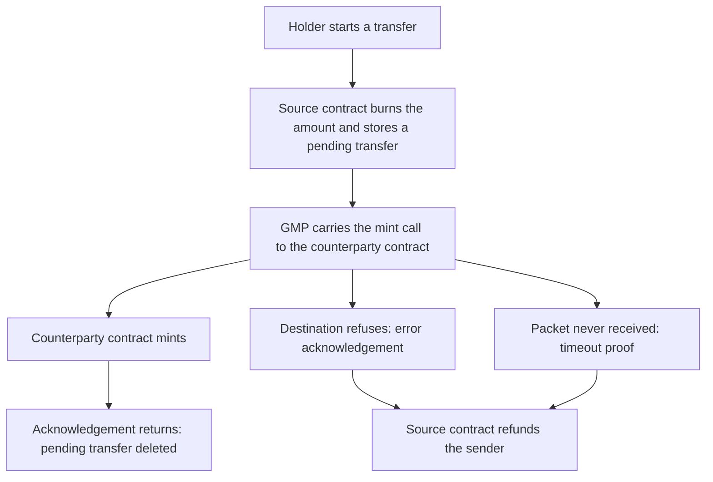

An Interchain Fungible Token (IFT) is a fungible token that moves between chains by burning it on one and minting it on the other. An issuer deploys an IFT contract on every chain where they want the asset to exist. Each deployment is an ERC20 token in IBC-Solidity. Unlike an escrow bridge, which locks the asset on one chain and issues a wrapped claim on another, an IFT burns on the source and mints the issuer's own token on arrival to the destination. Nothing has to be redeemed, and no wrapper has to be unwound. A holder on any of those chains holds the issuer's real asset, and it is the same asset however many chains it has crossed.

IFT deployments have to be linked before tokens can move between them. Each side's authority registers the other as a bridge. A deployment mints for an arriving transfer only when it has registered that counterparty IFT contract. Registering is a privileged call, reserved to the authority, but sending is open to any holder. IFT is built on top of GMP, so the cross-chain leg travels as a [General Message Passing (GMP)](/applications/gmp) call from one deployment to the other: the source deployment burns the amount, and the counterparty deployment mints it to the receiver. A failed transfer refunds the sender, so no transfer changes the total across the two chains.

## The transfer flow

A transfer starts with a holder, who calls `iftTransfer` with the client for the counterparty chain, a receiver on that chain, an amount, and optionally a timeout.

The source IFT contract then:

1. Validates the inputs.
2. Burns the amount from the sender.
3. Looks up the bridge for that client.
4. Builds the destination chain's mint call with the bridge's encoder.
5. Sends the call over GMP, addressed to the counterparty contract.
6. Stores a pending transfer under the packet sequence GMP returned.
7. Emits its transfer-initiated event.

The pending transfer is the refund ticket. It records the sender and the amount, keyed by client and sequence. While the packet is in flight it is the only trace of the tokens, until they are minted on the destination or reminted on the source chain in the case of a timeout refund.

The call that crosses the wire is the destination chain's mint call, built on the source chain before anything is sent. For an EVM counterparty the encoder ABI-encodes `iftMint`, with the receiver the holder passed to `iftTransfer`:

```solidity
abi.encodeCall(IIFT.iftMint, (receiverAddr, amount))
```

That payload is what the source IFT contract hands to GMP, addressed to the counterparty contract from its bridge:

```solidity
struct GMPPacketData {
    string sender;    // the source IFT contract, checksummed hex, filled in by GMP
    string receiver;  // the counterparty IFT contract, from the bridge
    bytes salt;       // empty for IFT
    bytes payload;    // the encoded iftMint call
    string memo;      // empty for IFT
}
```

The payload says where to mint and how much, specified by the holder. The sender field says which contract asked, and GMP fills it from the caller, so a sender cannot claim to be another contract.

<Note>
The packet data's receiver is the contract GMP calls on the destination chain. The payload's receiver is the holder who ends up with the tokens.
</Note>

On the destination chain a GMP account executes the payload, an address GMP derives for that sender on that client. The account is what calls `iftMint`, so the destination IFT contract can ask GMP whose account is calling.

The destination IFT contract checks four things before it mints:

- The caller is a GMP account.
- A bridge exists for that account's client.
- The account's sender string matches the counterparty address in that bridge exactly.
- The salt is empty, which leaves each counterparty one account to mint from.

Those checks are why the destination contract can trust the mint. The light client verified the packet, the account's identity says who sent it, and the bridge registration says whose mint calls this contract accepts.

When a successful acknowledgement reaches the source chain, the source contract deletes the pending transfer and emits its transfer-completed event. Because it had already burned the amount, nothing further is needed.

## Minting authority

Every IFT deployment has a single authority. In IBC-solidity that authority is either one owner address or an external access manager.

The authority's powers include:

- **Bridges**: it registers and removes the records that link this deployment to its counterparty IFT contracts.
- **Local supply**: it mints to any address on its own chain.
- **The contract's code**: it authorizes upgrades.

Minting happens along only three paths:

- The authority, through the contract's own `mint`.
- The GMP account of a registered counterparty IFT contract, through `iftMint`.
- GMP itself, when a failed transfer refunds the sender.

Beyond minting, a holder needs no permission. They transfer the token, burn their own balance, and start a cross-chain transfer without any authority check. A cross-chain transfer still travels through GMP, which has an authority of its own.

## Bridge registration

Two IFT contracts on different chains are bridged when each registers the other. Each side's bridge carries what the contract needs to reach the counterparty deployment, and what it needs to recognize its mint calls when they arrive.

In IBC-solidity a bridge holds three fields:

```solidity
struct IFTBridge {
    string clientId;
    string counterpartyIFTAddress;
    IIFTSendCallConstructor iftSendCallConstructor;
}
```

- **The client**: the local [client](/how-ibc-works/clients-and-counterparties) that identifies the counterparty chain.
- **The counterparty address**: the counterparty IFT contract's address on that chain, held as a string.
- **The encoder**: the component that builds mint calls in the form that chain expects.

Both counterparty IFT contracts must register. The source contract reads its bridge to find the counterparty, so a send with no bridge fails on the source chain. The destination contract mints only for a counterparty it has registered itself. A mint with no bridge fails on the destination chain, and the transfer comes back to its sender as a refund.

Bridges are keyed by client. An IFT contract can therefore reach one counterparty contract on each client it has. Registering the same client again replaces the previous entry.

Removing a bridge stops new sends on that client. Incoming mints on that client fail from then on. Transfers this contract already sent still complete or refund, because a refund reads nothing from the bridge.

For the full contract surface and the encoders that ship with it, see [IFT contracts](/ibc-solidity-contracts/ift-contracts).

## Failed transfers and refunds

No amount is minted on the destination chain until the light client has verified that the source chain committed the packet. The burn happened in the same transaction that committed it, so a mint always has a burn behind it.

A transfer fails in one of two ways, and both end in the same refund:

1. The destination refuses to mint. Its [router](/how-ibc-works/core-router-and-store) writes an error acknowledgement in place of a result, and the source IFT contract refunds when that acknowledgement arrives.
2. The packet is never received. Once the timeout has passed, a relayer submits the timeout proof, and the source contract refunds unconditionally.

For refunds, the source contract then mints the pending amount back to the original sender, deletes the pending transfer, and emits its refunded event.

A refund cannot follow a successful mint. A timeout needs proof that the destination chain has no receipt for the packet, so an amount is never minted on one chain and refunded on the other.

Each refund waits on a relayer. The amount stays burned and the record stays open until the acknowledgement or the timeout proof arrives, so a relayer that is down delays a refund rather than losing it.

A successful mint whose acknowledgement is never relayed only leaves a stale pending transfer on the source chain. Both chains already hold the right supply at that point, because the burn and the mint have both happened, and the acknowledgement only clears the record.



