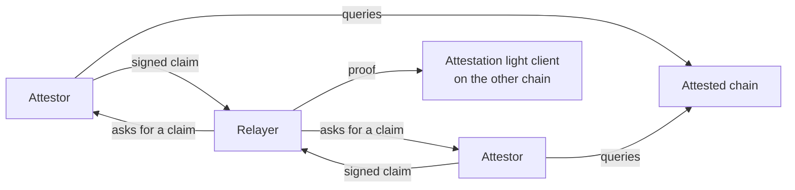

An attestor is an off-chain service that answers questions about one chain's state with a signature. The [attestation light client](/light-clients/attestation-light-client) accepts a claim only when enough of its attestors have signed it, which makes a connection's security exactly the keys that sign.

This page covers what an attestor reads and signs, the finality offset that bounds its answers, how a set of attestors binds to a client, and the keys an attestor signs with.

## How an attestor works

An attestor reads one chain and signs a statement about the chain's state at a certain height upon request. The attestor is stateless: it keeps no store of its own, and it reads the chain through an RPC endpoint it trusts to report accurate state.

The light client needs those signatures because it stores no commitment root. Every claim it accepts has to arrive signed by its attestor keys. A set of attestors watches one chain, and the client that trusts that set lives on the other.

Attestation is pull-based. An attestor signs when a relayer asks, and the relayer aggregates the signatures it gathers into one proof.



## What an attestor signs

An attestor signs exactly two kinds of claim, both about a single height:

- **A state attestation** binds a height to that block's timestamp.
- **A packet attestation** binds a height to a list of packet paths in the router store and their commitments, where a zero commitment asserts the path is empty.

Below is an example of a packet attestation:

```solidity
// The claim: packet 1 on client-0 is committed at height 1337.
PacketAttestation {
    height: 1337,
    packets: [
        PacketCompact {
            // keccak256 of the store path: client id, a record-type byte, then the 8-byte sequence
            path:       keccak256(hex"636c69656e742d30010000000000000001"),
            commitment: 0xb691a1950f6fb0bbbcf4bdb16fe2c4d0aa7ef783eb7803073f475cb8164d9b7a
        }
    ]
}
```

A state attestation carries only the height and that block's timestamp:

```solidity
StateAttestation { height: 1337, timestamp: 1754400000 }
```

One attestor returns the encoded claim, the height it applies to, and a single signature, plus the block timestamp when the claim carries one. The relayer collects those answers and submits the encoded claim once, with the signatures alongside it:

```solidity
AttestationProof {
    attestationData: abi.encode(PacketAttestation),
    signatures: [ /* 65 bytes each, r || s || v, threshold many required */ ]
}
```

Each signature covers `sha256(tag || sha256(attestationData))`, where the tag is `0x01` for a state attestation and `0x02` for a packet attestation.

Before signing, an attestor checks each claim against its own view of the chain. It refuses any height above its attestable height, which is set by a finality offset. For a packet attestation it recomputes each path and reads the value on chain: a packet commitment must exist and match, an acknowledgement must exist, and a receipt must be absent. One failing packet in a batch produces no attestation at all.

## The finality offset

Configured per attestor, the finality offset decides how far behind the chain head it will sign. It sets the attestable height, and a request above that height is refused rather than answered:

- An offset of zero attests up to the chain's own `finalized` block. Omitting the field is the same input as writing `0`.
- A positive offset of *n* attests up to `latest` minus *n* blocks.

A positive offset matters where a chain's `finalized` tag lags far behind its head. On Ethereum proof of stake the tag runs roughly 12 to 15 minutes behind, and an offset of zero makes every relay wait out that lag.

<Warning>
Do not set the offset shallower than the chain's practical finality. A reorg can make a quorum sign a second timestamp for a height it already signed, and conflicting timestamps at one height freeze the client for good.

</Warning>

## The attestor set

An attestor set is the attestor addresses and the signature threshold that a light client accepts proofs from, which makes it the trust root of the connection. A connection has an attestation light client on each of its two chains, and each of those clients has a set of its own.

The set itself lives on chain. The relayer's configuration is a separate list of the attestors it can reach:

- **On chain**, the addresses and threshold are fixed when the client is deployed. The constructor rejects an empty set, a zero threshold, a threshold larger than the set, and duplicate addresses.
- **Off chain**, the relayer's configuration lists the attestors it can reach, in one flat `attestors[]` list that `ibc attestor run` reads as well. A `type: local` entry is an attestor the process runs itself, naming the chain it watches, a signer, and a finality offset. A `type: remote` entry carries only a name and a bare `host:port`. A remote attestor reports its own chain and signing address through an `Info` RPC when the relayer dials it.

The configuration carries no threshold, and it does not say which client an attestor serves. The relayer resolves both against the chain at startup: it reads each client's on-chain attestation set for its addresses and its threshold, keeps the configured attestors that watch the counterparty chain and appear in that set, and refuses to start if fewer match than the threshold requires.

A deployed set never changes. No function adds, removes, or replaces an attestor, and no path changes the threshold, so a different set means deploying a new client.

## Attestor keys

An attestor signs with one ECDSA key per attestor entry, resolved through a named signer. The address of that key is what appears in a client's set: to the client, the attestor is its key.

A key lives in one of two places:

- A local keyfile on disk.
- A remote signing service that holds the key, reached over gRPC and addressed by a key id.

A key's reach is wider than one client. The signed bytes name no chain, no verifying client, and no contract address, so a signature produced for one client is valid on every client whose set contains that address.

<Warning>
Never reuse an attestor key across clients. A signature produced for one client verifies on every other client whose set holds that address, so one key counts toward both clients' thresholds and weakens both.
</Warning>

