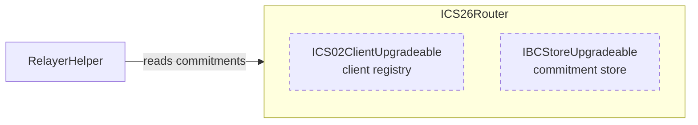

The `ICS26Router` contract is the core router of IBC-solidity. Every packet in either direction passes through it. It validates each call and records the outcome in its own store. It works with light clients to verify proofs, and it forwards payloads to applications.

Source: [ICS26Router.sol](https://github.com/cosmos/ibc-contracts/blob/main/ibc-solidity/contracts/ICS26Router.sol). The protocol model behind this surface is on [Core: router and store](/how-ibc-works/core-router-and-store) and [Packet lifecycle](/how-ibc-works/packet-lifecycle).

## What the router does

The router owns the application registry, the light client registry, and the commitment store. It drives the whole packet lifecycle of send, receive, acknowledge, and timeout. Registered applications call `sendPacket`, and relayers call `recvPacket`, `ackPacket`, `timeoutPacket`, and `updateClient`. Those relayer calls are gated, and one external OpenZeppelin [`AccessManager`](/ibc-solidity-contracts/permissions-and-upgrades#the-access-manager-and-its-roles) decides who passes. The router calls back into applications through `IIBCApp`, and it hands every cross-chain claim to a light client through `ILightClient`.

Interacts with: [AttestationLightClient](/ibc-solidity-contracts/attestation-light-client), [ICS27GMP and accounts](/ibc-solidity-contracts/ics27-gmp-and-accounts), [IFT contracts](/ibc-solidity-contracts/ift-contracts), and [Permissions and upgrades](/ibc-solidity-contracts/permissions-and-upgrades).

## Contracts on this page

| Contract | Kind | What it does | Source |
|---|---|---|---|
| ICS26Router | Deployed contract | The packet router itself | [ICS26Router.sol](https://github.com/cosmos/ibc-contracts/blob/main/ibc-solidity/contracts/ICS26Router.sol) |
| ICS02ClientUpgradeable | Abstract base, compiled into ICS26Router | The light client and counterparty registry | [ICS02ClientUpgradeable.sol](https://github.com/cosmos/ibc-contracts/blob/main/ibc-solidity/contracts/utils/ICS02ClientUpgradeable.sol) |
| IBCStoreUpgradeable | Abstract base, compiled into ICS26Router | The provable commitment store | [IBCStoreUpgradeable.sol](https://github.com/cosmos/ibc-contracts/blob/main/ibc-solidity/contracts/utils/IBCStoreUpgradeable.sol) |
| ICS24Host | Library | Commitment paths, commitment hashes, and the universal error acknowledgement constant | [ICS24Host.sol](https://github.com/cosmos/ibc-contracts/blob/main/ibc-solidity/contracts/utils/ICS24Host.sol) |
| IBCIdentifiers | Library | The client-ID prefix and the custom-identifier validation rules | [IBCIdentifiers.sol](https://github.com/cosmos/ibc-contracts/blob/main/ibc-solidity/contracts/utils/IBCIdentifiers.sol) |
| RelayerHelper | Standalone contract, deployed by the repository's Solidity tests | Read-only packet-status queries against the router's store | [RelayerHelper.sol](https://github.com/cosmos/ibc-contracts/blob/main/ibc-solidity/contracts/utils/RelayerHelper.sol) |



## Registering an application

Every IBC application is registered on a port by whoever deploys it, and implements three router-only callbacks. A port belongs permanently to the first application registered on it.

| Function | What it does |
|---|---|
| `addIBCApp(address app)` | Registers an application under its own address, as a hex string, for a port identifier. Permissionless. |
| `addIBCApp(string calldata portId, address app)` | Registers an application under a custom port identifier. Role-gated. |
| `getIBCApp(string calldata portId)` | Returns the application registered on a port. |

The role map names `ID_CUSTOMIZER_ROLE` for the role-gated function. The port that function picks must pass identifier validation, and it must not parse as an address, so a chosen name can never collide with one derived from a contract address. Custom identifiers may not start with `client-` or `channel-`, so a chosen name can never collide with a generated one.

Either function reverts if the port already exists.

To be an IBC application, a contract must implement `IIBCApp`, which defines three callbacks:

```solidity
interface IIBCApp {
    function onRecvPacket(IIBCAppCallbacks.OnRecvPacketCallback calldata msg_) external returns (bytes memory);

    function onAcknowledgementPacket(IIBCAppCallbacks.OnAcknowledgementPacketCallback calldata msg_) external;

    function onTimeoutPacket(IIBCAppCallbacks.OnTimeoutPacketCallback calldata msg_) external;
}
```

The router calls each callback at a specific point in the packet lifecycle: on receive (destination chain), on acknowledgement (source chain), and on timeout (source chain).

## Sending a packet

The router accepts `sendPacket` only from the application registered on the payload's source port. After accepting it, it fills in the rest of the packet fields.

```solidity
function sendPacket(IICS26RouterMsgs.MsgSendPacket calldata msg) external returns (uint64);

struct MsgSendPacket {
    string sourceClient;
    uint64 timeoutTimestamp;
    Payload payload;
}

struct Payload {
    string sourcePort;
    string destPort;
    string version;
    string encoding;
    bytes value;
}
```

- The caller supplies the source client, a timeout, and one payload. The router checks `msg.sender` against the application registry before anything else.
- Then, the router fills in the other two fields: the destination client, from the counterparty registered for the source client, and the sequence, from a per-client counter that starts at 1 and increments on every send. The call returns that sequence as a `uint64`.
- The timeout must be in the future and no more than `MAX_TIMEOUT_DURATION` away, a constant of one day, both bounds measured against the sending chain's own block timestamp.
- The call leaves a 32-byte commitment at the packet's path. The full packet reaches a relayer through the `SendPacket` event.

## Relayer entry points

These are the packet-lifecycle calls a relayer makes to the router. Each carries a proof, and the router hands that proof to a light client to check. A relayer also calls `updateClient`. That call is in [Client and counterparty registry](#client-and-counterparty-registry).

| Function | What it does |
|---|---|
| `recvPacket(MsgRecvPacket calldata msg)` | Verifies membership of the packet commitment on the source chain, writes a receipt, calls the destination application, and commits the acknowledgement |
| `ackPacket(MsgAckPacket calldata msg)` | Verifies that the destination chain stored the acknowledgement, deletes the packet commitment, and calls the sending application |
| `timeoutPacket(MsgTimeoutPacket calldata msg)` | Verifies that no receipt exists on the destination chain, deletes the packet commitment, and calls the sending application |

The router also inherits OpenZeppelin's `multicall`, which batches several calls into one transaction. A relayer uses it to put an `updateClient` call ahead of the packet calls it is relaying, so the client holds the proof height before any verification runs.

Each takes the reconstructed packet, one proof, and the height that proof was taken at. `ackPacket` also carries the acknowledgement bytes.

```solidity
struct MsgRecvPacket {
    Packet packet;
    bytes proofCommitment;
    IICS02ClientMsgs.Height proofHeight;
}

struct MsgAckPacket {
    Packet packet;
    bytes acknowledgement;
    bytes proofAcked;
    IICS02ClientMsgs.Height proofHeight;
}

struct MsgTimeoutPacket {
    Packet packet;
    bytes proofTimeout;
    IICS02ClientMsgs.Height proofHeight;
}
```

## Acknowledgements and callback failures

A receiving application returns its acknowledgement in the same transaction, and the router commits what comes back.

An application that reverts with a reason still leaves an acknowledgement on chain. The router catches the revert, emits the reason, and commits `sha256("UNIVERSAL_ERROR_ACKNOWLEDGEMENT")` from ICS24Host in its place.
The failures differ in what becomes of the packet. A revert with a reason settles it, because an acknowledgement reaches the source chain. A revert with no reason leaves it pending, for a relayer to retry with more gas. A port with no application registered leaves it unreceivable, and its only ending is a timeout. An application that returns empty acknowledgement bytes, or the reserved universal error acknowledgement, leaves it unreceivable in the same way. Those reverts repeat on retry, so a timeout ends the packet. The reverts themselves are in [Errors](#errors).

## Client and counterparty registry

The router carries the client registry it inherits from ICS02ClientUpgradeable. Anyone may register a client there, while keeping one fresh and replacing one are both gated.

| Function | What it does |
|---|---|
| `addClient(CounterpartyInfo calldata counterpartyInfo, address client)` | Registers a client under a generated identifier and returns it. Permissionless. |
| `addClient(string calldata clientId, CounterpartyInfo calldata counterpartyInfo, address client)` | Registers a client under a custom identifier. Role-gated. |
| `updateClient(string calldata clientId, bytes calldata updateMsg)` | Forwards an opaque update to the client contract. Role-gated. |
| `migrateClient(string calldata clientId, CounterpartyInfo calldata counterpartyInfo, address client)` | Replaces the client contract and counterparty info under the same identifier. Admin-gated by default. |
| `submitMisbehaviour(string calldata clientId, bytes calldata misbehaviourMsg)` | Forwards misbehaviour evidence to the client. Callable by any address. |
| `getClient(string calldata clientId)` | Returns the light client contract registered under an identifier. |
| `getCounterparty(string calldata clientId)` | Returns the counterparty identifier and merkle prefix. |
| `getNextClientSeq()` | Returns the next sequential client number. |

Two things are stored per client identifier: the address of a light-client contract, and counterparty info, which is the counterparty's own client identifier plus its merkle prefix. The permissionless registration generates the identifier as `client-` plus a counter, and the role-gated overload lets an ID customizer supply one instead.

Misbehaviour submission is open to any address, and the router forwards the evidence to the client registered under the identifier. What comes of it is the client's decision. A client that has gone wrong is replaced under its own identifier: an admin-gated `migrateClient` swaps in a new client contract and counterparty info.

To be registrable, a client contract implements five functions: `updateClient`, `verifyMembership`, `verifyNonMembership`, `misbehaviour`, and `getClientState`. Both verify functions take an opaque proof, a proof height, and a merkle path. Membership also takes the value it expects to find there. Both return the counterparty's unix timestamp at that height. Clients are interchangeable behind that interface, such as the [AttestationLightClient](/ibc-solidity-contracts/attestation-light-client).

## Commitment storage and queries

A commitment is a hash of something the chain did, stored so the counterparty can verify it happened without being handed the original. Each one lives in the same mapping, from a hashed path to a fixed-length value, and the path is what says which kind it is.

| Record | Path | Written by |
|---|---|---|
| Packet commitment | `sourceClient` + `0x01` + big-endian sequence | `sendPacket` |
| Receipt | `destClient` + `0x02` + big-endian sequence | `recvPacket` |
| Acknowledgement commitment | `destClient` + `0x03` + big-endian sequence | `recvPacket` |

Each kind commits a different value.

```text
packet           sha256(0x02 || sha256(destClient) || sha256(timeout) || sha256(payloadHashes))
acknowledgement  sha256(0x02 || sha256(ack) for each acknowledgement, concatenated)
receipt          keccak256(packet)
```

- Each payload hash inside a packet's value covers the source port, the destination port, the version, the encoding, and the value.
- A receipt value must be non-zero, which is what lets non-membership prove a packet was never received. The code relies on that property rather than deriving it.

The store has one public read, `getCommitment(bytes32 hashedPath)`, which returns the stored value, or zero. The key is keccak256 of the raw path in the table above. `RelayerHelper` wraps that call: `queryPacketCommitment`, `queryPacketReceipt`, and `queryAckCommitment` build the path from a client identifier and a sequence, and `isPacketReceived` and `isPacketReceiveSuccessful` take the packet itself. The latter is true only for a received packet whose stored acknowledgement is not the universal error acknowledgement.

## Events

| Event | When it fires |
|---|---|
| `SendPacket(string indexed clientId, uint256 indexed sequence, Packet packet)` | A packet is committed and sent |
| `WriteAcknowledgement(string indexed clientId, uint256 indexed sequence, Packet packet, bytes[] acknowledgements)` | An acknowledgement is committed on the destination chain |
| `AckPacket(string indexed clientId, uint256 indexed sequence, Packet packet, bytes acknowledgement)` | An acknowledgement is delivered back to the source chain |
| `TimeoutPacket(string indexed clientId, uint256 indexed sequence, Packet packet)` | A packet is timed out on the source chain |
| `IBCAppAdded(string portId, address app)` | An application is registered on a port |
| `IBCAppRecvPacketCallbackError(bytes reason)` | The router caught a revert from `onRecvPacket` |
| `Noop()` | A relay was redundant, so the handler returned without doing anything |
| `ICS02ClientAdded(string clientId, CounterpartyInfo counterpartyInfo, address client)` | A client is registered |
| `ICS02ClientUpdated(string clientId, UpdateResult result)` | The router forwards an update to a client |
| `ICS02ClientMigrated(string clientId, CounterpartyInfo counterpartyInfo, address client)` | A client contract and its counterparty info are replaced under the same identifier |
| `ICS02MisbehaviourSubmitted(string clientId)` | The router forwards misbehaviour evidence to a client |

- Every packet event indexes a client identifier and the sequence. Which client is indexed depends on the leg: `SendPacket`, `AckPacket`, and `TimeoutPacket` index the source client, and `WriteAcknowledgement` indexes the destination client.

## Errors

The IBC-defined reverts a router call can produce come from one of three places: the router itself, the commitment store with its path library, or the client registry.

| Error | What triggers it |
|---|---|
| `IBCPortAlreadyExists` | Registering an application on a port that is already taken |
| `IBCInvalidPortIdentifier` | A custom port identifier that is empty, parses as an address, or fails identifier validation |
| `IBCAppNotFound` | A lookup for a port with no application registered on it |
| `IBCUnauthorizedSender` | A `sendPacket` caller that is not the application registered on the payload's source port |
| `IBCInvalidTimeoutTimestamp` | A timeout that is not in the future on send, has already passed on receive, or has not been reached by the counterparty timestamp on timeout |
| `IBCInvalidTimeoutDuration` | A timeout further ahead than `MAX_TIMEOUT_DURATION` |
| `IBCInvalidCounterparty` | A packet whose claimed counterparty client is not the one registered |
| `IBCAsyncAcknowledgementNotSupported` | An application returning empty acknowledgement bytes |
| `IBCErrorUniversalAcknowledgement` | An application returning the universal error acknowledgement |
| `IBCFailedCallback` | A receive callback that leaves empty revert data, which happens when the callback frame itself dies |
| `IBCPacketCommitmentAlreadyExists` | Committing a packet where a commitment already exists |
| `IBCPacketAcknowledgementAlreadyExists` | A second acknowledgement write for the same packet |
| `IBCPacketCommitmentMismatch` | A supplied packet that does not hash to the stored commitment being deleted |
| `IBCPacketReceiptMismatch` | A stored receipt that differs from the one being written. An honest caller cannot reach it, because a packet is unique per source client and sequence |
| `IBCMultiPayloadPacketNotSupported` | A packet carrying any number of payloads other than one, on receive, acknowledge, or timeout |
| `InvalidMerklePrefix` | A counterparty merkle prefix with no elements to append the IBC path to |
| `IBCInvalidClientId` | A custom client identifier that is empty or fails identifier validation |
| `IBCClientNotFound` | A lookup for a client identifier with no client registered |
| `IBCClientAlreadyExists` | Registering a client under an identifier that is already taken |
| `IBCCounterpartyClientNotFound` | A lookup for the counterparty of a client that has none registered |

## Roles and permissions

Each gate below is a function selector granted to a role in an external OpenZeppelin `AccessManager`.

| Role | What it gates | Typical holder |
|---|---|---|
| Relayer | `recvPacket`, `timeoutPacket`, `ackPacket`, `updateClient` | Assigned in the deployment's role map |
| ID customizer | `addIBCApp(string,address)` and the custom-identifier `addClient` | Assigned in the deployment's role map |
| Admin | `migrateClient` and the UUPS upgrade authorization | A security council paired with a governance admin, in the security model the repository documents |

Authorization itself happens outside the router. One external `AccessManager` is passed as `authority` at initialization, and a deployment decides which selectors it binds to which role. The router only asks the access manager whether the caller holds the role assigned to the selector, so who may relay is a deployment decision rather than a property of the contract.

<Note>
On a chain the IBC CLI brings up, any address may relay. `ibc deploy core` binds the router's relaying calls to the public role, and it never grants the relayer role. The selectors it binds are listed under [the access manager and its roles](/ibc-solidity-contracts/permissions-and-upgrades#the-access-manager-and-its-roles).
</Note>

## Deployment and upgrade

The router ships as a logic contract behind an ERC1967 proxy. Its initializer, `initialize(authority)`, takes one argument and binds the `AccessManager` address behind every gate above.

Upgrades are UUPS with a `restricted` `_authorizeUpgrade`. The upgrade selector belongs to the `AccessManager` admin by default. For the full map across every contract, see [Permissions and upgrades](/ibc-solidity-contracts/permissions-and-upgrades).
