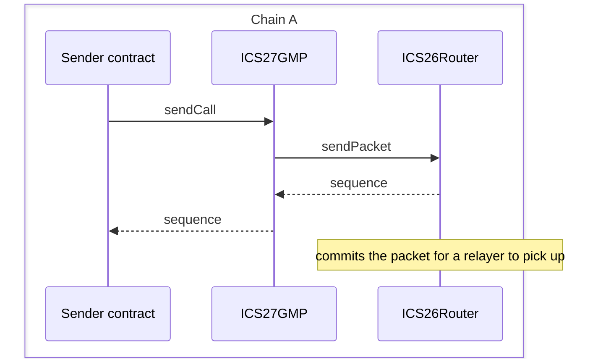
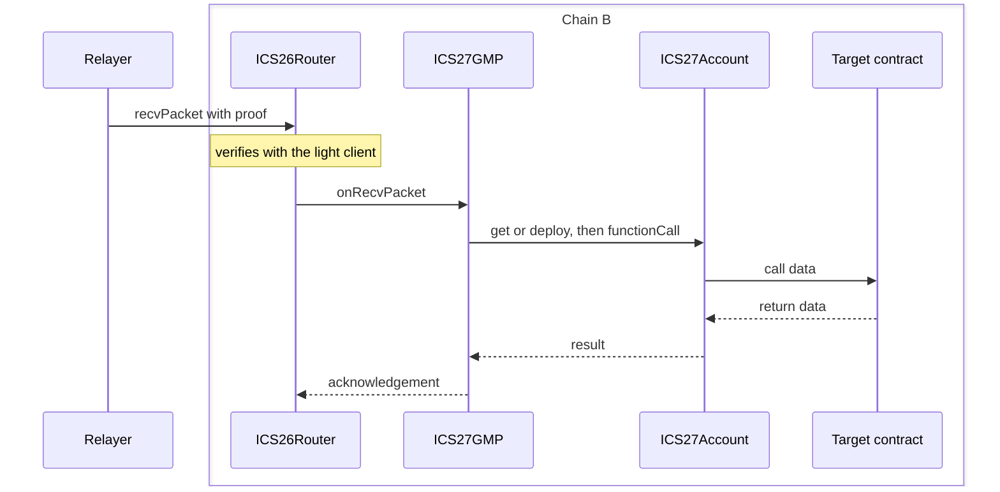
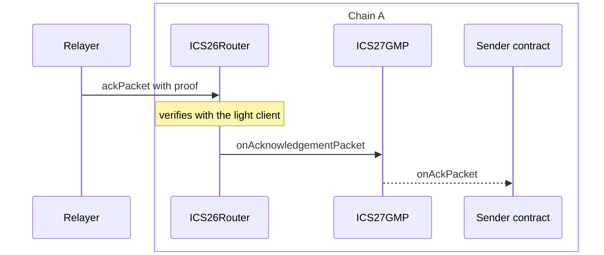

ICS27GMP is the General Message Passing application. It carries arbitrary call payloads to be executed across chains that implement GMP.

A sender reaches it to dispatch a call. The router reaches it to deliver a packet. A received call runs from an ICS27Account that ICS27GMP deploys, so the contract being called sees an address unique to the remote sender. Senders can build on ICS27GMP: [IFT](/ibc-solidity-contracts/ift-contracts) is built on GMP to fungibly move tokens across chains.

Source: [ICS27GMP.sol](https://github.com/cosmos/ibc-contracts/blob/main/ibc-solidity/contracts/ICS27GMP.sol), with the account contract and the libraries listed below. The model behind this surface is on [GMP: how it works](/applications/gmp).

Interacts with: [ICS26Router](/ibc-solidity-contracts/ics26-router) for sends and packet callbacks, its own ICS27Account children, the AccessManager that holds its authority, and every sending contract it calls back, including [IFT contracts](/ibc-solidity-contracts/ift-contracts).

## Contracts on this page

| Contract | Kind | What it does | Source |
|----------|------|--------------|--------|
| ICS27GMP | Deployed contract, behind an ERC1967 proxy | Sends call payloads and executes received ones | [ICS27GMP.sol](https://github.com/cosmos/ibc-contracts/blob/main/ibc-solidity/contracts/ICS27GMP.sol) |
| ICS27Account | Deployed once as the account implementation, then one proxy instance per `(clientId, sender, salt)`, behind a shared beacon | Makes the destination call on a remote sender's behalf | [ICS27Account.sol](https://github.com/cosmos/ibc-contracts/blob/main/ibc-solidity/contracts/utils/ICS27Account.sol) |
| ICS27Lib | Library, compiled into ICS27GMP | Supplies the GMP constants, the acknowledgement encoding, and the account beacon-proxy bytecode used for CREATE2 | [ICS27Lib.sol](https://github.com/cosmos/ibc-contracts/blob/main/ibc-solidity/contracts/utils/ICS27Lib.sol) |
| IBCSenderCallbacksLib | Library, compiled into ICS27GMP | Checks a sender's ERC165 support and makes the acknowledgement or timeout callback | [IBCSenderCallbacksLib.sol](https://github.com/cosmos/ibc-contracts/blob/main/ibc-solidity/contracts/utils/IBCSenderCallbacksLib.sol) |

One ICS27Account exists per `(clientId, sender, salt)` triple, so a chain holds one account for every distinct triple that has received a call.

## How a call moves through the contracts

A sender starts a call with `sendCall`, which builds the packet data and hands the packet to the router, which commits a record of it.



Once a relayer carries it to the destination chain, the router verifies the packet with the light client and then calls `onRecvPacket`. ICS27GMP checks the payload's identity fields, finds or deploys the sender's account, and asks that account to call the receiver. The target's return data goes back to the router as the acknowledgement.



Before it makes that call, `onRecvPacket` checks three things:

- The payload's version, encoding, and both port identifiers match the ICS27 constants.
- The payload carries bytes.
- The `receiver` string parses as an EVM address, or the call reverts `ICS27InvalidReceiver`.

Back on the source chain the router calls `onAcknowledgementPacket` when that acknowledgement arrives, or `onTimeoutPacket` when the deadline passes without receipt. Either handler recovers the original sender from the packet data and forwards the outcome to that sender's callback.



The three handlers the router calls — `onRecvPacket`, `onAcknowledgementPacket`, and `onTimeoutPacket` — accept the router alone, and revert `ICS27Unauthorized` for any other caller.

## Sending a call

Any contract or externally owned account can call a send.

```solidity
function sendCall(IICS27GMPMsgs.SendCallMsg calldata msg_) external returns (uint64 sequence);

struct SendCallMsg {
    string sourceClient;
    string receiver;
    bytes salt;
    bytes payload;
    uint64 timeoutTimestamp;
    string memo;
}
```

| Field | What it means |
|-------|---------------|
| `sourceClient` | The local client to send over |
| `receiver` | The destination contract address |
| `salt` | Differentiates the sender's destination accounts |
| `payload` | The call data for the receiver |
| `timeoutTimestamp` | Absolute, in unix seconds |
| `memo` | Optional |

ICS27GMP fills in the packet's sender itself, taking `msg.sender` and formatting it as a checksummed hex string.

The returned sequence number, paired with the client it was counted on, is what a sender stores to match later callbacks. Because ICS27GMP inherits Multicall, several sends fit in one transaction, each returning its own.

These conditions reject a send:

- An empty payload reverts `ICS27PayloadEmpty`.
- A timeout at or before the current block timestamp, or more than one day out, reverts in the router.
- An unregistered `sourceClient` reverts `IBCCounterpartyClientNotFound` in the router.
- A paused ICS27GMP rejects the send.

The router accepts a packet on `gmpport` from ICS27GMP alone, so no other contract can send something that arrives as a GMP call.

## Packet data on the wire

The packet data is an ABI-encoded `GMPPacketData`, and the payload carrying it uses fixed port, version, and encoding values.

```solidity
struct GMPPacketData {
    string sender;
    string receiver;
    bytes salt;
    bytes payload;
    string memo;
}
```

ICS27GMP builds that struct from the send message. It adds the sender, while the client identifier and the timeout become fields of the packet rather than of its data.

The payload around it carries three more fields, fixed by constants in ICS27Lib and identical in both directions.

| Payload field | Value |
|---------------|-------|
| Source and destination port | `gmpport` |
| Version | `ics27-2` |
| Encoding | `application/x-solidity-abi` |

The memo travels in the packet data, and no handler reads it.

## Destination accounts and their addresses

A destination account is the contract that makes a remote sender's call on this chain. It is identified by client, sender, and salt. It is deployed on first use at a CREATE2 address, which is computable in advance.

ICS27GMP never makes the destination call itself. It asks the sender's account contract to make the low-level call, so the target sees a stable sender-specific `msg.sender` rather than the GMP contract.

```solidity
struct AccountIdentifier {
    string clientId;  // the destination chain's local client identifier
    string sender;    // from the packet
    bytes salt;       // from the packet
}
```

The salt is the sender's own choice, and changing it changes the identifier. One sender can drive several accounts on the same chain by choosing different salts. An empty salt is allowed, and gives the sender one default account per client.

An account is deployed on the first inbound call for its identifier. ICS27GMP hashes the identifier, then uses that hash as the CREATE2 salt for a beacon proxy it deploys itself.

```solidity
bytes32 accountIdHash = keccak256(abi.encode(accountId));

bytes memory bytecode = ICS27Lib.getBeaconProxyBytecode(address($._accountBeacon), address(this));
address accountAddress = Create2.deploy(0, accountIdHash, bytecode);
```

The address therefore depends on all three identifier fields, on the account beacon, and on ICS27GMP's own address, which the proxy bytecode and the CREATE2 call both carry. The same identifier under a different ICS27GMP deployment resolves to a different address.

Two views expose the mapping in both directions.

| Function | What it returns |
|----------|-----------------|
| `getOrComputeAccountAddress(AccountIdentifier)` | The stored account if it exists, otherwise the CREATE2 address computed from the identifier hash and the proxy bytecode hash |
| `getAccountIdentifier(address)` | The identifier behind a deployed account, reverting `ICS27AccountNotFound` for an unknown address |

This allows a sender to compute a destination address before creation and fund or authorize its destination account ahead of its first call.

The reverse lookup is how a destination contract tells which remote sender is calling it. IFT uses it in `iftMint`, checking the calling account's `sender` and salt before minting.

## The account contract's functions

Only ICS27GMP can drive an account from outside, and it has one function for the purpose. The account's other primitives answer to the account alone.

| Function | Who may call it | What it does |
|----------|-----------------|--------------|
| `functionCall(target, data)` | ICS27GMP | Low-level call carrying the received payload |
| `execute(target, data, value)` | The account itself | Call with native value |
| `executeBatch(Call[])` | The account itself | Several calls in sequence |
| `delegateExecute(target, data)` | The account itself | Delegatecall |
| `sendValue(recipient, amount)` | The account itself | Native value transfer |
| `initialize(ics27)` | Runs once, during the proxy's construction | Binds the account to ICS27GMP |
| `ics27()` | Anyone | The ICS27GMP address |

An inbound payload runs through `functionCall`, a thin wrapper around OpenZeppelin's `Address.functionCall`.

The four value and batching primitives carry an `onlySelf` check, so `msg.sender` has to be the account. A sender reaches them by addressing a GMP call to its own account, with the primitive as the payload. A batch is an array of `Call { target, data, value }`.

Value has to be in the account already, because a GMP call carries none. Because addresses are pre-computable, a sender can fund its account before its first call ever arrives.

## Acknowledgements and sender callbacks

Results reach a sending contract only if it implements the callback interface and advertises it through ERC165.

An acknowledgement takes one of two shapes. Success is `abi.encode(GMPAcknowledgement{ result })`, carrying the target's raw return data. Failure is the fixed 32-byte universal error acknowledgement, `sha256("UNIVERSAL_ERROR_ACKNOWLEDGEMENT")`.

To hear either one, a sending contract implements `IIBCSenderCallbacks`.

```solidity
interface IIBCSenderCallbacks {
    function onAckPacket(bool success, IIBCAppCallbacks.OnAcknowledgementPacketCallback calldata msg_) external;
    function onTimeoutPacket(IIBCAppCallbacks.OnTimeoutPacketCallback calldata msg_) external;
}
```

The `success` flag is not carried in the acknowledgement. ICS27GMP derives it by hashing the acknowledgement bytes and comparing them against the universal error value, so anything that is not that value counts as success.

IBCSenderCallbacksLib calls back only a sender that answers the ERC165 check, and skips any other in silence. A missing interface therefore costs the sender its callback, not the packet.

The acknowledgement struct carries the source and destination client identifiers, the packet sequence, the full original payload, the raw acknowledgement bytes, and the relayer address. The timeout struct is the same one minus the acknowledgement.

Both callbacks fire synchronously inside the relayer's `ackPacket` or `timeoutPacket` transaction, after the packet commitment is deleted.

## Gas and value

The destination call runs on whatever gas the relayer's transaction leaves, and a GMP call carries no native value.

The account forwards the destination call with `Address.functionCall`, which sends all remaining gas. Gas budgeting is delegated to the relayer.

The same helper turns an empty revert into a `FailedCall` error. A target that runs out of gas reverts with a four-byte `FailedCall`, so the router writes the error acknowledgement and the packet is consumed. Empty revert data reaches the router only when the callback frame itself dies, and that is the case the router rejects outright, leaving the packet in flight. A relayer can then retry that packet with more gas.

A GMP call carries call data alone, so any native value a target receives has to be in the account already.

## State and storage

The contract stores the account registry in both directions and keeps nothing per packet.

Storage is four fields, held in one ERC-7201 namespaced slot:

```solidity
struct ICS27GMPStorage {
    mapping(bytes32 accountIdHash => IICS27Account account) _accounts;
    mapping(address account => IICS27GMPMsgs.AccountIdentifier accountId) _accountIds;
    IICS26Router _ics26;
    UpgradeableBeacon _accountBeacon;
}
```

| What is stored | When written |
|----------------|--------------|
| The two account mappings, forward and reverse | An account is first deployed on an inbound call |
| The router address and the account beacon | At initialization |

Nothing in the contract deletes any of it, so the account registry only grows.

Per-packet state lives elsewhere. GMP keeps no record to clean up, and the commitment and the receipt live in the router's store.

## Initialization and registration

The proxy is initialized once with the router, the account logic, and the authority. A separate call then registers it on the router under the port `gmpport`.

ICS27GMP is deployed as a logic contract behind an ERC1967 proxy, and its initializer takes three addresses:

```solidity
function initialize(address ics26_, address accountLogic, address authority) external;
```

That call also creates the ICS27Account beacon from `accountLogic`.

The router address and the account beacon are fixed from that point on, each assigned only in `initialize` and with no setter. Both are readable through the `ics26()` and `getAccountBeacon()` views.

ICS27GMP serves every sender on the chain under one port, `gmpport`. Registration goes through the router's restricted `addIBCApp(string, address)`, the overload that takes a custom identifier rather than an address-shaped one. The caller is an external account the access manager permits. On a chain `ibc deploy gmp` brings up, that is the deploy key. [Permissions and upgrades](/ibc-solidity-contracts/permissions-and-upgrades#the-access-manager-and-its-roles) covers which role holds that selector.

A port can be claimed only once, and a second attempt reverts `IBCPortAlreadyExists`.

One ICS27GMP per IBC deployment keeps every sender on a chain mutually reachable, since a second one would claim its own port and derive its own account addresses.

## Events and errors

ICS27GMP declares no events, so a call is observed through the router's.
Six router events cover a call's life.

| Event | When it fires |
|-------|---------------|
| `SendPacket` | ICS27GMP hands a packet to the router |
| `WriteAcknowledgement` | The destination router commits the acknowledgement |
| `AckPacket` | The acknowledgement is delivered on the source chain |
| `TimeoutPacket` | A timeout is proven on the source chain |
| `IBCAppRecvPacketCallbackError` | The destination call reverts with a reason |
| `Noop` | A relay arrives for work already done, so the router returns without reverting |

The revert reason from a failed destination call appears in `IBCAppRecvPacketCallbackError` alone. It stays on the destination chain, so diagnosing a failure means reading destination logs.

Both addresses still emit inherited events. The ICS27GMP address emits pause, upgrade, initialization, and authority events. An account address emits initialization.

The nine errors are declared in `IICS27Errors`.

| Error | What it means |
|-------|---------------|
| `ICS27PayloadEmpty` | The payload has no bytes |
| `ICS27InvalidReceiver` | The receiver string does not parse as an address |
| `ICS27InvalidSender` | The packet's sender string does not parse as an address |
| `ICS27InvalidAddress` | A generic invalid address string, declared in the error set and not reverted by these contracts |
| `ICS27Unauthorized` | The caller is not the expected address |
| `ICS27UnexpectedVersion` | The payload version is not `ics27-2` |
| `ICS27UnexpectedEncoding` | The payload encoding is not the ICS27 encoding |
| `ICS27InvalidPort` | A payload port is not `gmpport` |
| `ICS27AccountNotFound` | No account is registered at the queried address |

The receiver and sender errors surface in different places. An unparseable receiver reverts the receive, which the router turns into an error acknowledgement. An unparseable sender reverts acknowledgement or timeout processing instead.

## Roles, pausing, and upgrades

An AccessManager gates the pause switch and every upgrade. One upgrade call replaces the logic behind every account at once.

| Role | What it gates |
|------|---------------|
| `PAUSER_ROLE` | The `pause` selector |
| `UNPAUSER_ROLE` | The `unpause` selector |
| AccessManager admin | The UUPS upgrade of ICS27GMP and the `upgradeAccountTo` selector |

Which of those roles a chain actually assigns is the deployment's choice.

Pausing reaches all four packet-facing entry points, each of them `whenNotPaused`:

- New sends halt.
- On the destination, inbound calls become error acknowledgements through the router's catch.
- Acknowledgements and timeouts revert until the contract is unpaused.

ICS27GMP itself is UUPS-upgradeable, with a `restricted` `_authorizeUpgrade`.

Accounts upgrade through `upgradeAccountTo`, which replaces the implementation behind the account beacon rather than repointing the stored beacon address. That reaches every account at once, since all account proxies read the same UpgradeableBeacon that ICS27GMP owns.

The [Permissions and upgrades](/ibc-solidity-contracts/permissions-and-upgrades) page carries the full proxy map and the role assignments each deployment makes.
