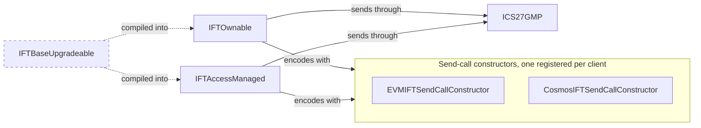

An Interchain Fungible Token (IFT) is a fungible token that moves between chains by burning it on one and minting it on the other. Each deployment is an ERC20 with the cross-chain behavior built into the token itself.

That behavior is built on GMP. An IFT defines no packet type, and instead a transfer travels as an ordinary GMP call, addressed to the counterparty IFT contract registered for that client.

An issuer deploys one of two variants, which differ only in who the contract's authority is. The authority registers a send-call constructor for each counterparty the contract bridges to.

Source: [IFTBaseUpgradeable.sol](https://github.com/cosmos/ibc-contracts/blob/main/ibc-solidity/contracts/utils/IFTBaseUpgradeable.sol), with the deployable variants and the encoders listed below. The behavior behind this surface is on [IFT: how it works](/applications/ift).

## What an IFT contract does

An IFT contract contains both the ERC20 logic and the logic for moving the token across chains. Sending burns the amount from the caller, then dispatches an encoded mint call through [ICS27GMP](/ibc-solidity-contracts/ics27-gmp-and-accounts). On receipt, the contract checks that the sender is a registered counterparty, then mints the amount.

Any holder can send with `iftTransfer`, or burn their own balance directly. Minting is the gated side: the authority mints local supply, and a registered counterparty's mint call arrives through GMP. The authority also registers which counterparties this contract accepts those calls from.

GMP carries the call, and calls back when the packet is acknowledged or times out. Two counterparty IFT contracts reach each other through GMP alone, with no escrow or voucher contract between them.

Interacts with: [ICS27GMP and its per-sender accounts](/ibc-solidity-contracts/ics27-gmp-and-accounts), one send-call constructor per registered bridge, and the counterparty IFT contract.

## Contracts on this page

One variant is deployed per token, with the abstract base compiled into it. Each counterparty needs a send-call constructor registered beside it.

| Contract | Kind | What it does | Source |
|---|---|---|---|
| `IFTBaseUpgradeable` | Abstract base, compiled into `IFTOwnable` and `IFTAccessManaged` | The shared burn, mint, and refund surface | [IFTBaseUpgradeable.sol](https://github.com/cosmos/ibc-contracts/blob/main/ibc-solidity/contracts/utils/IFTBaseUpgradeable.sol) |
| `IFTOwnable` | Deployed contract, behind an ERC1967 proxy | An IFT whose authority is one owner address | [IFTOwnable.sol](https://github.com/cosmos/ibc-contracts/blob/main/ibc-solidity/contracts/utils/IFTOwnable.sol) |
| `IFTAccessManaged` | Deployed contract, behind an ERC1967 proxy | An IFT whose authority is an external AccessManager | [IFTAccessManaged.sol](https://github.com/cosmos/ibc-contracts/blob/main/ibc-solidity/contracts/utils/IFTAccessManaged.sol) |
| `EVMIFTSendCallConstructor` | Encoder contract, stateless | Builds the mint call for an EVM counterparty | [EVMIFTSendCallConstructor.sol](https://github.com/cosmos/ibc-contracts/blob/main/ibc-solidity/contracts/utils/EVMIFTSendCallConstructor.sol) |
| `CosmosIFTSendCallConstructor` | Encoder contract, configured at construction | Builds the mint call for a Cosmos SDK counterparty | [CosmosIFTSendCallConstructor.sol](https://github.com/cosmos/ibc-contracts/blob/main/ibc-solidity/contracts/utils/CosmosIFTSendCallConstructor.sol) |

The external surface is declared in `IIFT`, the data structures in `IIFTMsgs`, and the errors in `IIFTErrors`. An encoder implements `IIFTSendCallConstructor`, which is the one interface an issuer writes against to support a new counterparty.



## Authority

Every IFT deployment has a single authority. Registering and removing bridges, minting local supply, and authorizing upgrades all run through it.

IBC-solidity ships two standard options: a single owner address, or an external access manager.

- **`IFTOwnable`** gives the contract a single owner address. It combines the base with `ERC20BurnableUpgradeable`, `OwnableUpgradeable`, and `UUPSUpgradeable`, and its authority check resolves to `onlyOwner`.
- **`IFTAccessManaged`** hands authorization to an external OpenZeppelin AccessManager, which permissions each function by role rather than fixing it to one address. It swaps the owner for `AccessManagedUpgradeable`, and its authority check uses the `restricted` modifier, which defers to that manager.

A contract that fits neither variant inherits `IFTBaseUpgradeable` directly. It must implement `_onlyAuthority()` to choose its own governance model. It can also override the ERC20 `_update` hook for behavior such as rate limiting or whitelisting.

## Initialize the contract

The choice of authority shows up as the initializer's first argument:

```solidity
// IFTOwnable
function initialize(address owner_, string calldata erc20Name, string calldata erc20Symbol, address ics27Gmp)

// IFTAccessManaged
function initialize(address authority_, string calldata erc20Name, string calldata erc20Symbol, address ics27Gmp)
```

| Parameter | What it sets |
|---|---|
| `owner_` on `IFTOwnable`, `authority_` on `IFTAccessManaged` | The authority: an owner address, or the AccessManager contract |
| `erc20Name` | The ERC20 token name |
| `erc20Symbol` | The ERC20 token symbol |
| `ics27Gmp` | The GMP contract this contract sends through and accepts callbacks from |

The GMP address is fixed at initialization by the initializer. Pointing a live contract at a different GMP deployment therefore means an upgrade, which the same authority gates.

Both variants run behind a proxy, and both disable initializers in their constructors.

## Bridge registration

A bridge is one IFT contract's record of a counterparty IFT contract, kept against the client for that counterparty's chain. It tells this contract where to send, and whose mint calls to accept.

Each contract registers its own counterparties, one at a time, and a pair can transfer only once both sides have registered the other. Bridges are keyed by client, so a contract holds one counterparty per client.

| Function | Description |
|---|---|
| `registerIFTBridge(string clientId, string counterpartyIFTAddress, address iftSendCallConstructor)` | Authority-only. Records the counterparty for a client ID |
| `removeIFTBridge(string clientId)` | Authority-only. Deletes the record for a client ID |

Registration validates its arguments before it stores anything. The client ID and the counterparty address must be non-empty, and the send-call constructor must be a live contract that advertises `IIFTSendCallConstructor` through ERC-165.

```solidity
struct IFTBridge {
    string clientId;
    string counterpartyIFTAddress;
    IIFTSendCallConstructor iftSendCallConstructor;
}
```

The three fields are the local IBC client ID, the counterparty contract's address as a string, and the send-call constructor registered for that client.

<Warning>
Register an EVM counterparty in its checksummed EIP-55 form. The receiving side compares that string byte for byte against the sender string GMP produces, which is the checksummed hex of the sending contract's address. A differently cased address makes every incoming mint revert.
</Warning>

Registering the same client ID again overwrites the previous entry. Removal deletes the entry, and transfers this contract already sent on that client still settle or refund.

## Sending a transfer

A transfer starts on the source IFT contract, when a holder calls `iftTransfer`. The contract burns the amount first, then dispatches an encoded mint call over GMP and stores the record (later this record can be used to refund a failure or timeout). An IFT has no packet type of its own: the transfer travels as an ordinary GMP call, and [ICS27GMP](/ibc-solidity-contracts/ics27-gmp-and-accounts) owns the wire format.

| Function | Description |
|---|---|
| `iftTransfer(string clientId, string receiver, uint256 amount, uint64 timeoutTimestamp)` | Burns and sends with a caller-supplied timeout, which must be in the future |
| `iftTransfer(string clientId, string receiver, uint256 amount)` | Burns and sends with the default timeout of now plus 15 minutes |

Any holder may call either overload, since neither carries an authority check. The call burns before it dispatches, stores the pending transfer under the sequence `sendCall` returns, and ends by emitting `IFTTransferInitiated`.

From the dispatch onwards the transfer is out of this contract's hands. Its path to the counterparty:

1. The source contract calls `ICS27GMP.sendCall` with the encoded mint call, the counterparty address from the bridge, an empty salt, and the timeout. The returned packet sequence keys the pending transfer.
2. ICS27GMP wraps the payload in a GMP packet whose sender field is the source contract's address as checksummed hex, and sends it through the [router](/ibc-solidity-contracts/ics26-router) on the `gmpport` port.
3. A relayer carries the packet to the destination chain and submits it with a proof, which the destination chain's light client verifies.
4. The destination router hands the packet to its own ICS27GMP, by port.
5. That ICS27GMP executes the payload through the `ICS27Account` it derives for this sender and client, so `iftMint` arrives from the derived destination account rather than from GMP itself.

The destination contract's checks on that call are next. [IFT: how it works](/applications/ift) explains the same path from the holder's side.

## Receiving a mint

The receiving entry point is `iftMint(address receiver, uint256 amount)`, and the destination contract mints only for a caller it can trace back to a registered counterparty.

That caller is the `ICS27Account` GMP derived for the source contract on this client, not the GMP contract itself. That derivation takes the client, the sender, and a salt, so the address is what identifies who asked for the mint. Four checks on the caller stand between the call and a mint.

- The contract asks GMP for the caller's account identifier, and that lookup reverts when the caller is not a GMP account.
- A bridge must be registered for the identifier's client ID.
- The identifier's sender string must equal the registered counterparty address exactly.
- The identifier's salt must be empty, which leaves each counterparty one account to mint through.

Pass all four and the contract mints to the receiver, emits `IFTMintReceived`, and returns nothing. GMP wraps the call's empty return data in an acknowledgement. Fail one and the call reverts, which the router converts into an error acknowledgement.

## Acknowledgement and timeout callbacks

The two GMP callbacks settle or refund the pending record, and only the GMP contract can invoke them.

| Function | Description |
|---|---|
| `onAckPacket(bool success, IIBCAppCallbacks.OnAcknowledgementPacketCallback msg_)` | Settles the pending transfer on success, refunds on the error acknowledgement |
| `onTimeoutPacket(IIBCAppCallbacks.OnTimeoutPacketCallback msg_)` | Refunds the pending transfer |

The base contract inherits `IBCCallbackReceiver`, which advertises `IIBCSenderCallbacks` through ERC-165, and GMP delivers a callback only to senders that advertise it.

On a successful acknowledgement the source contract deletes the pending transfer and emits `IFTTransferCompleted`, minting and burning nothing. On the error acknowledgement it refunds instead: it mints the pending amount back to the original sender, deletes the record, and emits `IFTTransferRefunded`.

The timeout callback refunds with no success check, once a relayer submits the timeout proof and GMP routes the callback to the source contract. Its three effects are the same: mint back to the sender, delete the record, emit `IFTTransferRefunded`.

## Send-call constructors

A send-call constructor is registered per counterparty client, and it turns a receiver and an amount into the exact mint call that chain expects. One EVM encoder serves every EVM counterparty, because it holds no state. A Cosmos encoder is built with one counterparty's type URL, denom, and interchain account address, so a second Cosmos counterparty needs a second encoder. The destination's mint call is built on the source chain, inside the transfer, and different chain types expect different encodings.

| Contract | What it produces |
|---|---|
| `EVMIFTSendCallConstructor` | An ABI-encoded call to `IIFT.iftMint(receiver, amount)`, after parsing the receiver string as an EVM address |
| `CosmosIFTSendCallConstructor` | A protojson transaction wrapping one `MsgIFTMint`, whose type URL, denom, and signer, an interchain account address, are all fixed at construction |

The Cosmos contract accepts a receiver that is either EVM hex or bech32-shaped. Its interchain account address derives from the IFT contract's own address, so the pair is precomputed off-chain before that contract is deployed. That changes deployment order: the account address is computed off-chain first, then fed to the constructor's deployment.

Supporting a new counterparty means implementing `constructMintCall(receiver, amount)` from `IIFTSendCallConstructor` and advertising that interface through ERC-165, then registering the contract as a bridge's constructor. Without the ERC-165 answer, `registerIFTBridge` reverts `IFTInvalidConstructorInterface`.

## State and storage

Beyond its ERC20 balances and its access-control state, an IFT contract also stores the GMP address, the bridges by client ID, and the pending transfers by client ID and sequence. All three live in one ERC-7201 namespaced slot.

| What is stored | When written | When deleted |
|---|---|---|
| The GMP contract | At initialization | Stays for the life of the contract |
| A bridge, per client ID | On registration | On removal, or overwritten by a later registration for the same client ID |
| A pending transfer, per client ID and sequence | On send, under the sequence `sendCall` returns | On a successful acknowledgement, or on a refund |

A pending transfer is a `PendingTransfer{sender, amount}` record. It holds only the sender and the amount, because the client ID and the sequence are its mapping keys. Each has its own getter: `getIFTBridge(clientId)` for a bridge, `getPendingTransfer(clientId, sequence)` for a pending transfer, and `ics27()` for the GMP address.

## Events

Six events cover the bridge lifecycle and every transfer outcome, all declared in `IIFT`.

| Event | When it fires |
|---|---|
| `IFTBridgeRegistered` | A bridge is registered for a client ID |
| `IFTBridgeRemoved` | A bridge is removed |
| `IFTTransferInitiated` | At the end of a send, with the client ID, sequence, sender, receiver, and amount |
| `IFTMintReceived` | After a successful `iftMint` |
| `IFTTransferCompleted` | A successful acknowledgement settles a pending transfer |
| `IFTTransferRefunded` | Either failure path refunds a pending transfer |

## Errors

The reverts fall into argument validation, a missing bridge or pending record, and an unauthorized caller. The contract's errors are declared in `IIFTErrors`, and each send-call constructor declares its own receiver error.

| Error | Raised when |
|---|---|
| `IFTEmptyClientId` | A registration or a send passes an empty client ID |
| `IFTEmptyCounterpartyAddress` | A registration passes an empty counterparty address |
| `IFTZeroAddressConstructor` | A registration passes the zero address as the send-call constructor |
| `IFTInvalidConstructorInterface(callConstructor)` | The send-call constructor does not advertise `IIFTSendCallConstructor` |
| `IFTEmptyReceiver` | A send passes an empty receiver |
| `IFTZeroAmount` | A send passes a zero amount |
| `IFTTimeoutInPast(timeout, currentTime)` | A send passes a timeout that is not in the future |
| `IFTBridgeNotFound(clientId)` | No bridge is registered for the client ID involved |
| `IFTUnauthorizedMint(expected, actual)` | The calling account's sender string does not match the registered counterparty address |
| `IFTUnexpectedSalt(salt)` | The calling account's identifier carries a non-empty salt |
| `IFTOnlyICS27GMP(caller)` | Anyone but the GMP contract calls a callback |
| `IFTPendingTransferNotFound(clientId, sequence)` | No pending transfer matches the client ID and sequence |
| `EVMIFTInvalidReceiver(receiver)` | The receiver string does not parse as an EVM address |
| `CosmosIFTInvalidReceiver(receiver)` | The receiver string is neither EVM hex nor bech32-shaped |

## Roles and permissions

The table names the main entry points each kind of caller may call.

| Caller | What it may call | Who that is |
|---|---|---|
| The authority | `registerIFTBridge`, `removeIFTBridge`, the local `mint(address, uint256)`, and upgrade authorization | The owner on `IFTOwnable`, an AccessManager role per function on `IFTAccessManaged` |
| Any holder | ERC20 transfers, burning an own balance, and `iftTransfer` | Every token holder |
| The GMP contract | `onAckPacket` and `onTimeoutPacket` | The GMP deployment the contract was initialized with |
| A counterparty's GMP account | `iftMint` | The `ICS27Account` GMP derived for a registered counterparty contract |

Holders can burn their own balance because both variants inherit `ERC20BurnableUpgradeable`, which also lets an approved spender burn from the balance it was approved against. A call to `iftMint` from the GMP contract itself reverts, because that contract has no account identifier of its own.

## Deployment and upgrade

The issuer deploys the variant's logic contract behind an ERC1967 proxy. The repo ships a Forge script that deploys an `IFTOwnable` logic contract and its proxy for the end-to-end tests, taking the GMP address, name, and symbol from the environment and making the deployer the owner.

Both variants are UUPS-upgradeable, and the same authority that gates bridge management gates the upgrade: owner-gated on `IFTOwnable`, `restricted` on `IFTAccessManaged`. A `CosmosIFTSendCallConstructor` keeps the configuration it is deployed with. [Permissions and upgrades](/ibc-solidity-contracts/permissions-and-upgrades) carries the full proxy and upgrade map.
