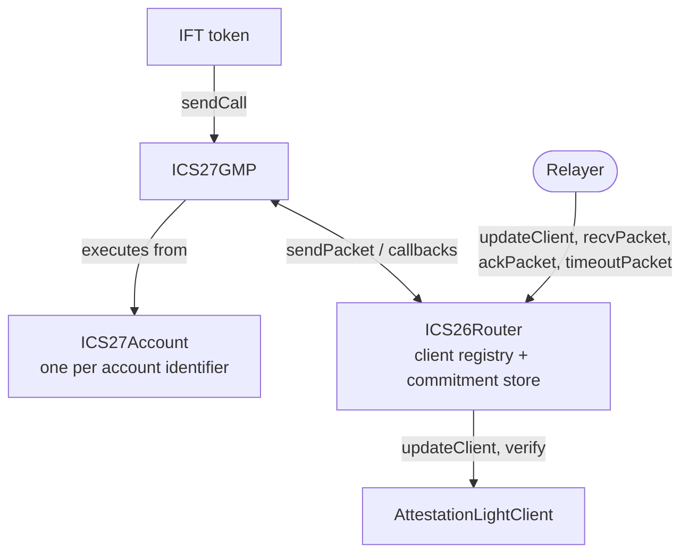

IBC-solidity is the Solidity implementation of the IBC protocol. It consists of a core set of contracts that run on each chain: a router that holds the registries and the commitment store, light clients for each counterparty, and the applications that send and receive packets.

The pages in this section document the main contracts and how they work.

## How the contracts fit together

Each chain in a pair holds a core set of IBC contracts. At its center is the core ICS26Router, which owns the application registry, the light client registry, and the commitment store.

Around it sit light clients counterparty and the applications that use them. The router records the counterparty client identifier for each client it registers.

The router is the only contract that talks to both the applications and the light clients. An application joins by registering an `IIBCApp` implementation under a port identifier. Light clients are interchangeable behind `ILightClient`, which declares `updateClient`, `verifyMembership`, `verifyNonMembership`, `misbehaviour`, and `getClientState`.

To start, an application calls `sendPacket`. The router accepts that call only from the application registered on the packet's source port. Inbound, a relayer calls `recvPacket`. The router has the destination client verify a membership proof of the packet commitment, then dispatches `onRecvPacket` to the application. The same pattern closes the loop: `ackPacket` verifies the counterparty's acknowledgement, and `timeoutPacket` verifies that no receipt was written.

## IBC-solidity contracts

Every contract in the tables below is one of five things: a contract with its own address, an abstract base compiled into another contract, a child instance a parent creates, an encoder registered per counterparty client, or a library. The Kind column says which one each is.

### ICS26Router: the IBC core

Documented in [core](/ibc-solidity-contracts/ics26-router).

| Contract | Kind | What it does | Source |
|---|---|---|---|
| ICS26Router | Deployed contract | Packet router: holds the application and client registries, drives send, receive, acknowledge, and timeout | [ICS26Router.sol](https://github.com/cosmos/ibc-contracts/blob/main/ibc-solidity/contracts/ICS26Router.sol) |
| ICS02ClientUpgradeable | Abstract base, compiled into ICS26Router | The light client registry: client identifiers, their client contracts, and their counterparty information | [ICS02ClientUpgradeable.sol](https://github.com/cosmos/ibc-contracts/blob/main/ibc-solidity/contracts/utils/ICS02ClientUpgradeable.sol) |
| IBCStoreUpgradeable | Abstract base, compiled into ICS26Router | The provable store of packet commitments, receipts, and acknowledgements | [IBCStoreUpgradeable.sol](https://github.com/cosmos/ibc-contracts/blob/main/ibc-solidity/contracts/utils/IBCStoreUpgradeable.sol) |
| ICS24Host | Library | Commitment path and commitment-hash generators, plus the universal error acknowledgement | [ICS24Host.sol](https://github.com/cosmos/ibc-contracts/blob/main/ibc-solidity/contracts/utils/ICS24Host.sol) |
| IBCIdentifiers | Library | The client identifier prefix and the validation rules for custom identifiers | [IBCIdentifiers.sol](https://github.com/cosmos/ibc-contracts/blob/main/ibc-solidity/contracts/utils/IBCIdentifiers.sol) |
| RelayerHelper | Standalone contract, optional. No deployment script creates it | Read-only packet-status queries over the router's commitments. No shipped deployment path creates it | [RelayerHelper.sol](https://github.com/cosmos/ibc-contracts/blob/main/ibc-solidity/contracts/utils/RelayerHelper.sol) |

### Light clients

AttestationLightClient is documented in [attestation light client](/ibc-solidity-contracts/attestation-light-client).

| Contract | Kind | What it does | Source |
|---|---|---|---|
| AttestationLightClient | Deployed contract, one per counterparty | Light client that trusts an m-of-n attestor set's signatures over heights and packet commitments | [AttestationLightClient.sol](https://github.com/cosmos/ibc-contracts/blob/main/ibc-solidity/contracts/light-clients/attestation/AttestationLightClient.sol) |
| SP1ICS07Tendermint | Deployed contract | Tendermint light client whose updates and proofs are verified as SP1 zero-knowledge proofs | [SP1ICS07Tendermint.sol](https://github.com/cosmos/ibc-contracts/blob/main/ibc-solidity/contracts/light-clients/sp1-ics07/SP1ICS07Tendermint.sol) |
| ICS02PrecompileWrapper | Deployed contract, one per ibc-go client identifier it wraps | Adapter exposing a Cosmos EVM chain's ICS02 precompile through the light client interface | [ICS02PrecompileWrapper.sol](https://github.com/cosmos/ibc-contracts/blob/main/ibc-solidity/contracts/light-clients/ics02-wrapper/ICS02PrecompileWrapper.sol) |

### ICS27GMP: the GMP application

Documented in [GMP](/ibc-solidity-contracts/ics27-gmp-and-accounts).

| Contract | Kind | What it does | Source |
|---|---|---|---|
| ICS27GMP | Deployed contract | General Message Passing: sends call payloads and executes received ones from per-sender accounts | [ICS27GMP.sol](https://github.com/cosmos/ibc-contracts/blob/main/ibc-solidity/contracts/ICS27GMP.sol) |
| ICS27Account | Deployed once as the account implementation, then one proxy instance per `(clientId, sender, salt)` | Execution account a remote GMP sender controls on this chain | [ICS27Account.sol](https://github.com/cosmos/ibc-contracts/blob/main/ibc-solidity/contracts/utils/ICS27Account.sol) |
| ICS27Lib | Library | GMP constants, acknowledgement encoding, and the account proxy bytecode used for CREATE2 | [ICS27Lib.sol](https://github.com/cosmos/ibc-contracts/blob/main/ibc-solidity/contracts/utils/ICS27Lib.sol) |
| IBCSenderCallbacksLib | Library | ERC165-checked dispatch of acknowledgement and timeout callbacks to sender contracts | [IBCSenderCallbacksLib.sol](https://github.com/cosmos/ibc-contracts/blob/main/ibc-solidity/contracts/utils/IBCSenderCallbacksLib.sol) |

### IFT: Interchain Fungible Tokens

Documented in [IFT](/ibc-solidity-contracts/ift-contracts).

| Contract | Kind | What it does | Source |
|---|---|---|---|
| IFTOwnable | Deployed contract | Issuer-owned IFT token, minted and administered by a single owner | [IFTOwnable.sol](https://github.com/cosmos/ibc-contracts/blob/main/ibc-solidity/contracts/utils/IFTOwnable.sol) |
| IFTAccessManaged | Deployed contract | IFT token governed by an AccessManager authority instead of a single owner | [IFTAccessManaged.sol](https://github.com/cosmos/ibc-contracts/blob/main/ibc-solidity/contracts/utils/IFTAccessManaged.sol) |
| IFTBaseUpgradeable | Abstract base, compiled into an IFT token | The shared IFT engine: burns on send, mints on receive, refunds on failure | [IFTBaseUpgradeable.sol](https://github.com/cosmos/ibc-contracts/blob/main/ibc-solidity/contracts/utils/IFTBaseUpgradeable.sol) |
| EVMIFTSendCallConstructor | Encoder contract | Encodes the counterparty mint call as an ABI `iftMint` call for EVM chains | [EVMIFTSendCallConstructor.sol](https://github.com/cosmos/ibc-contracts/blob/main/ibc-solidity/contracts/utils/EVMIFTSendCallConstructor.sol) |
| CosmosIFTSendCallConstructor | Encoder contract | Encodes the counterparty mint call as a protojson message for Cosmos SDK chains | [CosmosIFTSendCallConstructor.sol](https://github.com/cosmos/ibc-contracts/blob/main/ibc-solidity/contracts/utils/CosmosIFTSendCallConstructor.sol) |
| IBCCallbackReceiver | Abstract base, compiled into a callback receiver | ERC165 base advertising support for acknowledgement and timeout callbacks | [IBCCallbackReceiver.sol](https://github.com/cosmos/ibc-contracts/blob/main/ibc-solidity/contracts/utils/IBCCallbackReceiver.sol) |

### Access control

Documented in [access control](/ibc-solidity-contracts/permissions-and-upgrades).

| Contract | Kind | What it does | Source |
|---|---|---|---|
| AccessManager | Deployed contract, from OpenZeppelin | Holds the role assignments the core contracts check against | [AccessManager](https://docs.openzeppelin.com/contracts/5.x/api/access#AccessManager) |
| IBCRolesLib | Library | The shared role identifiers and the selectors each role gates | [IBCRolesLib.sol](https://github.com/cosmos/ibc-contracts/blob/main/ibc-solidity/contracts/utils/IBCRolesLib.sol) |

## Who deploys what

Deployment splits three ways:

- **An operator** stands up the core: an AccessManager, then ICS26Router and the applications, then one light client per counterparty, each registered on the router with `addClient`.
- **A token issuer** deploys its own IFT, initialized with an already-deployed ICS27GMP address plus the token's name and symbol, and one send-call constructor registered per counterparty client it bridges to.
- **The contracts themselves** create the rest. ICS27GMP makes an account proxy for each `(clientId, sender, salt)` on first use, behind the beacon it creates over the account logic it was handed. The ICS02 precompile is chain-native at `0x...0807`, so only its wrapper is deployed.

The IBC CLI deploys the contract set. `ibc deploy core` stands up the access manager and the router on one chain. `ibc deploy client` deploys a light client tracking one counterparty and registers it. A connection between two chains takes four of those invocations, two per chain.

[Permissions and upgrades](/ibc-solidity-contracts/permissions-and-upgrades) has what each deployment fixes for good and who can change it later.

## Audits

- [Zellic, 2025-03-25](https://github.com/cosmos/ibc-contracts/blob/main/docs/audits/2025-03-25-zellic.pdf)
- [Sherlock, 2025-04-03](https://github.com/cosmos/ibc-contracts/blob/main/docs/audits/2025-04-03-sherlock.pdf)

