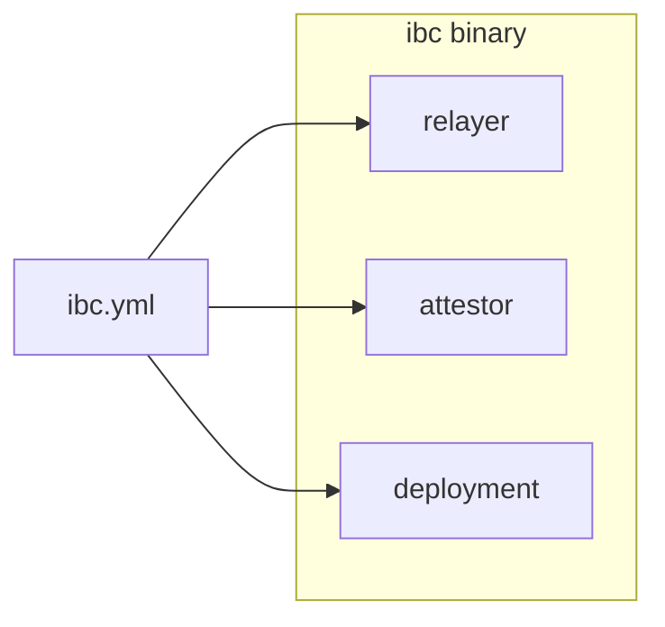
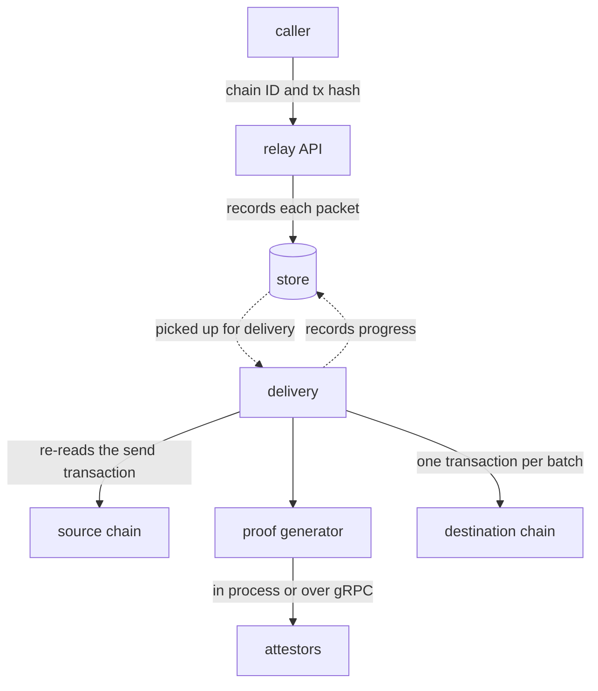
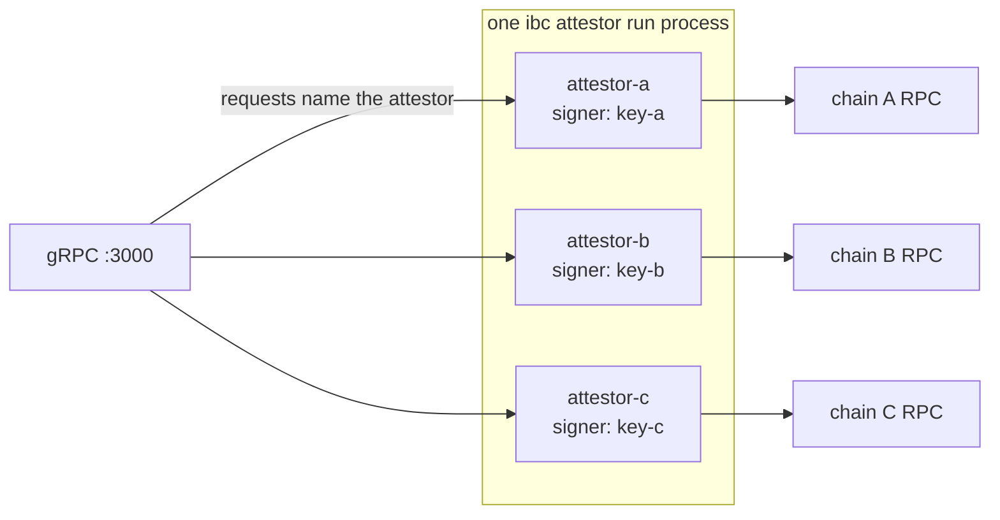

The IBC CLI is an all-in-one tool for deploying, configuring, and running an IBC connection between chains, simplifying the process of setting up and managing IBC connections.

It consists of three parts:

- Contract deployment for IBC Solidity contracts on EVM chains
- A relayer for moving packets between chains
- An attestor service for attestation light clients

Each of these services is configurable under a single configuration file. Proof aggregation and transaction-building logic are internalized in the relayer. Relayers and attestors can be run in a single process or standalone using the CLI.  IBC CLI also handles contract deployment and configuration for the operator.

## Deployment

You can deploy the IBC Solidity contracts to an EVM chain with an RPC endpoint and a funded key. The IBC CLI deploys them and wires them to each other.

It deploys the following contracts:

- The core routing stack: an access manager and the [ICS26Router](../5-ibc-solidity-contracts/2-ics26-router.md) behind a proxy.
- An [attestation light client](../5-ibc-solidity-contracts/5-attestation-light-client.md) on each chain tracking the other, registered on the router.
- The [ICS27GMP](../5-ibc-solidity-contracts/3-ics27-gmp-and-accounts.md) app and its account logic.
- [IFT](../5-ibc-solidity-contracts/4-ift-contracts.md) token contracts, and the bridges between them.

Signer keys, contract addresses, client IDs, and finality settings all have to stay consistent across the on-chain and off-chain pieces, which can be difficult to manage by hand. The CLI handles the deployment and the checks that catch a mismatch, so you do not write your own deployment and query scripts.

Follow the [tutorial](2-tutorial-deploy-ibc-and-send-a-token.md) to learn the full process of deploying IBC between two chains and sending a token.

Deployment is done from a single key. It becomes the access manager's admin, which governs the router and the GMP app, and the default owner of any token you deploy. See [Permissions and upgrades](../5-ibc-solidity-contracts/6-permissions-and-upgrades.md) for more details.

## The relayer

Relayers are responsible for moving packets between chains. The IBC CLI provides a relayer service that can run on its own, or in one process with an attestor. It moves packets between the chains named in its configuration file.

Its work starts after an application has already sent a packet. The relayer reads that send transaction on the source chain, gathers the proofs the packet needs, and submits them to the destination chain. It then carries the acknowledgement back, or times the packet out if it never arrived.

[The Relayer page](../2-how-ibc-works/5-relayer.md) covers what a relayer is for and what it is trusted with.

### Starting a relay

A relay starts one of two ways:

- With `autoRelay` enabled on a client end, the relayer subscribes to that chain over a websocket and carries packets leaving it as they are sent. 
- Manually: a relay begins by calling the relayer's API, naming the source chain, the transaction, and which of its packets to relay.

Packets heading the same way are batched and delivered together, rather than one at a time.

### Proof generation and transaction building

Before it can deliver anything, the relayer needs proof of the packets for the light client. It runs one proof generator for each light client it submits to. Currently the only supported light client type is the attestation light client, with more light client types planned.

The generator asks the client's attestors to attest to the chain's state at a height. It checks the signatures, and once enough attestors have signed the same attestation to meet the client's threshold, it packages that attestation and its signatures together. That package is the proof.

It returns a proof of the chain's state at a height, and a proof for each packet in the batch.

The relayer then turns each batch of packets heading to the same destination into one transaction. That transaction makes a single call to the router. It carries a list of operations: first an update advancing the light client to the height just proved, then one delivery for each packet in the batch.

### Signing and gas

A relayer's signing key is set in the IBC CLI's configuration file. That key can be a file on disk or a remote key manager.

The `ibc keys` commands can create a key and add it to the configuration in one step.

A connection relayed in both directions submits to both chains, so it needs a funded key on each to pay gas. Nothing reimburses those fees.

### Database

The relayer keeps a database to store the status of each packet and the transactions that carried it. It runs on SQLite by default, and a Postgres database is available for larger deployments, configured in the configuration file.

### Relayer API

The relayer exposes a gRPC API. `Relay` asks it to deliver the packets in a transaction, and `Status` reports where each of those packets got to.

## The attestor

An attestor signs statements about a chain: its state at a height, and the packets it holds. See [Attestors](../4-light-clients/2-attestors.md) for what it signs and why that is trustworthy.

An attestor process is a stateless gRPC service with a connection to the chain it watches. It has a signer, and a rule for how far behind the head it will sign.

Its signer is configured in the IBC CLI's configuration file. Just like the relayer's signer, it can be a key file or a remote key manager.

An attestor's finality offset decides how far behind the chain head it signs. 

One process can host several attestors, each with its own signer and one chain it watches. That is what lets a single process attest for several chains at once.

IBC CLI allows you to run an attestor as its own standalone process, or in-process with the relayer. 

## Configuration

IBC CLI stores the configuration for deployment, the relayer, and attestors in a single YAML file at `~/.ibc/ibc.yml`.

It has six blocks:

- `chains`: the chains all three parts talk to, with a router address for each, an RPC endpoint, and a websocket endpoint where auto-relay is enabled.
- `relayer`: the connections to relay, and per-chain relay settings.
- `attestors`: the attestors this process runs, or queries over the network.
- `signers`: the keys, each under an alias the other blocks reference by name.
- `server` and `db`: the address to listen on, and the relayer's database.

Most configurations can be generated. `ibc config new` writes a starting file, `config add-chain` appends a chain, and the `ibc keys` commands can append a signer. After deploying, `ibc deploy render-config` prints the chains, connections, and attestors that the deployment implies.

The IBC CLI also validates the file with the `ibc config validate` command. 

The [configuration reference](6-configuration.md) carries every key and its default. [CLI commands](7-cli-commands.md) and the [API reference](8-api.md) cover the rest of the surface.

## Next steps

- [Deploy IBC and send a token](2-tutorial-deploy-ibc-and-send-a-token.md) brings up two chains and moves a token between them.
- [Run a standalone attestor](3-run-a-standalone-attestor.md) takes an attestor out of the relayer's process and into its own.
- [Run a standalone relayer](4-run-a-standalone-relayer.md) brings up a relayer against a connection someone else deployed.
