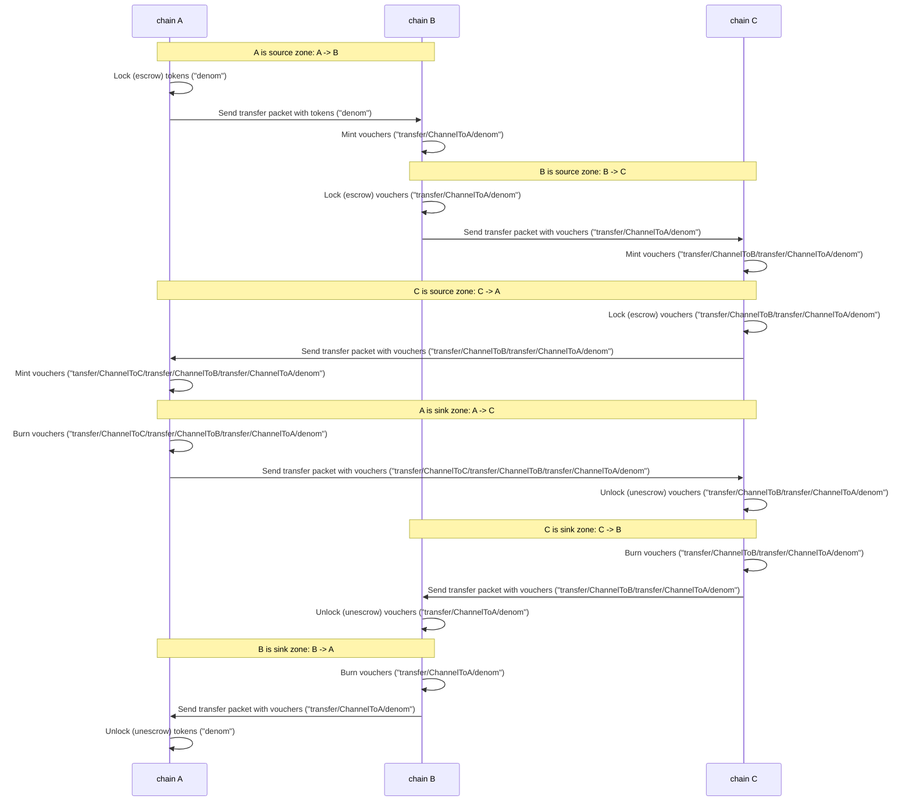

## Synopsis

This standard document specifies packet data structure, state machine handling logic, and encoding details for the transfer of fungible tokens over an IBC channel between two modules on separate chains. The state machine logic presented allows for safe multi-chain denomination handling with permissionless channel opening. This logic constitutes a "fungible token transfer bridge module", interfacing between the IBC routing module and an existing asset tracking module on the host state machine.

### Motivation

Users of a set of chains connected over the IBC protocol might wish to utilise an asset issued on one chain on another chain, perhaps to make use of additional features such as exchange or privacy protection, while retaining fungibility with the original asset on the issuing chain. This application-layer standard describes a protocol for transferring fungible tokens between chains connected with IBC which preserves asset fungibility, preserves asset ownership, limits the impact of Byzantine faults, and requires no additional permissioning.

### Definitions

The IBC handler interface & IBC routing module interface are as defined in [ICS 25](../../core/ics-025-handler-interface) and [ICS 26](../../core/ics-026-routing-module), respectively.

### Desired Properties

- Preservation of fungibility (two-way peg).
- Preservation of total supply (constant or inflationary on a single source chain & module).
- Permissionless token transfers, no need to whitelist connections, modules, or denominations.
- Symmetric (all chains implement the same logic, no in-protocol differentiation of hubs & zones).
- Fault containment: prevents Byzantine-inflation of tokens originating on chain `A`, as a result of chain `B`'s Byzantine behaviour (though any users who sent tokens to chain `B` may be at risk).

## Technical Specification

### Data Structures

Only one packet data type is required: `FungibleTokenPacketData`, which specifies the denomination, amount, sending account, and receiving account.

```typescript
interface FungibleTokenPacketData {
  denom: string
  amount: uint256
  sender: string
  receiver: string
  memo: string
}
```

As tokens are sent across chains using the ICS 20 protocol, they begin to accrue a record of channels for which they have been transferred across. This information is encoded into the `denom` field. 

The ICS 20 token denominations are represented by the form `{ics20Port}/{ics20Channel}/{denom}`, where `ics20Port` and `ics20Channel` are an ICS 20 port and channel on the current chain for which the funds exist. The prefixed port and channel pair indicate which channel the funds were previously sent through. Implementations are responsible for correctly parsing the IBC trace information from the base denomination. The way the reference ICS 20 implementation in ibc-go handles this is by taking advantage of the fact that it automatically generates channel identifiers with the format `channel-{n}`, where `n` is a integer greater or equal than 0. It can then correctly parse out the IBC trace information from the base denom which may have slashes, but will not have a substring of the form `{transfer-port-name}/channel-{n}`. If this assumption is broken, the trace information will be parsed incorrectly (i.e. part of the base denom will be misinterpreted as trace information). Thus chains must make sure that base denominations do not have the ability to create arbitrary prefixes that can mock the ICS 20 logic.

A sending chain may be acting as a source or sink zone. When a chain is sending tokens across a port and channel which are not equal to the last prefixed port and channel pair, it is acting as a source zone. When tokens are sent from a source zone, the destination port and channel will be prefixed onto the denomination (once the tokens are received) adding another hop to a tokens record. When a chain is sending tokens across a port and channel which are equal to the last prefixed port and channel pair, it is acting as a sink zone. When tokens are sent from a sink zone, the last prefixed port and channel pair on the denomination is removed (once the tokens are received), undoing the last hop in the tokens record. A more complete explanation is present in the [ibc-go implementation](https://github.com/cosmos/ibc-go/blob/457095517b7832c42ecf13571fee1e550fec02d0/modules/apps/transfer/keeper/relay.go#L18-L49) and the [ADR 001](https://github.com/cosmos/ibc-go/blob/main/docs/architecture/adr-001-coin-source-tracing.md).

The following sequence diagram exemplifies the multi-chain token transfer dynamics. This process encapsulates the steps involved in transferring tokens in a cycle that begins and ends on the same chain, traversing through Chain A, Chain B, and Chain C. The order of operations is outlined as `A -> B -> C -> A -> C -> B -> A`.



The acknowledgement data type describes whether the transfer succeeded or failed, and the reason for failure (if any).

```typescript
type FungibleTokenPacketAcknowledgement = FungibleTokenPacketSuccess | FungibleTokenPacketError;

interface FungibleTokenPacketSuccess {
  // This is binary 0x01 base64 encoded
  result: "AQ=="
}

interface FungibleTokenPacketError {
  error: string
}
```

Note that both the `FungibleTokenPacketData` as well as `FungibleTokenPacketAcknowledgement` must be JSON-encoded (not Protobuf encoded) when they serialized into packet data. Also note that `uint256` is string encoded when converted to JSON, but must be a valid decimal number of the form `[0-9]+`.

The fungible token transfer bridge module tracks escrow addresses associated with particular channels in state. Fields of the `ModuleState` are assumed to be in scope.

```typescript
interface ModuleState {
  channelEscrowAddresses: Map<Identifier, string>
}
```

### Sub-protocols

The sub-protocols described herein should be implemented in a "fungible token transfer bridge" module with access to a bank module and to the IBC routing module.

#### Port & channel setup

The `setup` function must be called exactly once when the module is created (perhaps when the blockchain itself is initialised) to bind to the appropriate port and create an escrow address (owned by the module).

```typescript
function setup() {
  capability = routingModule.bindPort("transfer", ModuleCallbacks{
    onChanOpenInit,
    onChanOpenTry,
    onChanOpenAck,
    onChanOpenConfirm,
    onChanCloseInit,
    onChanCloseConfirm,
    onRecvPacket,
    onTimeoutPacket,
    onAcknowledgePacket,
    onTimeoutPacketClose
  })
  claimCapability("port", capability)
}
```

Once the `setup` function has been called, channels can be created through the IBC routing module between instances of the fungible token transfer module on separate chains.

An administrator (with the permissions to create connections & channels on the host state machine) is responsible for setting up connections to other state machines & creating channels
to other instances of this module (or another module supporting this interface) on other chains. This specification defines packet handling semantics only, and defines them in such a fashion
that the module itself doesn't need to worry about what connections or channels might or might not exist at any point in time.

#### Routing module callbacks

##### Channel lifecycle management

Both machines `A` and `B` accept new channels from any module on another machine, if and only if:

- The channel being created is unordered.
- The version string is `ics20-1`.

```typescript
function onChanOpenInit(
  order: ChannelOrder,
  connectionHops: [Identifier],
  portIdentifier: Identifier,
  channelIdentifier: Identifier,
  counterpartyPortIdentifier: Identifier,
  counterpartyChannelIdentifier: Identifier,
  version: string) => (version: string, err: Error) {
  // only unordered channels allowed
  abortTransactionUnless(order === UNORDERED)
  // assert that version is "ics20-1" or empty
  // if empty, we return the default transfer version to core IBC
  // as the version for this channel
  abortTransactionUnless(version === "ics20-1" || version === "")
  // allocate an escrow address
  channelEscrowAddresses[channelIdentifier] = newAddress(portIdentifier, channelIdentifier)
  return "ics20-1", nil
}
```

```typescript
function onChanOpenTry(
  order: ChannelOrder,
  connectionHops: [Identifier],
  portIdentifier: Identifier,
  channelIdentifier: Identifier,
  counterpartyPortIdentifier: Identifier,
  counterpartyChannelIdentifier: Identifier,
  counterpartyVersion: string) => (version: string, err: Error) {
  // only unordered channels allowed
  abortTransactionUnless(order === UNORDERED)
  // assert that version is "ics20-1"
  abortTransactionUnless(counterpartyVersion === "ics20-1")
  // allocate an escrow address
  channelEscrowAddresses[channelIdentifier] = newAddress(portIdentifier, channelIdentifier)
  // return version that this chain will use given the
  // counterparty version
  return "ics20-1", nil
}
```

```typescript
function onChanOpenAck(
  portIdentifier: Identifier,
  channelIdentifier: Identifier,
  counterpartyChannelIdentifier: Identifier,
  counterpartyVersion: string) {
  // port has already been validated
  // assert that counterparty selected version is "ics20-1"
  abortTransactionUnless(counterpartyVersion === "ics20-1")
}
```

```typescript
function onChanOpenConfirm(
  portIdentifier: Identifier,
  channelIdentifier: Identifier) {
  // accept channel confirmations, port has already been validated, version has already been validated
}
```

```typescript
function onChanCloseInit(
  portIdentifier: Identifier,
  channelIdentifier: Identifier) {
    // always abort transaction
    abortTransactionUnless(FALSE)
}
```

```typescript
function onChanCloseConfirm(
  portIdentifier: Identifier,
  channelIdentifier: Identifier) {
  // no action necessary
}
```

##### Packet relay

In plain English, between chains `A` and `B`:

- When acting as the source zone, the bridge module escrows an existing local asset denomination on the sending chain and mints vouchers on the receiving chain.
- When acting as the sink zone, the bridge module burns local vouchers on the sending chains and unescrows the local asset denomination on the receiving chain.
- When a packet times-out, local assets are unescrowed back to the sender or vouchers minted back to the sender appropriately.
- Acknowledgement data is used to handle failures, such as invalid denominations or invalid destination accounts. Returning
  an acknowledgement of failure is preferable to aborting the transaction since it more easily enables the sending chain
  to take appropriate action based on the nature of the failure.

`sendFungibleTokens` must be called by a transaction handler in the module which performs appropriate signature checks, specific to the account owner on the host state machine.

```typescript
function sendFungibleTokens(
  denomination: string,
  amount: uint256,
  sender: string,
  receiver: string,
  sourcePort: string,
  sourceChannel: string,
  timeoutHeight: Height,
  timeoutTimestamp: uint64, // in unix nanoseconds
): uint64 {
    prefix = "{sourcePort}/{sourceChannel}/"
    // we are the source if the denomination is not prefixed
    source = denomination.slice(0, len(prefix)) !== prefix
    if source {
      // determine escrow account
      escrowAccount = channelEscrowAddresses[sourceChannel]
      // escrow source tokens (assumed to fail if balance insufficient)
      bank.TransferCoins(sender, escrowAccount, denomination, amount)
    } else {
      // receiver is source chain, burn vouchers
      bank.BurnCoins(sender, denomination, amount)
    }

    // create FungibleTokenPacket data
    data = FungibleTokenPacketData{denomination, amount, sender, receiver}

    // send packet using the interface defined in ICS4
    sequence = handler.sendPacket(
      getCapability("port"),
      sourcePort,
      sourceChannel,
      timeoutHeight,
      timeoutTimestamp,
      json.marshal(data) // json-marshalled bytes of packet data
    )

    return sequence
}
```

`onRecvPacket` is called by the routing module when a packet addressed to this module has been received.

```typescript
function onRecvPacket(packet: Packet) {
  FungibleTokenPacketData data = packet.data
  assert(data.denom !== "")
  assert(data.amount > 0)
  assert(data.sender !== "")
  assert(data.receiver !== "")

  // construct default acknowledgement of success
  FungibleTokenPacketAcknowledgement ack = FungibleTokenPacketAcknowledgement{true, null}
  prefix = "{packet.sourcePort}/{packet.sourceChannel}/"
  // we are the source if the packets were prefixed by the sending chain
  source = data.denom.slice(0, len(prefix)) === prefix
  if source {
    // receiver is source chain: unescrow tokens
    // determine escrow account
    escrowAccount = channelEscrowAddresses[packet.destChannel]
    // unescrow tokens to receiver (assumed to fail if balance insufficient)
    err = bank.TransferCoins(escrowAccount, data.receiver, data.denom.slice(len(prefix)), data.amount)
    if (err !== nil)
      ack = FungibleTokenPacketAcknowledgement{false, "transfer coins failed"}
  } else {
    prefix = "{packet.destPort}/{packet.destChannel}/"
    prefixedDenomination = prefix + data.denom
    // sender was source, mint vouchers to receiver (assumed to fail if balance insufficient)
    err = bank.MintCoins(data.receiver, prefixedDenomination, data.amount)
    if (err !== nil)
      ack = FungibleTokenPacketAcknowledgement{false, "mint coins failed"}
  }
  return ack
}
```

`onAcknowledgePacket` is called by the routing module when a packet sent by this module has been acknowledged.

```typescript
function onAcknowledgePacket(
  packet: Packet,
  acknowledgement: bytes) {
  // if the transfer failed, refund the tokens
  if (!acknowledgement.success)
    refundTokens(packet)
}
```

`onTimeoutPacket` is called by the routing module when a packet sent by this module has timed-out (such that it will not be received on the destination chain).

```typescript
function onTimeoutPacket(packet: Packet) {
  // the packet timed-out, so refund the tokens
  refundTokens(packet)
}
```

`refundTokens` is called by both `onAcknowledgePacket`, on failure, and `onTimeoutPacket`, to refund escrowed tokens to the original sender.

```typescript
function refundTokens(packet: Packet) {
  FungibleTokenPacketData data = packet.data
  prefix = "{packet.sourcePort}/{packet.sourceChannel}/"
  // we are the source if the denomination is not prefixed
  source = data.denom.slice(0, len(prefix)) !== prefix
  if source {
    // sender was source chain, unescrow tokens back to sender
    escrowAccount = channelEscrowAddresses[packet.srcChannel]
    bank.TransferCoins(escrowAccount, data.sender, data.denom, data.amount)
  } else {
    // receiver was source chain, mint vouchers back to sender
    bank.MintCoins(data.sender, data.denom, data.amount)
  }
}
```

```typescript
function onTimeoutPacketClose(packet: Packet) {
  // can't happen, only unordered channels allowed
}
```

#### Using the Memo Field

Note: Since earlier versions of this specification did not include a `memo` field, implementations must ensure that the new packet data is still compatible with chains that expect the old packet data. A legacy implementation MUST be able to unmarshal a new packet data with an empty string memo into the legacy `FungibleTokenPacketData` struct. Similarly, an implementation supporting `memo` must be able to unmarshal a legacy packet data into the current struct with the `memo` field set to the empty string.

The `memo` field is not used within transfer, however it may be used either for external off-chain users (i.e. exchanges) or for middleware wrapping transfer that can parse and execute custom logic on the basis of the passed in memo. If the memo is intended to be parsed and interpreted by higher-level middleware, then these middleware are advised to namespace their additions to the memo string so that they do not overwrite each other. Chains should ensure that there is some length limit on the entire packet data to ensure that the packet does not become a DOS vector. However, these do not need to be protocol-defined limits. If the receiver cannot accept a packet because of length limitations, this will lead to a timeout on the sender side.

Memos that are intended to be read by higher level middleware for custom execution must be structured so that different middleware can read relevant data in the memo intended for them without interfering with data intended for other middlewares.

Thus, for any memo that is meant to be interpreted by the state machine; it is recommended that the memo is a JSON object with each middleware reserving a key that it can read into and retrieve relevant data. This way the memo can be constructed to pass in information such that multiple middleware can read the memo without interference from each other.

Example:

```json
{
  "wasm": {
    "address": "contractAddress",
    "arguments": "marshalledArguments",
  },
  "callback": "contractAddress",
  "router": "routerArgs",
}
```

Here, the "wasm", "callback", and "router" fields are all intended for separate middlewares that will exclusively read those fields respectively in order to execute their logic. This allows multiple modules to read from the memo. Middleware should take care to reserve a unique key so that they do not accidentally read data intended for a different module. This issue can be avoided by some off-chain registry of keys already in-use in the JSON object.

#### Reasoning

##### Correctness

This implementation preserves both fungibility & supply.

Fungibility: If tokens have been sent to the counterparty chain, they can be redeemed back in the same denomination & amount on the source chain.

Supply: Redefine supply as unlocked tokens. All send-recv pairs sum to net zero. Source chain can change supply.

##### Multi-chain notes

This specification does not directly handle the "diamond problem", where a user sends a token originating on chain A to chain B, then to chain D, and wants to return it through D -> C -> A — since the supply is tracked as owned by chain B (and the denomination will be "{portOnD}/{channelOnD}/{portOnB}/{channelOnB}/denom"), chain C cannot serve as the intermediary. It is not yet clear whether that case should be dealt with in-protocol or not — it may be fine to just require the original path of redemption (and if there is frequent liquidity and some surplus on both paths the diamond path will work most of the time). Complexities arising from long redemption paths may lead to the emergence of central chains in the network topology.

In order to track all of the denominations moving around the network of chains in various paths, it may be helpful for a particular chain to implement a registry which will track the "global" source chain for each denomination. End-user service providers (such as wallet authors) may want to integrate such a registry or keep their own mapping of canonical source chains and human-readable names in order to improve UX.

#### Optional addenda

- Each chain, locally, could elect to keep a lookup table to use short, user-friendly local denominations in state which are translated to and from the longer denominations when sending and receiving packets. 
- Additional restrictions may be imposed on which other machines may be connected to & which channels may be established.

## Backwards Compatibility

Not applicable.

## Forwards Compatibility

This initial standard uses version "ics20-1" in the channel handshake.

A future version of this standard could use a different version in the channel handshake,
and safely alter the packet data format & packet handler semantics.

## Example Implementations

- Implementation of ICS 20 in Go can be found in [ibc-go repository](https://github.com/cosmos/ibc-go).
- Implementation of ICS 20 in Rust can be found in [ibc-rs repository](https://github.com/cosmos/ibc-rs).

## History

Jul 15, 2019 - Draft written

Jul 29, 2019 - Major revisions; cleanup

Aug 25, 2019 - Major revisions, more cleanup

Feb 3, 2020 - Revisions to handle acknowledgements of success & failure

Feb 24, 2020 - Revisions to infer source field, inclusion of version string

July 27, 2020 - Re-addition of source field

Nov 11, 2022 - Addition of a memo field

## Copyright

All content herein is licensed under [Apache 2.0](https://www.apache.org/licenses/LICENSE-2.0).
