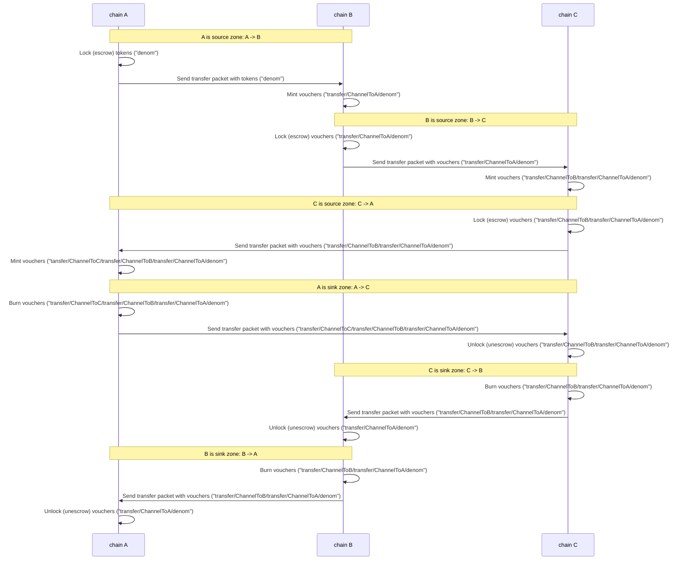

## Synopsis

This standard document specifies packet data structure, state machine handling logic, and encoding details for the transfer of fungible tokens over an IBC channel between two modules on separate chains. The state machine logic presented allows for safe multi-chain denomination handling with permissionless channel opening. This logic constitutes a "fungible token transfer bridge module", interfacing between the IBC routing module and an existing asset tracking module on the host state machine.

### Motivation

Users of a set of chains connected over the IBC protocol might wish to utilise an asset issued on one chain on another chain, perhaps to make use of additional features such as exchange or privacy protection, while retaining fungibility with the original asset on the issuing chain. This application-layer standard describes a protocol for transferring fungible tokens between chains connected with IBC which preserves asset fungibility, preserves asset ownership, limits the impact of Byzantine faults, and requires no additional permissioning.

### Definitions

The IBC handler interface & IBC routing module interface are as defined in [ICS 25](../../core/ics-025-handler-interface) and [ICS 26](../../core/ics-026-routing-module), respectively.

### Desired Properties

- Preservation of fungibility (two-way peg).
- Preservation of total supply (constant or inflationary on a single source chain & module).
- Permissionless token transfers, no need to whitelist connections, modules, or denominations.
- Symmetric (all chains implement the same logic, no in-protocol differentiation of hubs & zones).
- Fault containment: prevents Byzantine-inflation of tokens originating on chain `A`, as a result of chain `B`'s Byzantine behaviour (though any users who sent tokens to chain `B` may be at risk).

## Technical Specification

### Data Structures

Only one packet data type is required: `FungibleTokenPacketData`, which specifies the denomination, amount, sending account, and receiving account or `FungibleTokenPacketDataV2` which specifies multiple tokens being sent between sender and receiver along with an optional forwarding path that can forward tokens further beyond the initial receiving chain. A v2 supporting chain can optionally convert a v1 packet for channels that are still on version 1.

```typescript
interface FungibleTokenPacketData {
  denom: string
  amount: uint256
  sender: string
  receiver: string
  memo: string
}

interface FungibleTokenPacketDataV2 {
  tokens: []Token
  sender: string
  receiver: string
  memo: string
  // a struct containing the list of next hops, 
  // determining where the tokens must be forwarded next, 
  // and the memo for the final hop
  forwarding: Forwarding 
}

interface Token {
  denom: Denom 
  amount: uint256
}

interface Denom {
  base: string // base denomination
  trace: []Hop
}

interface Forwarding {
  hops: []Hop
  memo: string
}

interface Hop {
  portId: string
  channelId: string
}
```

As tokens are sent across chains using the ICS 20 protocol, they begin to accrue a record of channels for which they have been transferred across. This information is encoded into the `trace` field in the token. 

The ICS 20 token traces are represented by a list of `ics20Port` and `ics20Channel` pairs, which are an ICS 20 port and channel on the current chain for which the funds exist. The port and channel pair indicate which channel the funds were previously sent through. Implementations are responsible for correctly parsing the IBC trace information and encoding it into the final on-chain denomination so that the same base denominations sent through different paths are not treated as being fungible.

A sending chain may be acting as a source or sink zone. When a chain is sending tokens across a port and channel which are not equal to the last prefixed port and channel pair, it is acting as a source zone. When tokens are sent from a source zone, the destination port and channel will be prepended to the trace (once the tokens are received) adding another hop to a tokens record. When a chain is sending tokens across a port and channel which are equal to the last prefixed port and channel pair, it is acting as a sink zone. When tokens are sent from a sink zone, the first element of the trace, which was the last port and channel pair added to the trace is removed (once the tokens are received), undoing the last hop in the tokens record. A more complete explanation is [present in the ibc-go implementation](https://github.com/cosmos/ibc-go/blob/457095517b7832c42ecf13571fee1e550fec02d0/modules/apps/transfer/keeper/relay.go#L18-L49).

The following sequence diagram exemplifies the multi-chain token transfer dynamics. This process encapsulates the steps involved in transferring tokens in a cycle that begins and ends on the same chain, traversing through chain A, chain B, and chain C. The order of operations is outlined as `A -> B -> C -> A -> C -> B -> A`.



The forwarding path in the `v2` packet tells the receiving chain where to send the tokens to next. This must be constructed as a list of portID/channelID pairs with each element concatenated as `portID/channelID`. This allows users to automatically route tokens through the interchain. A common usecase might be to unwind the trace of the tokens back to the original source chain before sending it forward to the final intended destination.

Here are examples of the transfer packet data:

```typescript

// V1 example of transfer packet data
FungibleTokenPacketData {
  denom: "transfer/channel-1/transfer/channel-4/uatom",
  amount: 500,
  sender: cosmosexampleaddr1,
  receiver: cosmosexampleaddr2,
  memo: "exampleMemo",
}

// V2 example of transfer packet data
FungibleTokenPacketDataV2 {
  tokens: [
    Token{
      denom: Denom{
        base: "uatom",
        trace: [
          Hop{
            portId: "transfer",
            channelId: "channel-1",
          }, 
          Hop{
            portId: "transfer",
            channelId: "channel-4",
          }
        ],
      },
      amount: 500,
    },
    Token{
      denom: Denom{
        base: "btc",
        trace: [
          Hop{
            portId: "transfer",
            channelId: "channel-3",
          }
        ],
      },
      amount: 7,
    }
  ],
  sender: cosmosexampleaddr1,
  receiver: cosmosexampleaddr2,
  memo: "",
  forwarding: {
    hops: [
      Hop{portId: "transfer", channelId: "channel-7"},
      Hop{portId: "transfer", channelId: "channel-13"},
    ],  
    memo: "swap: {...}"
  }, // provide hops in order and the memo intended for final hop
}
```

The acknowledgement data type describes whether the transfer succeeded or failed, and the reason for failure (if any).

```typescript
type FungibleTokenPacketAcknowledgement = FungibleTokenPacketSuccess | FungibleTokenPacketError;

interface FungibleTokenPacketSuccess {
  // This is binary 0x01 base64 encoded
  result: "AQ=="
}

interface FungibleTokenPacketError {
  error: string
}
```

Note that both the `FungibleTokenPacketData` as well as `FungibleTokenPacketAcknowledgement` must be JSON-encoded (not Protobuf encoded) when they serialized into packet data. Also note that `uint256` is string encoded when converted to JSON, but must be a valid decimal number of the form `[0-9]+`.

The fungible token transfer bridge module tracks escrow addresses associated with particular channels in state. Fields of the `ModuleState` are assumed to be in scope.

```typescript
interface ModuleState {
  channelEscrowAddresses: Map<Identifier, string>
  channelForwardingAddresses: Map<Identifier, string>
}
```

### Store paths

#### Packet forward path

The `v2` packets that have non-empty forwarding information and should thus be forwarded, must be stored in the private store, so that an acknowledgement can be written for them when receiving an acknowledgement or timeout for the forwarded packet.

```typescript
function packetForwardPath(channelIdentifier: bytes, sequence: bigEndianUint64): Path {
  return "{channelIdentifier}0x4{bigEndianUint64Sequence}"
}
```

### Sub-protocols

The sub-protocols described herein should be implemented in a "fungible token transfer bridge" module with access to a bank module and to the IBC routing module.

#### Application callback setup

The `setup` function must be called exactly once when the module is created (perhaps when the blockchain itself is initialised) to register the application callbacks in the IBC router.

```typescript
function setup() {
  IBCRouter.callbacks["transfer"]=[onSendPacket,onRecvPacket,onAcknowledgePacket,onTimeoutPacket]
}
```

Once the `setup` function has been called, the application callbacks are registered and accessible in the IBC router.  

#### Routing module callbacks

##### Packet relay

This specification defines packet handling semantics.

Both machines `A` and `B` accept new packet from any module on another machine, if and only if the version string is `ics20-1` or `ics20-2`.

In plain English, between chains `A` and `B`:

- When acting as the source zone, the bridge module escrows an existing local asset denomination on the sending chain and mints vouchers on the receiving chain.
- When acting as the sink zone, the bridge module burns local vouchers on the sending chains and unescrows the local asset denomination on the receiving chain.
- When a packet times-out, local assets are unescrowed back to the sender or vouchers minted back to the sender appropriately.
- Acknowledgement data is used to handle failures, such as invalid denominations or invalid destination accounts. Returning
  an acknowledgement of failure is preferable to aborting the transaction since it more easily enables the sending chain
  to take appropriate action based on the nature of the failure.

Note: `constructOnChainDenom` is a helper function that will construct the local on-chain denomination for the bridged token. It **must** encode the trace and base denomination to ensure that tokens coming over different paths are not treated as fungible. The original trace and denomination must be retrievable by the state machine so that they can be passed in their original forms when constructing a new IBC path for the bridged token. The ibc-go implementation handles this by creating a local denomination: `hash(trace+base_denom)`.

`onSendFungibleTokens` must be called by a transaction handler in the module which performs appropriate signature checks, specific to the account owner on the host state machine.

```typescript
function onSendFungibleTokens(
  sourceChannelId: bytes, 
  payload: Payload
  ): bool {
  
  // the decode function must check the payload.encoding is among those supported 
  success,appData=decode(payload.encoding,payload.appData)
  abortTransactionUnless(success)
  // memo and forwarding cannot both be non-empty
  abortTransactionUnless(appData.memo != "" && appData.forwarding != nil)
  for token in appData.tokens 
    onChainDenom = constructOnChainDenom(token.denom.trace, token.denom.base)
    // if the token is not prefixed by our channel end's port and channel identifiers
    // then we are sending as a source zone
    if !isTracePrefixed(payload.sourcePort, sourceChannelId, token) {
      // determine escrow account
      escrowAccount = channelEscrowAddresses[sourceChannelId]
      // escrow source tokens (assumed to fail if balance insufficient)
      bank.TransferCoins(appData.sender, escrowAccount, onChainDenom, token.amount)
    } else {
      // receiver is source chain, burn vouchers
      bank.BurnCoins(appData.sender, onChainDenom, token.amount)
    }
  }

  var dataBytes bytes
  transferVersion = payload.version
  if transferVersion == "ics20-1" {
    abortTransactionUnless(len(appData.tokens) == 1)
    token = appData.tokens[0]
    // abort if forwarding defined
    abortTransactionUnless(appData.forwarding == nil)
    // create v1 denom of the form: port1/channel1/port2/channel2/port3/channel3/denom
    v1Denom = constructOnChainDenom(token.denom.trace, token.denom.base)
    // v1 packet data does not support forwarding fields
    data = FungibleTokenPacketData{v1Denom, token.amount, appData.sender, appData.receiver,appData.memo}
    // specific econding packet data marshalling into bytes
    dataBytes = payload.encoding.marshal(appData)
  } else if transferVersion == "ics20-2" {
    // create FungibleTokenPacket data
    data = FungibleTokenPacketDataV2{tokens, appData.sender, appData.receiver, appData.memo, appData.forwarding}
    // specific econding packet data marshalling into bytes
    dataBytes = payload.encoding.marshal(appData)
  } else {
   // Unsupported transfer version
    abortTransactionUnless(false)
  }
  return true
}
```

`onRecvPacket` is called by the routing module when a packet addressed to this module has been received.

Note: Function `parseICS20V1Denom` is a helper function that will take the full IBC denomination and extract the base denomination (i.e. native denomination in the chain of origin) and the trace information (if any) for the received token.

```typescript
function onRecvPacket(
  destChannelId: bytes,
  sourceChannelId: bytes,
  sequence: bigEndianUint64, 
  payload: Payload,
  ): (bytes, bool) {
  transferVersion = payload.version
  var tokens []Token
  var sender string
  var receiver string // address to send tokens to on this chain
  var finalReceiver string // final intended address in forwarding case

  if transferVersion == "ics20-1" {
     FungibleTokenPacketData data = payload.encoding.unmarshal(payload.appData)
     // convert full denom string to denom struct with base denom and trace
     denom = parseICS20V1Denom(data.denom)
     token = Token{
       denom: denom
       amount: data.amount
     }
     tokens = []Token{token}
     sender = data.sender
     receiver = data.receiver
  } else if transferVersion == "ics20-2" {
    FungibleTokenPacketDataV2 data = payload.encoding.unmarshal(payload.appData)
    tokens = data.tokens
    sender = data.sender

    // if we need to forward the tokens onward
    // overwrite the receiver to temporarily send to the 
    // channel escrow address of the intended receiver
    if len(data.forwarding.hops) > 0 {
      // memo must be empty
      abortTransactionUnless(data.memo == "")
      if channelForwardingAddress[destChannelId] == "" {
        channelForwardingAddress[destChannelId] = newAddress()
      }
      receiver = channelForwardingAddresses[destChannelId]
      finalReceiver = data.receiver
    } else {
      receiver = data.receiver
    }
  } else {
    // should never be reached as transfer version must be negotiated
    // to be either ics20-1 or ics20-2 during channel handshake
    abortTransactionUnless(false)
  }

  assert(sender !== "")
  assert(receiver !== "")
    
  // construct default acknowledgement of success
  FungibleTokenPacketAcknowledgement ack = FungibleTokenPacketAcknowledgement{true, null}

  receivedTokens = []Token
  for token in tokens {
    assert(token.denom !== nil)
    assert(token.amount > 0)
    
    var onChainTrace []Hop
    // we are the source if the packets were prefixed by the sending chain
    // if the sender sends the tokens prefixed with their channel end's
    // port and channel identifiers then we are receiving tokens we 
    // previously had sent to the sender, thus we are receiving the tokens
    // as a source zone
    if isTracePrefixed(payload.sourcePort, sourceChannelId, token) {
      // since we are receiving back to source we remove the prefix from the trace
      onChainTrace = token.trace[1:]
      onChainDenom = constructOnChainDenom(onChainTrace, token.denom.base)
      // receiver is source chain: unescrow tokens
      // determine escrow account
      escrowAccount = channelEscrowAddresses[destChannelId]
      // unescrow tokens to receiver (assumed to fail if balance insufficient)
      err = bank.TransferCoins(escrowAccount, receiver, onChainDenom, token.amount)
      if (err != nil) {
        ack = FungibleTokenPacketAcknowledgement{false, "transfer coins failed"}
        // break out of for loop on first error
        break
      }
    } else {
      // since we are receiving to a new sink zone we prepend the prefix to the trace
      prefixTrace = Hop{portId: payload.destPort, channelId: destChannelId}
      onChainTrace = append([]Hop{prefixTrace}, token.denom.trace...)
      onChainDenom = constructOnChainDenom(onChainTrace, token.denom.base)
      // sender was source, mint vouchers to receiver (assumed to fail if balance insufficient)
      err = bank.MintCoins(receiver, onChainDenom, token.amount)
      if (err !== nil) {
        ack = FungibleTokenPacketAcknowledgement{false, "mint coins failed"}
        // break out of for loop on first error
        break
      }
    }

    // add the received token to the received tokens list
    recvToken = Token{
      denom: Denom{base: token.denom.base, trace: onChainTrace},
      amount: token.amount,
    }
    receivedTokens = append(receivedTokens, recvToken)
  }

  // if there is an error ack return immediately and do not forward further
  if !ack.Success() {
    return ack, true
  }

  // if acknowledgement is successful and forwarding path set
  // then start forwarding
  if len(data.forwarding.hops) > 0 {
    
    memo = ""
    nextForwarding = Forwarding{
      hops: data.forwarding.hops[1:]
      memo: data.forwarding.memo
    }
    if len(data.forwarding.hops) == 1 {
      // we're on the last hop, we can set memo and clear
      // the next forwarding
      memo = data.forwarding.memo
      nextForwarding = nil
    }
    // send the tokens we received above to the next port and channel
    // on the forwarding path
    // and reduce the forwarding by the first element
  
  // Here we must call the core sendPacket providing the correct forwardingPayload --> Need to construct the payload 
  //construct payload 

  forwardingPayload= FungibleTokenPacketDataV2 {
    tokens: receivedTokens,
    sender: receiver
    receiver: finalReceiver
    memo: memo, 
    // a struct containing the list of next hops, 
    // determining where the tokens must be forwarded next, 
    // and the memo for the final hop
    forwarding: nextForwarding 
  }
  
  packetSequence=handler.sendPacket(
      forwarding.hops[0].channelId,
      currentTime() + DefaultHopTimeoutPeriod,
      forwardingPayload
    )
    // store packet for future sending ack
    privateStore.set(packetForwardPath(forwarding.hops[0].channelId, packetSequence), sequence)
    // use async ack until we get successful acknowledgement from further down the line.
    return nil, true
  }

  return ack,true
}
```

`onAcknowledgePacket` is called by the routing module when a packet sent by this module has been acknowledged.

```typescript
function onAcknowledgePacket(
  sourceChannelId: bytes,
  destChannelId: bytes, 
  sequence: bigEndianUint64,
  payload: Payload, 
  acknowledgement: bytes
  ): bool {
  // if the transfer failed, refund the tokens
  // to the sender account. In case of a packet sent for a
  // forwarded packet, the sender is the forwarding
  // address for the destination channel of the forwarded packet.
  if !(acknowledgement.success) {
    refundTokens(sourceChannelId, payload)
  }

  // check if the packet that was sent is from a previously forwarded packet
  prevPacketSeq = privateStore.get(packetForwardPath(sourceChannelId, sequence))

  if prevPacketSeq != nil {
    if acknowledgement.success {
      FungibleTokenPacketAcknowledgement ack = FungibleTokenPacketAcknowledgement{true, "forwarded packet succeeded"}
      handler.writeAcknowledgement(
        destChannelId,
        prevPacketSeq,
        ack,
      )
    } else {
      // the forwarded packet has failed, thus the funds have been refunded to the forwarding address.
      // we must revert the changes that came from successfully receiving the tokens on our chain
      // before propogating the error acknowledgement back to original sender chain
      revertInFlightChanges(destChannelId, payload)
      // write error acknowledgement
      FungibleTokenPacketAcknowledgement ack = FungibleTokenPacketAcknowledgement{false, "forwarded packet failed"}
      handler.writeAcknowledgement(
        destChannelId,
        prevPacketSeq,
        ack,
      )
    }

    // delete the forwarded packet that triggered sending this packet
    privateStore.delete(packetForwardPath(sourceChannelId, sequence))
  }

  return true
}
```

`onTimeoutPacket` is called by the routing module when a packet sent by this module has timed-out (such that it will not be received on the destination chain).

```typescript
function onTimeoutPacket(
  sourceChannelId: bytes,
  destChannelId: bytes,
  sequence: bigEndianUint64,
  payload: Payload
  ): bool {
  // the packet timed-out, so refund the tokens
  // to the sender account. In case of a packet sent for a
  // forwarded packet, the sender is the forwarding
  // address for the destination channel of the forwarded packet.
  refundTokens(sourceChannelId,payload)

  // check if the packet sent is from a previously forwarded packet
  prevPacketSeq = privateStore.get(packetForwardPath(sourceChannelId, sequence))

  if prevPacketSeq != nil {
    // the forwarded packet has failed, thus the funds have been refunded to the forwarding address.
    // we must revert the changes that came from successfully receiving the tokens on our chain
    // before propogating the error acknowledgement back to original sender chain
    revertInFlightChanges(destChannelId, payload)
    // write error acknowledgement
    FungibleTokenPacketAcknowledgement ack = FungibleTokenPacketAcknowledgement{false, "forwarded packet timed out"}
    handler.writeAcknowledgement(
      prevPacket,
      ack,
    )

    // delete the forwarded packet that triggered sending this packet
    privateStore.delete(packetForwardPath(sourceChannelId, sequence))
  }
}
```

Given three chains and a transfer from chain A to chain C through chain B, the following diagrams summarize the core logic of the protocol regarding the handling of tokens in the middle chain, both for the success case (i.e. tokens received on chain C) and failure case (i.e. tokens cannot be received on chain C and an error acknowledgement is written):


##### Helper functions

```typescript
// helper function that returns true if the first element of the trace of the 
// token is matches the provided portId and channelId; otherwise it returns false
function isTracePrefixed(portId: string, channelId: string, token: Token) boolean {
  trace = token.trace[0]
  return trace.portId == portId && trace.channelId == channelId
}
```

`refundTokens` is called by both `onAcknowledgePacket`, on failure, and `onTimeoutPacket`, to refund escrowed tokens to the original sender.

```typescript
function refundTokens(
  sourceChannelId: bytes, 
  payload: Payload
  ) {
  // retrieve version from payload 
  transferVersion = payload.version
  if transferVersion == "ics20-1" {
     FungibleTokenPacketData data = payload.encoding.unmarshal(payload.appData)
     // convert full denom string to denom struct with base denom and trace
     denom = parseICS20V1Denom(data.denom)
     token = Token{
       denom: denom
       amount: data.amount
     }
     tokens = []Token{token}
  } else if transferVersion == "ics20-2" {
    FungibleTokenPacketDataV2 data = payload.encoding.unmarshal(payload.appData)
    tokens = data.tokens
  } else {
    // Unsupported version
    abortTransactionUnless(false)
  }

  for token in tokens {
    onChainDenom = constructOnChainDenom(token.denom.trace, token.denom.base)
    // Since this is refunding an outgoing packet, we can check if the tokens 
    // were originally from the receiver by checking if the tokens were prefixed
    // by our channel end's identifiers.
    if !isTracePrefixed(payload.sourcePortId, sourceChannelId, token) {
      // sender was source chain, unescrow tokens back to sender
      escrowAccount = channelEscrowAddresses[sourceChannelId]
      bank.TransferCoins(escrowAccount, data.sender, onChainDenom, token.amount)
    } else {
      // receiver was source chain, mint vouchers back to sender
      bank.MintCoins(data.sender, onChainDenom, token.amount)
    }
  }
}
```

```typescript
// revertInFlightChanges reverts the receive packet
// that occurs in the middle chains during a packet forwarding
// If an error occurs further down the line, the state changes
// on this chain must be reverted before sending back the error acknowledgement
// to ensure atomic packet forwarding
function revertInFlightChanges(
  destChannelId: bytes,  
  payload: Payload
  ) {
  forwardingAddress = channelForwardingAddress[destChannelId]
  reverseEscrow = channelEscrowAddresses[destChannelId]

  // the token on our chain is the token in the sentPacket
  for token in payload.appData.tokens {
    // we are checking if the tokens that were sent out by our chain in the 
    // sentPacket were source tokens with respect to the original receivedPacket.
    // If the tokens in sentPacket were prefixed by our channel end's port and channel
    // identifiers, then it was a minted voucher and we need to burn it.
    // Otherwise, it was an original token from our chain and we must give the tokens
    // back to the escrow account.
    if !isTracePrefixed(payload.destPort, destChannelId, token) {
      // receive sent tokens from the received escrow account to the forwarding account
      // so we must send the tokens back from the forwarding account to the received escrow account
      bank.TransferCoins(forwardingAddress, reverseEscrow, token.denom, token.amount)
    } else {
      // receive minted vouchers and sent to the forwarding account
      // so we must burn the vouchers from the forwarding account
      bank.BurnCoins(forwardingAddress, token.denom, token.amount)
    }
  }
}
```

#### Using the Memo Field

Note: Since earlier versions of this specification did not include a `memo` field, implementations must ensure that the new packet data is still compatible with chains that expect the old packet data. A legacy implementation MUST be able to unmarshal a new packet data with an empty string memo into the legacy `FungibleTokenPacketData` struct. Similarly, an implementation supporting `memo` must be able to unmarshal a legacy packet data into the current struct with the `memo` field set to the empty string.

The `memo` field is not used within transfer, however it may be used either for external off-chain users (i.e. exchanges) or for middleware wrapping transfer that can parse and execute custom logic on the basis of the passed in memo. If the memo is intended to be parsed and interpreted by higher-level middleware, then these middleware are advised to namespace their additions to the memo string so that they do not overwrite each other. Chains should ensure that there is some length limit on the entire packet data to ensure that the packet does not become a DOS vector. However, these do not need to be protocol-defined limits. If the receiver cannot accept a packet because of length limitations, this will lead to a timeout on the sender side.

Memos that are intended to be read by higher level middleware for custom execution must be structured so that different middleware can read relevant data in the memo intended for them without interfering with data intended for other middlewares.

Thus, for any memo that is meant to be interpreted by the state machine; it is recommended that the memo is a JSON object with each middleware reserving a key that it can read into and retrieve relevant data. This way the memo can be constructed to pass in information such that multiple middleware can read the memo without interference from each other.

Example:

```json
{
  "wasm": {
    "address": "contractAddress",
    "arguments": "marshalledArguments",
  },
  "callback": "contractAddress",
  "router": "routerArgs",
}
```

Here, the "wasm", "callback", and "router" fields are all intended for separate middlewares that will exclusively read those fields respectively in order to execute their logic. This allows multiple modules to read from the memo. Middleware should take care to reserve a unique key so that they do not accidentally read data intended for a different module. This issue can be avoided by some off-chain registry of keys already in-use in the JSON object.

#### Reasoning

##### Correctness

This implementation preserves both fungibility & supply.

Fungibility: If tokens have been sent to the counterparty chain, they can be redeemed back in the same denomination & amount on the source chain.

Supply: Redefine supply as unlocked tokens. All send-recv pairs sum to net zero. Source chain can change supply.

##### Multi-chain notes

This specification does not directly handle the "diamond problem", where a user sends a token originating on chain A to chain B, then to chain D, and wants to return it through D -> C -> A — since the supply is tracked as owned by chain B (and the denomination will be "{portOnD}/{channelOnD}/{portOnB}/{channelOnB}/denom"), chain C cannot serve as the intermediary. It is not yet clear whether that case should be dealt with in-protocol or not — it may be fine to just require the original path of redemption (and if there is frequent liquidity and some surplus on both paths the diamond path will work most of the time). Complexities arising from long redemption paths may lead to the emergence of central chains in the network topology.

In order to track all of the denominations moving around the network of chains in various paths, it may be helpful for a particular chain to implement a registry which will track the "global" source chain for each denomination. End-user service providers (such as wallet authors) may want to integrate such a registry or keep their own mapping of canonical source chains and human-readable names in order to improve UX.

#### Optional addenda

- Each chain, locally, could elect to keep a lookup table to use short, user-friendly local denominations in state which are translated to and from the longer denominations when sending and receiving packets. 
- Additional restrictions may be imposed on which other machines may be connected to & which channels may be established.

## Backwards Compatibility

Not applicable.

## Forwards Compatibility

Not applicable.

## Example Implementations

- Implementation of ICS 20 in Go can be found in [ibc-go repository](https://github.com/cosmos/ibc-go).
- Implementation of ICS 20 in Rust can be found in [ibc-rs repository](https://github.com/cosmos/ibc-rs).

## History

Jul 15, 2019 - Draft written

Jul 29, 2019 - Major revisions; cleanup

Aug 25, 2019 - Major revisions, more cleanup

Feb 3, 2020 - Revisions to handle acknowledgements of success & failure

Feb 24, 2020 - Revisions to infer source field, inclusion of version string

July 27, 2020 - Re-addition of source field

Nov 11, 2022 - Addition of a memo field

Sep 22, 2023 - [Support for multi-token packets](https://github.com/cosmos/ibc/pull/1020)

March 5, 2024 - [Support for path forwarding](https://github.com/cosmos/ibc/pull/1090)

June 18, 2024 - [Support for data protobuf encoding](https://github.com/cosmos/ibc/pull/1118)

Oct 31, 2024 - [Support for IBC TAO v2](https://github.com/cosmos/ibc/pull/1157)

## Copyright

All content herein is licensed under [Apache 2.0](https://www.apache.org/licenses/LICENSE-2.0).
