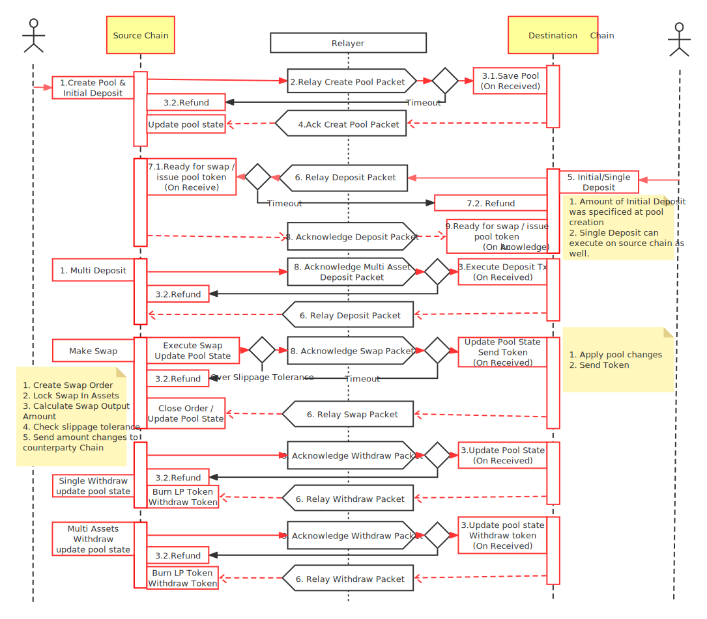

## Synopsis

This standard document specifies the packet data structure, state machine handling logic, and encoding details for token exchange through single-asset liquidity pools over an IBC channel between separate chains.

### Motivation

ICS-101 Interchain Liquidity enables chains to have their own token pricing mechanism and exchange protocol via IBC transactions. By enabling their own token pricing mechanism and exchange protocol, each chain can play a role in a fully decentralised exchange network.

Features include an option to provide liquidity with a single asset instead of a pair, which users might prefer as it reduces the risk of impermanent loss.

### Definitions

`Interchain swap`: an IBC token swap protocol, built on top of an automated market making model, which leverages liquidity pools and incentives. Each chain that integrates this app becomes part of a decentralized exchange network.

`Interchain liquidity pool`: a single-asset liquidity pool on a chain, with a corresponding single-asset liquidity pool on a separate chain. This comprises an interchain liquidity pool and can execute interchain swaps to exchange between the assets.

`Automated market makers(AMM)`: are decentralized exchanges that pool liquidity and allow tokens to be traded in a permissionless and automatic way. Usually uses an liquidity pool invariant for token swapping calculation. In this interchain standard, the Balancer algorithm is implemented.

`Weighted pools`: liquidity pools characterized by the percentage weight of each token denomination maintained within.

`Single-asset deposit`: a deposit into a liquidity pool that does not require users to deposit both token denominations -- one is enough. While this deposit method will impact the exchange price of the pool, it also provides an opportunity for arbitrage.

`Multi-asset deposit`: a deposit into a liquidity pool that require users to deposit both token denominations. This deposit method will not impact the exchange price of the pool.

`Left-side swap`: a token exchange that specifies the desired quantity to be sold.

`Right-side swap`: a token exchange that specifies the desired quantity to be purchased.

`Pool state`: the entire state of a liquidity pool including its invariant value which is derived from its token balances and weights inside.

`Source chain`: a chain that initiates an IBC transaction.

`Destination chain`: a chain that receives an IBC transaction from a source chain.

### Desired Properties

- `Permissionless`: no need to whitelist connections, modules, or denominations. Individual implementations may have their own permissioning scheme, however the protocol must not require permissioning from a trusted party to be secure.
- `Decentralized`: all parameters are managed on chain via governance. Does not require any central authority or entity to function. Also does not require a single blockchain, acting as a hub, to function.
- `Guarantee of Exchange`: no occurrence of a user receiving tokens without the equivalent promised exchange.
- `Liquidity Incentives`: supports the collection of fees which are distributed to liquidity providers and acts as incentive for liquidity participation.
- `Weighted Math`: allows the configuration of pool weights so users can choose their levels of exposure between the tokens.

## Technical Specification

### General Design

An interchain liquidity pool comprises of two single-asset liquidity pools on separate chains, and maintains synced pool states on both chains. Pool state changes on one chain will update its corresponding pool state on the other chain through IBC packet relays, which occurs during a deposit, withdrawal or swap.

The pool states can become temporarily unsynced due to packet relay flight-time. To avoid unnecessary price arbitrage, each chain can only execute sell orders of the token held by its single-asset liquidity pool.

Both chains can initiate a swap, and both chains can subsequently update its pool state.

This is an overview of how Interchain Swap works:



### Algorithms

#### Invariant

A constant invariant is maintained after trades, taking into consideration token weights and balance. The value function $V$ is defined as:

$$V = {&Pi;_tB_t^{W_t}}$$

Where

- $t$ ranges over the tokens in the pool
- $B_t$ is the balance of the token in the pool
- $W_t$ is the normalized weight of the tokens, such that the sum of all normalized weights is 1.

#### Spot Price

Spot prices of tokens are defined entirely by the weights and balances of the token pair. The spot price between any two tokens, $SpotPrice_i^{o}$, or in short $SP_i^o$, is the ratio of the token balances normalized by their weights:

$$SP_i^o = (B_i/W_i)/(B_o/W_o)$$

- $B_i$ is the balance of token $i$, the token being sold by the trader which is going into the pool
- $B_o$ is the balance of token $o$, the token being bought by the trader which is going out of the pool
- $W_i$ is the weight of token $i$
- $W_o$ is the weight of token $o$

#### Fees

Traders pay swap fees when they trade with a pool. These fees can be customized with a minimum value of 0.01% and a maximum value of 10%. Basis points for `feeRate` is used, where the integer 1 is 0.01% and integer 100 is 1.00%.

The fees go to liquidity providers in exchange for depositing their tokens in the pool to facilitate trades. Trade fees are collected at the time of a swap, and goes directly into the pool, increasing the pool balance. For a trade with a given $inputToken$ and $outputToken$, the amount collected by the pool as a fee is

$$Amount_{fee} = Amount_{inputToken} * swapFee$$

As the pool collects fees, liquidity providers automatically collect fees through their proportional ownership of the pool balance.

### Pool Initialization

An interchain liquidity pool has two possible states:

`POOL_STATUS_INITIAL`: The interchain liquidity pool is created but not yet ready to execute swaps. Pool parameters have been registered but assets for the swap pair have not been deposited.

`POOL_STATUS_READY`: The interchain liquidity pool is ready to execute swaps. Required assets have been deposited.

The pool can be fully funded through the initial deposit or through subsequent deposits. Deposits can be single-asset deposits or multi-asset deposits.

### Data Structures

#### Pool Structure

```ts
interface Coin {
  amount: int64;
  denom: string;
}
```

```ts
enum PoolAssetSide {
  Source = 0;
  Destination = 1;
}
```

```ts
// PoolStatus defines if the pool is ready for trading
enum PoolStatus {
  POOL_STATUS_INITIAL = 0;
  POOL_STATUS_READY = 1;
}
```

```ts
interface PoolAsset {
  side: PoolAssetSide;
  balance: Coin;
  // percentage
  weight: int32;
  decimal: int32;
}
```

```ts
interface InterchainLiquidityPool {
  id: string;
  sourceCreator: string;
  destinationCreator: string;
  assets: []PoolAsset;
  swapFee: int32;
  // the issued amount of pool token in the pool. the denom is pool id
  supply: Coin;
  status: PoolStatus;
  encounterPartyPort: string;
  encounterPartyChannel: string;

  constructor(
    poolId:string,
    creator:string,
    counterPartyCreator:string,
    store,
    sourceLiquidity:[]PoolAsset,
    destinationLiquidity:[]PoolAsset,
    swapFee: number,
    sourcePort: string,
    sourceChannel: string) {
    this.id = poolId
    this.supply = {
       amount: 0,
       denom: this.id
    }
    this.status = PoolStatus.POOL_STATUS_INITIAL
    this.encounterPartyPort = portId
    this.encounterPartyChannel = channelId
    this.swapFee = swapFee
    // construct assets
    this.assets = [...sourceLiquidity,...destinationLiquidity]
  }

  function findDenomBySide(side: PoolAssetSide): string | undefined {
    for (const asset of this.pool.assets) {
        if (asset.side === side) {
            return asset.balance.denom;
        }
    }
    return;
}

function findAssetBySide(side: PoolAssetSide): Coin | undefined {
    for (const asset of this.pool.assets) {
        if (asset.side === side) {
            return asset.balance;
        }
    }
    throw undefined;
}

function findPoolAssetBySide(side: PoolAssetSide): PoolAsset | undefined {
    for (const asset of this.pool.assets) {
        if (asset.side === side) {
            return asset;
        }
    }
    return;
}

 function findDenomByDenom(denom: string): Coin | undefined {
    for (const asset of this.pool.assets) {
        if (asset.amount.denom === denom) {
            return asset.amount;
        }
    }
    return;
}

function updateAssetPoolSide(denom: string, side: PoolAssetSide): PoolAsset | undefined {
    for (const asset of this.pool.assets) {
        if (asset.balance.denom === denom) {
            asset.side = side;
            return asset;
        }
    }
    return undefined;
}

function addAsset(token: Coin): void {
    for (const asset of this.pool.assets) {
        if (asset.balance.denom === token.denom) {
            asset.balance.amount += token.amount;
            return;
        }
    }
}

function subtractAsset(token: Coin): Coin | undefined {
    for (const asset of this.pool.assets) {
        if (asset.balance.denom === token.denom) {
            asset.balance.amount -=token.amount;
            return asset.balance;
        }
    }
    return
}

function addPoolSupply(token: Coin): void {
    if (token.denom !== this.pool.id) {
        return
    }
    this.supply.amount += token.amount;
}

function subtractPoolSupply(token: Coin): void {
    if (token.denom !== this.pool.id) {
        return
    }
    ilp.supply.amount -= token.amount;
}
}
```

```ts
function generatePoolId(sourceChainId: string, destinationChainId: string, denoms: string[]): string {
  const chainPrefix = [sourceChainId, destinationChainId].sort().join(",");
  const id = chainPrefx.concat(denoms.sort().join(","));
  const poolId = "pool" + sha256.hash(id);
  return poolId;
}
```

#### Interchain Market Maker

The `InterchainMarketMaker` is a core component for swap calculations. It is initialized with an `InterchainLiquidityPool` and `feeRate`. Since the `feeRate` for a trading pair can be updated through governance, it is possible to have different rates on each chain.

```ts
class InterchainMarketMaker {
    pool :InterchainLiquidityPool
    static initialize(pool: InterchainLiquidityPool) : InterchainMarketMaker {
        return {
            pool: pool
        }
    }

    // MarketPrice Bi / Wi / (Bo / Wo)
    function marketPrice(denomIn, denomOut string): float64 {
        const tokenIn = this.Pool.findAssetByDenom(denomIn)
        const tokenOut = this.Pool.findAssetByDenom(denomOut)
        const balanceIn = tokenIn.balance.amount
        const balanceOut = tokenOut.balance.amount
        const weightIn := tokenIn.weight
        const weightOut := tokenOut.weight

        return balanceIn / weightIn / (balanceOut / weightOut)
    }

    // P_issued = P_supply * ((1 + At/Bt) ** Wt -1)
    function depositSingleAsset(token: Coin): Coin {
        const asset = this.pool.findAssetByDenom(token.denom)
        const amount = token.amount
        const supply = this.pool.supply.amount
        const weight = asset.weight / 100
        const issueAmount = supply * (math.pow(1+amount/asset.balance, weight) - 1)

        asset.balance.amount += token.amount // update balance of the asset

        return {
            amount: issueAmount,
            denom: this.pool.supply.denom
        }
    }

    // P_issued = P_supply * Wt * Dt/Bt
    function depositMultiAsset(tokens: Coin[]): Coin[] {
    const outTokens: Coin[] = [];
    for (const token of tokens) {
      const asset = imm.Pool.FindAssetByDenom(token.Denom);
      if (!asset) {
        throw new Error("Asset not found");
      }

      let issueAmount: Int;

      if (imm.Pool.Status === PoolStatus_INITIALIZED) {
        let totalAssetAmount = 0;
        for (const asset of imm.Pool.Assets) {
          totalAssetAmount = totalAssetAmount+asset.balance.amount;
        }
        issueAmount = totalAssetAmount*asset.Weight/100;
      } else {
        const ratio = token.amount/asset.balance;
        issueAmount = supply.amount*asset.weight*ratio/100;
      }

      const outputToken: Coin = {
        Amount: issueAmount,
        Denom: imm.pool.supply.denom,
      };
      outTokens.push(outputToken);
    }

    return outTokens;
  }

    // input the supply token, output the expected token.
    // At = Bt * (P_redeemed / P_supply)/Wt
    multiAssetWithdraw(redeem: Coin): Coin[] {
    const outs: Coin[] = [];

    if (redeem.amount>imm.pool.supply.amount) {
      throw new Error("Overflow amount");
    }

    for (const asset of imm.pool.assets) {
      const out = asset.balance.amount*redeem.amount/imm.pool.supply.amount;
      const outputCoin: Coin = {
        Denom: asset.Balance.Denom,
        Amount: out,
      };
      outs.push(outputCoin);
    }

    return outs;
  }

    // LeftSwap implements OutGivenIn
    // Input how many coins you want to sell, output an amount you will receive
    // Ao = Bo * (1 -(Bi / (Bi + Ai)) ** Wi/Wo)
    function leftSwap(amountIn: Coin, denomOut: string): Coin {

        const assetIn = this.pool.findAssetByDenom(amountIn.denom)
        abortTransactionUnless(assetIn !== undefined)

        const assetOut = this.pool.findAssetByDenom(denomOut)
        abortTransactionUnless(assetOut !== undefined)

        // redeem.weight is percentage
        const balanceOut = assetOut.balance.amount
        const balanceIn = assetIn.balance.amount
        const weightIn = assetIn.weight / 100
        const weightOut = assetOut.weight / 100
        const amount = this.minusFees(amountIn.amount)

        const amountOut := balanceOut * (1- (balanceIn / (balanceIn + amount)) ** (weightIn/weightOut))

        return {
            amount: amountOut,
            denom:denomOut
        }
    }

    // RightSwap implements InGivenOut
    // Input how many coins you want to buy, output an amount you need to pay
    // Ai = Bi * ((Bo/(Bo - Ao)) ** Wo/Wi -1)
  function rightSwap(amountIn: Coin,amountOut: Coin) Coin {

     const assetIn = this.pool.findAssetByDenom(amountIn.denom)
      abortTransactionUnless(assetIn != null)
      const AssetOut = this.pool.findAssetByDenom(amountOut.denom)
      abortTransactionUnless(assetOut != null)
      const balanceIn = assetIn.balance.amount
      const balanceOut = assetOut.balance.amount
      const weightIn = assetIn.weight / 100
      const weightOut = assetOut.weight / 100

      const amount = balanceIn * ((balanceOut/(balanceOut -this.minusFees(amountOut.amount)) ** (weightOut/weightIn) - 1))

     abortTransactionUnless(amountIn.amount > amount)

     return {
         amount,
         denom: amountIn.denom
     }
}

    // amount - amount * feeRate / 10000
    function minusFees(amount:number):number {
        return amount * (1 - this.pool.feeRate / 10000))
    }
}
```

#### Data packets

There is only one required packate data type: the `IBCSwapDataPacket`. This packet specifies the message type and data (protobuf marshalled), acting as a wrapper for interchain swap messages.

```ts
enum MessageType {
  MakePool,
  TakePool,
  MakeMultiAssetDeposit
  TakeMultiAssetDeposit
  MultiAssetWithdraw,
  LeftSwap,
  RightSwap,
}

interface StateChange {
  in: Coin[];
  out: Coin[];
  poolTokens: Coin[];
  poolId: string;
  multiDepositOrderId: string;
  sourceChainId: string;
}
```

```ts
// IBCSwapDataPacket is used to wrap message for relayer.
interface IBCSwapDataPacket {
    type: MessageType,
    data: []byte, // Bytes
    stateChange: StateChange
    memo: string,
}
```

```typescript
type IInterchainSwapPacketAcknowledgement = InterchainSwapPacketSuccess | InterchainSwapPacketError;

interface InterchainSwapPacketSuccess {
  // This is binary 0x01 base64 encoded
  result: "AQ==";
}

interface InterchainSwapPacketError {
  error: string;
}
```

#### Port & channel setup

The fungible token swap module on a chain must always bind to a port with the id `interchainswap`

The `setup` function must be called exactly once when the module is created (perhaps when the blockchain itself is initialised) to bind to the appropriate port and create an escrow address (owned by the module).

```typescript
function setup() {
  capability = routingModule.bindPort("interchainswap", ModuleCallbacks{
    onChanOpenInit,
    onChanOpenTry,
    onChanOpenAck,
    onChanOpenConfirm,
    onChanCloseInit,
    onChanCloseConfirm,
    onRecvPacket,
    onTimeoutPacket,
    onAcknowledgePacket,
    onTimeoutPacketClose
  })
  claimCapability("port", capability)
}
```

Once the setup function has been called, channels can be created via the IBC routing module.

#### Channel lifecycle management

An interchain swap module will accept new channels from any module on another machine, provided that the following conditions are met:

- The channel being created is unordered.
- The version string is `ics101-1`.

```typescript
function onChanOpenInit(
  order: ChannelOrder,
  connectionHops: [Identifier],
  portIdentifier: Identifier,
  channelIdentifier: Identifier,
  counterpartyPortIdentifier: Identifier,
  counterpartyChannelIdentifier: Identifier,
  version: string) => (version: string, err: Error) {
  // only ordered channels allowed
  abortTransactionUnless(order === ORDERED)
  // assert that version is "ics101-1" or empty
  // if empty, we return the default transfer version to core IBC
  // as the version for this channel
  abortTransactionUnless(version === "ics101-1" || version === "")
  return "ics101-1", nil
}
```

```typescript
function onChanOpenTry(
  order: ChannelOrder,
  connectionHops: [Identifier],
  portIdentifier: Identifier,
  channelIdentifier: Identifier,
  counterpartyPortIdentifier: Identifier,
  counterpartyChannelIdentifier: Identifier,
  counterpartyVersion: string) => (version: string, err: Error) {
  // only ordered channels allowed
  abortTransactionUnless(order === ORDERED)
  // assert that version is "ics101-1"
  abortTransactionUnless(counterpartyVersion === "ics101-1")
  // return version that this chain will use given the
  // counterparty version
  return "ics101-1", nil
}
```

```typescript
function onChanOpenAck(
  portIdentifier: Identifier,
  channelIdentifier: Identifier,
  counterpartyChannelIdentifier: Identifier,
  counterpartyVersion: string
) {
  abortTransactionUnless(counterpartyVersion === "ics101-1");
}
```

#### Packet relay

The function `sendInterchainIBCSwapDataPacket` must be invoked by a transaction handler in the module, which also performs the appropriate signature checks, specific to the account owner on the host state machine.

```ts
function sendInterchainIBCSwapDataPacket(
  swapPacket: IBCSwapPacketData,
  sourcePort: string,
  sourceChannel: string,
  timeoutHeight: Height,
  timeoutTimestamp: uint64
) {
  // send packet using the interface defined in ICS4
  handler.sendPacket(
    getCapability("port"),
    sourcePort,
    sourceChannel,
    timeoutHeight,
    timeoutTimestamp,
    protobuf.encode(swapPacket)
  );
}
```

`onRecvPacket` is called by the routing module when a packet addressed to this module has been received.

```ts
function OnRecvPacket(packet: Packet): Uint8Array | undefined {
  const data: IBCSwapPacketData = packet.data;
  switch (data.type) {
    case "MAKE_POOL":
      const makePoolMsg: MsgMakePoolRequest = unmarshalJSON(data.Data);
      abortTransactionUnless(data.stateChange.poolId !== "");
      abortTransactionUnless(store.has(data.stateChange.poolId)); // existed already.
      const poolId = store.OnMakePoolReceived(makePoolMsg, data.stateChange.poolId, data.stateChange.sourceChainId);
      const makePoolRes = protobuf.encode({ poolId });
      return makePoolRes;

    case "TAKE_POOL":
      const takePoolMsg: MsgTakePoolRequest = unmarshalJSON(data.Data);
      const takePoolRes = store.OnTakePoolReceived(takePoolMsg);
      const takePoolResEncoded = protobuf.encode({ poolId: takePoolRes });
      return takePoolResEncoded;

    case "SINGLE_DEPOSIT":
      const singleDepositMsg: MsgSingleAssetDepositRequest = unmarshalJSON(data.Data);
      abortTransactionUnless(data.stateChange.poolId === "");
      const singleDepositRes = store.OnSingleAssetDepositReceived(singleDepositMsg, data.stateChange);
      const singleDepositResEncoded = protobuf.encode(singleDepositRes);
      return singleDepositResEncoded;

    case "MAKE_MULTI_DEPOSIT":
      const makeMultiDepositMsg: MsgMakeMultiAssetDepositRequest = unmarshalJSON(data.Data);
      const makeMultiDepositRes = k.OnMakeMultiAssetDepositReceived(makeMultiDepositMsg, data.stateChange);
      const makeMultiDepositResEncoded = protobuf.encode(makeMultiDepositRes);
      return makeMultiDepositResEncoded;

    case "TAKE_MULTI_DEPOSIT":
      const takeMultiDepositMsg: MsgTakeMultiAssetDepositRequest = unmarshalJSON(data.Data);
      const takeMultiDepositRes = k.OnTakeMultiAssetDepositReceived(takeMultiDepositMsg, data.stateChange);
      const takeMultiDepositResEncoded = protobuf.encode(takeMultiDepositRes);
      return takeMultiDepositResEncoded;

    case "MULTI_WITHDRAW":
      const multiWithdrawMsg: MsgMultiAssetWithdrawRequest = unmarshalJSON(data.Data);
      const multiWithdrawRes = k.OnMultiAssetWithdrawReceived(multiWithdrawMsg, data.stateChange);
      const multiWithdrawResEncoded = protobuf.encode(multiWithdrawRes);
      return multiWithdrawResEncoded;

    case "LEFT_SWAP":
    case "RIGHT_SWAP":
      const swapMsg: MsgSwapRequest = unmarshalJSON(data.Data);
      const swapRes = k.OnSwapReceived(swapMsg, data.stateChange);
      const swapResEncoded = protobuf.encode(swapRes);
      return swapResEncoded;

    default:
      return;
  }
}
```

`onAcknowledgePacket` is called by the routing module when a packet sent by this module has been acknowledged.

```ts
// OnAcknowledgementPacket implements the IBCModule interface

// OnAcknowledgementPacket processes the packet acknowledgement and performs actions based on the acknowledgement type
function OnAcknowledgementPacket(packet: Packet, data: IBCSwapPacketData, ack: Acknowledgement) {
  switch (ack.response.type) {
    case "Acknowledgement_Error":
      return store.refundPacketToken(packet, data);
    default:
      switch (data.type) {
        case "MAKE_POOL":
          const msgMakePool: MsgMakePoolRequest = unmarshalJSON(data.Data);
          const errMakePool = store.OnMakePoolAcknowledged(msgMakePool, data.StateChange.PoolId);
          abortTransactionUnless(errMakePool === undefined);
          break;

        case "TAKE_POOL":
          const msgTakePool: MsgTakePoolRequest = unmarshalJSON(data.Data);
          const errTakePool = store.OnTakePoolAcknowledged(msgTakePool);
          abortTransactionUnless(errTakePool === undefined);
          break;

        case "SINGLE_DEPOSIT":
          const msgSingleDeposit: MsgSingleAssetDepositRequest = unmarshalJSON(data.Data);
          const resSingleDeposit: MsgSingleAssetDepositResponse = protobuf.decode(ack.GetResult());
          const errSingleDeposit = store.OnSingleAssetDepositAcknowledged(msgSingleDeposit, resSingleDeposit);
          abortTransactionUnless(errSingleDeposit === undefined);
          break;

        case "MAKE_MULTI_DEPOSIT":
          const msgMakeMultiDeposit: MsgMakeMultiAssetDepositRequest = unmarshalJSON(data.Data);
          const resMakeMultiDeposit: MsgMultiAssetDepositResponse = protobuf.decode(ack.GetResult());
          const errMakeMultiDeposit = store.OnMakeMultiAssetDepositAcknowledged(
            msgMakeMultiDeposit,
            resMakeMultiDeposit
          );
          abortTransactionUnless(errMakeMultiDeposit === undefined);
          break;

        case "TAKE_MULTI_DEPOSIT":
          const msgTakeMultiDeposit: MsgTakeMultiAssetDepositRequest = unmarshalJSON(data.Data);
          const resTakeMultiDeposit: MsgTakePoolResponse = protobuf.decode(ack.GetResult());
          const errTakeMultiDeposit = store.OnTakeMultiAssetDepositAcknowledged(msgTakeMultiDeposit, data.StateChange);
          abortTransactionUnless(errTakeMultiDeposit === undefined);
          break;

        case "MULTI_WITHDRAW":
          const msgMultiWithdraw: MsgMultiAssetWithdrawRequest = unmarshalJSON(data.Data);
          const resMultiWithdraw: MsgMultiAssetWithdrawResponse = protobuf.decode(ack.GetResult());
          const errMultiWithdraw = store.OnMultiAssetWithdrawAcknowledged(msgMultiWithdraw, resMultiWithdraw);
          abortTransactionUnless(errMultiWithdraw === undefined);
          break;

        case "LEFT_SWAP":
        case "RIGHT_SWAP":
          const msgSwap: MsgSwapRequest = unmarshalJSON(data.Data);
          const resSwap: MsgSwapResponse = protobuf.decode(ack.GetResult());
          const errSwap = store.OnSwapAcknowledged(msgSwap, resSwap);
          abortTransactionUnless(errSwap === undefined);
          break;

        default:
          return;
      }
  }
}
```

`onTimeoutPacket` is called by the routing module when a packet sent by this module has timed-out (such that the tokens will be refunded). Tokens are also refunded on failure.

```ts
function onTimeoutPacket(packet: Packet) {
  // the packet timed-out, so refund the tokens
  refundTokens(packet);
}
```

```ts
function refundPacketToken(packet: Packet, data: IBCSwapPacketData): Error | undefined {
  let token: Coin | undefined;
  let sender: string | undefined;

  switch (data.type) {
    case "MAKE_POOL":
      const makePoolMsg: MsgMakePoolRequest = unmarshalJSON(data.Data);
      // Refund initial liquidity
      sender = makePoolMsg.creator;
      token = makePoolMsg.liquidity[0].balance;
      break;

    case "SINGLE_DEPOSIT":
      const singleDepositMsg: MsgSingleAssetDepositRequest = unmarshalJSON(data.Data);
      token = singleDepositMsg.token;
      sender = singleDepositMsg.sender;
      break;

    case "MAKE_MULTI_DEPOSIT":
      const makeMultiDepositMsg: MsgMakeMultiAssetDepositRequest = unmarshalJSON(data.Data);
      token = makeMultiDepositMsg.deposits[0].balance;
      sender = makeMultiDepositMsg.deposits[0].sender;
      break;

    case "TAKE_MULTI_DEPOSIT":
      const takeMultiDepositMsg: MsgTakeMultiAssetDepositRequest = unmarshalJSON(data.Data);
      const { order, found } = store.getMultiDepositOrder(takeMultiDepositMsg.poolId, takeMultiDepositMsg.orderId);
      abortTransactionUnless(found);
      token = order.Deposits[1];
      sender = msg.Sender;
      break;
    case "MULTI_WITHDRAW":
      const multiWithdrawMsg: MsgMultiAssetWithdrawRequest = unmarshalJSON(data.Data);
      token = multiWithdrawMsg.poolToken;
      sender = multiWithdrawMsg.receiver;
      break;

    case "RIGHT_SWAP":
      const swapMsg: MsgSwapRequest = unmarshalJSON(data.Data);
      token = swapMsg.tokenIn;
      sender = swapMsg.sender;
      break;

    default:
      return;
  }

  const escrowAccount = getEscrowAddress(packet.sourcePort, packet.sourceChannel);
  const err = store.sendCoins(escrowAccount, sender, token);
  return err;
}
```

### Sub-protocols

These sub-protocols handle packets relayed from a source chain, including pool state updates and token transfers:

```protobuf
  rpc MakePool (MsgMakePoolRequest) returns (MsgMakePoolResponse);
  rpc TakePool (MsgTakePoolRequest) returns (MsgTakePoolResponse);
  rpc SingleAssetDeposit    (MsgSingleAssetDepositRequest   ) returns (MsgSingleAssetDepositResponse   );
  rpc MakeMultiAssetDeposit    (MsgMakeMultiAssetDepositRequest   ) return (MsgMultiAssetDepositResponse   );
  rpc TakeMultiAssetDeposit    (MsgTakeMultiAssetDepositRequest   ) returns (MsgMultiAssetDepositResponse   );
  rpc MultiAssetWithdraw   (MsgMultiAssetWithdrawRequest  ) returns (MsgMultiAssetWithdrawResponse  );
  rpc Swap       (MsgSwapRequest             ) returns (MsgSwapResponse      );
```

#### Interfaces for sub-protocols

```ts
interface MsgMakePoolRequest {
  sourcePort: string;
  sourceChannel: string;
  counterPartyCreator: string;
  sourceLiquidity: PoolAsset[];
  destinationLiquidity: PoolAsset[];
  sender: string;
  decimals: int32[];
  swapFee: int32;
  timeHeight: Height;
  timeoutTimeStamp: uint64;
}

interface MsgMakePoolResponse {
  poolId: string;
}
```

```ts
interface MsgTakePoolRequest {
  sender: string;
  poolId: string;
  port: string;
  channel: string;
  timeHeight: Height;
  timeoutTimeStamp: uint64;
}

interface MsgTakePoolResponse {
  poolId: string;
}
```

```ts
interface MsgSingleAssetDepositRequest {
  poolId: string;
  sender: string;
  token: Coin; // only one element for now, might have two in the feature
  port: string;
  channel: string;
  timeHeight: Height;
  timeoutTimeStamp: uint64;
}
interface MsgSingleDepositResponse {
  poolToken: Coin;
}
```

```ts
interface DepositAsset {
  sender: string;
  balance: Coin;
}

enum LPAllocation {
  MAKER_CHAIN, // All LP tokens are minted on maker chain
  TAKER_CHAIN, // All LP tokens are minted on taker chain
  SPLIT, // LP tokens are minted on both chains and divided based on the pool ratio.
}

interface MsgMakeMultiAssetDepositRequest {
  poolId: string;
  deposits: DepositAsset[];
  lpAllocation: LPAllocation.MAKER_CHAIN;
  token: Coin; // only one element for now, might have two in the feature
  port: string;
  channel: string;
  timeHeight: Height;
  timeoutTimeStamp: uint64;
}

interface MsgTakeMultiAssetDepositRequest {
  sender: string;
  poolId: string;
  orderId: uint64;
  port: string;
  channel: string;
  timeHeight: Height;
  timeoutTimeStamp: uint64;
}

interface MsgMultiAssetDepositResponse {
  poolToken: Coin;
}
```

```ts
interface MsgMultiAssetWithdrawRequest {
  poolId: string;
  receiver: string;
  counterPartyReceiver: string;
  poolToken: Coin;
  port: string;
  channel: string;
  timeHeight: Height;
  timeoutTimeStamp: uint64;
}

interface MsgMultiAssetWithdrawResponse {
  tokens: Coin[];
}
```

```ts
interface MsgSwapRequest {
  swap_type: SwapMsgType;
  sender: string;
  poolId: string;
  tokenIn: Coin;
  tokenOut: Coin;
  slippage: uint64;
  recipient: string;
  port: string;
  channel: string;
  timeHeight: Height;
  timeoutTimeStamp: uint64;
}

interface MsgSwapResponse {
  swap_type: SwapMsgType;
  tokens: Coin[];
}
```

### Control flow And life scope

These are methods that output a state change on the source chain, which will be subsequently synced to the destination chain.

```ts
  // Custom helper to support compatability with cosmwasm: Same function MarshalJSON/unmarshalJSON in Golang
  function marshalJSON(data:any): Uint8Array {
    const jsonData = JSON.stringify(any);
    return Base64.encode(json).toBytes();
  }

  function unmarshalJSON<T>(data:any): T {
    const jsonData = Base64.decode(data);
    return json.parse(jsonData) as T
  }

  function makePool(msg: MsgMakePoolRequest): MsgMakePoolResponse {

    const { counterPartyChainId, connected } = store.GetCounterPartyChainID(msg.sourcePort, msg.sourceChannel);

    abortTransactionUnless(connected)

    const denoms: string[] = [];
    for (const liquidity of msg.liquidity) {
      denoms.push(liquidity.balance.denom);
    }

    const poolId = generatePoolId(store.chainID(), counterPartyChainId, denoms);
    const found = await store.getInterchainLiquidityPool(poolId);
    abortTransactionUnless(found)
    // Validate message
    const portValidationErr = host.PortIdentifierValidator(msg.SourcePort);
    abortTransactionUnless(portValidationErr === undefined)
    const channelValidationErr = host.ChannelIdentifierValidator(msg.SourceChannel);
    abortTransactionUnless(channelValidationErr === undefined)
    const validationErr = msg.ValidateBasic();
    abortTransactionUnless(validationErr === undefined)
    const sourceLiquidity = store.GetBalance(msg.creator, msg.sourceLiquidity[0].balance.denom);
    abortTransactionUnless(sourceLiquidity.amount > msg.sourceLiquidity[0].balance.amount)
    const lockErr = store.lockTokens(msg.sourcePort, msg.sourceChannel, senderAddress, msg.sourceLiquidity[0].balance);
    abortTransactionUnless(lockErr === undefined)

    const packet: IBCSwapPacketData = {
      type: "MAKE_POOL",
      data: marshalJSON(msg),
      stateChange: {
        poolId: poolId,
        sourceChainId: store.ChainID(),
      },
    };

    const sendPacketErr = await store.sendIBCSwapPacket(msg.sourcePort, msg.sourceChannel, timeoutHeight, timeoutStamp, packet);

    abortTransactionUnless(sendPacketErr === undefined)
    return {
      poolId
    };
  }

  function takePool(msg: MsgTakePoolRequest): MsgTakePoolResponse {

    const { pool, found } = await store.getInterchainLiquidityPool(msg.PoolId);
    abortTransactionUnless(found)

    abortTransactionUnless(pool.SourceChainId !== store.ChainID())
    abortTransactionUnless(pool.DestinationCreator === msg.Creator)

    const creatorAddr = sdk.MustAccAddressFromBech32(msg.Creator);

    const asset = pool.FindAssetBySide("SOURCE");
    abortTransactionUnless(asset)

    const liquidity = store.GetBalance(creatorAddr, asset.denom);
    abortTransactionUnless(liquidity.amount > 0)

    const lockErr = store.LockTokens(msg.port, pool.channel, creatorAddr, asset);
    abortTransactionUnless(lockErr === undefined)

    const packet: IBCSwapPacketData = {
      type: "TAKE_POOL",
      data: protobuf.encode(msg),
    };

    const sendPacketErr = await store.SendIBCSwapPacket(pool.counterPartyPort, pool.counterPartyChannel, timeoutHeight, timeoutStamp, packet);
    abortTransactionUnless(sendPacketErr === undefined)

    return {
      poolId: msg.PoolId,
    };
  }

  function makeMultiAssetDeposit(msg: MsgMakeMultiAssetDepositRequest): MsgMultiAssetDepositResponse {

    const { pool, found } = await store.getInterchainLiquidityPool(msg.poolId);

    abortTransactionUnless(found)

    // Check initial deposit condition
    abortTransactionUnless(pool.status === "ACTIVE")

    // Check input ratio of tokens
    const sourceAsset = pool.findAssetBySide("SOURCE");
    abortTransactionUnless(sourceAsset)

    const destinationAsset = pool.findAssetBySide("DESTINATION");
    abortTransactionUnless(destinationAsset)

    const currentRatio = sourceAsset.amount/destinationAsset.amount;
    const inputRatio = msg.deposits[0].balance.amount/msg.deposits[1].balance.amount;

    const slippageErr = checkSlippage(currentRatio, inputRatio, 10);
    abortTransactionUnless(slippageErr)

    // Create escrow module account here
    const lockErr = store.lockTokens(msg.port, msg.channel, sdk.msg.deposits[0].sender, msg.deposits[0].balance);
    abortTransactionUnless(lockErr)

    const amm = new InterchainMarketMaker(pool);

    const poolTokens = await amm.depositMultiAsset([
      msg.deposits[0].balance,
      msg.deposits[1].balance,
    ]);

    // create order
    const order: MultiAssetDepositOrder = {
      poolId: msg.poolId;
      chainId: store.chainID(),
      sourceMaker: msg.deposits[0].sender,
      destinationTaker: msg.deposits[1].sender,
      deposits: getCoinsFromDepositAssets(msg.deposits),
      status: "PENDING";
      createdAt: store.blockTime(),
      lpAllocation: msg.lpAllocation,
    };

    // save order in source chain
    store.appendMultiDepositOrder(pool.Id, order);

    const packet: IBCSwapPacketData = {
      type: "MAKE_MULTI_DEPOSIT",
      data: marshalJSON(msg),
      stateChange: { poolTokens: poolTokens },
    };

    const sendPacketErr = await store.sendIBCSwapPacket(pool.counterPartyPort, pool.counterPartyChannel, timeoutHeight, timeoutStamp, packet);
    abortTransactionUnless(sendPacketErr === undefined)

    return { poolTokens };
  }


  function takeMultiAssetDeposit(msg: MsgTakeMultiAssetDepositRequest): MsgMultiAssetDepositResponse {

  // check pool exist or not
  const { pool, found } = store.getInterchainLiquidityPool(msg.poolId);
  abortTransactionUnless(found)

  // check order exist or not
  const { order, found } = store.getMultiDepositOrder(msg.poolId, msg.orderId);
  abortTransactionUnless(found)

  abortTransactionUnless(order.chainId !== store.chainID())
  abortTransactionUnless(msg.sender === order.destinationTaker)
  abortTransactionUnless(order.status !== "COMPLETE")


  // estimate pool token
  const amm = new InterchainMarketMaker(pool);
  const poolTokens = await amm.depositMultiAsset(order.deposits);

  // check asset owned status
  const asset = order.deposits[1];
  const balance = store.getBalance(msg.sender, asset.denom);
  abortTransactionUnless(balance.amount < asset.amount)


  // Create escrow module account here
  const lockErr = store.lockTokens(pool.counterPartyPort, pool.counterPartyChannel, msg.sender, asset);
  abortTransactionUnless(lockErr === undefined)

  const packet: IBCSwapPacketData = {
    type: "TAKE_MULTI_DEPOSIT",
    data: marshalJSON(msg),
    stateChange: { poolTokens },
  };


  const sendPacketErr = await store.sendIBCSwapPacket(msg.port, msg.channel, timeoutHeight, timeoutStamp, packet);
  abortTransactionUnless(sendPacketErr === undefined)

  return {};
}

function singleAssetDeposit(msg: MsgSingleAssetDepositRequest): MsgSingleAssetDepositResponse {
  // Validate message
  const validationErr = msg.validateBasic();
  abortTransactionUnless(validationErr === undefined);

  // Check if pool exists
  const { pool, found } = store.getInterchainLiquidityPool(msg.poolId);
  abortTransactionUnless(found);

  // Deposit token to escrow account
  const balance = store.getBalance(msg.sender, msg.token.denom);
  abortTransactionUnless(balance.amount.gt(sdk.NewInt(0)));

  // Check pool status
  abortTransactionUnless(pool.status === "ACTIVE");

  // Lock tokens in escrow account
  const lockErr = store.lockTokens(pool.counterPartyPort, pool.counterPartyChannel, msg.sender, sdk.NewCoins(msg.token));
  abortTransactionUnless(lockErr === undefined);

  const amm = new InterchainMarketMaker(pool);

  const poolToken = await amm.depositSingleAsset(msg.token);
  abortTransactionUnless(poolToken === undefined);

  const packet: IBCSwapPacketData = {
    type: "SINGLE_DEPOSIT",
    data: marshalJSON(msg);,
    stateChange: { poolTokens: [poolToken] },
  };

  const sendPacketErr = await store.sendIBCSwapPacket(msg.port, msg.channel, timeoutHeight, timeoutStamp, packet);
  abortTransactionUnless(sendPacketErr === undefined);

  return { poolToken: pool.supply };
}


function multiAssetWithdraw(msg: MsgMultiAssetWithdrawRequest): MsgMultiAssetWithdrawResponse {
  // Validate message
  const validationErr = msg.validateBasic();
  abortTransactionUnless(validationErr === undefined);

  // Check if pool token denom exists
  const poolTokenDenom = msg.poolToken.denom;
  abortTransactionUnless(store.bankKeeper.hasSupply(poolTokenDenom));

  // Get the liquidity pool
  const { pool, found } = store.getInterchainLiquidityPool(msg.poolId);
  abortTransactionUnless(found);

  const amm = new InterchainMarketMaker(pool);

  const outs = await amm.multiAssetWithdraw(msg.poolToken);
  abortTransactionUnless(outs === undefined);

  const packet: IBCSwapPacketData = {
    type: "MULTI_WITHDRAW",
    data: marshalJSON(msg),
    stateChange: {
      out: outs,
      poolTokens: [msg.poolToken],
    },
  };

  const sendPacketErr = await store.sendIBCSwapPacket(ctx, msg.port, msg.channel, timeoutHeight, timeoutStamp, packet);
  abortTransactionUnless(sendPacketErr === undefined);

  return {};
}


function swap(msg: MsgSwapRequest): MsgSwapResponse {
  const { pool, found } = store.getInterchainLiquidityPool(msg.poolId);
  abortTransactionUnless(found);

  abortTransactionUnless(pool.status === "ACTIVE");

  const amm = new InterchainMarketMaker(pool);

  let msgType: SwapMessageType;

  switch (msg.swapType) {
    case "LEFT":
      msgType = "LEFT_SWAP";
      let actualOut: Coin = amm.leftSwap(msg.tokenIn, msg.tokenOut.denom);
      abortTransactionUnless(actualOut.amount > 0);
      abortTransactionUnless(actualOut.amount >= msg.tokenOut.amount * (1 - msg.slippage)); // Note: slippage is base point, need convert to percentage.
      break;
    case "RIGHT":
      msgType = "RIGHT_SWAP";
      let requiredTokenIn = amm.rightSwap(msg.tokenIn, msg.tokenOut);
      abortTransactionUnless(requiredTokenIn.amount > 0);
      abortTransactionUnless(msg.tokenIn.amount * (1 - msg.slippage) >= requiredTokenIn?.amount);
      break;
    default:
       abortTransactionUnless(false);
  }

  const lockErr = store.lockTokens(pool.counterPartyPort, pool.counterPartyChannel, msg.sender, msg.tokenIn);
  abortTransactionUnless(lockErr === undefined);

  const packet: IBCSwapPacketData = {
    type: msgType,
    data: marshalJSON(msg),
    stateChange: { out: [swappedToken] },
  };

  const sendPacketErr = store.sendIBCSwapPacket(
    msg.port,
    msg.channel,
    timeoutHeight,
    timeoutTimestamp,
    packet
  );
  abortTransactionUnless(sendPacketErr === undefined);

  return {
    swapType: msg.swapType,
    tokens: [msg.tokenIn, msg.tokenOut],
  };
}
```

These are methods that handle packets relayed from a source chain, and includes pool state updates and token transfers. In this way, packets relayed on the source chain update pool states on the destination chain.

```ts
function onMakePoolReceived(msg: MsgMakePoolRequest, poolID: string, sourceChainId: string): string {
  abortTransactionUnless(msg.validateBasic() === undefined);
  const { pool, found } = store.getInterchainLiquidityPool(poolID);
  abortTransactionUnless(found === false);

  const liquidityBalance = msg.sourceLiquidity[0].balance;
  if (!store.bankKeeper.hasSupply(liquidityBalance.denom)) {
    throw new Error(`Invalid decimal pair: ${types.ErrFailedOnDepositReceived}`);
  }

  const interchainLiquidityPool = new InterchainLiquidityPool(
    poolID,
    msg.creator,
    msg.counterPartyCreator,
    store,
    msg.sourceLiquidity,
    msg.destinationLiquidity,
    msg.swapFee,
    msg.sourcePort,
    msg.sourceChannel
  );

  interchainLiquidityPool.sourceChainId = sourceChainId;
  store.setInterchainLiquidityPool(interchainLiquidityPool);
  return poolID;
}

function onTakePoolReceived(msg: MsgTakePoolRequest): string {
  abortTransactionUnless(msg.validateBasic() === undefined);
  const { pool, found } = store.getInterchainLiquidityPool(msg.poolId);
  abortTransactionUnless(found);

  pool.status = "ACTIVE";
  const asset = pool.findPoolAssetBySide("DESTINATION");
  abortTransactionUnless(asset === undefined);

  const totalAmount = pool.sumOfPoolAssets();
  const mintAmount = (totalAmount * asset.weight) / 100;

  // TODO remove it or add a options for depositor to choose where LP is minted.
  // store.mintTokens(pool.sourceCreator, new sdk.Coin(pool.supply.denom, mintAmount));
  store.setInterchainLiquidityPool(pool);
  return pool.id;
}

function onSingleAssetDepositReceived(
  msg: MsgSingleAssetDepositRequest,
  stateChange: StateChange
): MsgSingleAssetDepositResponse {
  abortTransactionUnless(msg.validateBasic() === undefined);
  const { pool, found } = store.getInterchainLiquidityPool(msg.poolId);
  abortTransactionUnless(found);

  pool.addPoolSupply(stateChange.poolTokens[0]);
  pool.addAsset(msg.token);

  store.setInterchainLiquidityPool(pool);

  return {
    poolToken: stateChange.poolTokens[0],
  };
}

function onMakeMultiAssetDepositReceived(
  msg: MsgMakeMultiAssetDepositRequest,
  stateChange: StateChange
): MsgMultiAssetDepositResponse {
  abortTransactionUnless(msg.validateBasic() === undefined);
  const [senderPrefix, , err] = bech32.decode(msg.deposits[1].sender);
  abortTransactionUnless(store.getConfig().getBech32AccountAddrPrefix() !== senderPrefix);

  const { pool, found } = store.getInterchainLiquidityPool(msg.poolId);
  abortTransactionUnless(found);

  const order: MultiAssetDepositOrder = {
    poolId: msg.poolId,
    chainId: pool.sourceChainId,
    sourceMaker: msg.deposits[0].sender,
    destinationTaker: msg.deposits[1].sender,
    deposits: getCoinsFromDepositAssets(msg.deposits),
    status: "PENDING",
    createdAt: store.blockTime(),
  };

  store.appendMultiDepositOrder(msg.poolId, order);

  return {
    poolTokens: stateChange.poolTokens,
  };
}

function onTakeMultiAssetDepositReceived(
  msg: MsgTakeMultiAssetDepositRequest,
  stateChange: StateChange
): MsgMultiAssetDepositResponse {
  abortTransactionUnless(msg.validateBasic() === undefined);

  const { pool, found } = store.getInterchainLiquidityPool(msg.poolId);
  abortTransactionUnless(found);

  const { order, found: orderFound } = store.getMultiDepositOrder(msg.poolId, msg.orderId);
  abortTransactionUnless(orderFound);
  order.status = "COMPLETE";

  for (const supply of stateChange.poolTokens) {
    pool.addPoolSupply(supply);
  }

  for (const asset of order.deposits) {
    pool.addAsset(asset);
  }

  const totalPoolToken = sdk.NewCoin(msg.poolId, sdk.NewInt(0));
  for (const poolToken of stateChange.poolTokens) {
    totalPoolToken.amount = totalPoolToken.amount.add(poolToken.amount);
  }

  switch (order.lpAllocation) {
    case LPAllocation.MAKER_CHAIN:
      store.mintTokens(order.destinationTaker, totalPoolToken);
    case LPAllocation.SPLIT:
      store.mintTokens(order.sourceMaker, totalPoolToken[0]);
    default:
  }

  store.setInterchainLiquidityPool(pool);
  store.setMultiDepositOrder(pool.id, order);

  return {};
}

function onMultiAssetWithdrawReceived(
  msg: MsgMultiAssetWithdrawRequest,
  stateChange: StateChange
): MsgMultiAssetWithdrawResponse {
  abortTransactionUnless(msg.validateBasic() === undefined);
  const { pool, found } = store.getInterchainLiquidityPool(msg.poolToken.denom);
  abortTransactionUnless(found);

  for (const poolAsset of stateChange.out) {
    pool.subtractAsset(poolAsset);
  }

  for (const poolToken of stateChange.poolTokens) {
    pool.subtractPoolSupply(poolToken);
  }

  store.unlockTokens(
    pool.counterPartyPort,
    pool.counterPartyChannel,
    msg.counterPartyReceiver,
    sdk.NewCoins(stateChange.out[1])
  );

  if (pool.supply.amount == 0) {
    store.removeInterchainLiquidityPool(pool.id);
  } else {
    store.setInterchainLiquidityPool(pool);
  }

  return { tokens: stateChange.out };
}

function onSwapReceived(msg: MsgSwapRequest, stateChange: StateChange): MsgSwapResponse {
  abortTransactionUnless(msg.validateBasic() === undefined);

  const { pool, found } = store.getInterchainLiquidityPool(msg.poolId);
  abortTransactionUnless(found);
  store.unlockTokens(pool.counterPartyPort, pool.counterPartyChannel, msg.recipient, sdk.NewCoins(stateChange.out[0]));

  pool.subtractAsset(stateChange.out[0]);
  pool.addAsset(msg.tokenIn);

  store.setInterchainLiquidityPool(pool);

  return { tokens: stateChange.out };
}

function onMakePoolAcknowledged(msg: MsgMakePoolRequest, poolId: string): void {
  const pool = new InterchainLiquidityPool(
    poolId,
    msg.creator,
    msg.counterPartyCreator,
    store,
    msg.sourceLiquidity,
    msg.destinationLiquidity,
    msg.swapFee,
    msg.sourcePort,
    msg.sourceChannel
  );

  pool.sourceChainId = store.chainID();

  const totalAmount = sdk.NewInt(0);
  for (const asset of msg.liquidity) {
    totalAmount = totalAmount.add(asset.balance.amount);
  }

  store.mintTokens(msg.creator, {
    denom: pool.supply.denom,
    amount: (totalAmount * msg.sourceliquidity[0].weight) / 100,
  });

  store.setInterchainLiquidityPool(pool);
}

function onTakePoolAcknowledged(msg: MsgTakePoolRequest): void {
  const { pool, found } = store.getInterchainLiquidityPool(msg.poolId);
  abortTransactionUnless(found);

  pool.status = "ACTIVE";

  store.setInterchainLiquidityPool(pool);
}

function onSingleAssetDepositAcknowledged(req: MsgSingleAssetDepositRequest, res: MsgSingleAssetDepositResponse): void {
  const { pool, found } = store.getInterchainLiquidityPool(req.poolId);
  abortTransactionUnless(found);

  store.mintTokens(req.sender, res.poolToken);

  pool.addAsset(req.token);
  pool.addPoolSupply(res.poolToken);

  store.setInterchainLiquidityPool(pool);
}

function onMakeMultiAssetDepositAcknowledged(
  req: MsgMakeMultiAssetDepositRequest,
  res: MsgMultiAssetDepositResponse
): void {
  const { pool, found } = k.getInterchainLiquidityPool(ctx, req.poolId);
  abortTransactionUnless(found);
  store.setInterchainLiquidityPool(pool);
}

function onTakeMultiAssetDepositAcknowledged(req: MsgTakeMultiAssetDepositRequest, stateChange: StateChange): void {
  const { pool, found } = store.getInterchainLiquidityPool(req.poolId);
  abortTransactionUnless(found);

  const order = store.getMultiDepositOrder(req.poolId, req.orderId);
  abortTransactionUnless(order.found);

  const totalMintAmount := 0
  for (const poolToken of stateChange.poolTokens) {
     totalMintAmount += poolToken
  }
  if totalMintAmount > 0 {
      pool.addPoolSupply(poolToken);

      switch (order.lpAllocation) {
        case LPAllocation.TAKER_CHAIN:
          store.mintTokens(order.destinationTaker, totalPoolToken);
        case LPAllocation.SPLIT:
          store.mintTokens(order.destinationTaker, totalPoolToken[1]);
        default:
      }
  }

  for (const deposit of order.deposits) {
    pool.addAsset(deposit);
  }

  order.status = "COMPLETE";

  store.setInterchainLiquidityPool(pool);
  store.setMultiDepositOrder(pool.id, order);
}

function onTakePoolAcknowledged(msg: MsgTakePoolRequest): void {
  const { pool, found } = store.getInterchainLiquidityPool(msg.poolId);
  abortTransactionUnless(found);

  pool.status = "ACTIVE";
  store.setInterchainLiquidityPool(pool);
}

function onSingleAssetDepositAcknowledged(req: MsgSingleAssetDepositRequest, res: MsgSingleAssetDepositResponse): void {
  const { pool, found } = store.getInterchainLiquidityPool(req.poolId);
  abortTransactionUnless(found);

  store.mintTokens(req.sender, res.poolToken);

  pool.addAsset(req.token);
  pool.addPoolSupply(res.poolToken);

  store.setInterchainLiquidityPool(pool);
}

function onMakeMultiAssetDepositAcknowledged(
  req: MsgMakeMultiAssetDepositRequest,
  res: MsgMultiAssetDepositResponse
): void {
  const { pool, found } = store.getInterchainLiquidityPool(req.poolId);
  abortTransactionUnless(found);
  store.setInterchainLiquidityPool(pool);
}

function onTakeMultiAssetDepositAcknowledged(req: MsgTakeMultiAssetDepositRequest, stateChange: StateChange): void {
  const { pool, found } = store.getInterchainLiquidityPool(req.poolId);
  abortTransactionUnless(found);
  const order,
    found = store.getMultiDepositOrder(req.poolId, req.orderId);
  abortTransactionUnless(found);
  for (const poolToken of stateChange.poolTokens) {
    pool.addPoolSupply(poolToken);
  }

  for (const deposit of order.deposits) {
    pool.addAsset(deposit);
  }

  order.status = "COMPLETE";

  store.setInterchainLiquidityPool(pool);
  store.setMultiDepositOrder(pool.id, order);
}

function onMultiAssetWithdrawAcknowledged(req: MsgTakeMultiAssetDepositRequest, stateChange: StateChange): void {
  const { pool, found } = store.getInterchainLiquidityPool(req.poolId);
  abortTransactionUnless(found);

  // update pool status
  for (const out of stateChange.Out) {
    pool.subtractAsset(out);
  }
  pool.subtractPoolSupply(req.poolToken);

  const { nativeToken, found } = pool.FindDenomBySide("PoolAssetSide_SOURCE");
  abortTransactionUnless(found);

  const { out, found } = stateChange.FindOutByDenom(nativeToken);
  abortTransactionUnless(found);

  // unlock token
  store.UnlockTokens(pool.counterPartyPort, pool.counterPartyChannel, req.Receiver, out);

  if ((pool.supply.amount = 0)) {
    store.removeInterchainLiquidityPool(req.PoolId);
  } else {
    // Save pool
    store.setInterchainLiquidityPool(pool);
  }
}

function OnSwapAcknowledged(req: MsgSwapRequest, res: MsgSwapResponse): void {
  const { pool, found } = store.getInterchainLiquidityPool(req.poolId);
  abortTransactionUnless(found);
  // pool status update
  pool.addAsset(req.tokenIn);
  pool.subtractAsset(req.tokenOut);
  store.setInterchainLiquidityPool(pool);
}
```

## RISKS

### Pool State Inconsistency

Synchronization of pool states is crucial for Interchain Swap, as there are two mirrored pools across the two chains.
However, pool state synchronization could be delayed due to relayer halts or network issues. This can create swap price differences.

Solutions and mitigations:

- Timeout: Packets timeout when receipt are delayed for an extended period of time. This limits the impact of inconsistent pool states on mispriced swap orders.
- Slippage Tolerance: Cancel orders if executed price difference to quoted price is outside of tolerance range.
- Single-sided trade: Each chain can only execute sell orders of the token held by its single-asset liquidity pool. This removes unnecessary arbitrage opportunities.

### Price Impact Of Single Asset Deposit

While single-asset deposits are convenient for users and reduce the risk of impermanent loss, they can significantly impact swap prices.

Solution and mitigations:

- Set an upper limit for single-asset deposits. This limit would be proportional to the amount deposited and the balance of the asset in the liquidity pool.

## Backwards Compatibility

Not applicable.

## Forwards Compatibility

Coming soon.

## Example Implementation

https://github.com/ibcswap/ibcswap

## Other Implementations

Coming soon.

## History

Oct 9, 2022 - Draft written

Oct 11, 2022 - Draft revised

## References

https://dev.balancer.fi/resources/pool-math/weighted-math#spot-price

## Copyright

All content herein is licensed under [Apache 2.0](https://www.apache.org/licenses/LICENSE-2.0).
