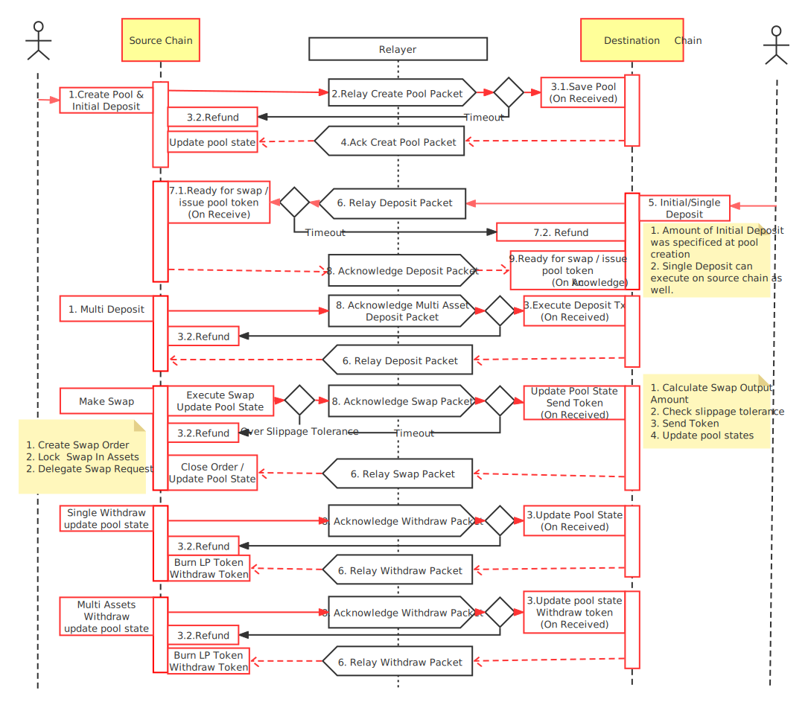

## Synopsis

This standard document specifies the packet data structure, state machine handling logic, and encoding details for token exchange through single-sided liquidity pools over an IBC channel between separate chains.

### Motivation

ICS-101 Interchain Swaps enables chains their own token pricing mechanism and exchange protocol via IBC transactions. Each chain can thus play a role in a fully decentralised exchange network.

Users might also prefer single asset pools over dual assets pools as it removes the risk of impermanent loss.

### Definitions

`Interchain swap`: a IBC token swap protocol, built on top of an automated marketing making system, which leverages liquidity pools and incentives. Each chain that integrates this app becomes part of a decentralized exchange network.

`Automated market makers(AMM)`: are decentralized exchanges that pool liquidity and allow tokens to be traded in a permissionless and automatic way. Usually uses an invariant for token swapping calculation. In this interchain standard, the Balancer algorithm is implemented.

`Weighted pools`: liquidity pools characterized by the percentage weight of each token denomination maintained within.

`Single-sided liquidity pools`: a liquidity pool that does not require users to deposit both token denominations -- one is enough. But a single deposit will affect the price of the liquidity pool, increasing the opportunity for arbitrageurs

`Double-sided liquidity pools`: a liquidity pool that does require users to deposit both token denominations -- require token pair.

`Left-side swap`: a token exchange that specifies the desired quantity to be sold.

`Right-side swap`: a token exchange that specifies the desired quantity to be purchased.

`Pool state`: the entire state of a liquidity pool including its invariant value which is derived from its token balances and weights inside.

### Desired Properties

- `Permissionless`: no need to whitelist connections, modules, or denominations. Individual implementations may have their own permissioning scheme, however the protocol must not require permissioning from a trusted party to be secure.
- `Decentralization`: all parameters are managed on chain via governance. Does not require any central authority or entity to function. Also does not require a single blockchain, acting as a hub, to function.
- `Gaurantee of Exchange`: no occurence of a user receiving tokens without the equivalent promised exchange.
- `Liquidity Incentives`: supports the collection of fees which are distributed to liquidity providers and acts as incentive for liquidity participation.
- `Weighted Math`: allows the configuration of pool weights so users can choose their levels of exposure between the tokens.

## Technical Specification

Unlike Other Swaps. Interchain swap have two copies of pool state, each pool state are mirrored to the other. it's not always same. it will keep dynamic consistent through various IBC transactions: such as deposit, swap, withdraw.

Each pool is only used for assets on the chain where the liquidity pool is located

To implement interchain swap, we introduce the `Swap Initiator` and `State Updater`. The `Swap Initiator` will pre-process the request and execute the swap (validate msgs, lock assets, etc), and then forward the transactions to the relayer. The `State Updater` just simply update the states sent from `Swap Initiator`(keep the pool state consistency).

Each chain could be either `Swap Initiator` or `State Updater`, it depend on where the swap is created.

This is an overview of how Interchain Swap works



### Algorithms

#### Invariant

A constant invariant is maintained after trades which takes into consideration token weights and balance. The value function $V$ is defined as:

$$V = {&Pi;_tB_t^{W_t}}$$

Where

- $t$ ranges over the tokens in the pool
- $B_t$ is the balance of the token in the pool
- $W_t$ is the normalized weight of the tokens, such that the sum of all normalized weights is 1.

#### Spot Price

Spot prices of tokens are defined entirely by the weights and balances of the token pair. The spot price between any two tokens, $SpotPrice_i^{o}$, or in short $SP_i^o$, is the ratio of the token balances normalized by their weights:

$$SP_i^o = (B_i/W_i)/(B_o/W_o)$$

- $B_i$ is the balance of token $i$, the token being sold by the trader which is going into the pool
- $B_o$ is the balance of token $o$, the token being bought by the trader which is going out of the pool
- $W_i$ is the weight of token $i$
- $W_o$ is the weight of token $o$

#### Fees

Traders pay swap fees when they trade with a pool. These fees can be customized with a minimum value of 0.01% and a maximum value of 10%. To avoid use decimal, we use basis point for `feeRate`, 1 = 0.01%, 100 = 1%

The fees go to liquidity providers in exchange for depositing their tokens in the pool to facilitate trades. Trade fees are collected at the time of a swap, and goes directly into the pool, increasing the pool balance. For a trade with a given $inputToken$ and $outputToken$, the amount collected by the pool as a fee is

$$Amount_{fee} = Amount_{inputToken} * swapFee$$

As the pool collects fees, liquidity providers automatically collect fees through their proportional ownership of the pool balance.

### Data Structures

#### Pool Structure

```ts
interface Coin {
  amount: int64;
  denom: string;
}
```

```ts
enum PoolSide {
  Native = 1;
  Remote = 2;
}
```

```ts
// PoolStatus defines if the pool is ready for trading
enum PoolStatus {
  POOL_STATUS_INITIAL = 0;
  POOL_STATUS_READY = 1;
}
```

```ts
interface PoolAsset {
  side: PoolSide;
  balance: Coin;
  // percentage
  weight: int32;
  decimal: int32;
}
```

```ts
interface InterchainLiquidityPool {
  id: string;
  assets []PoolAsset;
  // the issued amount of pool token in the pool. the denom is pool id
  supply: Coin;
  status: PoolStatus;
  encounterPartyPort: string;
  encounterPartyChannel: string;
  constructor(denoms: []string, decimals: []number, weight: string, portId string, channelId string) {

    this.id = generatePoolId(denoms)
    this.supply = {
       amount: 0,
       denom: this.id
    }
    this.status = PoolStatus.POOL_STATUS_INITIAL
    this.encounterPartyPort = portId
    this.encounterPartyChannel = channelId

    // construct assets
    const weights = weight.split(':').length
    if(denoms.length === decimals.length && denoms.length === weight.split(':').length) {
        for(let i=0; i < denoms.length; i++) {
            this.assets.push({
               side: store.hasSupply(denom[i]) ? PoolSide.Native: PoolSide.Remote,
               balance: {
                 amount: 0,
                 denom: denom[i],
               },
               weight: number(weights[i])
               decimal: decimals[i]
            })
        }
    }
  }
}
```

```ts
function generatePoolId(denoms: []string) {
    return "pool" + sha256(denoms.sort().join(''))
}
```

#### Interchain Market Maker

Interchain Market Maker is a core component for swap calculation, which is stateless and initialized with few parameters: such liquidity pool and fee rates. Note, For a trading pair, the `feeRate` on each chain could be different. which can be updated by governance.

```ts
class InterchainMarketMaker {
    pool :InterchainLiquidityPool
    // basis point
    feeRate: number // int32

    construct(pool: InterchainLiquidityPool, feeRate: number) : InterchainMarketMaker {
        this.pool = pool,
        this.feeRate = feeRate,
    }

    // MarketPrice Bi / Wi / (Bo / Wo)
    function marketPrice(denomIn, denomOut string): float64 {
        const tokenIn = this.Pool.findAssetByDenom(denomIn)
        const tokenOut = this.Pool.findAssetByDenom(denomOut)
        const balanceIn = tokenIn.balance.amount
        const balanceOut = tokenOut.balance.amount
        const weightIn := tokenIn.weight
        const weightOut := tokenOut.weight

        return balanceIn / weightIn / (balanceOut / weightOut)
    }

    // P_issued = P_supply * ((1 + At/Bt) ** Wt -1)
    function depositSingleAsset(token: Coin): Coin {
        const asset = this.pool.findAssetByDenom(token.denom)
        const amount = token.amount
        const supply = this.pool.supply.amount
        const weight = asset.weight / 100
        const issueAmount = supply * (math.pow(1+amount/asset.balance, weight) - 1)

        asset.balance.amount += token.amount // update balance of the asset

        return {
            amount: issueAmount,
            denom: this.pool.supply.denom
        }
    }

    // P_issued = P_supply * (1 + At/Bt)
    function depositDoubleAsset(tokens: Coin[]): Coin[] {
        const lpTokens = [];
        for (const token in tokens) {
            const asset = this.pool.findAssetByDenom(token.denom)
            const amount = token.amount
            const supply = this.pool.supply.amount
            const weight = asset.weight / 100
            const issueAmount = supply * (1+amount/asset.balance)
            asset.balance.amount += token.amount // update balance of the asset
            lpTokens.push({
                amount: issueAmount,
                denom: this.pool.supply.denom
            });
        }
        return lpTokens
    }

    // input the supply token, output the expected token.
    // At = Bt * (1 - (1 - P_redeemed / P_supply) ** 1/Wt)
    function withdraw(redeem: Coin, denomOut: string): Coin {

        const asset = this.pool.findAssetByDenom(denomOut)

        abortTransactionUnless(asset != null)
        abortTransactionUnless(this.pool.status === PoolStatus.POOL_STATUS_READY)
        abortTransactionUnless(redeem.amount <= this.pool.supply.amount)
        abortTransactionUnless(redeem.denom == this.pool.supply.denom)

        const balance = asset.balance.amount
        const supply = this.pool.supply.amount
        const weight = asset.weight / 100 // convert int to percent

        const amountOut = balance * (1 - ( 1 - redeem.amount / supply) ** (1/weight))
        return {
            amount: amountOut,
            denom: denomOut,
        }
    }

    // LeftSwap implements OutGivenIn
    // Input how many coins you want to sell, output an amount you will receive
    // Ao = Bo * (1 -(Bi / (Bi + Ai)) ** Wi/Wo)
    function leftSwap(amountIn: Coin, denomOut: string): Coin {

        const assetIn = this.pool.findAssetByDenom(amountIn.denom)
        abortTransactionUnless(assetIn != null)

        const assetOut = this.pool.findAssetByDenom(denomOut)
        abortTransactionUnless(assetOut != null)

        // redeem.weight is percentage
        const balanceOut = assetOut.balance.amount
        const balanceIn = assetIn.balance.amount
        const weightIn = assetIn.weight / 100
        const weightOut = assetOut.weight / 100
        const amount = this.minusFees(amountIn.amount)

        const amountOut := balanceOut * (1- (balanceIn / (balanceIn + amount)) ** (weightIn/weightOut))

        return {
            amount: amountOut,
            denom:denomOut
        }
    }

    // RightSwap implements InGivenOut
    // Input how many coins you want to buy, output an amount you need to pay
    // Ai = Bi * ((Bo/(Bo - Ao)) ** Wo/Wi -1)
    function rightSwap(amountIn: Coin, amountOut: Coin) Coin {

        const assetIn = this.pool.findAssetByDenom(amountIn.denom)
        abortTransactionUnless(assetIn != null)
        const AssetOut = this.pool.findAssetByDenom(amountOut.denom)
        abortTransactionUnless(assetOut != null)

        const balanceIn = assetIn.balance.amount
        const balanceOut = assetOut.balance.amount
        const weightIn = assetIn.weight / 100
        const weightOut = assetOut.weight / 100

        const amount = balanceIn * ((balanceOut/(balanceOut - amountOut.amount) ** (weightOut/weightIn) - 1)

        abortTransactionUnless(amountIn.amount > amount)

        return {
            amount,
            denom: amountIn.denom
        }
    }

    // amount - amount * feeRate / 10000
    function minusFees(amount sdk.Int) sdk.Int {
        return amount * (1 - this.pool.feeRate / 10000))
    }
}
```

#### Data packets

Only one packet data type is required: `IBCSwapDataPacket`, which specifies the message type and data(protobuf marshalled). It is a wrapper for interchain swap messages.

- Payloads in packet

```ts
enum MessageType {
  CreatePool,
  SingleDeposit,
  DoubleDeposit,
  Withdraw,
  Swap
}

enum SwapType {
  Right
  Left
}

interface StateChange {
  in: Coin[];
  out: Coin[];
  poolToken: Coin; // could be negtive
}
```

- Packet structure

```ts
// IBCSwapDataPacket is used to wrap message for relayer.
interface IBCSwapDataPacket {
    type: MessageType,
    data: []byte, // Bytes
    stateChange: StateChange
}
```

- Packet of Acknowledgement

```typescript
type IBCSwapDataAcknowledgement = IBCSwapDataPacketSuccess | IBCSwapDataPacketError;

interface IBCSwapDataPacketSuccess {
  // This is binary 0x01 base64 encoded
  result: "AQ==";
}

interface IBCSwapDataPacketError {
  error: string;
}
```

### Sub-protocols

Traditional liquidity pools typically maintain its pool state in one location.

A liquidity pool in the interchain swap protocol maintains its pool state on both its source chain and destination chain. The pool states mirror each other and are synced through IBC packet relays, which we elaborate on in the following sub-protocols.

Interchain Swap implements the following sub-protocols:

```protobuf
  rpc CreatePool(MsgCreatePoolRequest) returns (MsgCreatePoolResponse);
  rpc SingleDeposit(MsgSingleDepositRequest) returns (MsgSingleDepositResponse);
  rpc DoubleDeposit(MsgDoubleDepositRequest) returns (MsgDoubleDepositResponse);
  rpc Withdraw(MsgWithdrawRequest) returns (MsgWithdrawResponse);
  rpc LeftSwap(MsgLeftSwapRequest) returns (MsgSwapResponse);
  rpc RightSwap(MsgRightSwapRequest) returns (MsgSwapResponse);
```

#### Interfaces for sub-protocols

- Create cross chain liquidity pool

```ts
interface MsgCreatePoolRequest {
    sourcePort: string,
    sourceChannel: string,
    sender: string,
    denoms: []string,
    decimals: []int32,
    weight: string,
}

interface MsgCreatePoolResponse {}
```

- Single Side Deposit

```ts
interface MsgDepositRequest {
  poolId: string;
  sender: string;
  token: Coin;
}
interface MsgSingleDepositResponse {
  poolToken: Coin;
}
```

- Two sides Deposit

```ts
interface LocalDeposit {
  sender: string;
  token: Coin;
}
interface RemoteDeposit {
  sender: string;
  sequence: int; // account transaction sequence
  token: Coin;
  signature: Uint8Array;
}

interface MsgDoubleDepositRequest {
  poolId: string;
  localDeposit: LocalDeposit;
  remoteDeposit: RemoteDeposit;
}
interface MsgDoubleDepositResponse {
  poolTokens: Coin[];
}
```

- Withdraw

```ts
interface MsgWithdrawRequest {
    sender: string,
    poolCoin: Coin,
    denomOut: string,
}
interface MsgWithdrawResponse {
   tokens: []Coin;
}
```

- Left Swap

```ts
interface MsgSwapRequest {
   sender: string,
   swapType: SwapType,
   tokenIn: Coin,
   tokenOut: Coin,
   slippage: number; // max tolerated slippage
   recipient: string,
}
interface MsgSwapResponse {
  tokens: []Coin;
}
```

- Right Swap

```ts
interface MsgRightSwapRequest {
  sender: string;
  tokenIn: Coin;
  tokenOut: Coin;
  slippage: number; // max tolerated slippage
  recipient: string;
}
interface MsgSwapResponse {
  tokens: Coin[];
}
```

### Control Flow And Life Scope

These are methods of `Swap Initiator`, which execute main logic and output a state change, state change is need to be executed on both local and remote

```ts
function createPool(msg: MsgCreatePoolRequest) {

    // ICS 24 host check if both port and channel are validate
    abortTransactionUnless(host.portIdentifierValidator(msg.sourcePort))
    abortTransactionUnless(host.channelIdentifierValidator(msg.sourceChannel));

    // Only two assets in a pool
    abortTransactionUnless(msg.denoms.length != 2)
    abortTransactionUnless(msg.decimals.length != 2)
    abortTransactionUnless(msg.weight.split(':').length != 2) // weight: "50:50"
    abortTransactionUnless( !store.hasPool(generatePoolId(msg.denoms)) )

    const pool = new InterchainLiquidityPool(msg.denoms, msg.decimals, msg.weight, msg.sourcePort, msg.sourceChannel)

    const localAssetCount = 0
    for(var denom in msg.denoms) {
       if (bank.hasSupply(denom)) {
          localAssetCount += 1
       }
    }
    // should have 1 native asset on the chain
    abortTransactionUnless(localAssetCount >= 1)

    // constructs the IBC data packet
    const packet = {
        type: MessageType.CreatePool,
        data: protobuf.encode(msg), // encode the request message to protobuf bytes.
    }
    sendInterchainIBCSwapDataPacket(packet, msg.sourcePort, msg.sourceChannel, msg.timeoutHeight, msg.timeoutTimestamp)

}

function singleDeposit(msg MsgSingleDepositRequest) {

    abortTransactionUnless(msg.sender != null)
    abortTransactionUnless(msg.tokens.length > 0)

    const pool = store.findPoolById(msg.poolId)
    abortTransactionUnless(pool != null)

    const balance = bank.queryBalance(msg.sender, msg.token.denom)
    // should have enough balance
    abortTransactionUnless(balance.amount >= token.amount)

    // deposit assets to the escrowed account
    const escrowAddr = escrowAddress(pool.encounterPartyPort, pool.encounterPartyChannel)
    bank.sendCoins(msg.sender, escrowAddr, msg.tokens)

    const amm = new InterchainMarketMaker(pool, params.getPoolFeeRate())
    const poolToken = amm.depositSingleAsset(msg.token)

    // constructs the IBC data packet
    const packet = {
        type: MessageType.Deposit,
        data: protobuf.encode(msg), // encode the request message to protobuf bytes.
        stateChange: { poolToken }
    }
    sendInterchainIBCSwapDataPacket(packet, msg.sourcePort, msg.sourceChannel, msg.timeoutHeight, msg.timeoutTimestamp)
}


function doubleDeposit(msg MsgDoubleDepositRequest) {

    abortTransactionUnless(msg.localDeposit.sender != null)
    abortTransactionUnless(msg.localDeposit.token != null)
    abortTransactionUnless(msg.remoteDeposit.sender != null)
    abortTransactionUnless(msg.remoteDeposit.token != null)
    abortTransactionUnless(msg.remoteDeposit.signature != null)
    abortTransactionUnless(msg.remoteDeposit.sequence != null)


    const pool = store.findPoolById(msg.poolId)
    abortTransactionUnless(pool != null)

    const balance = bank.queryBalance(sender, msg.localDeposit.token.denom)
    // should have enough balance
    abortTransactionUnless(balance.amount >= msg.localDeposit.token.amount)

    // deposit assets to the escrowed account
    const escrowAddr = escrowAddress(pool.encounterPartyPort, pool.encounterPartyChannel)
    bank.sendCoins(msg.sender, escrowAddr, msg.tokens)

    const amm = new InterchainMarketMaker(pool, params.getPoolFeeRate())
    const poolToken = amm.depositSingleAsset(msg.token)

    // constructs the IBC data packet
    const packet = {
        type: MessageType.DoubleDeposit,
        data: protobuf.encode(msg), // encode the request message to protobuf bytes.
        stateChange: { poolToken },
    }
    sendInterchainIBCSwapDataPacket(packet, msg.sourcePort, msg.sourceChannel, msg.timeoutHeight, msg.timeoutTimestamp)
}

function withdraw(msg MsgWithdrawRequest) {

    abortTransactionUnless(msg.sender != null)
    abortTransactionUnless(msg.token.length > 0)

    const pool = store.findPoolById(msg.poolToken.denom)
    abortTransactionUnless(pool != null)
    abortTransactionUnless(pool.status == PoolStatus.POOL_STATUS_READY)

    const outToken = this.pool.findAssetByDenom(msg.denomOut)
    abortTransactionUnless(outToken != null)
    abortTransactionUnless(outToken.poolSide == PoolSide.Native)

    // lock pool token to the swap module
    const escrowAddr = escrowAddress(pool.encounterPartyPort, pool.encounterPartyChannel)
    bank.sendCoins(msg.sender, escrowAddr, msg.poolToken)

    const amm = new InterchainMarketMaker(pool, params.getPoolFeeRate())
    const outAmount = amm.withdraw(msg.poolToken)

    // constructs the IBC data packet
    const packet = {
        type: MessageType.Withdraw,
        data: protobuf.encode(msg), // encode the request message to protobuf bytes.
        stateChange: {
            poolToken: msg.poolToken,
            out: outAmount,
        }
    }
    sendInterchainIBCSwapDataPacket(packet, msg.sourcePort, msg.sourceChannel, msg.timeoutHeight, msg.timeoutTimestamp)

}

function leftSwap(msg MsgSwapRequest) {

    abortTransactionUnless(msg.sender != null)
    abortTransactionUnless(msg.tokenIn != null && msg.tokenIn.amount > 0)
    abortTransactionUnless(msg.tokenOut != null && msg.tokenOut.amount > 0)
    abortTransactionUnless(msg.slippage > 0)
    abortTransactionUnless(msg.recipient != null)

    const pool = store.findPoolById([tokenIn.denom, denomOut])
    abortTransactionUnless(pool != null)
    abortTransactionUnless(pool.status == PoolStatus.POOL_STATUS_READY)

	// lock swap-in token to the swap module
	const escrowAddr = escrowAddress(pool.encounterPartyPort, pool.encounterPartyChannel)
	bank.sendCoins(msg.sender, escrowAddr, msg.tokenIn)

	const amm = new InterchainMarketMaker(pool, params.getPoolFeeRate())
    const outAmount = amm.leftSwap(msg.tokenIn, denomOut)

	// contructs the IBC data packet
    const packet = {
        type: MessageType.Swap,
        data: protobuf.encode(msg), // encode the request message to protobuf bytes.
        stateChange: { in: msg.tokenIn, out: outAmount }
    }
    sendInterchainIBCSwapDataPacket(packet, msg.sourcePort, msg.sourceChannel, msg.timeoutHeight, msg.timeoutTimestamp)

}

function rightSwap(msg MsgRightSwapRequest) {

    abortTransactionUnless(msg.sender != null)
    abortTransactionUnless(msg.tokenIn != null && msg.tokenIn.amount > 0)
    abortTransactionUnless(msg.tokenOut != null && msg.tokenOut.amount > 0)
    abortTransactionUnless(msg.slippage > 0)
    abortTransactionUnless(msg.recipient != null)

    const pool = store.findPoolById(generatePoolId[tokenIn.denom, tokenOut.denom])
    abortTransactionUnless(pool != null)
    abortTransactionUnless(pool.status == PoolStatus.POOL_STATUS_READY)

    // lock swap-in token to the swap module
    const escrowAddr = escrowAddress(pool.encounterPartyPort, pool.encounterPartyChannel)
    bank.sendCoins(msg.sender, escrowAddr, msg.tokenIn)

	const amm = new InterchainMarketMaker(pool, params.getPoolFeeRate())
    const inAmount = amm.rightSwap(msg.tokenIn, msg.tokenOut)
    abortTransactionUnless(msg.tokenIn > inAmount)

    // contructs the IBC data packet
    const packet = {
        type: MessageType.Rightswap,
        data: protobuf.encode(msg), // encode the request message to protobuf bytes.
        stateChange: {in: msg.TokenIn, out: msg.TokenOut }
    }
    sendInterchainIBCSwapDataPacket(packet, msg.sourcePort, msg.sourceChannel, msg.timeoutHeight, msg.timeoutTimestamp)

}
```

The `State Updater` handle all transactions, update states and sent tokens when received, and send the result as an acknowledgement. In this way, packets relayed on the source chain update pool states on the destination chain according to results in the acknowledgement.

```ts
function onCreatePoolReceived(msg: MsgCreatePoolRequest, destPort: string, destChannel: string): MsgCreatePoolResponse {

    // Only two assets in a pool
    abortTransactionUnless(msg.denoms.length != 2)
    abortTransactionUnless(msg.decimals.length != 2)
    abortTransactionUnless(msg.weight.split(':').length != 2) // weight format: "50:50"
    abortTransactionUnless( !store.hasPool(generatePoolId(msg.denoms)) )

    // construct mirror pool on destination chain
    const pool = new InterchainLiquidityPool(msg.denoms, msg.decimals, msg.weight, destPort, destChannel)

    // count native tokens
    const count = 0
    for(var denom in msg.denoms) {
        if bank.hasSupply(ctx, denom) {
            count += 1
            pool.updateAssetPoolSide(denom, PoolSide.Native)
        } else {
            pool.updateAssetPoolSide(denom, PoolSide.Remote)
        }
    }
    // only one token (could be either native or IBC token) is validate
    abortTransactionUnless(count == 1)

    store.savePool(pool)

    return {
        poolId: pool.id,
    }
}

function onSingleDepositReceived(msg: MsgSingleDepositRequest, state: StateChange): MsgSingleDepositResponse {

    const pool = store.findPoolById(msg.poolId)
    abortTransactionUnless(pool != null)

    // add deposit asset
    const assetIn = pool.findAssetByDenom(state.in.denom)
    assetIn.balance.amount += state.in.amount

    // add pool token to keep consistency, no need to mint pool token since the deposit is executed on the source chain.
    pool.supply.amount += state.poolToken.amount
    store.savePool(pool)

    return { poolToken: state.poolToken }
}


function onDoubleDepositReceived(msg: MsgSingleDepositRequest, state: StateChange): MsgSingleDepositResponse {

    abortTransactionUnless(msg.remoteDeposit.sender != null)
    abortTransactionUnless(msg.remoteDeposit.token != null)

    const pool = store.findPoolById(msg.poolId)
    abortTransactionUnless(pool != null)

    const amm = store.findAmmById(msg.poolId)
    if(amm !== null) {
        // fetch fee rate from the params module, maintained by goverance
        const feeRate = params.getPoolFeeRate()
        const amm = new InterchainMarketMaker(pool, feeRate)
    }

    // verify signature
    const sender = account.GetAccount(msg.remoteDeposit.sender)
    abortTransactionUnless(sender != null)
    abortTransactionUnless(msg.remoteDeposit.sequence != senderGetSequence())

    const remoteDeposit = {
        sender: sender.GetAddress();
        sequence: sender.GetSequence();
        token: msg.remoteDeposit.Token;
    }
    const encoder = new TextEncoder();
    const rawRemoteDepositTx = encoder.encode(JSON.stringify(remoteDeposit));
    const pubKey = account.GetPubKey()
    const isValid = pubKey.VerifySignature(rawRemoteDepositTx, msg.remoteDeposit.signature)
    abortTransactionUnless(isValid != false)

    // deposit remote token
    const poolTokens = amm.doubleSingleAsset([msg.localDeposit.token, msg.remoteDeposit.token])

    // mint voucher token
    bank.mintCoin(MODULE_NAME, poolTokens[1])
    bank.sendCoinsFromModuleToAccount(MODULE_NAME, msg.remoteDeposit.sender,  poolTokens[1])
    store.savePool(amm.pool) // update pool states

    return { poolToken }
}

function onWithdrawReceived(msg: MsgWithdrawRequest, state: StateChange) MsgWithdrawResponse {
    abortTransactionUnless(msg.sender != null)
    abortTransactionUnless(msg.denomOut != null)
    abortTransactionUnless(msg.poolCoin.amount > 0)

    const pool = store.findPoolById(msg.poolCoin.denom)
    abortTransactionUnless(pool != null)

    // fetch fee rate from the params module, maintained by goverance
    const feeRate = params.getPoolFeeRate()

    const amm = new InterchainMarketMaker(pool, feeRate)
    const outToken = amm.withdraw(msg.poolCoin, msg.denomOut)
    store.savePool(amm.pool) // update pool states

    // the outToken will sent to msg's sender in `onAcknowledgement()`

    return { tokens: outToken }
}

function onLeftSwapReceived(msg: MsgSwapRequest, state: StateChange) MsgSwapResponse {

    abortTransactionUnless(msg.sender != null)
    abortTransactionUnless(msg.tokenIn != null && msg.tokenIn.amount > 0)
    abortTransactionUnless(msg.tokenOut != null && msg.tokenOut.amount > 0)
    abortTransactionUnless(msg.slippage > 0)
    abortTransactionUnless(msg.recipient != null)

    const pool = store.findPoolById(generatePoolId([tokenIn.denom, denomOut]))
    abortTransactionUnless(pool != null)
    // fetch fee rate from the params module, maintained by goverance
    const feeRate = params.getPoolFeeRate()

    const amm = new InterchainMarketMaker(pool, feeRate)
    const outToken = amm.leftSwap(msg.tokenIn, msg.tokenOut.denom)

    const expected = msg.tokenOut.amount

    // tolerance check
    abortTransactionUnless(outToken.amount > expected * (1 - msg.slippage / 10000))

    const escrowAddr = escrowAddress(pool.encounterPartyPort, pool.encounterPartyChannel)
    bank.sendCoins(escrowAddr, msg.recipient, outToken)

    store.savePool(amm.pool) // update pool states

    return { tokens: outToken }
}

function onRightSwapReceived(msg MsgRightSwapRequest, state: StateChange) MsgSwapResponse {

    abortTransactionUnless(msg.sender != null)
    abortTransactionUnless(msg.tokenIn != null && msg.tokenIn.amount > 0)
    abortTransactionUnless(msg.tokenOut != null && msg.tokenOut.amount > 0)
    abortTransactionUnless(msg.slippage > 0)
    abortTransactionUnless(msg.recipient != null)

    const pool = store.findPoolById(generatePoolId[tokenIn.denom, tokenOut.denom]))
    abortTransactionUnless(pool != null)
    abortTransactionUnless(pool.status == PoolStatus.POOL_STATUS_READY)
    // fetch fee rate from the params module, maintained by goverance
    const feeRate = params.getPoolFeeRate()

    const amm = new InterchainMarketMaker(pool, feeRate)
    const minTokenIn = amm.rightSwap(msg.tokenIn, msg.tokenOut)

    // tolerance check
    abortTransactionUnless(tokenIn.amount > minTokenIn.amount)
    abortTransactionUnless((tokenIn.amount - minTokenIn.amount)/minTokenIn.amount > msg.slippage / 10000))

    const escrowAddr = escrowAddress(pool.encounterPartyPort, pool.encounterPartyChannel)
    bank.sendCoins(escrowAddr, msg.recipient, msg.tokenOut)

    store.savePool(amm.pool) // update pool states

    return { tokens: minTokenIn }
}

function onCreatePoolAcknowledged(request: MsgCreatePoolRequest, response: MsgCreatePoolResponse) {
    // do nothing
}

function onSingleDepositAcknowledged(request: MsgSingleDepositRequest, response: MsgSingleDepositResponse) {
    const pool = store.findPoolById(msg.poolId)
    abortTransactionUnless(pool != null)
    pool.supply.amount += response.tokens.amount
    store.savePool(pool)

    bank.mintCoin(MODULE_NAME,request.sender,response.token)
    bank.sendCoinsFromModuleToAccount(MODULE_NAME, msg.sender, response.tokens)
}

function onDoubleDepositAcknowledged(request: MsgDoubleDepositRequest, response: MsgDoubleDepositResponse) {
    const pool = store.findPoolById(msg.poolId)
    abortTransactionUnless(pool != null)

    for(const poolToken in response.PoolTokens) {
         pool.supply.amount += poolToken.amount
    }

    store.savePool(pool)

    bank.mintCoin(MODULE_NAME,response.tokens[0])
    bank.sendCoinsFromModuleToAccount(MODULE_NAME, msg.localDeposit.sender, response.tokens[0])
}

function onWithdrawAcknowledged(request: MsgWithdrawRequest, response: MsgWithdrawResponse) {
    const pool = store.findPoolById(msg.poolId)
    abortTransactionUnless(pool != null)
    abortTransactionUnless(pool.supply.amount >= response.tokens.amount)
    pool.supply.amount -= response.tokens.amount
    store.savePool(pool)

    bank.sendCoinsFromAccountToModule(msg.sender, MODULE_NAME, response.tokens)
    bank.burnCoin(MODULE_NAME, response.token)
}

function onLeftSwapAcknowledged(request: MsgSwapRequest, response: MsgSwapResponse) {
    const pool = store.findPoolById(generatePoolId[request.tokenIn.denom, request.tokenOut.denom]))
    abortTransactionUnless(pool != null)

    const assetOut = pool.findAssetByDenom(request.tokenOut.denom)
    abortTransactionUnless(assetOut.balance.amount >= response.tokens.amount)
    assetOut.balance.amount -= response.tokens.amount

    const assetIn = pool.findAssetByDenom(request.tokenIn.denom)
    assetIn.balance.amount += request.tokenIn.amount

    store.savePool(pool)
}

function onRightSwapAcknowledged(request: MsgRightSwapRequest, response: MsgSwapResponse) {
    const pool = store.findPoolById(generatePoolId([request.tokenIn.denom, request.tokenOut.denom]))
    abortTransactionUnless(pool != null)

    const assetOut = pool.findAssetByDenom(request.tokenOut.denom)
    abortTransactionUnless(assetOut.balance.amount >= response.tokens.amount)
    assetOut.balance.amount -= request.tokenOut.amount

    const assetIn = pool.findAssetByDenom(request.tokenIn.denom)
    assetIn.balance.amount += request.tokenIn.amount

    store.savePool(pool)
}
```

#### Port & channel setup

The fungible token swap module on a chain must always bind to a port with the id `interchainswap`

The `setup` function must be called exactly once when the module is created (perhaps when the blockchain itself is initialised) to bind to the appropriate port and create an escrow address (owned by the module).

```typescript
function setup() {
  capability = routingModule.bindPort("interchainswap", ModuleCallbacks{
    onChanOpenInit,
    onChanOpenTry,
    onChanOpenAck,
    onChanOpenConfirm,
    onChanCloseInit,
    onChanCloseConfirm,
    onRecvPacket,
    onTimeoutPacket,
    onAcknowledgePacket,
    onTimeoutPacketClose
  })
  claimCapability("port", capability)
}
```

Once the setup function has been called, channels can be created via the IBC routing module.

#### Channel lifecycle management

An interchain swap module will accept new channels from any module on another machine, if and only if:

- The channel being created is unordered.
- The version string is `ics101-1`.

```typescript
function onChanOpenInit(
  order: ChannelOrder,
  connectionHops: [Identifier],
  portIdentifier: Identifier,
  channelIdentifier: Identifier,
  counterpartyPortIdentifier: Identifier,
  counterpartyChannelIdentifier: Identifier,
  version: string) => (version: string, err: Error) {
  // only ordered channels allowed
  abortTransactionUnless(order === ORDERED)
  // assert that version is "ics20-1" or empty
  // if empty, we return the default transfer version to core IBC
  // as the version for this channel
  abortTransactionUnless(version === "ics101-1" || version === "")
  return "ics101-1", nil
}
```

```typescript
function onChanOpenTry(
  order: ChannelOrder,
  connectionHops: [Identifier],
  portIdentifier: Identifier,
  channelIdentifier: Identifier,
  counterpartyPortIdentifier: Identifier,
  counterpartyChannelIdentifier: Identifier,
  counterpartyVersion: string) => (version: string, err: Error) {
  // only ordered channels allowed
  abortTransactionUnless(order === ORDERED)
  // assert that version is "ics101-1"
  abortTransactionUnless(counterpartyVersion === "ics101-1")
  // return version that this chain will use given the
  // counterparty version
  return "ics101-1", nil
}
```

```typescript
function onChanOpenAck(
  portIdentifier: Identifier,
  channelIdentifier: Identifier,
  counterpartyChannelIdentifier: Identifier,
  counterpartyVersion: string
) {
  abortTransactionUnless(counterpartyVersion === "ics101-1");
}
```

#### Packet relay

`sendInterchainIBCSwapDataPacket` must be called by a transaction handler in the module which performs appropriate signature checks, specific to the account owner on the host state machine.

```ts
function sendInterchainIBCSwapDataPacket(
  swapPacket: IBCSwapPacketData,
  sourcePort: string,
  sourceChannel: string,
  timeoutHeight: Height,
  timeoutTimestamp: uint64
) {
  // send packet using the interface defined in ICS4
  handler.sendPacket(getCapability("port"), sourcePort, sourceChannel, timeoutHeight, timeoutTimestamp, swapPacket);
}
```

`onRecvPacket` is called by the routing module when a packet addressed to this module has been received.

```ts
function onRecvPacket(packet: Packet) {

    IBCSwapPacketData swapPacket = packet.data
    // construct default acknowledgement of success
    const ack: IBCSwapDataAcknowledgement = new IBCSwapDataPacketSuccess()

    try{
        switch swapPacket.type {
        case CREATE_POOL:
            var msg: MsgCreatePoolRequest = protobuf.decode(swapPacket.data)
            onCreatePoolReceived(msg, packet.destPortId, packet.destChannelId)
            break
        case SINGLE_DEPOSIT:
            var msg: MsgSingleDepositRequest = protobuf.decode(swapPacket.data)
            onSingleDepositReceived(msg)
            break

        case Double_DEPOSIT:
            var msg: MsgDoubleDepositRequest = protobuf.decode(swapPacket.data)
            onDoubleDepositReceived(msg)
            break

        case WITHDRAW:
            var msg: MsgWithdrawRequest = protobuf.decode(swapPacket.data)
            onWithdrawReceived(msg)
            break
        case SWAP:
            var msg: MsgSwapRequest = protobuf.decode(swapPacket.data)
            if(msg.SwapType === SwapType.Left) {
                onLeftSwapReceived(msg)
            }else{
                 onRightSwapReceived(msg)
            }
            break
        }
    } catch {
        ack = new IBCSwapDataPacketError()
    }

    // NOTE: acknowledgement will be written synchronously during IBC handler execution.
    return ack
}
```

`onAcknowledgePacket` is called by the routing module when a packet sent by this module has been acknowledged.

```ts

// OnAcknowledgementPacket implements the IBCModule interface
function OnAcknowledgementPacket(
	packet: channeltypes.Packet,
	ack channeltypes.Acknowledgement,
)  {

    var ack channeltypes.Acknowledgement
    if (!ack.success()) {
        refund(packet)
    } else {
        const swapPacket = protobuf.decode(packet.data)
        switch swapPacket.type {
        case CREATE_POOL:
            onCreatePoolAcknowledged(msg)
            break;
        case SINGLE_DEPOSIT:
            onSingleDepositAcknowledged(msg)
            break;
        case Double_DEPOSIT:
            onDoubleDepositAcknowledged(msg)
            break;
        case WITHDRAW:
            onWithdrawAcknowledged(msg)
            break;
        case SWAP:
            var msg: MsgSwapRequest = protobuf.decode(swapPacket.data)
            if(msg.SwapType === SwapType.Left) {
                onLeftSwapAcknowledged(msg)
            }else{
                 onRightSwapAcknowledged(msg)
            }
            onLeftSwapAcknowledged(msg)
            break;
        }
    }

    return nil
}
```

`onTimeoutPacket` is called by the routing module when a packet sent by this module has timed-out (such that the tokens will be refunded). Tokens are also refunded on failure.

```ts
function onTimeoutPacket(packet: Packet) {
  // the packet timed-out, so refund the tokens
  refundTokens(packet);
}
```

```ts

function refundToken(packet: Packet) {
   let token
   switch packet.type {
    case Swap:
      token = packet.tokenIn
      break;
    case Deposit:
      token = packet.tokens
      break;
    case DoubleDeposit:
      token = packet.tokens
      break;
    case Withdraw:
      token = packet.pool_token
   }
    escrowAccount = channelEscrowAddresses[packet.srcChannel]
    bank.TransferCoins(escrowAccount, packet.sender, token.denom, token.amount)
}
```

## RISKS

### Pool State Inconsistency

To maintain pool state synchronization is extreme important for Interchain Swap, since we have two mirrored pool across the two chain.
However, Pool state synchronization could be delayed due to the relayer halt or network issues. the delay could affect swap price.

Solutions:

- Timeout: Swap order need to be confirmed on the counterparty chain. it would be canceled and refund if packets not arrival the counterparty on time.
- Slippage Tolerance can be a way to protect loss caused by in-consistency.
- Single side trade: Each Token can only be trade its native chain. in inconsistency state, the backlog swap would sell lower prices than consistency state. which could help to maintain consistency.

### Price Impact Of Single Asset Deposit

Single side deposit is convenient for user to deposit asset.
But single side deposit could break the balance of constant invariant. which means the current pool price would go higher or lower. which increase opportunity for arbitrageur

Solution:

- set upper limit for single side deposit. The ratio of profits taken away by arbitrageurs is directly proportional to the ratio of single-sided deposits and the quantity of that asset in the liquidity pool.

## Backwards Compatibility

Not applicable.

## Forwards Compatibility

Coming soon.

## Example Implementation

https://github.com/ibcswap/ibcswap

## Other Implementations

Coming soon.

## History

Oct 9, 2022 - Draft written

Oct 11, 2022 - Draft revised

## References

https://dev.balancer.fi/resources/pool-math/weighted-math#spot-price

## Copyright

All content herein is licensed under [Apache 2.0](https://www.apache.org/licenses/LICENSE-2.0).
