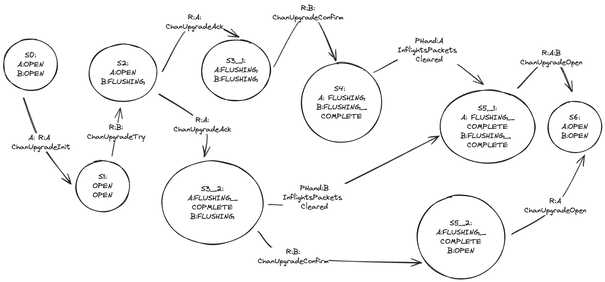
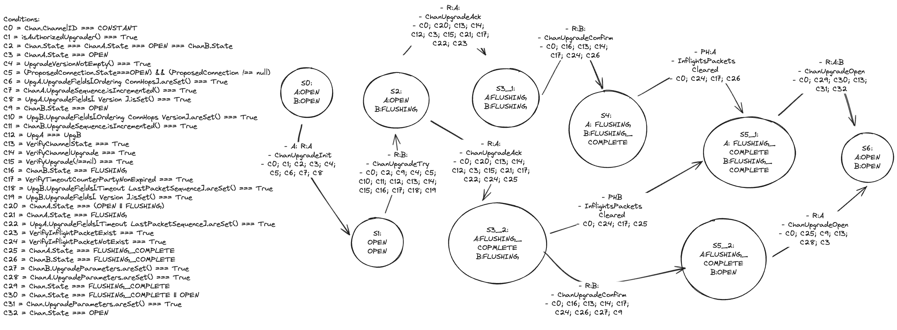

# Channel Upgradability Finite State Machines - WIP 

This document is an attempt to abstract the [channel upgradability specs](https://github.com/cosmos/ibc/blob/main/spec/core/ics-004-channel-and-packet-semantics/UPGRADES.md) into finite state machines (FSMs). For the synopsis and motivation we refer the reader to the specs document. 

According to the specs the channel upgradiblity handshake protocol defines 5 subprotocols and 7 datagrams, exchanged between the parties during the upgrading process, that are reproduced here for the reader's convenience. 
 
- Sub-protocols: `initUpgradeHandshake`, `startFlushUpgradeHandshake`, `openUpgradeHandshake`, `cancelChannelUpgrade`, and `timeoutChannelUpgrade`. 
- Datagrams:  `ChanUpgradeInit`,`ChanUpgradeTry`, `ChanUpgradeAck`, `ChanUpgradeConfirm`, `ChanUpgradeOpen`, `ChanUpgradeTimeout`, and `ChanUpgradeCancel`. 

Every defined datagram and subprotocol has an associated function. A datagram-function call may activate a subprotocol-function, based on the current state, conditions, input and flow.

## Finite state machine modeling

We consider a deterministic finite state machine as a 4-tuple (Q; C; Σ; δ) consisting of: 

- a finite set of States Q
- a finite set of Conditions C
- a finite set of Accepted Inputs Σ
- a finite set of Accepted States Transition δ

### Q: States 
We start defining each state. For every state we list the status of Chain and Chain B: ChannelState,ProvableStore,PrivateStore. 

| State | ChannelState A      | ChannelState B      | ProvableStore A                                                | ProvableStore B                                                | Private Store A                        | Private Store B                        |
|-------|---------------------|---------------------|----------------------------------------------------------------|----------------------------------------------------------------|----------------------------------------|----------------------------------------|
| q0    | OPEN                | OPEN                |                                                                |                                                                |                                        |                                        |
| q1.1  | OPEN                | OPEN                | Chan.UpgradeSequenceSet; Upg.UpgradeSet; Upg.VersionSet;      |                                                                |                                        |                                        |
| q1.2  | OPEN                | OPEN                |                                                                | Chan.UpgradeSequenceSet; Upg.UpgradeSet; Upg.VersionSet;      |                                        |                                        |
| q2    | OPEN                | OPEN                | Chan.UpgradeSequenceSet; Upg.UpgradeSet; Upg.VersionSet; | Chan.UpgradeSequenceSet; Upg.UpgradeSet; Upg.VersionSet; |                                        |                                        |
| q3.1  | FLUSHING            | OPEN                | Chan.UpgradeSequenceSet; Upg.UpgradeSet; Upg.TimeoutSet; Upg.VersionSet; | Chan.UpgradeSequenceSet; Upg.UpgradeSet; Upg.VersionSet;      |                                        |                                        |
| q3.2  | OPEN                | FLUSHING            | Chan.UpgradeSequenceSet; Upg.UpgradeSet; Upg.VersionSet;      | Chan.UpgradeSequenceSet; Upg.UpgradeSet; Upg.TimeoutSet; Upg.VersionSet; |                                        |                                        |
| q4    | FLUSHING            | FLUSHING            | Chan.UpgradeSequenceSet; Upg.UpgradeSet; Upg.TimeoutSet; Upg.VersionSet; | Chan.UpgradeSequenceSet; Upg.UpgradeSet; Upg.TimeoutSet; Upg.VersionSet; | Priv.Upg.CounterParty TimeoutSet 0..1; | Priv.Upg.CounterParty TimeoutSet 0..1; |
| q5.1  | FLUSHING_COMPLETE   | FLUSHING            | Upg.UpgradeSet; Chan.UpgradeSequenceSet; Upg.TimeoutSet; Upg.VersionSet; | Upg.UpgradeSet; Chan.UpgradeSequenceSet; Upg.TimeoutSet; Upg.VersionSet; |                                        | Priv.Upg.CounterParty TimeoutSet;       |
| q5.2  | FLUSHING            | FLUSHING_COMPLETE   | Upg.UpgradeSet; Chan.UpgradeSequenceSet; Upg.TimeoutSet; Upg.VersionSet; | Upg.UpgradeSet; Chan.UpgradeSequenceSet; Upg.TimeoutSet; Upg.VersionSet; | Priv.Upg.CounterParty TimeoutSet;       |                                        |
| q6    | FLUSHING_COMPLETE   | FLUSHING_COMPLETE   | Chan.UpgradeSequenceSet; Upg.UpgradeSet; Upg.TimeoutSet; Upg.VersionSet; | Chan.UpgradeSequenceSet; Upg.UpgradeSet; Upg.TimeoutSet; Upg.VersionSet; |                                        |                                        |
| q7.1  | OPEN                | FLUSHING_COMPLETE   | Chan.UpgradeSequenceSet; Chan.VersionSet; Chan.ConnectionHopsSet; Chan.OrderingSet; | Chan.UpgradeSequenceSet; Upg.UpgradeSet; Upg.TimeoutSet; Upg.VersionSet; |                                        | Priv.Upg.CounterParty TimeoutSet;       |
| q7.2  | FLUSHING_COMPLETE   | OPEN                | Chan.UpgradeSequenceSet; Upg.UpgradeSet; Upg.TimeoutSet; Upg.VersionSet; | Chan.UpgradeSequenceSet; Chan.VersionSet; Chan.ConnectionHopsSet; Chan.OrderingSet; | Priv.Upg.CounterParty TimeoutSet;       |                                        |
| q8    | OPEN                | OPEN                | Chan.UpgradeSequenceSet; Chan.VersionSet; Chan.ConnectionHopsSet; Chan.OrderingSet; | Chan.UpgradeSequenceSet; Chan.VersionSet; Chan.ConnectionHopsSet; Chan.OrderingSet; |                                        |                                        |
| q9    | OPEN or FLUSHING                | OPEN or FLUSHING                | Chan.UpgradeErrorSet 0..1 | Chan.UpgradeErrorSet 0..1 |                                        |                                        |

Every time a state transition occurs, we should verify that in qX ChannelStateX, ProvableStateX and PrivateStoreX reflect what is written in this table.  

### C: Conditions 

Below we list all the conditions that are verified during the protocol execution. In order for a state transition to occur, cX must evaluate to True. We assume that the protocol is only started if pc0 evaluates to True. 

- pc0: BothChannelEnds === OPEN  

- c0: isAuthorizedUpgrader === True
- c1: proposedUpgradeFields.Version !==""
- c2: proposedConnection !== null && proposedConnection.state === OPEN
- c3: proposedConnection.supports(prposedUpgradeFields.ordering) === True
- c4: Upg.UpgradeSet === False
- c5: Upg.UpgradeSet === True
- c6: isCompatibleUpgradeFields === True 
- c7: VerifyChannelState === True
- c8: VerifyChannelUpgrade === True
- c9: Upg.CounterParty.Sequence >= Chan.UpgSequence
- c10: Upg.TimeoutHeight !== 0 || Upg.TimeoutTimestamp !== 0 
- c11: CounterPartyTimeoutNotExpired === True
- c12: PendingInflightsPacket !== True
- c13: PendingInflightsPacket === True
- c14: Priv.Upg.CounterPartyTimeoutSet === True
- c15: CounterPartyUpgradeSequence < Chan.upgradeSequence === True
- c16: CounterPartyUpgradeSequence > Chan.upgradeSequence === True
- c17: Upg.TimeoutExpired === True

### Σ: Accepted Inputs
We now identify all the possible inputs. 

Given: 
- ix: [Party, Condition, PreviosInput]: Datagram --> subprotocolActivation -- extraDetails 

Each input identifier ix corresponds to a specific action, and the placeholders [Party, Condition, PreviousInput] capture who is involved in the action, any conditions that must be satisfied, and any previous input that must have occurred, respectively. 

Thus we can summarize the inputs as: 

- i0: [Party, , ]: ChanUpgradeInit --> initUpgradeHandshake
- i1: [Party, , ]: ChanUpgradeTry --> initUpgradeHandshake
- i2: [Party, Condition, PreviousInput]: ChanUpgradeTry --> startFlushUpgradeHandshake -- atomic
- i3: [Party, Condition, ]: ChanUpgradeTry --> startFlushUpgradeHandshake
- i4: [Party, Condition, ]: ChanUpgradeAck --> startFlushtUpgradeHandshake
- i5: [Party, Condition, ]: ChanUpgradeConfirm
- i6: [Party, , PreviousInput]: PacketHandler 
- i7: [Party, Condition, PreviousInput]: ChanUpgradeConfirm --> OpenUpgradeHandshake -- atomic
- i8: [Party, , ]: ChanUpgradeOpen --> OpenUpgradeHandshake
- i9: [Party,Conditions , ]: ChanUpgradeCancel --> restoreChannel
- i10: [Party,Conditions , ]: ChanUpgradeTimeout --> restoreChannel


Below, we list the expanded representation of the protocol inputs. 
Note that the column previous state, "ix" indicates a previous input. When we express this as i5(c13) we assume that this is the input i5 having the same Party of the new input that is enforcing the c13 condition. 


- i0: [A, (c0; c1; c2 ; c3), ]: ChanUpgradeInit --> initUpgradeHandshake
- i0: [B, (c0; c1; c2 ; c3), ]: ChanUpgradeInit --> initUpgradeHandshake
- i0: [A & B, (c0; c1  c2; c3), ]: ChanUpgradeInit --> initUpgradeHandshake
- i0: [A, (c0; c1; c2; c3 incrementUpgradeSeq), ]: ChanUpgradeInit --> initUpgradeHandshake
- i0: [B, (c0; c1; c2; c3 incrementUpgradeSeq), ]: ChanUpgradeInit --> initUpgradeHandshake
- i1: [B, (c1; c2; c3; c4) , ]: ChanUpgradeTry --> initUpgradeHandshake
- i1: [A, (c1; c2; c3; c4) , ]: ChanUpgradeTry --> initUpgradeHandshake
- i1: [A, (c1; c2; c3; c4; c16) , ]: ChanUpgradeTry --> initUpgradeHandshake -- SwitchToCounterPartyUpgSeq
- i1: [B, (c1; c2; c3; c4; c16) , ]: ChanUpgradeTry --> initUpgradeHandshake -- SwitchToCounterPartyUpgSeq
- i2: [A, (c4; c6; c7; c8; c9; c10), i1]: ChanUpgradeTry --> startFlushUpgradeHandshake -- atomic
- i2: [B, (c4; c6; c7; c8; c9; c10), i1]: ChanUpgradeTry --> startFlushUpgradeHandshake -- atomic
- i3: [A, (c5; c6; c7; c8; c9; c10), ]: ChanUpgradeTry --> startFlushUpgradeHandshake
- i3: [B, (c5; c6; c7; c8; c9; c10), ]: ChanUpgradeTry --> startFlushUpgradeHandshake
- i4: [A, (c7; c8; c6; c10; c11; c12), ]: ChanUpgradeAck --> startFlushtUpgradeHandshake
- i4: [B, (c7; c8; c6; c10; c11; c13), ]: ChanUpgradeAck --> startFlushtUpgradeHandshake
- i4: [B, (c7; c8; c6; c10; c11; c12), ]: ChanUpgradeAck --> startFlushtUpgradeHandshake
- i4: [A, (c7; c8; c6; c10; c11; c13), ]: ChanUpgradeAck --> startFlushtUpgradeHandshake
- i5: [A, (c7; c8; c11; c12), ]: ChanUpgradeConfirm
- i5: [B, (c7; c8; c11; c12), ]: ChanUpgradeConfirm
- i5: [B, (c7; c8; c11; c13; c14), ]: ChanUpgradeConfirm
- i5: [A, (c7; c8; c11; c13; c14), ]: ChanUpgradeConfirm
- i6: [A, (c11; c12; c14) ,i5(c13)]: PacketHandler 
- i6: [B, (c11; c12; c14) ,i5(c13)]: PacketHandler 
- i7: [A, , i5(c12)]: ChanUpgradeConfirm --> OpenUpgradeHandshake -- atomic
- i7: [B, , i5(c12)]: ChanUpgradeConfirm --> OpenUpgradeHandshake -- atomic
- i8: [A, c7 , ]: ChanUpgradeOpen --> OpenUpgradeHandshake
- i8: [B, c7 , ]: ChanUpgradeOpen --> OpenUpgradeHandshake
- i9: [A or B, c15, ]: ChanUpgradeCancel --> restoreChannel
- i10: [A or B, (c5; c17; c11)] : ChanUpgradeTimeout --> restoreChannel
- i10: [A, (c5; c17; c11)] : ChanUpgradeTimeout --> restoreChannel
- i10: [B, (c5; c17; c11)] : ChanUpgradeTimeout --> restoreChannel

### Accepted States Transition δ
We model the accepted state transition as: 

1. [initial_state] x [input[Party,Conditions,PreviousCall]] -> [final_state]. 
2. [initial_state] x [input[Party,Conditions,PreviousCall]] -> [intermediate_state] x [input[Party,Conditions,PreviousCall]] -> [final_state]. 

---

- [q0] x [i0: [A,(c0; c1; c2 ; c3),]] -> [q1.1] 
- [q0] x [i0: [B,(c0; c1; c2 ; c3), ]] -> [q1.2]
- [q0] x [i0: [A & B, (c0; c1  c2; c3), ]] -> [q2]

- [q1.1] x [i0: [A,(c0; c1; c2; c3; incrementUpgradeSeq), ]] -> [q1.1] 
- [q1.1] x [i1: [B, (c1; c2; c3; c4) , ]] -> [q2] x [i2: [B, (c4; c6; c7; c8; c9; c10), i1]] -> [q3.2] 

- [q1.2] x [i0: [B,(c0; c1; c2; c3; incrementUpgradeSeq), ]] -> q1.2
- [q1.2] x [i1: [A, (c1; c2; c3; c4) , ]] -> [q2] x [i2: [A, (c4; c6; c7; c8; c9; c10), i1]] -> [q3.1]

- [q2] x [i3: [A, (c5; c6; c7; c8; c9; c10), ]] -> [q3.1]
- [q2] x [i3: [B, (c5; c6; c7; c8; c9; c10), ]] -> [q3.2]
- [q2] x [i9 [A or B, c15, ]] -> [q9]

- [q3.1] x [i4: [A, (c7; c8; c6; c10; c11; c13), ]] -> [q4]
- [q3.1] x [i4: [A, (c7; c8; c6; c10; c11; c12), ]] -> [q5.2]

- [q3.2] x [i4: [B, (c7; c8; c6; c10; c11; c12), ]] -> [q4]
- [q3.2] x [i4: [B, (c7; c8; c6; c10; c11; c13), ]] -> [q5.1]

- [q4] x [i5: [A, (c7; c8; c11; c13; c14), ]] -> [q4]
- [q4] x [i5: [B, (c7; c8; c11; c13; c14), ]] -> [q4]
- [q4] x [i5: [A, (c7; c8; c11; c12), ]] -> [q5.1]
- [q4] x [i6: [A, (c11; c12; c14) ,i5(c13)]] -> [q5.1]
- [q4] x [i5: [B, (c7; c8; c11; c12), ]] -> [q5.2]
- [q4] x [i6: [B, (c11; c12; c14) ,i5(c13)]] -> [q5.2]
- [q4] x [i10: [A or B, (c5; c17; c11), ]] -> [q9]


- [q5.1] x [i5: [B, (c7; c8; c11; c13; c14), ]] -> [q5.1]
- [q5.1] x [i6: [B, (c11; c12), i5(c13)]] -> [q6]
- [q5.1] x [i5: [B, (c7; c8; c11; c12), ]] -> [q6] x [i7: [B, , i5(c12)]] -> [q7.2] 
- [q5.1] x [i10: [A, (c5; c17; c11), ]] -> [q9]

- [q5.2] x [i5: [A, (c7; c8; c11; c13; c14), ]] -> [q5.2]
- [q5.2] x [i6: [A, (c11; c12), i5(c13)]] -> [q6]
- [q5.2] x [i5: [A, (c7; c8; c11; c12), ]] -> [q6] x [i7: [A, , i5(c12)]] -> [q7.1]
- [q5.2] x [i10: [B, (c5; c17; c11), ]] -> [q9]

- [q6] x [i8: [A, c7 ,]] -> [q7.1]
- [q6] x [i8: [B, c7 ,]] -> [q7.2]

- [q7.1] x [i8: [B, c7 ,]] -> [q8]
- [q7.2] x [i8: [A, c7 ,]] -> [q8]

- [q9] x [i9: [A or B, c15, ]] ->[q0]

### Finite State Machine Diagram

Here we give a graphical representation of the finite state machine. 

[FSM](https://excalidraw.com/#json=B36vSsO7NiXmsRpVrWNYw,T--rvN-vQ-Ys9S5ZWAevPg)


### Flows
The protocol defines 3 Main possible flows: 
- A starts the process and B follows.
- B starts the process and A follows.
- A & B start the process (Crossing Hello). 

To describe the different flows we will write the state transition matrix. The state transition matrix has '1' indicating a possible transition and empty cells where no transition occurs. Empty cells indicate no direct transition is possible between those states.

#### Flow 0:  A & B start the process (Crossing Hello)

| States    | q0 | q1.1 | q1.2 | q2 | q3.1 | q3.2 | q4 | q5.1 | q5.2 | q6 | q7.1 | q7.2 | q8 | q9 |
|-----------|----|------|------|----|------|------|----|------|------|----|------|------|----|----|
| **q0**    |    | 1    | 1    | 1  |      |      |    |      |      |    |      |      |    |    |
| **q1.1**  |    | 1    |      | 1  |      |      |    |      |      |    |      |      |    |    |
| **q1.2**  |    |      | 1    | 1  |      |      |    |      |      |    |      |      |    |    |
| **q2**    |    |      |      |    | 1    | 1    |    |      |      |    |      |      |    |1   |
| **q3.1**  |    |      |      |    |      |      | 1  |      | 1    |    |      |      |    |    |
| **q3.2**  |    |      |      |    |      |      | 1  | 1    |      |    |      |      |    |    |
| **q4**    |    |      |      |    |      |      |    | 1    | 1    |    |      |      |    |1   |
| **q5.1**  |    |      |      |    |      |      |    | 1    |      | 1  |      |      |    |1   |
| **q5.2**  |    |      |      |    |      |      |    |      |  1   | 1  |      |      |    |1   |
| **q6**    |    |      |      |    |      |      |    |      |      |    | 1    |  1   |    |    |
| **q7.1**  |    |      |      |    |      |      |    |      |      |    |      |      | 1  |    |
| **q7.2**  |    |      |      |    |      |      |    |      |      |    |      |      | 1  |    |
| **q8**    |    |      |      |    |      |      |    |      |      |    |      |      |    |    |
| **q9**    | 1  |      |      |    |      |      |    |      |      |    |      |      |    |    |

#### Flow 1: A starts the process and B follows.

| States    | q0 | q1.1 | q1.2 | q2 | q3.1 | q3.2 | q4 | q5.1 | q5.2 | q6 | q7.1 | q7.2 | q8 | q9 |
|-----------|----|------|------|----|------|------|----|------|------|----|------|------|----|----|
| **q0**    |    | 1    |      |    |      |      |    |      |      |    |      |      |    |    |
| **q1.1**  |    | 1    |      | 1  |      |      |    |      |      |    |      |      |    |    |
| **q1.2**  |    |      |      |    |      |      |    |      |      |    |      |      |    |    |
| **q2**    |    |      |      |    |      | 1    |    |      |      |    |      |      |    |1   |
| **q3.1**  |    |      |      |    |      |      |    |      |      |    |      |      |    |    |
| **q3.2**  |    |      |      |    |      |      | 1  | 1    |      |    |      |      |    |    |
| **q4**    |    |      |      |    |      |      | 1  | 1    | 1    |    |      |      |    |1   |
| **q5.1**  |    |      |      |    |      |      |    | 1    |      | 1  |      |      |    |1   |
| **q5.2**  |    |      |      |    |      |      |    |      | 1    | 1  |      |      |    |1   |
| **q6**    |    |      |      |    |      |      |    |      |      |    | 1    | 1    |    |    |
| **q7.1**  |    |      |      |    |      |      |    |      |      |    |      |      | 1  |    |
| **q7.2**  |    |      |      |    |      |      |    |      |      |    |      |      | 1  |    |
| **q8**    |    |      |      |    |      |      |    |      |      |    |      |      |    |    |
| **q9**    | 1  |      |      |    |      |      |    |      |      |    |      |      |    |    |

#### Flow 2: B starts the process and A follows.

| States    | q0 | q1.1 | q1.2 | q2 | q3.1 | q3.2 | q4 | q5.1 | q5.2 | q6 | q7.1 | q7.2 | q8 | q9 |
|-----------|----|------|------|----|------|------|----|------|------|----|------|------|----|----|
| **q0**    |    |      |  1   |    |      |      |    |      |      |    |      |      |    |    |
| **q1.1**  |    |      |      |    |      |      |    |      |      |    |      |      |    |    |
| **q1.2**  |    |  1   |      |  1 |      |      |    |      |      |    |      |      |    |    |
| **q2**    |    |      |      |    |   1  |      |    |      |      |    |      |      |    |1   |
| **q3.1**  |    |      |      |    |      |      |  1 |      | 1    |    |      |      |    |    |
| **q3.2**  |    |      |      |    |      |      |    |      |      |    |      |      |    |    |
| **q4**    |    |      |      |    |      |      | 1  | 1    | 1    |    |      |      |    |1   |
| **q5.1**  |    |      |      |    |      |      |    | 1    |      | 1  |      |      |    |1   |
| **q5.2**  |    |      |      |    |      |      |    |      | 1    | 1  |      |      |    |1   |
| **q6**    |    |      |      |    |      |      |    |      |      |    | 1    | 1    |    |    |
| **q7.1**  |    |      |      |    |      |      |    |      |      |    |      |      | 1  |    |
| **q7.2**  |    |      |      |    |      |      |    |      |      |    |      |      | 1  |    |
| **q8**    |    |      |      |    |      |      |    |      |      |    |      |      |    |    |
| **q9**    | 1  |      |      |    |      |      |    |      |      |    |      |      |    |    |

### Cancel and Timeout
`RestoreChannel` can be called at any point of the process and will reset the state machine execution to s0.


# Notes 

<details>
  <summary>Click to expand!</summary>

The content below is not to be considered.

# IntermediateWork: 

#### Inputs


// optimistically accept version that TRY chain proposes and pass this to callback for confirmation.
  // in the crossing hello case, we do not modify version that our TRY call returned and instead 
  // enforce that both TRY calls returned the same version

[FSM_SubProtocols](https://excalidraw.com/#json=0bR7GjjkdWXnD9zvJ-bBk,3FsByRW_n1_YdWFWA679wg)


### Description 
`initUpgradeHandshake` will initialize the channel end for the upgrade handshake. It will validate the upgrade parameters and store the channel upgrade. All packet processing will continue according to the original channel parameters, as this is a signalling mechanism that can remain indefinitely. The new proposed upgrade will be stored in the provable store for counterparty verification. If it is called again before the handshake starts, then the current proposed upgrade will be replaced with the new one and the channel sequence will be incremented.

// initUpgradeHandshake will verify that the channel is in the
// correct precondition to call the initUpgradeHandshake protocol.
// it will verify the new upgrade field parameters, and make the
// relevant state changes for initializing a new upgrade:
// - store channel upgrade
// - incrementing upgrade sequence

The `initUpgradeHandshake` involves states s0;s1.1;s1.2;s2 and it is used in two datagrams, namely ChanUpgradeInit and ChanUpgradeTry. Over these datagrams exchange the protocol guarantees that a Chan.UpgradeVersion is agreed (Both Chains stores the same value on their channel end.) 

For this subprotocol to be correctly executed, we require a series of state transition that starting from s0 must end in s2, regardless of the taken path. 

In the picture we can see that there are 3 possible paths we could take: 

- Crossing Hello (Both Chain A and Chain B start the process): In the case of Crossing Hello, we are sure that both Chains Chan.UpgradeVersion is written in s2
- Chain A starts the process : we are sure that Chain B have Chan.UpgradeVersion written in s2, but Chain A may write the Chan.UpgradeVersion on s3.1. 
- Chain B starts the process : In case Chain B starts the process, then we are sure that Chain A have Chan.UpgradeVersion written in s2, but Chain B may write the Chan.UpgradeVersion on s3.2.

The difference between the three is about when the version is actually written in the state. 

The protocol guarantee that on s4 both Chains A and B have the Chan.UpgradeVersion written into the channel state of their chain. 

### StartFlusUpgradeHandshake 

The `startFlushUpgradeHandshake` involves states s2;s3.1;s3.2;s4 and it is used in two datagrams, namely ChanUpgradeTry and ChanUpgradeAck. Over these datagrams exchange the protocol guarantees that a Upg.CounterPartyTimeout is set (Both Chains stores the counterParty value on their channel end.)

That means the protocol guarantees that on s4 both Chains have stored the counterParty Timeout. 

For this subprotocol to be correctly executed, we require a series of state transition that starting from s2 must end in s4, regardless of the taken path. 

Again the state when this writing to the channel end state happens actually depends on which situation we are: 

- Crossing Hello (Both Chain A and Chain B start the process). s4.
- Chain A starts the process : we are sure that Chain B have UpgCounterPartyTimeout written in s3.2, but Chain A may write the Upg.CounterPartyTimeout on s4.
s3.1
- Chain B starts the process : we are sure that Chain A have Upg.CounterPartyTimeout written in s3.1, but Chain A may write the Upg.CounterPartyTimeout on s4. 

### OpenUpgradeHandshake 


This subprotocol will open the channel and switch the existing channel parameters to the newly agreed-upon upgrade channel fields.
ensures that all new channel information are written into the channel state on both ends and that auxiliary parameters are actually deleted from the state.  

The `OpenUpgradeHandshake` involves state s6;s7.1;s7.2;s8. It is used in datagrams `ChanUpgradeOpen` and `ChanUpgradeConfirm`. 

Again depending on the starting chain we may have difference times for things being written into the state. 

- Crossing Hello (Both Chain A and Chain B start the process). s8.
- Chain A starts the process : we are sure that Chain B have Chan.Info written and auxiliary states deleted in s7.2, but Chain A may write the Chan.Info and deletes auxiliary states on s8.

- Chain B starts the process : we are sure that Chain A have Chan.Info written and auxiliary states deleted in s7.1, but Chain B may write the Chan.Info and deletes auxiliary states on s8.

Similarly to the Version, we can delineate when Upg.CounterPartyTimeout is guaranteed to be written by both chain in the store. 

### Guaranteed States
s0,s2;s4;s8. Which means that these states conditions (which information is written) are eligible as invariants for the protocol correctness verification. 

### Datagrams consideration 

All the functions defined in the Upgrade Handshake protocol, peforms on-chain verification of the stored information and use a subset of the subprotocols. 

In particular we have that: 
Table 


[InitUpgradeHandshake](
https://excalidraw.com/#json=MOyhE_n_X-lSokzJvBBT6,_dZELbWnxq6EKjQlw3-zXQ)

Idea Multi s1.1 --> s1.3 with just channel sequence that will be incremented. 


## v0: 

# Channel Upgradability Protocol 
According to the [specs](https://github.com/cosmos/ibc/blob/main/spec/core/ics-004-channel-and-packet-semantics/UPGRADES.md#upgrade-handshake), we can model the channel upgradability protocol with 2 main flow namely, `UpgradeOk` and `UpgradeNotOk`. `UpgradeOk` can be expanded in 2 subflows namely `UpgradeOkCrossingHello` and `UpgradeOkNotCrossingHello`. `UpgradeNotOk` can be further expanded in 3 subflows namely `UpgradeCanceled`,`UpgradeExpired`, `UpgradeStaled`.  

- `UpgradeOk`
    - `UpgradeOkNotCrossingHello`
    - `UpgradeOkCrossingHello`
- `UpgradeNotOk`
    - `UpgradeCanceled`
    - `UpgradeExpired` 
    - `UpgradeStaled`

We now procede with the abstraction process of every flow identified. 

## UpgradeOkNotCrossingHello
In this section we describe the happy path of the channel upgradability protocol, the `UpgradeOkNotCrossingHello`.   

### FSM High Level Representation

[UpgradeOkNotCrossingHello High Level Representation](https://excalidraw.com/#json=2zmjDnSeYCqDInYRE1dFk,KFIj9CYEOk8v_xLlb-p6Fw)



## Formalization of the specs - WIP 

The content of this section may be completely modified. I'm trying to understand how to better defines all the conditions and invariants needed for every state transition. 

### States 

**State Table**
| StateID| Description                                                  |
|--------|--------------------------------------------------------------|
| S0    | A:OPEN; B:OPEN :: The channel is ready to be upgraded        |
| S1    | A:OPEN; B:OPEN :: Chain A has started the process            |
| S2    | A:OPEN; B:FLUSHING            |
| S3_1  | A:FLUSHING; B:FLUSHING        |
| S3_2  | A:FLUSHING_COMPLETE; B:FLUSHING |
| S4    | A:FLUSHING; B:FLUSHING_COMPLETE |
| S5_1  | A:FLUSHING_COMPLETE; B:FLUSHING_COMPLETE                  |
| S5_2  | A:FLUSHING_COMPLETE; B:OPEN                  |
| S6    | A:OPEN; B:OPEN                  |

**Admitted Flow**
Here we list all the possible flows. 

1. `S0 -> S1 -> S2 -> S3_1 -> S4 -> S5_1 ->S6`  
2. `S0 -> S1 -> S2 -> S3_2 -> S5_1 ->S6`
3. `S0 -> S1 -> S2 -> S3_2 -> S5_2 ->S6`

**F:Admitted State Transition**:
- S0->S1 
- S1->S2
- S2->S3_1 
- S2->S3_2
- S3_1->S4
- S3_2->S5_1
- S3_2->S5_2
- S5_1->S6
- S5_2->S6

### Storage Definition 

In the provable store we have 7 paths for each end that we need to consider for this protocol: 
- ConnectionPath:
    - ConnectionPath on A: ConnA
    - ConnectionPath on B: ConnB
- ChannelPath:
    - ChannelPath on A: ChanA
    - ChannelPath on B: ChanB
- ChannelUpgradePath:
    - ChannelUpgradePath on A: UpgA
    - ChannelUpgradePath on B: UpgB
- CounterPartyLastPacketSequencePath:
    - CounterPartyLastPacketSequencePath on A: LastSeqA
    - CounterPartyLastPacketSequencePath on B: LastSeqB
- NextSequenceSendPath:
    - NextSequenceSendPath on A: NextSeqSendA
    - NextSequenceSendPath on B: NextSeqSendB
- CounterPartyUpgradeTimeoutPath:
    - CounterPartyUpgradeTimeoutPath on A: TimeoutA
    - CounterPartyUpgradeTimeoutPath on B: TimeoutB
- UpgradeErrorPath:
    - UpgradeErrorPath on A : UpgErrA
    - UpgradeErrorPath on B : UpgErrB

The private store is meant for an end (e.g. ChainA or ChainB) to store transient data (e.g data that are necessary to take decision but that don't get stored in chains). We will call:
- PrivateStore:
    - PrivateStore on A: PrivA
    - PrivateStore on B: PrivA

### Actors 
- Chain A: A  
- Chain B: B
- Relayer for A: R:A
- Relayer for B: R:B
- Packet Handler for A : PH:A
- Packet Handler for B : PH:B

### Functions Calls For State Transition
```typescript
S0-->S1: (OPEN,OPEN) --> (OPEN,OPEN) :: A and R:A
ChanUpgradeInit --> IsAuthorizedUpgrader()
    InitUpgradeHandshake --> getChan(ChanA) :: VerifyChanAis(OPEN); VerifyUpgradeVersion(!== "") 
        getConn(ConnA):: Verify (ProposedConnection !== null && ProposedConnection.stateIs(OPEN)) VerifyOrderingSupported()
        setUpgrade(UpgA) [Ordering and ConnHops] 
        setUpgradeSequence(ChanA)
    getUpgrade(UpgA)
    setUpgrade(UpgA) [Version] 
```

```typescript
S1 -->S2: (OPEN,OPEN) --> (OPEN,FLUSHING) :: R:B
ChanUpgradeTry -->	getChan(ChanB) :: VerifyChanBis(OPEN)
    getUpgrade(UpgB) 
    InitUpgradeHandshake--> getChan(ChanB) :: VerifyChanBis(OPEN) ; VerifyUpgradeVersion(!== "")
        getConn(ConnB):: Verify (ProposedConnection !== null && ProposedConnection.stateIs(OPEN)) VerifyOrderingSupported() 
        setUpgrade(UpgB) [Ordering, ConnHops, Version]; 
        setUpgradeSequence(ChanB)
    VerifyIsCompatibleUpgFields()		
    getConn(ConnA) :: ConstructCounterPartyChannelEnd(); VerifyChannelState(); VerifyChannelUpgrade()
    StartFlushingUpgradeHandshake --> getChan(ChanB):: VerifyChanBis(OPEN)
        getUpgrade(UpgB):: VerifyUpgrade(!==nil)	
        setChanB(FLUSHING)
        getUpgradeTimeout(TimeoutA):: VerifyTimeoutNotExpired() 
        getNextSeqSend(NextSeqSendA)	
        setChannel(ChanB);
        setUpgrade(UpgB) [Timeout, LastPacketSequence]
    getChan(ChanB)
    getUpgrade(UpgB)
    setUpgrade(UpgB) [Version]
```

```typescript
S2 --> S3_1: (OPEN,FLUSHING) --> (FLUSHING,FLUSHING) :: R:A
ChanUpgradeAck -->	getChan(ChanA):: VerifyChanAis(OPEN) 
    getConn(ConnB) :: ConstructCounterPartyChannelEnd(); VerifyChannelState(); VerifyChannelUpgrade()
    getUpgrade(UpgA) :: VerifyIsCompatibleUpgFields()		
    StartFlushingUpgradeHandshake --> getChan(ChanA) :: VerifyChanAis(OPEN)
        getUpgrade(UpgA):: VerifyUpgrade(!==nil)	
        setChanA(FLUSHING)
        getUpgradeTimeout(TimeoutB):: VerifyTimeoutNotExpired()
        getNextSeqSend(NextSeqSendB)
        setChannel(ChanA)	
        setUpgrade(UpgA) [Timeout, LastPacketSequence]
    VerifyInflightsPacket(Exist)
    setCounterPartyTimeout(PrivA)
    setChannel(ChanA)	
    setUpgrade(UpgA)
```

```typescript
S2 --> S3_2: (OPEN,FLUSHING) --> (FLUSHING_COMPLETE,FLUSHING) :: R:A
ChanUpgradeAck-->	getChan(ChanA); VerifyChanAis(OPEN || FLUSHING) 
    getConn(ConnB) :: ConstructCounterPartyChannelEnd(); VerifyChannelState(); VerifyChannelUpgrade()
    getUpgrade(UpgA) :: VerifyIsCompatibleUpgFields() 	
    StartFlushingUpgradeHandshake --> getChan(ChanA):: VerifyChanIs(OPEN)
        getUpgrade(UpgA) ::  VerifyUpgrade(!==nil)
        setChanA(FLUSHING)
        getUpgradeTimeout(TimeoutB):: VerifyTimeoutNotExpired()
        getNextSeqSend(NextSeqSendB)
        setChannel(ChanA)	
        setUpgrade(UpgA) [Timeout, LastPacketSequence]
    VerifyInflightsPackets(NotExist) 
    setChanA(FLUSHING_COMPLETE) 
    setChannel(ChanA)
    setUpgrade(UpgA)
```

```typescript
S3_1 --> S4: (FLUSHING,FLUSHING) --> (FLUSHING,FLUSHING_COMPLETE) :: R:B
ChanUpgradeConfirm--> getChan(ChanB):: VerifyChanBis(FLUSHING) 
    getConn(ConnA) :: ConstructCounterPartyChannelEnd(); VerifyChannelState(); VerifyChannelUpgrade()
    VerifyTimeoutNotExpired()
    VerifyInflightsPackets(NotExist) 
    setChanB(FLUSHING_COMPLETE) 
    setChannel(ChanB)
```

```typescript
S4 --> S5_1: (FLUSHING,FLUSHING_COMPLETE) --> (FLUSHING_COMPLETE,FLUSHING_COMPLETE) :: PH:A
PacketHandlerChainA_Function-->	VerifyInflightsPackets(NotExist)
    VerifyTimeoutNotExpired()
    setChanA(FLUSHING_COMPLETE) 
    setChannel(ChanA)
```

```typescript
S3_2 --> S5_1: (FLUSHING_COMPLETE,FLUSHING) --> (FLUSHING_COMPLETE,FLUSHING_COMPLETE) :: PH:B
PacketHandlerChainB_Function-->	VerifyInflightsPackets(NotExist) 
    VerifyTimeoutNotExpired()
    setChanB(FLUSHING_COMPLETE) 
    setChannel(ChanB)
```

```typescript
S3_2 --> S5_2: (FLUSHING_COMPLETE,FLUSHING) --> (FLUSHING_COMPLETE,OPEN) :: R:B
ChanUpgradeConfirm--> getChan(ChanB):: VerifyChanBis(FLUSHING)
    getConn(ConnA) :: ConstructCounterPartyChannelEnd(); VerifyChannelState(); VerifyChannelUpgrade()
    VerifyTimeoutNotExpired()
    VerifyInflightsPackets(NotExist) 
    setChanB(FLUSHING_COMPLETE) 
    setChannel(ChanB)
    openUpgradeHandshake--> getChan(ChanB) 
        getUpgrade(UpgB)
        setChanUpgradeParameter(ChanB)
        setChanB(OPEN)
        setChannel(ChanB)
        delUpgrade(UpgB)
        delTimeout(TimeoutB)
        delLastPacSeq(LastSeqB)
```

```typescript
S5_1 --> S6: (FLUSHING_COMPLETE,FLUSHING_COMPLETE) --> (OPEN,OPEN)	:: R:B and R:A
ChanUpgradeOpen--> getChan(Chan):: VerifyChanIs(FLUSHING_COMPLETE)
    getConn(Conn);	
    VerifyChanIs(OPEN || FLUSHING_COMPLETE)
    ConstructCounterPartyChannelEnd(); VerifyChannelState()
    openUpgradeHandshake--> getChan(); 
        getUpgrade(UpgA)
        setChanUpgradeParameter(Chan)
        setChan(OPEN)
        setChannel(Chan)
        delUpgrade(Upg)
        delTimeout(Timeout)
        delLastPacSeq(LastSeq)
```

```typescript
S5_2 --> S6: (FLUSHING_COMPLETE,OPEN) --> (OPEN,OPEN)	
ChanUpgradeOpen -->	getChan(ChanA):: VerifyChanAis(FLUSHING_COMPLETE)
    getConn(ConnB)  
    VerifyChanBis(OPEN)
    getUpgrade(UpgA)
    ConstructCounterPartyChannelEnd(); VerifyChannelState()
    openUpgradeHandshake--> getChan(ChanA) 
        getUpgrade(UpgA)
        setChanUpgradeParameter(ChanA)
        setChanA(OPEN)
        setChannel(ChanA)
        delUpgrade(UpgA)
        delTimeout(TimeoutA)
        delLastPacSeq(LastSeqA)
```

### Conditions

Notes: 
- Need to understand if there is a better way to express conditions in a more compress format.  

**C:Conditions**: 
- C0 = Chan.ChannelID === CONSTANT 
- C1 = isAuthorizedUpgrader() === True
- C2 = Chan.State === ChanA.State === OPEN === ChanB.State
- C3 = ChanA.State === OPEN
- C4 = UpgradeVersionNotEmpty() === True
- C5 = (ProposedConnection.State===OPEN) && (ProposedConnection !== null)
- C6 = UpgA.UpgradeFields[Ordering ConnHops].areSet() === True
- C7 = ChanA.UpgradeSequence.isIncremented() === True
- C8 = UpgA.UpgradeFields[ Version ].isSet() === True
- C9 = ChanB.State === OPEN 
- C10 = UpgB.UpgradeFields[Ordering ConnHops Version].areSet() === True
- C11 = ChanB.UpgradeSequence.isIncremented() === True
- C12 = UpgA === UpgB
- C13 = VerifyChannelState === True
- C14 = VerifyChannelUpgrade === True
- C15 = VerifyUpgrade(!==nil) === True
- C16 = ChanB.State === FLUSHING 
- C17 = VerifyTimeoutCounterPartyNonExpired === True 
- C18 = UpgB.UpgradeFields[Timeout LastPacketSequence].areSet() === True
- C19 = UpgB.UpgradeFields[ Version ].isSet() === True
- C20 = ChanA.State === (OPEN || FLUSHING)
- C21 = ChanA.State === FLUSHING 
- C22 = UpgA.UpgradeFields[Timeout LastPacketSequence].areSet() === True
- C23 = VerifyInflightPacketExist === True
- C24 = VerifyInflightPacketNotExist === True
- C25 = ChanA.State === FLUSHING_COMPLETE
- C26 = ChanB.State === FLUSHING_COMPLETE
- C27 = ChanB.UpgradeParameters.areSet() === True
- C28 = ChanA.UpgradeParameters.areSet() === True
- C29 = Chan.State === FLUSHING_COMPLETE
- C30 = Chan.State === FLUSHING_COMPLETE || OPEN
- C31 = Chan.UpgradeParameters.areSet() === True
- C32 = Chan.State === OPEN

|Initiator| Q | Q'   | C (Conditions)                      | Σ (Input Function)  | 
|---------|---|------|-------------------------------------|--------------------|
|A:R:A    | S0| S1   | C0;C1;C2;C3;C4;C5;C6;C7;C8          | ChanUpgradeInit    |
|R:B      | S1| S2   | C0;C2;C9;C4;C5;C10;C11;C12;C13;C14;C15;C16;C17;C18;C19| ChanUpgradeTry     | 
|R:A      | S2| S3_1 | C0;C20;C13;C14;C12;C3;C15;C21;C17;C22;C23  | ChanUpgradeAck     |
|R:A      | S2| S3_2 | C0;C20;C13;C14;C12;C3;C15;C21;C17;C22;C24;C25  | ChanUpgradeAck     |
|R:B      | S3_1|S4  | C0;C16;C13;C14;C17;C24;C26          | ChanUpgradeConfirm |
|PH:A     | S4|S5_1  | C0;C24;C17;C26                      | PH:A Function      |
|PH:B     | S3_2|S5_1| C0;C24;C17;C25                      | PH:B Function      |
|R:B      | S3_2|S5_2| C0;C16;C13;C14;C17;C24;C26;C27;C9   | ChanUpgradeConfirm |
|R:A:B    | S5_1|S6  | C0;C29;C30;C13;C31;C32              | ChanUpgradeOpen    |
|R:A      | S5_2|S6  | C0;C25;C9;C13;C28;C3                | ChanUpgradeOpen    |


[UpgradeOkNotCrossingHello with Conditions](https://excalidraw.com/#json=ozuqjEQkt2sBcvK_4JhJI,sF60RbRxrrYa88-TjzdkeA)




### Upgrade Handshake - UpgradeOkCrossingHello

## Upgrade Handshake - UpgradeNotOk

### Upgrade Handshake - UpgradeCanceled

### Upgrade Handshake - UpgradeExpired

### Upgrade Handshake - UpgradeStaled


Outdated

## Conditions 
- C0 = Chan.State === ChanA.State === OPEN === ChanB.State
- C1 = Chan.ChannelID === CONSTANT 
- C2 = isAuthorizedUpgrader() === True
- C3 = ChanA.UpgradeSequence.isIncremented() === True
- C4 = UpgA.UpgradeFields[Ordering ConnHops].areSet() === True
- C5 = (ProposedConnection.State===OPEN) && (ProposedConnection !== null)
- C6 = isSupported(UpgA.UpgradeFields.ordering) === True
- C7 = UpgA.isStored(PSa) === True
- C8 = ChanA.UpgradeSequence.isStored(PSa) === True
- C9 = UpgB.isStored(PSb) !== True 
- C10 = ChanB.UpgradeSequence === ChanA.UpgradeSequence
- C11 = VerifyChanA.State() === True 
- C12 = VerifyChanA.Upgrade === True 
- C13 = (Chan.UpgradeTimeout != 0) || (Chan.UpgradeTimestamp != 0) 
- C13 = UpgA.lastPacketSequence.isSet() === True
- C14 = UpgA.isStored(PSa) === True 
- C15 = ChanB.State.isSet(FLUSHING) === True 
- C16 = ChanB.isStored(PSb) === True 
- C17 = (ChanB.State === FLUSHING) && (ChanA.State === OPEN) 
- C18 = VerifyChanB.State() === True 
- C19 = VerifyChanB.Upgrade === True 
- C20 = UpgB.UpgradeFields === UpgA.UpgradeFields 
- C21 = UpgB.Timeout.isExpired() !== True
- C22 = InP.exist()===True
- C23 = InP.exist()!==True 
- C24 = ChanA.State.isSet(FLUSHING) === True 
- C25 = ChanA.isStored(PSa) === True 
- C26 = ChanA.State.isSet(FLUSHING_COMPLETE) === True 
- C27 = UpgA.Timeout.isExpired() !== True
- C28 = (ChanB.State === FLUSHING) && (ChanA.State === FLUSHING)
- C29 = ChanB.State.isSet(FLUSHING_COMPLETE) === True 
- C30 = ChanB.isStored(PSb) === True 
- C31 = (ChanA.State === FLUSHING_COMPLETE) && (ChanB.State === FLUSHING)
- C32 = ChanB.State.isSet(OPEN) === True 
- C33 = (ChanA.State === FLUSHING_COMPLETE) && (ChanB.State === FLUSHING_COMPLETE)
- C34 = (ChanA.State === FLUSHING_COMPLETE) && (ChanB.State === OPEN)


|Initiator| Q | Q'   | C (Conditions)                      | Σ (Input Symbols)  | 
|---------|---|------|-------------------------------------|--------------------|
|A        | S0| S1   | C0;C1;C2;C3;C4;C5;C6;C7;C8          | ChanUpgradeInit    |
|R:B      | S1| S2   | C0;C1;C9;C10;C11;C12;C13;C14;C15;C16| ChanUpgradeTry     | 
|R:A      | S2| S3_1 | C1;C17;C18;C19;C20;C21;C22;C24;C25  | ChanUpgradeAck     |
|R:A      | S2| S3_2 | C1;C17;C18;C19;C20;C21;C23;C25;C26  | ChanUpgradeAck     |
|R:B      | S3_1|S4  | C27;C28;C11;C12;C23;C29;C30         | ChanUpgradeConfirm |
|PH:A     | S4|S5_1  | C21;C23;C26;C25                     | PH:A Message       |
|PH:B      | S3_2|S5_1| C27;C31;C23;C11;C29;C30            | PH:B Message       |
|R:B      | S3_2|S5_2| C27;C31;C23;C11;C32;C30             | ChanUpgradeConfirm |
|R:A:B    | S5_1|S6  | C21;C27;C33                         | ChanUpgradeOpen    |
|R:A      | S5_2|S6  | C21;C27;C34                         | ChanUpgradeOpen    |


### Definition Description
We have a working channel `Chan`. The channel works on top of an established connection between ChainA and ChainB and has two ends. We will call `ChanA` and `ChanB` the ends of the channel of the connected chains. 

For both chains we have a provable store `PS`. We define `PSa` and `PSb` as the ChainA and ChainB provable store.  

For the upgradability protocol the [`Upgrade`](https://github.com/cosmos/ibc/blob/main/spec/core/ics-004-channel-and-packet-semantics/UPGRADES.md#upgrade) type, that represent a particular upgrade attempt on a channel hand, has been introduced. We will call `Upg` the upgrade parameters store in `Chan` and `UpgA` and `UpgB` the upgrade parameters at both `ChanA` and `ChanB` ends

We call infligh packets `InP` the packets that have been sent before an upgrade starts. `InP` needs to be cleared out for the succesfull execution of the channel upgrade protocol.  


**Definition**: 
- Chan: Channel :: Chan.State, Chan.UpgradeFields, Chan.ChannelID, Chan.UpgradeSequence. 
- Chan.State ∈ (OPEN, FLUSHING, FLUSHING_COMPLETE)
- ChanA: Cannel State on Chain A.  
- ChanB: Cannel State on Chain B.  
- Upg: Upgrade type :: Upg.UpgradeFields, Upg.UpgradeTimeout, Upg.lastPacketSent. 
- UpgA: Upgrade type on ChainA.
- UpgB: Upgrade type on ChainB.
- PS: ProvableStore.
- PSa : ProvableStore on ChainA.
- PSb : ProvableStore on ChainB. 


Note that for the not crossing hello on S2 the ChanUpgradeTry the getUpgrade(UpgB) Must return null and no error should be stored. 

| State Transition | Function                         | Pr.A                                                                       | Pr.B                                                                                                          |
|------------------|----------------------------------|----------------------------------------------------------------------------|----------------------------------------------------------------------------------------------------------------|
| S0 -> S1         | ChanUpgradeInit                  | getUpgrade(UpgA);setUpgradeVersion(UpgA)                                   |                                                                                                                |
| S0 -> S1         | InitUpgradeHandshake             | getChan(ChanA); getConn(ConnA); setUpgradeOrdering(UpgA); setUpgradeConnHops(UpgA); setUpgradeSequence(ChanA) |                                                                                                                |
| S1 -> S2         | ChanUpgradeTry                   | getChan(ChanA)                                                             | getUpgrade(UpgB);setError(UpgErrB);getUpgrade(UpgB); setUpgradeVersion(UpgB)                                  |
| S1 -> S2         | InitUpgradeHandshake             |                                                                            | getChan(ChanB); getConn(ConnB); setUpgradeOrdering(UpgB); setUpgradeConnHops(UpgB); setUpgradeSequence(ChanB) |
| S1 -> S2         | IsCompatibleFields               |                                                                            | getConn(ConnB)                                                                                                 |
| S1 -> S2         | StartFlushingUpgradeHandshake    | getUpgradeTimeout(TimeoutA); getNextSeqSend(NextSeqSendA)                   | getChan(ChanB);getUpgrade(UpgB);setUpgradeTimeout(UpgB);setLastPacSeq(LastSeqB);setChannel(ChanB)             |
| S2 -> S3_1       | ChanUpgradeAck                   | getChan(ChanA); getConn(ConnA); getUpgrade(UpgA); setChannel(ChanA)        | setUpgradeTimeout(TimeoutA);setLastPacSeq(LastSeqA);                                                            |
| S2 -> S3_1       | IsCompatibleFields               | getConn(ConnA)                                                             |                                                                                                                |
| S2 -> S3_1       | StartFlushingUpgradeHandshake    | getChan(ChanA);getUpgrade(UpgA);setUpgradeTimeout(UpgA);setUpgrade(UpgA);setChannel(ChanA)                   | getUpgradeTimeout(TimeoutB); getNextSeqSend(NextSeqSendB)                                                      |
| S2 -> S3_2       | ChanUpgradeAck                   | getChan(ChanA); getConn(ConnA); getUpgrade(UpgA); setChannel(ChanA); setLastPacSeq(LastSeqA); |                                                                                                                |
| S2 -> S3_2       | IsCompatibleFields               | getConn(ConnA)                                                             |                                                                                                                |
| S2 -> S3_2       | StartFlushingUpgradeHandshake    | getChan(ChanA);getUpgrade(UpgA);setUpgradeTimeout(UpgA);setUpgrade(UpgA);setChannel(ChanA)                   | getUpgradeTimeout(TimeoutB); getNextSeqSend(NextSeqSendB)                                                      |
| S3_1 -> S4       | ChanUpgradeConfirm               |                                                                        | getChan(B); getConn(ConnB);setChan(B)                                                                          |
| S4 -> S5_1       | ?                                |                                                                        |                                                                                                                |
| S3_2 -> S5_1     | ChanUpgradeConfirm               |                                                                        | getChan(B); getConn(ConnB);SetChan(ChanB)                                                                      |
| S3_2 -> S5_2     | ChanUpgradeConfirm               |                                                                        | getChan(B); getConn(ConnB);SetChan(ChanB)                                                                      |
| S3_2 -> S5_2     | openUpgradeHandshake             |                                                                        | getChan(B); getUpgrade(UpgB);SetChan(ChanB); delUpgrade(UpgB);delTimeout(TimeoutB));delLastPacSeq(LastSeqB)     |
| S5_1 -> S6       | ChanUpgradeOpen                  | getChan(ChanA);getConn(ConnA);                                             |                                                                                                                |
| S5_1 -> S6       | openUpgradeHandshake             | getChan(A); getUpgrade(UpgA);SetChan(ChanA); delUpgrade(UpgA);delTimeout(TimeoutA));delLastPacSeq(LastSeqA)   |                                                                                                                |
| S5_2 -> S6       | ChanUpgradeOpen                  | getChan(ChanA);getConn(ConnA);getUpgrade(UpgA);                            | getConn(ConnB)                                                                                                 |
| S5_2 -> S6       | openUpgradeHandshake             | getChan(A); getUpgrade(UpgA);SetChan(ChanA); delUpgrade(UpgA);delTimeout(TimeoutA));delLastPacSeq(LastSeqA)   |                                                                                                                |


## Finite State Machine Modeling 

We consider a deterministic finite state machine as a 5-tuple (Q; C; Σ; δ; F) consisting of: 
- a finite set of States Q
- a finite set of Invariant Conditions C
- a finite set of Accepted Inputs Σ
- a finite set of Accepted States Transition F
- a finite set of Transition Functions δ

Where 

**Q**: 
| State  | Liveness Time | Description     |
|-------|---------------|-----------------|
| S0    |        t0     | The channel is ready to be upgraded |
| S1    |        t1     | Chain A has started the process  |
| S2    |        t1     | Chain B Goes from OPEN to FLUSHING |
| S3_1  |        t1     | Chain A Goes from OPEN to FLUSHING  |
| S3_2  |        t1     | Chain A Goes from OPEN to FLUSHING COMPLETE |
| S4    |        t1     | Chain A and Chain B are in FLUSHING COMPLETE |
| S5    |        t2     | Channel Updated |

**Σ**:
- ChanlUpgradeInit --> isAuthorizedUpgrader; initUpgradeHandshake :: Modify Upg.UpgradeFields 
- ChanlUpgradeTry
- ChanlUpgradeAck
- ChanlUpgradeConfirm
- ChanlUpgradeOpen

- initUpgradeHandshake
- isCompatibleUpgradeFields
- startFlushUpgradeHandshake
- openUpgradeHandshake
- pendingInflightPackets
- isAuthorizedUpgrader

**F**:
- S0->S1 
- S1->S2
- S1->S1
- S2->S3_1 
- S2->S3_2
- S3_1->S4
- S3_2->S4
- S4->S5

**C**: 
- C0 = Chan.State === ChanA.t0.State === OPEN === ChanB.t0.State
- C1 = ChanA.t0.ChannelID === ChanA.t1.ChannelID === ChanA.t2.ChannelID === ChanB.t0.ChannelID === ChanB.t1.ChannelID === ChanB.t2.ChannelID
- C2 = Chan.t2.UpgradeFields === (UpgA.t2.UpgradeFields === UpgB.t2.UpgradeFields) ||  Chan.t0.UpgradeFields
- C3 = InP.processed(Chan.t0.UpgradeFields)
- C4 = UpgA.t2.UpgradeTimeout.notExpired === UpgB.t2.UpgradeTimeout.notExpired
- C5 = (Upg.UpgradeTimeout.timeoutHeight || Upg.UpgradeTimeout.timeoutTimestamp) != 0
- C6 = UpgA.t1.isStored(PSa) 
- C7 = isAuthorizedUpgrader === True 
- C8 = Chan.t1.UpgradeSequence === Chan.t0.UpgradeSequence+1 
- C9 = Chan.t1.UpgradeFields.UpgradeVersion != Null
- C10 = Chan.t1.UpgradeFields.ProposedConnection != Null && Chan.t1.UpgradeFields.ProposedConnection === OPEN 
- C11 = initUpgradeHandshake has been executed. 
- C12 = Upg.isNotSet 
- C13 = Upg.isSet 
- C14 = Upg.Ordering.isSupported
- C15 = Chan.isStored(PS)

**δ**: 
We define δ : C * Σ * Q = Q'  


```typescript
// initUpgradeHandshake will verify that the channel is in the
// correct precondition to call the initUpgradeHandshake protocol.
// it will verify the new upgrade field parameters, and make the
// relevant state changes for initializing a new upgrade:
// - store channel upgrade
// - incrementing upgrade sequence
function initUpgradeHandshake(
  portIdentifier: Identifier,
  channelIdentifier: Identifier,
  proposedUpgradeFields: UpgradeFields,
): uint64 {
  // current channel must be OPEN
  // If channel already has an upgrade but isn't in FLUSHING,
  // then this will override the previous upgrade attempt
  channel = provableStore.get(channelPath(portIdentifier, channelIdentifier))
  abortTransactionUnless(channel.state == OPEN)

  // new channel version must be nonempty
  abortTransactionUnless(proposedUpgradeFields.Version !== "")

  // proposedConnection must exist and be in OPEN state for 
  // channel upgrade to be accepted
  proposedConnection = provableStore.get(connectionPath(proposedUpgradeFields.connectionHops[0])
  abortTransactionUnless(proposedConnection !== null && proposedConnection.state === OPEN)

  // new order must be supported by the new connection
  abortTransactionUnless(isSupported(proposedConnection, proposedUpgradeFields.ordering))

  // lastPacketSent and timeout will be filled when we move to FLUSHING
  upgrade = Upgrade{
    fields: proposedUpgradeFields,
  }

  // store upgrade in provable store for counterparty proof verification
  provableStore.set(channelUpgradePath(portIdentifier, channelIdentifier), upgrade)

  channel.upgradeSequence = channel.upgradeSequence + 1
  provableStore.set(channelPath(portIdentifier, channelIdentifier), channel)
  return channel.upgradeSequence
}
```
```typescript
function chanUpgradeInit(
  portIdentifier: Identifier,
  channelIdentifier: Identifier,
  proposedUpgradeFields: UpgradeFields,
  msgSender: string,
) {
  // chanUpgradeInit may only be called by addresses authorized by executing chain
  abortTransactionUnless(isAuthorizedUpgrader(msgSender))

  upgradeSequence = initUpgradeHandshake(portIdentifier, channelIdentifier, proposedUpgradeFields)

  // call modules onChanUpgradeInit callback
  module = lookupModule(portIdentifier)
  version, err = module.onChanUpgradeInit(
    portIdentifier,
    channelIdentifier,
    upgradeSequence,
    proposedUpgradeFields.ordering,
    proposedUpgradeFields.connectionHops,
    proposedUpgradeFields.version
  )
  // abort transaction if callback returned error
  abortTransactionUnless(err === nil)

  // replace channel upgrade version with the version returned by application
  // in case it was modified
  upgrade = provableStore.get(channelUpgradePath(portIdentifier, channelIdentifier))
  upgrade.fields.version = version
  provableStore.set(channelUpgradePath(portIdentifier, channelIdentifier), upgrade)
}
```

For every of the defined structure we will have `UpgA.t0`,`UpgB.t0` the upgrade parameters at t0 (e.g. starting of the upgrade) and `UpgA.t1`,`UpgB.t1` the upgrade parameters at t1 (e.g proposed upgrade) and `UpgA.t2`,`UpgB.t2` the upgrade parameters at t2 (e.g finalized upgrade). This is valid for Chan too. 


**UpgradeOkNotCrossingHello Table** : describes what is used within the scope of the UpgradeOk flow. 

| Category             | Item                         | Used in UpgradeOk |
|----------------------|------------------------------|:-----------------:|
| **Datagrams**        | *ChanUpgradeInit*            |         1         |
|                      | *ChanUpgradeTry*             |         1         |
|                      | *ChanUpgradeAck*             |         1         |
|                      | *ChanUpgradeConfirm*         |         1         |
|                      | *ChanUpgradeOpen*            |         1         |
|                      | *ChanUpgradeTimeout*         |                   |
|                      | *ChanUpgradeCancel*          |                   |
| **Utility Functions**| `initUpgradeHandshake`       |         1         |
|                      | `isCompatibleUpgradeFields`  |         1         |
|                      | `startFlushUpgradeHandshake` |         1         |
|                      | `openUpgradeHandshake`       |         1         |
|                      | `restoreChannel`             |                   |
|                      | `pendingInflightPackets`     |         1         |
|                      | `isAuthorizedUpgrader`       |         1         |
|                      | `getUpgradeTimeout`          |                   |
| **Functions**        | ChanlUpgradeInit             |         1         |
|                      | ChanlUpgradeTry              |         1         |
|                      | ChanlUpgradeAck              |         1         |
|                      | ChanlUpgradeConfirm          |         1         |
|                      | ChanlUpgradeOpen             |         1         |
|                      | CancelChannelUpgrade         |                   |
|                      | TimeoutChannelUpgrade        |                   |


**Final States Description**
| State | Description | PostConditions| 
|-------|-------------|--|
|   5_1 | Succesful| Ca && Cb are on CUPn |
|   5_2 | Unsuccesful| Ca && Cb are on CUPo | 


**Condition Table**
| Condition ID | Condition |  
|-------|-------------|
|C0|(Ca && Cb on CUPo || Ca && Cb on CUPn)|
|C1|CI before == CI after|
|C2|Ca/Cb has stored CUPn in PSa/PSb|
|C3|Ca/Cb has stored Cx/Cy change in PSa/PSb|
|C4|InP|
|C5|!InP|
|C6|Ca/Cb has stored Timeout in PSa/PSb|
|C7|Timeout Expired
|C8|Timeout Not Expired 
|C9|Ca/Cb has stored ErrorMessage in PSa/PSb|


The Upgrade Handshake protocol starts when either ChainA or ChainB send trought R a `ChannelUpgradeInit` datagram. We will assume that ChainA is the starting chain and that C0 Holds. Thus we can model the start of the protocol as follow:
- PCO holds. 
- Ca send `ChannelUpgradeInit` datagram to Cb using relayer R. 
 

TBD
## Abstraction Process Description

The abstraction process follows the next described steps: 
1. Identify the protocol main flows and subflows defined in the specs. 
2. For each flow or subflow 
    1. Idenfity involved actors.
    2. Idenfify needed definitions.  
    3. Identify set of inputs.  
    4. Identify the state transitions functions. 
    5. Identify invariant conditions. 
    6. Identify states with preconditions and postconditions.  
    7. Idenfify possible state transitions pairs.  
    8. Draw FSM.  


- CUPo: Channel Old Upgrade Parameters 
- CUPn: Channel New Upgrade Parameters 
- CI: Channel Identifiers
- PSa: Provable Store Chain A
- PSb: Provable Store Chain B
- InP: Inflight Packets 
- TO: Timeout
- TOE : Timeout Experied
- !TOE : Timeout Not Experied


</details>
