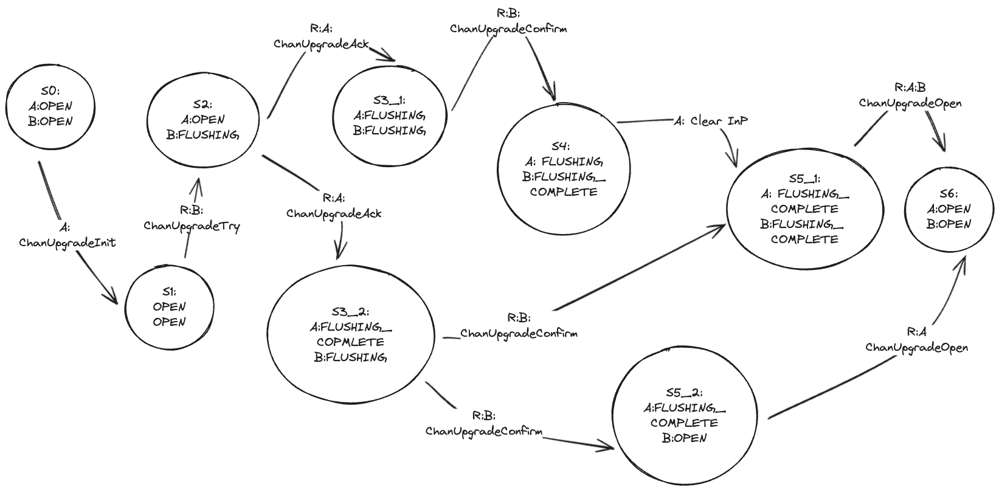

# Channel Upgradability Finite State Machines 

This document is an attempt to abstract the [channel upgradability specs](https://github.com/cosmos/ibc/blob/main/spec/core/ics-004-channel-and-packet-semantics/UPGRADES.md) into finite state machines (FSMs). 

# Channel Upgradability Protocol 
According to the [specs](https://github.com/cosmos/ibc/blob/main/spec/core/ics-004-channel-and-packet-semantics/UPGRADES.md#upgrade-handshake), we can model the channel upgradability protocol with 2 main flow namely, `UpgradeOk` and `UpgradeNotOk`. `UpgradeOk` can be expanded in 2 subflows namely `UpgradeOkCrossingHello` and `UpgradeOkNotCrossingHello`. `UpgradeNotOk` can be further expanded in 3 subflows namely `UpgradeCanceled`,`UpgradeExpired`, `UpgradeStaled`.  

- `UpgradeOk`
    - `UpgradeOkNotCrossingHello`
    - `UpgradeOkCrossingHello`
- `UpgradeNotOk`
    - `UpgradeCanceled`
    - `UpgradeExpired` 
    - `UpgradeStaled`

We now procede with the abstraction process of every flow identified. 

## UpgradeOkNotCrossingHello
In this section we describe the happy path of the channel upgradability protocol, the `UpgradeOkNotCrossingHello`.   

### FSM High Level Representation

[UpgradeOkNotCrossingHello High Level Representation](https://excalidraw.com/#json=dU82X90B_i7qlEAdFY00R,T_dyyFxOX32glPaWvch-cg)

{width=100%}

## Formalization of the specs - WIP 

The content of this section may be completely modified. I'm trying to understand how to better defines all the conditions and invariants needed for every state transition. 

### Admitted Flow
Here we list all the possible flows. 

1. `S0 -> S1 -> S2 -> S3_1 -> S4 -> S5_1 ->S6`  
2. `S0 -> S1 -> S2 -> S3_2 -> S5_1 ->S6`
3. `S0 -> S1 -> S2 -> S3_2 -> S5_2 ->S6`

### States Description

**State Table**

| StateID| Description                                                  |
|--------|--------------------------------------------------------------|
| S0    | A:OPEN; B:OPEN :: The channel is ready to be upgraded        |
| S1    | A:OPEN; B:OPEN :: Chain A has started the process            |
| S2    | A:OPEN; B:FLUSHING            |
| S3_1  | A:FLUSHING; B:FLUSHING        |
| S3_2  | A:FLUSHING_COMPLETE; B:FLUSHING |
| S4    | A:FLUSHING; B:FLUSHING_COMPLETE |
| S5_1  | A:FLUSHING_COMPLETE; B:FLUSHING_COMPLETE                  |
| S5_2  | A:FLUSHING_COMPLETE; B:OPEN                  |
| S6    | A:OPEN; B:OPEN                  |

**F:Admitted State Transition**:
- S0->S1 
- S1->S2
- S2->S3_1 
- S2->S3_2
- S3_1->S4
- S3_2->S5_1
- S3_2->S5_2
- S5_1->S6
- S5_2->S6

**Storage** 

In the provable store we have 7 paths for each channel end that we need to consider for this protocol: 
- ConnectionPath:
    - ConnectionPath on A: Pr.ConnA
    - ConnectionPath on B: Pr.ConnB
- ChannelPath:
    - ChannelPath on A: Pr.ChanA
    - ChannelPath on B: Pr.ChanB
- ChannelUpgradePath:
    - ChannelUpgradePath on A: Pr.UpgA
    - ChannelUpgradePath on B: Pr.UpgB
- CounterPartyLastPacketSequencePath:
    - CounterPartyLastPacketSequencePath on A: Pr.LastSeqA
    - CounterPartyLastPacketSequencePath on B: Pr.LastSeqB
- NextSequenceSendPath:
    - NextSequenceSendPath on A: Pr.NextSeqSendA
    - NextSequenceSendPath on B: Pr.NextSeqSendB
- CounterPartyUpgradeTimeoutPath:
    - CounterPartyUpgradeTimeoutPath on A: Pr.TimeoutA
    - CounterPartyUpgradeTimeoutPath on B: Pr.TimeoutB
- UpgradeErrorPath:
    - UpgradeErrorPath on A : Pr.UpgErrA
    - UpgradeErrorPath on B : Pr.UpgErrB

The private store is meant for an end (e.g. ChainA or ChainB) to store transient data (e.g data that are necessary to take decision but that don't get stored in chains). We will call:
- PrivateStore:
    - PrivateStore on A: PrivA
    - PrivateStore on B: PrivA


Note that for the not crossing hello on S2 the ChanUpgradeTry the getUpgrade(UpgB) Must return null and no error should be stored. 

| State Transition | Function               | Pr.A                      | Pr.B | PrivA                | PrivB |
|---------|------------------------|--------------------------|-----|----------------------|-------|
| S0 ->S1 |  ChanUpgradeInit       | getUpgrade(UpgA);setUpgradeVersion(UpgA)    |     |      |       |
| S0 ->S1 |  InitUpgradeHandshake  | getChan(ChanA); getConn(ConnA); setUpgradeOrdering(UpgA); setUpgradeConnHops(UpgA); setUpgradeSequence(ChanA)                         |     |    |       |
| S1 ->S2 |  ChanUpgradeTry        | getChan(ChanA)|getUpgrade(UpgB);setError(UpgErrB);getUpgrade(UpgB); setUpgradeVersion(UpgB)     |                      |       |
| S1 ->S2 |  InitUpgradeHandshake        | |getChan(ChanB); getConn(ConnB); setUpgradeOrdering(UpgB); setUpgradeConnHops(UpgB); setUpgradeSequence(ChanB)     |                      |       |
| S1 ->S2 |  IsCompatibleFields        | |getConn(ConnB)   |                      |       |
| S1 ->S2 |  StartFlushingUpgradeHandshake        | getUpgradeTimeout(TimeoutA); getNextSeqSend(NextSeqSendA) |getChan(ChanB);getUpgrade(UpgB);setUpgradeTimeout(UpgB);setLastPacSeq(LastSeqB);setChannel(ChanB)    |                      |       |
| S2 ->S3_1   |  ChanUpgradeAck        | getChan(ChanA); getConn(ConnA); getUpgrade(UpgA); setChannel(ChanA) |setUpgradeTimeout(TimeoutA);setLastPacSeq(LastSeqA);   |                      |       |
| S2 ->S3_1 |  IsCompatibleFields        |getConn(ConnA) |   |                      |       |
| S2 ->S3_1 |  StartFlushingUpgradeHandshake        | getChan(ChanA);getUpgrade(UpgA);setUpgradeTimeout(UpgA);setUpgrade(UpgA);setChannel(ChanA) | getUpgradeTimeout(TimeoutB); getNextSeqSend(NextSeqSendB);     |                      |       |
| S2 ->S3_2   |  ChanUpgradeAck        | getChan(ChanA); getConn(ConnA); getUpgrade(UpgA); setChannel(ChanA) |setLastPacSeq(LastSeqA);   |                      |       |
| S2 ->S3_2 |  IsCompatibleFields        |getConn(ConnA) |   |                      |       |
| S2 ->S3_2 |  StartFlushingUpgradeHandshake        | getChan(ChanA);getUpgrade(UpgA);setUpgradeTimeout(UpgA);setUpgrade(UpgA);setChannel(ChanA) | getUpgradeTimeout(TimeoutB); getNextSeqSend(NextSeqSendB);     |                      |       |

Questions: 
If timeout get stored the first time with StartFlushingUpgradeHandshake, isn't the getUpgradeTimeout always getting a null value and thus the transaction get aborted? 

**Actors**: 
- Chain A: A  
- Chain B: B
- Relayer : R
- Relayer for A: R:A
- Relayer for B: R:B
- Packet Handler : PH
- Packet Handler for A : PH:A
- Packet Handler for B : PH:B


### Conditions

Notes: 
- For now conditions may be duplicated. This needs other pass to be cleared out
- Need to review all conditions to ensure nothing is missing 
- Need to understand if there is a better way to express conditions 

**C:Conditions**: 
- C0 = Chan.State === ChanA.State === OPEN === ChanB.State
- C1 = Chan.ChannelID === CONSTANT 
- C2 = isAuthorizedUpgrader() === True
- C3 = ChanA.UpgradeSequence.isIncremented() === True
- C4 = UpgA.UpgradeFields.areSet() === True
- C5 = (ProposedConnection.State===OPEN) && (ProposedConnection !== null)
- C6 = isSupported(UpgA.UpgradeFields.ordering) === True
- C7 = UpgA.isStored(PSa) === True
- C8 = ChanA.UpgradeSequence.isStored(PSa) === True
- C9 = UpgB.isStored(PSb) !== True 
- C10 = ChanB.UpgradeSequence === ChanA.UpgradeSequence
- C11 = VerifyChanA.State() === True 
- C12 = VerifyChanA.Upgrade === True 
- C13 = (Chan.UpgradeTimeout != 0) || (Chan.UpgradeTimestamp != 0) 
- C13 = UpgA.lastPacketSequence.isSet() === True
- C14 = UpgA.isStored(PSa) === True 
- C15 = ChanB.State.isSet(FLUSHING) === True 
- C16 = ChanB.isStored(PSb) === True 
- C17 = (ChanB.State === FLUSHING) && (ChanA.State === OPEN) 
- C18 = VerifyChanB.State() === True 
- C19 = VerifyChanB.Upgrade === True 
- C20 = UpgB.UpgradeFields === UpgA.UpgradeFields 
- C21 = UpgB.Timeout.isExpired() !== True
- C22 = InP.exist()===True
- C23 = InP.exist()!==True 
- C24 = ChanA.State.isSet(FLUSHING) === True 
- C25 = ChanA.isStored(PSa) === True 
- C26 = ChanA.State.isSet(FLUSHING_COMPLETE) === True 
- C27 = UpgA.Timeout.isExpired() !== True
- C28 = (ChanB.State === FLUSHING) && (ChanA.State === FLUSHING)
- C29 = ChanB.State.isSet(FLUSHING_COMPLETE) === True 
- C30 = ChanB.isStored(PSb) === True 
- C31 = (ChanA.State === FLUSHING_COMPLETE) && (ChanB.State === FLUSHING)
- C32 = ChanB.State.isSet(OPEN) === True 
- C33 = (ChanA.State === FLUSHING_COMPLETE) && (ChanB.State === FLUSHING_COMPLETE)
- C34 = (ChanA.State === FLUSHING_COMPLETE) && (ChanB.State === OPEN)


|Initiator| Q | Q'   | C (Conditions)                      | Σ (Input Symbols)  | 
|---------|---|------|-------------------------------------|--------------------|
|A        | S0| S1   | C0;C1;C2;C3;C4;C5;C6;C7;C8          | ChanUpgradeInit    |
|R:B      | S1| S2   | C0;C1;C9;C10;C11;C12;C13;C14;C15;C16| ChanUpgradeTry     | 
|R:A      | S2| S3_1 | C1;C17;C18;C19;C20;C21;C22;C24;C25  | ChanUpgradeAck     |
|R:A      | S2| S3_2 | C1;C17;C18;C19;C20;C21;C23;C25;C26  | ChanUpgradeAck     |
|R:B      | S3_1|S4  | C27;C28;C11;C12;C23;C29;C30         | ChanUpgradeConfirm |
|PH:A     | S4|S5_1  | C21;C23;C26;C25                     | PH:A Message       |
|R:B      | S3_2|S5_1| C27;C31;C23;C11;C29;C30             | ChanUpgradeConfirm |
|R:B      | S3_2|S5_2| C27;C31;C23;C11;C32;C30             | ChanUpgradeConfirm |
|R:A:B    | S5_1|S6  | C21;C27;C33                         | ChanUpgradeOpen    |
|R:A      | S5_2|S6  | C21;C27;C34                         | ChanUpgradeOpen    |

DRAW FSM INCLUDING CONDITIONS 

Outdate
### Definition Description
We have a working channel `Chan`. The channel works on top of an established connection between ChainA and ChainB and has two ends. We will call `ChanA` and `ChanB` the ends of the channel of the connected chains. 

For both chains we have a provable store `PS`. We define `PSa` and `PSb` as the ChainA and ChainB provable store.  

For the upgradability protocol the [`Upgrade`](https://github.com/cosmos/ibc/blob/main/spec/core/ics-004-channel-and-packet-semantics/UPGRADES.md#upgrade) type, that represent a particular upgrade attempt on a channel hand, has been introduced. We will call `Upg` the upgrade parameters store in `Chan` and `UpgA` and `UpgB` the upgrade parameters at both `ChanA` and `ChanB` ends

We call infligh packets `InP` the packets that have been sent before an upgrade starts. `InP` needs to be cleared out for the succesfull execution of the channel upgrade protocol.  


**Definition**: 
- Chan: Channel :: Chan.State, Chan.UpgradeFields, Chan.ChannelID, Chan.UpgradeSequence. 
- Chan.State ∈ (OPEN, FLUSHING, FLUSHING_COMPLETE)
- ChanA: Cannel State on Chain A.  
- ChanB: Cannel State on Chain B.  
- Upg: Upgrade type :: Upg.UpgradeFields, Upg.UpgradeTimeout, Upg.lastPacketSent. 
- UpgA: Upgrade type on ChainA.
- UpgB: Upgrade type on ChainB.
- PS: ProvableStore.
- PSa : ProvableStore on ChainA.
- PSb : ProvableStore on ChainB. 

## Upgrade Handshake - UpgradeNotOk

### Upgrade Handshake - UpgradeCanceled

### Upgrade Handshake - UpgradeExpired

### Upgrade Handshake - UpgradeStaled


# Personal Notes 

<details>
  <summary>Click to expand!</summary>

The content below is not to be considered.


## Finite State Machine Modeling 

We consider a deterministic finite state machine as a 5-tuple (Q; C; Σ; δ; F) consisting of: 
- a finite set of States Q
- a finite set of Invariant Conditions C
- a finite set of Accepted Inputs Σ
- a finite set of Accepted States Transition F
- a finite set of Transition Functions δ

Where 

**Q**: 
| State  | Liveness Time | Description     |
|-------|---------------|-----------------|
| S0    |        t0     | The channel is ready to be upgraded |
| S1    |        t1     | Chain A has started the process  |
| S2    |        t1     | Chain B Goes from OPEN to FLUSHING |
| S3_1  |        t1     | Chain A Goes from OPEN to FLUSHING  |
| S3_2  |        t1     | Chain A Goes from OPEN to FLUSHING COMPLETE |
| S4    |        t1     | Chain A and Chain B are in FLUSHING COMPLETE |
| S5    |        t2     | Channel Updated |

**Σ**:
- ChanlUpgradeInit --> isAuthorizedUpgrader; initUpgradeHandshake :: Modify Upg.UpgradeFields 
- ChanlUpgradeTry
- ChanlUpgradeAck
- ChanlUpgradeConfirm
- ChanlUpgradeOpen

- initUpgradeHandshake
- isCompatibleUpgradeFields
- startFlushUpgradeHandshake
- openUpgradeHandshake
- pendingInflightPackets
- isAuthorizedUpgrader

**F**:
- S0->S1 
- S1->S2
- S1->S1
- S2->S3_1 
- S2->S3_2
- S3_1->S4
- S3_2->S4
- S4->S5

**C**: 
- C0 = Chan.State === ChanA.t0.State === OPEN === ChanB.t0.State
- C1 = ChanA.t0.ChannelID === ChanA.t1.ChannelID === ChanA.t2.ChannelID === ChanB.t0.ChannelID === ChanB.t1.ChannelID === ChanB.t2.ChannelID
- C2 = Chan.t2.UpgradeFields === (UpgA.t2.UpgradeFields === UpgB.t2.UpgradeFields) ||  Chan.t0.UpgradeFields
- C3 = InP.processed(Chan.t0.UpgradeFields)
- C4 = UpgA.t2.UpgradeTimeout.notExpired === UpgB.t2.UpgradeTimeout.notExpired
- C5 = (Upg.UpgradeTimeout.timeoutHeight || Upg.UpgradeTimeout.timeoutTimestamp) != 0
- C6 = UpgA.t1.isStored(PSa) 
- C7 = isAuthorizedUpgrader === True 
- C8 = Chan.t1.UpgradeSequence === Chan.t0.UpgradeSequence+1 
- C9 = Chan.t1.UpgradeFields.UpgradeVersion != Null
- C10 = Chan.t1.UpgradeFields.ProposedConnection != Null && Chan.t1.UpgradeFields.ProposedConnection === OPEN 
- C11 = initUpgradeHandshake has been executed. 
- C12 = Upg.isNotSet 
- C13 = Upg.isSet 
- C14 = Upg.Ordering.isSupported
- C15 = Chan.isStored(PS)

**δ**: 
We define δ : C * Σ * Q = Q'  


```typescript
// initUpgradeHandshake will verify that the channel is in the
// correct precondition to call the initUpgradeHandshake protocol.
// it will verify the new upgrade field parameters, and make the
// relevant state changes for initializing a new upgrade:
// - store channel upgrade
// - incrementing upgrade sequence
function initUpgradeHandshake(
  portIdentifier: Identifier,
  channelIdentifier: Identifier,
  proposedUpgradeFields: UpgradeFields,
): uint64 {
  // current channel must be OPEN
  // If channel already has an upgrade but isn't in FLUSHING,
  // then this will override the previous upgrade attempt
  channel = provableStore.get(channelPath(portIdentifier, channelIdentifier))
  abortTransactionUnless(channel.state == OPEN)

  // new channel version must be nonempty
  abortTransactionUnless(proposedUpgradeFields.Version !== "")

  // proposedConnection must exist and be in OPEN state for 
  // channel upgrade to be accepted
  proposedConnection = provableStore.get(connectionPath(proposedUpgradeFields.connectionHops[0])
  abortTransactionUnless(proposedConnection !== null && proposedConnection.state === OPEN)

  // new order must be supported by the new connection
  abortTransactionUnless(isSupported(proposedConnection, proposedUpgradeFields.ordering))

  // lastPacketSent and timeout will be filled when we move to FLUSHING
  upgrade = Upgrade{
    fields: proposedUpgradeFields,
  }

  // store upgrade in provable store for counterparty proof verification
  provableStore.set(channelUpgradePath(portIdentifier, channelIdentifier), upgrade)

  channel.upgradeSequence = channel.upgradeSequence + 1
  provableStore.set(channelPath(portIdentifier, channelIdentifier), channel)
  return channel.upgradeSequence
}
```
```typescript
function chanUpgradeInit(
  portIdentifier: Identifier,
  channelIdentifier: Identifier,
  proposedUpgradeFields: UpgradeFields,
  msgSender: string,
) {
  // chanUpgradeInit may only be called by addresses authorized by executing chain
  abortTransactionUnless(isAuthorizedUpgrader(msgSender))

  upgradeSequence = initUpgradeHandshake(portIdentifier, channelIdentifier, proposedUpgradeFields)

  // call modules onChanUpgradeInit callback
  module = lookupModule(portIdentifier)
  version, err = module.onChanUpgradeInit(
    portIdentifier,
    channelIdentifier,
    upgradeSequence,
    proposedUpgradeFields.ordering,
    proposedUpgradeFields.connectionHops,
    proposedUpgradeFields.version
  )
  // abort transaction if callback returned error
  abortTransactionUnless(err === nil)

  // replace channel upgrade version with the version returned by application
  // in case it was modified
  upgrade = provableStore.get(channelUpgradePath(portIdentifier, channelIdentifier))
  upgrade.fields.version = version
  provableStore.set(channelUpgradePath(portIdentifier, channelIdentifier), upgrade)
}
```

For every of the defined structure we will have `UpgA.t0`,`UpgB.t0` the upgrade parameters at t0 (e.g. starting of the upgrade) and `UpgA.t1`,`UpgB.t1` the upgrade parameters at t1 (e.g proposed upgrade) and `UpgA.t2`,`UpgB.t2` the upgrade parameters at t2 (e.g finalized upgrade). This is valid for Chan too. 


**UpgradeOkNotCrossingHello Table** : describes what is used within the scope of the UpgradeOk flow. 

| Category             | Item                         | Used in UpgradeOk |
|----------------------|------------------------------|:-----------------:|
| **Datagrams**        | *ChanUpgradeInit*            |         1         |
|                      | *ChanUpgradeTry*             |         1         |
|                      | *ChanUpgradeAck*             |         1         |
|                      | *ChanUpgradeConfirm*         |         1         |
|                      | *ChanUpgradeOpen*            |         1         |
|                      | *ChanUpgradeTimeout*         |                   |
|                      | *ChanUpgradeCancel*          |                   |
| **Utility Functions**| `initUpgradeHandshake`       |         1         |
|                      | `isCompatibleUpgradeFields`  |         1         |
|                      | `startFlushUpgradeHandshake` |         1         |
|                      | `openUpgradeHandshake`       |         1         |
|                      | `restoreChannel`             |                   |
|                      | `pendingInflightPackets`     |         1         |
|                      | `isAuthorizedUpgrader`       |         1         |
|                      | `getUpgradeTimeout`          |                   |
| **Functions**        | ChanlUpgradeInit             |         1         |
|                      | ChanlUpgradeTry              |         1         |
|                      | ChanlUpgradeAck              |         1         |
|                      | ChanlUpgradeConfirm          |         1         |
|                      | ChanlUpgradeOpen             |         1         |
|                      | CancelChannelUpgrade         |                   |
|                      | TimeoutChannelUpgrade        |                   |


**Final States Description**
| State | Description | PostConditions| 
|-------|-------------|--|
|   5_1 | Succesful| Ca && Cb are on CUPn |
|   5_2 | Unsuccesful| Ca && Cb are on CUPo | 


**Condition Table**
| Condition ID | Condition |  
|-------|-------------|
|C0|(Ca && Cb on CUPo || Ca && Cb on CUPn)|
|C1|CI before == CI after|
|C2|Ca/Cb has stored CUPn in PSa/PSb|
|C3|Ca/Cb has stored Cx/Cy change in PSa/PSb|
|C4|InP|
|C5|!InP|
|C6|Ca/Cb has stored Timeout in PSa/PSb|
|C7|Timeout Expired
|C8|Timeout Not Expired 
|C9|Ca/Cb has stored ErrorMessage in PSa/PSb|


The Upgrade Handshake protocol starts when either ChainA or ChainB send trought R a `ChannelUpgradeInit` datagram. We will assume that ChainA is the starting chain and that C0 Holds. Thus we can model the start of the protocol as follow:
- PCO holds. 
- Ca send `ChannelUpgradeInit` datagram to Cb using relayer R. 
 

TBD
## Abstraction Process Description

The abstraction process follows the next described steps: 
1. Identify the protocol main flows and subflows defined in the specs. 
2. For each flow or subflow 
    1. Idenfity involved actors.
    2. Idenfify needed definitions.  
    3. Identify set of inputs.  
    4. Identify the state transitions functions. 
    5. Identify invariant conditions. 
    6. Identify states with preconditions and postconditions.  
    7. Idenfify possible state transitions pairs.  
    8. Draw FSM.  


- CUPo: Channel Old Upgrade Parameters 
- CUPn: Channel New Upgrade Parameters 
- CI: Channel Identifiers
- PSa: Provable Store Chain A
- PSb: Provable Store Chain B
- InP: Inflight Packets 
- TO: Timeout
- TOE : Timeout Experied
- !TOE : Timeout Not Experied


</details>
