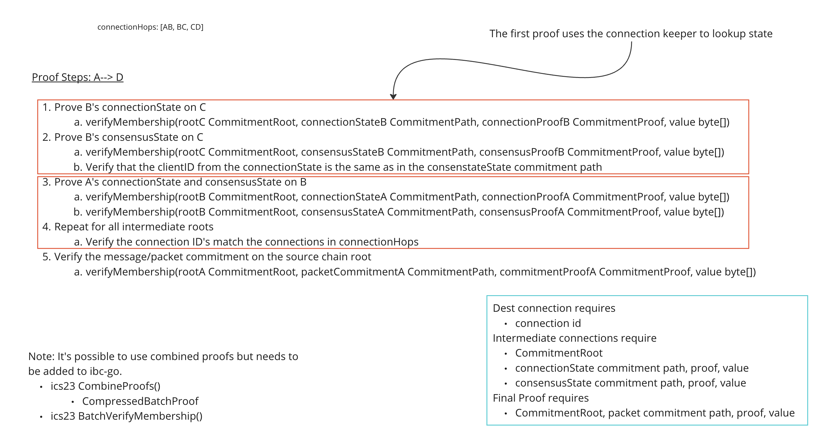

## Synopsis

This document describes a standard for multi-hop IBC channels. Multi-hop channels specifies a way to route messages across a path of IBC enabled blockchains utilizing multiple pre-existing IBC connections.

### Motivation

The current IBC protocol defines messaging in a point-to-point paradigm which allows message passing between two directly connected IBC chains, but as more IBC enabled chains come into existence there becomes a need to relay IBC packets across chains because IBC connections may not exist between the two chains wishing to exchange messages. IBC connections may not exist for a variety of reasons which could include economic inviability since connections require client state to be continuously exchanged between connection ends which carries a cost.

### Definitions

Associated definitions are as defined in referenced prior standards (where the functions are defined), where appropriate.

`Connection` is as defined in [ICS 3](https://github.com/cosmos/ibc/tree/main/spec/core/ics-003-connection-semantics).

`Channel` is as defined in [ICS 4](https://github.com/cosmos/ibc/tree/main/spec/core/ics-004-channel-and-packet-semantics).

`Channel Path` is defined as the path of connection IDs along which a channel is defined.

`Connection Hop` is defined as the connection ID of the connection between two chains along a channel path.

### Desired Properties

- IBC channel handshake and message packets should be able to be utilize pre-existing connections to form a logical proof chain to relay messages between unconnected chains.
- Relaying for a multi connection IBC channel should NOT require additional writes to intermediate hops.
- Minimal additional required state and changes to core and app IBC specs.
- Retain desired properties of connection, channel and packet definitions.
- Retain backwards compatibility for messaging over a single connection hop.

## Technical Specification

The bulk of the spec will be around proof generation and verification. Channel handshake and packet message types will remain the same. Round trip messaging semantics and flow will remain the same as well. There is additional work on the verifier side on the destination chain as well as the relayers who need to query for proofs. 

Messages passed over multiple hops require proof of the connection path from source chain to destination chain as well as the packet commitment on the source chain. The connection path is proven by verifying the connection state and consensus state of each connection segment in the path to the destination chain. On a high level, this can be thought of as a connection path proof chain where the destination chain can prove the each segment of the connection path by proving the state of the prior connection within the next chains state root.

### Channel Handshake and Packet Messages

For both channel handshake and packet messages, additional connection hops are defined in the pre-existing `connectionHops` field. The connection IDs along the channel path must be pre-existing to guarantee delivery to the correct recipient. See `Path Forgery Protection` for more info.

The spec for channel handshakes and packets remains the same. See [ICS 4](https://github.com/cosmos/ibc/tree/main/spec/core/ics-004-channel-and-packet-semantics).

### Multihop Relaying

Relayers would deliver channel handshake and IBC packets as they currently do except that they are required to provide more proof of the channel path. Relayers would scan packet events for the connectionHops field and determine if the packet is multi-hop by checking the number of hops in the field. If the number of hops is greater than one then the packet is a multi-hop packet and will need extra proof data.

For each multi-hop channel (detailed proof logic below):

- Scan source chain for IBC messages to relay.
- Read the connectionHops field in from the scanned message to determine the channel path.
- Query for proof of connection and consensus state for each intermediate connection in the channel path to the destination connection.
- Query proof of packet commitment or handshake message commitment on source chain.
- Submit proofs and data to RPC endpoint on destination chain.

### Proof Generation & Verification

Graphical depiction of proof generation.


Proof steps.



Pseudocode proof generation for a channel between chains `A -> B -> C`.

```typescript
function queryBatchProof(client: Client, keys: []string) {
    stateProofs = []
    for key in keys {
        resp = client.QueryABCI(abci.RequestQuery{
            Path:   "store/ibc/key",
            Height: height,
            Data:   key,
            Prove:  true,
        })
        proof = ConvertProofs(resp.ProofOps)
        stateProofs = append(stateProofs, proof.Proofs[0])
    }
    return CombineProofs(stateProofs)
}

// Query B & A for connectionState and consensusState kvs 
keys = [
    "ibc/connections/{id}",
    "ibc/consensusStates/{height}",
]
batchStateProofB = queryBatchProof(clientB, keys)
batchStateProofA = queryBatchProof(clientA, keys)

// Query A for channel handshake and/or packet messages
keys = [
    "ibc/channelEnds/ports/{portID}/channels/{channelID}",
    "ibc/commitments/ports/{portID}/channels/{channelID}/packets/{sequence}"
]
batchMessageProofA = queryBatchProof(clientA, keys)
```

Pseudocode proof verification of a channel between chains `A -> B -> C` .

```typescript
function verifyMembership(
    root: CommitmentRoot, 
    commitments: map[CommmitmentPath]bytes,
    batchProof: CommitmentProof) {
    // verifies the commitments in the commitment root using a batch proof
}

// Prove B's connectionState and consensusState on C
commitmentsB = map[CommitmentPath]bytes{
    connectionB: bytes,
    consensusStateB: bytes,
}
verifyMembership(
    rootC: CommitmentRoot, 
    commitmentsB: map[CommitmentPath]bytes, 
    batchProofB: CommitmentProof)

// Verify that the clientID from the connectionState is the same as in the consenstateState commitment path
// Prove A's connectionState and consensusState on B
commitmentsA = map[CommitmentPath]bytes{
    connectionA: bytes,
    consensusStateA: bytes,
}
verifyMembership(
    rootB: CommitmentRoot, 
    commitmentsA: map[CommitmentPath]bytes, 
    batchProofA: CommitmentProof)

// Repeat for all intermediate roots

// Verify the proven connection ID's match the connections in connectionHops
verifyConnectionIDs(connectionHops: []string, provenConnectionIDs: []string)

// Verify the message/packet commitment on the source chain root
verifyMembership(rootA: CommitmentRoot, packetCommitmentA: CommitmentPath, commitmentProofA: CommitmentProof, value: bytes)
```

### Path Forgery Protection

From the view of a single network, a list of connection IDs describes an unforgeable path of pre-existing connections to a destination chain. This is ensured by atomically incrementing connection IDs. 

We must verify a proof that the connection ID of each hop matches the proven connection state provided to the verifier. Additionally we must link the connection state to the client consensus state for that hop as well. We are essentially proving out the connection path of the channel.

## Backwards Compatibility

The existing IBC message sending should not be affected. Minor changes to the verification logic would be required to identify a multi-hop packet and apply the proper proof verification logic. Multi-hop packets should be easily identified by the existence of more than one connection ID in the connectionHops field.

## Forwards Compatibility

If a decentralized chain name service is developed for the data currently in the chain registry on github, it may be possible a calling app to specify only a unique chain name rather than an explicit set of connectionHops. The chain name service would maintain a mapping of chain names to channel paths. The name service could push routing table updates to subscribed chains. This should require fewer writes since routing table updates should be fewer than packets.

## Example Implementation

Coming soon.

## Other Implementations

Coming soon.

## History

Nov 11, 2022 - Initial draft

## Copyright

All content herein is licensed under [Apache 2.0](https://www.apache.org/licenses/LICENSE-2.0).
