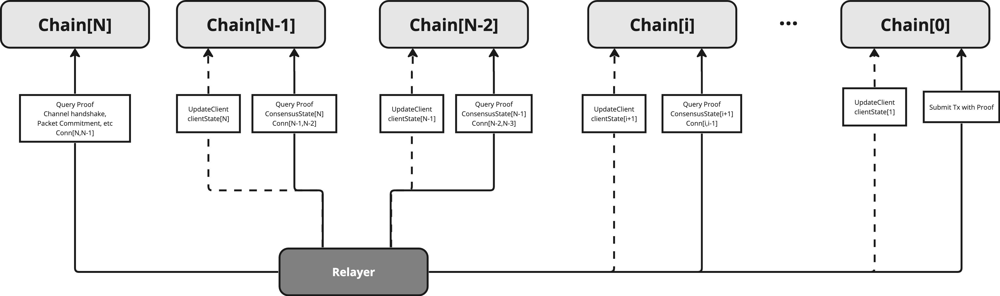
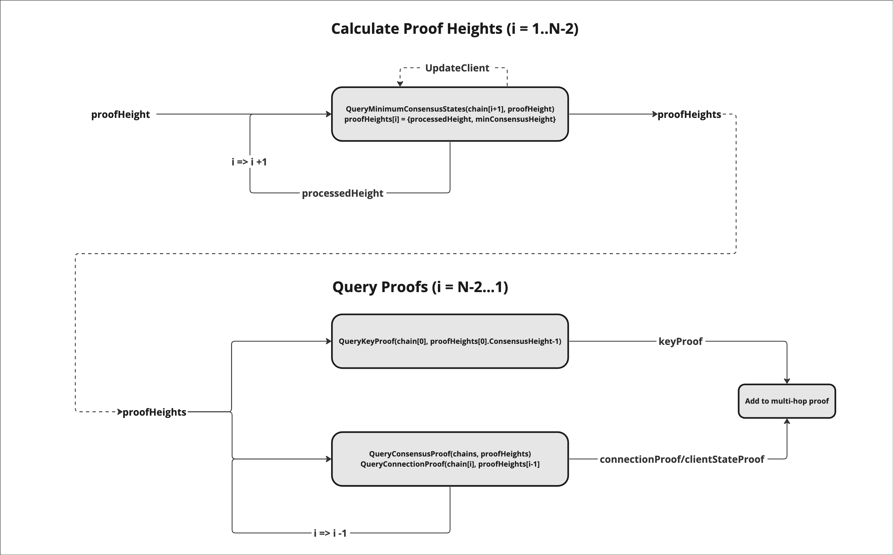

## Synopsis

This document describes a standard for multi-hop IBC channels. Multi-hop channels specifies a way to route messages across a path of IBC enabled blockchains utilizing multiple pre-existing IBC connections.

### Motivation

The current IBC protocol defines messaging in a point-to-point paradigm which allows message passing between two directly connected IBC chains, but as more IBC enabled chains come into existence there becomes a need to relay IBC packets across chains because IBC connections may not exist between the two chains wishing to exchange messages. IBC connections may not exist for a variety of reasons which could include economic inviability since connections require client state to be continuously exchanged between connection ends which carries a cost.

### Definitions

Associated definitions are as defined in referenced prior standards (where the functions are defined), where appropriate.

`Connection` is as defined in [ICS 3](https://github.com/cosmos/ibc/tree/main/spec/core/ics-003-connection-semantics).

`Channel` is as defined in [ICS 4](https://github.com/cosmos/ibc/tree/main/spec/core/ics-004-channel-and-packet-semantics).

`Channel Path` is defined as the path of connection IDs along which a channel is defined.

`Connection Hop` is defined as the connection ID of the connection between two chains along a channel path.

### Desired Properties

- IBC channel handshake and message packets should be able to be utilize pre-existing connections to form a logical proof chain to relay messages between unconnected chains.
- Relaying for a multi connection IBC channel should NOT require additional writes to intermediate hops.
- Minimal additional required state and changes to core and app IBC specs.
- Retain desired properties of connection, channel and packet definitions.
- Retain backwards compatibility for messaging over a single connection hop.

## Technical Specification

The bulk of the spec will be around proof generation and verification. IBC connections remain unchanged. Additionally, channel handshake and packet message types as well as general round trip messaging semantics and flow will remain the same. There is additional work on the verifier side on the receiving chain as well as the relayers who need to query for proofs.

Messages passed over multiple hops require proof of the connection path from source chain to receiving chain as well as the packet commitment on the source chain. The connection path is proven by verifying the connection state and consensus state of each connection in the path to the receiving chain. On a high level, this can be thought of as a channel path proof chain where the receiving chain can prove a key/value on the source chain by iteratively proving each connection and consensus state in the channel path starting with the consensus state associated with the final client on the receiving chain. Each subsequent consensus state and connection is proven until the source chain's consensus state is proven which can then be used to prove the desired key/value on the source chain.

### Channel Handshake and Packet Messages

For both channel handshake and packet messages, additional connection hops are defined in the pre-existing `connectionHops` field. The connection IDs along the channel path must be pre-existing and in the `OPEN` state to guarantee delivery to the correct recipient. See `Path Forgery Protection` for more info.

The spec for channel handshakes and packets remains the same. See [ICS 4](https://github.com/cosmos/ibc/tree/main/spec/core/ics-004-channel-and-packet-semantics).

In terms of connection topology, a user would be able to determine a viable channel path from sender -> receiver using information from the [chain registry](https://github.com/cosmos/chain-registry). They can also independently verify this information via network queries.

### Multihop Relaying

Relayers would deliver channel handshake and IBC packets as they currently do except that they are required to provide proof of the channel path. Relayers would scan packet events for the connectionHops field and determine if the packet is multi-hop by checking the number of hops in the field. If the number of hops is greater than one then the packet is a multi-hop packet and will need extra proof data.

For each multi-hop channel (detailed proof logic below):

1. Scan source chain for IBC messages to relay.
2. Read the connectionHops field in from the scanned message to determine the channel path.
3. Lookup connection endpoints via chain registry configuration and update the clients associated with the connections in the channel path to reflect the latest consensus state on the sending chain including the key/value to be proven.
4. Query for proof of connection, and consensus state for each intermediate connection in the channel path.
5. Query proof of packet commitment or handshake message commitment on source chain.
6. Submit proofs and data to RPC endpoint on receiving chain.

Relayers are connection topology aware with configurations sourced from the [chain registry](https://github.com/cosmos/chain-registry).

### Proof Generation & Verification

Graphical depiction of proof generation.


Relayer multi-hop proof queries.



Multi-hop proof query algorithm.


Multi-hop proof verfication logic.


Pseudocode proof generation for a channel between `N` chains `C[0] --> C[i] --> C[N]`

```go

// Proof generation helper functions
//
// Note: 'Chain' is assumed to contain information about the next chain in the channel path
//
// GetClientID return the clientID for the next chain in the channel path
func (Chain) GetClientID() (clientID string)
// GetConnectionID returns the connectionID corresponding to the next chain in the channel path
func (Chain) GetConnectionID() (connectionID string)
// GetClientStateHeight returns the client state height for the clientState corresponding to
// the next chain in the channel path
func (Chain) GetClientStateHeight() exported.Height
// QueryStateAtHeight returns the value and proof of a key at the given height along with the height at
// which the proof will succeed.
func (Chain) QueryStateAtHeight(key string, height int64) (value []byte, proof []byte, height exported.Height)
// UpdateClient updates the client state corresponding to the next chain in the channel path
func (*Chain) UpdateClient()

// ProofHeights contains multi-hop proof query height data.
type ProofHeights struct {
    proofHeight     exported.Height // query the proof at this height
    consensusHeight exported.Height // the proof is for the consensusState at this height
}

// ProofData is a generic proof struct.
type ProofData struct {
    Key   *MerklePath
    Value []]byte
    Proof []byte
}

// MultihopProof defines set of proofs to verify a multihop message.
// Consensus and Connection proofs are ordered from receiving to sending chain but do not including
// the chain[1] consensus/connection state on chain[0] since it is already known on the receiving chain.
type MultihopProof struct {
    KeyProof *ProofData            // the key/value proof on the on chain[KeyProofIndex] in the channel path
    ConsensusProofs []*ProofData   // array of consensus proofs starting with proof of consensusState of chain[1] on chain[2]
    ConnectionProofs []*ProofData  // array of connection proofs starting with proof of conn[1,2] on chain[2]
}

// QueryMultihopProof generates proof of a key/value at the proofHeight on indexed chain (chain0).
// Chains are provided in order from the sending (source) chain to the receiving (verifying) chain.
func QueryMultihopProof(
    chains []*Chain,
    key string,
    keyHeight exported.Height,
    includeKeyValue bool,
) (
    multihopProof MultihopProof,
    multihopProofHeight exported.Height,
) {

    abortTransactionUnless(len(chains) > 1)

    // calculate proof heights along channel path
    proofHeights := make([]*ProofHeights, len(chains)-1)
    abortTransactionUnless(calcProofPath(chains, 1, keyHeight, proofHeights))

    // the consensus state height of the proving chain's counterparty
    // this is where multi-hop proof verification begins
    multihopProofHeight = abortTransactionUnless(proofHeights[len(proofHeights)-1].consensusHeight.Decrement())

    // the key/value proof height is the height of the consensusState on the source chain
    keyHeight = abortTransactionUnless(proofHeights[0].consensusHeight.Decrement())

    var value []byte
    bytes, keyProof := chains[0].QueryStateAtHeight(key, keyHeight)

    if includeKeyValue {
        value = bytes
    }

    // assign the key/value proof
    multihopProof.KeyProof = &ProofData{
        Key:   nil,    // key to prove constructed during verification
        Value: value,  // proven values are constructed during verification (except for frozen client proofs)
        Proof: keyProof,
    }

    // query proofs of consensus/connection states on intermediate chains
    multihopProof.ConsensusProofs = make([]*ProofData, len(chains)-2)
    multihopProof.ConnectionProofs = make([]*ProofData, len(chains)-2)
    multihopProof.ConsensusProofs, multihopProof.ConnectionProofs = abortTransactionUnless(
        queryIntermediateProofs(
            chains,
            len(chains)-2,
            proofHeights,
            multihopProof.ConsensusProofs,
            multihopProof.ConnectionProofs)
        )

    return
}

// CalcProofPath calculates the optimal proof heights to generate a multi-hop proof
// along the channel path and performs client updates as needed.
func calcProofPath(
    chains []*Chain,
    chainIdx int,
    consensusHeight exported.Height,
    proofHeights []*ProofHeights,
) {
    var height ProofHeights
    chain := chains[chainIdx]

    // find minimum consensus height provable on the next chain
    // i.e. proofHeight is the minimum height at which the consensusState with
    // height=consensusHeight can be proved on the chain (aka processedHeight)
    height.proofHeight, height.consensusHeight = abortTransactionUnless(queryMinimumConsensusHeight(chain, consensusHeight, nil))

    // if no suitable consensusHeight then update client and use latest chain height/client height
    //
    // TODO: It could be more efficient to update the client with the missing block height
    // rather than the latest block height since it would be less likely to need client updates
    // on subsequent chains.
    if height.proofHeight == nil {
        abortTransactionUnless(chain.UpdateClient())
        height.proofHeight = chain.GetLatestHeight()
        height.consensusHeight = chain.GetClientStateHeight(chains[chainIdx+1])
    }

    // stop on the next to last chain
    if chainIdx == len(chains)-2 {
        proofHeights[chainIdx-1] = &height
        return
    }

    // use the proofHeight as the next consensus height
    abortTransactionUnless(calcProofPath(chains, chainIdx+1, height.proofHeight, proofHeights))

    proofHeights[chainIdx-1] = &height
    return
}

// QueryIntermediateProofs recursively queries intermediate chains in a multi-hop channel path for consensus state
// and connection proofs. It stops at the second to last path since the consensus and connection state on the
// final hop is already known on the destination.
func queryIntermediateProofs(
    chains []*Chain,
    proofIdx int,
    proofHeights []*ProofHeights,
    consensusProofs []*ProofData,
    connectionProofs []*ProofData,
) {
     // no need to query proofs on final chain since the clientState is already known
    if proofIdx < 0 {
        return
    }

    chain := chains[proofIdx]
    ph := proofHeights[proofIdx]

    // query proof of the consensusState
    proof := abortTransactionUnless(queryConsensusStateProof(chain, ph.proofHeight, ph.consensusHeight))
    consensusProofs[len(p.Paths)-proofIdx-2] = proof

    // query proof of the connectionEnd
    proof = abortTransactionUnless(queryConnectionProof(chain, ph.proofHeight))
    connectionProofs[len(p.Paths)-proofIdx-2] = proof

    // continue querying proofs on the next chain in the path
    QueryIntermediateProofs(chains, proofIdx-1, proofHeights, consensusProofs, connectionProofs)
}

// Query a proof for the counterparty consensus state at the specified height on the given chain.
func queryConsensusStateProof(
    chain Chain,
    proofHeight exported.Height,
    consensusHeight exported.Height,
) *ProofData {

    key := host.FullConsensusStateKey(chain.GetClientID(), consensusHeight)
    consensusStateBytes, consensusStateProof := chain.QueryStateAtHeight(key, int64(proofHeight.GetRevisionHeight()))
    merklePath := abortTransactionUnless(chain.GetMerklePath(string(key)))

    return &ProofData{
        Key:   merklePath,
        Value: consensusStateBytes,
        Proof: consensusStateProof,
    }
}

// Query a proof for the connEnd on the given chain at the specified height.
func queryConnectionProof(
    chain Chain,
    proofHeight exported.Height,
) *ProofData {

    key := host.ConnectionKey(chain.GetConnectionID())
    connectionEndBytes, connectionEndProof := chain.QueryStateAtHeight(key, int64(proofHeight.GetRevisionHeight()))
    merklePath := abortTransactionUnless(chain.GetMerklePath(string(key)))

    return &ProofData{
        Key: merklePath,
        Value: connectionEndBytes,
        Proof: connectionEndProof,
    }
}

// queryMinimumConsensusHeight returns the minimum height within the provided
// range at which a valid consensusState exists (processedHeight) and the
// corresponding consensus state height (consensusHeight).
func queryMinimumConsensusHeight(
    chain Chain,
    minConsensusHeight exported.Height,
    limit uint64,
) (
    processedHeight exported.Height,
    consensusHeight exported.Height
) {

    // find the minimum height consensus state
    consensusHeight := minConsensusHeight
    for i := uint64(0); i < limit; i++ {
        key := host.FullClientKey(clientID, ibctm.ProcessedHeightKey(consensusHeight))
        consensusStateHeightBytes, _ := abortTransactionUnless(chain.QueryStateAtHeight(key, chain.LastHeader.Header.Height, false))

        if consensusStateHeightBytes != nil {
            proofHeight := abortTransactionUnless(clienttypes.ParseHeight(string(consensusStateHeightBytes)))
            return proofHeight, consensusHeight
        }
        consensusHeight = consensusHeight.Increment()
    }

    return nil, nil
}
```

### Multi-hop Proof Verification Steps

The following outlines the general proof verification steps specific to a multi-hop IBC message.

1. Unpack the multihop proof bytes into consensus states, connection states and channel/commitment proof data.
2. Check the counterparty client on the receiving end is active and the client height is greater than or equal to the proof height.
3. Iterate through the connections states to determine the maximum `delayPeriod` for the channel path and verify that the counterparty consensus state on the receiving chain satisfies the delay requirement.
4. Iterate through connection state proofs and verify each connectionEnd is in the OPEN state and check that the connection ids match the channel connectionHops.
5. Verify the intermediate state proofs. Starting with known `ConsensusState[0]` at the given `proofHeight` on `Chain[1]` prove the prior chain's consensus and connection state.
6. Verify that the client id in each consensus state proof key matches the client id in the ConnectionEnd in the previous connection state proof.
7. Repeat step 5, proving `ConsensusState[i]`, and `Conn[i,i-1]` where `i` is the proof index starting with the consensus state on `Chain[2]`. `ConsensusState[1]` is already known on `Chain[0]`. Note that chains are indexed from executing (verifying) chain to  and proofs are indexed in the opposite direction to match the connectionHops ordering.
   - Verify ParseClientID(ConsensusProofs[i].Key) == ConnectionEnd.ClientID
   - ConsensusProofs[i].Proof.VerifyMembership(ConsensusState.GetRoot(), ConsensusProofs[i].Key, ConsensusProofs[i].Value)
   - ConnectionProofs[i].Proof.VerifyMembership(ConsensusState.GetRoot(), ConnectionProofs[i].Key, ConnectionProofs[i].Value)
   - ConsensusState = ConsensusProofs[i].Value
   - i++
8. Finally, prove the expected channel or packet commitment in `ConsensusState[N-2]` (sending chain consensus state) on `Chain[1]`

For more details see [ICS4](https://github.com/cosmos/ibc/tree/main/spec/core/ics-004-channel-and-packet-semantics).

### Multi-hop Proof Verification Pseudo Code

Pseudocode proof generation for a channel between `N` chains `C[N] --> C[i] --> C[0]`

```go
// Parse a client or connection ID from the connection proof key and return it.
func parseID(prefixedKey *PrefixedKey) string {
    keyPath := prefixedKey.KeyPath
    abortTransactionUnless(len(keyPath) >= 2)
    parts := strings.Split(keyPath[1], "/")
    abortTransactionUnless(len(parts) >= 2)
    return parts[1]
}

func parseClientID(prefixedKey *PrefixedKey) string {
    return parseID(prefixedKey)
}

func parseConnectionID(prefixedKey *PrefixedKey) string {
    return parseID(prefixedKey)
}

// VerifyMultihopMembership verifies a multihop membership proof.
// Inputs: consensusState - The consensusState for chain[N-1], which is known on the receiving chain (chain[N]).
//         connectionHops - The expected connectionHops for the channel from the receiving chain to the sending chain.
//         proof          - The serialized multihop proof data.
//         prefix         - Merkleprefix to be combined with key to generate Merklepath for the key/value proof verification.
//         key            - The key to prove in the indexed consensus state.
//         value          - The value to prove in the indexed consensus state.
func VerifyMultihopMembership(
    consensusState exported.ConsensusState,
    connectionHops []string,
    proof MultihopProof,
    prefix exported.Prefix,
    key string,
    value []byte,
) {
    // deserialize proof bytes into multihop proofs
    proofs := abortTransactionUnless(Unmarshal(proof))
    abortTransactionUnless(len(proofs.ConsensusProofs) >= 1)
    abortTransactionUnless(len(proofs.ConnectionProofs) == len(proofs.ConsensusProofs))

    // verify connection hop ordering and connections are in OPEN state
    abortTransactionUnless(VerifyConnectionHops(proofs.ConnectionProofs, connectionHops))

    // verify intermediate consensus and connection states from receiver --> sender
    abortTransactionUnless(VerifyConsensusAndConnectionStates(consensusState, proofs.ConsensusProofs, proofs.ConnectionProofs))

    // verify a key/value proof on source chain's consensus state.
    abortTransactionUnless(VerifyKeyMembership(consensusState, proofs, prefix, key, value))
}

// VerifyMultihopNonMembership verifies a multihop non-membership proof.
// Inputs: consensusState - The consensusState for chain[1], which is known on the receiving chain (chain[0]).
//         connectionHops - The expected connectionHops for the channel from the receiving chain to the sending chain.
//         proof          - The serialized multihop proof data.
//         prefix         - Merkleprefix to be combined with key to generate Merklepath for the key/value proof verification.
//         key            - The key to prove absent in the indexed consensus state
func VerifyMultihopNonMembership(
    consensusState exported.ConsensusState,
    connectionHops []string,
    proof MultihopProof,
    prefix exported.Prefix,
    key string,
) {
    // deserialize proof bytes into multihop proofs
    proofs := abortTransactionUnless(Unmarshal(proof))
    abortTransactionUnless(len(proofs.ConsensusProofs) >= 1)
    abortTransactionUnless(len(proofs.ConnectionProofs) == len(proofs.ConsensusProofs))

    // verify connection hop ordering and connections are in OPEN state
    abortTransactionUnless(VerifyConnectionHops(proofs.ConnectionProofs, connectionHops))

    // verify intermediate consensus and connection states from receiver --> sender
    abortTransactionUnless(VerifyConsensusAndConnectionStates(consensusState, proofs.ConsensusProofs, proofs.ConnectionProofs))

    // verify a key/value proof on source chain's consensus state.
    abortTransactionUnless(VerifyKeyNonMembership(consensusState, proofs, prefix, key))
}

// VerifyConnectionHops checks that each connection in the multihop proof is OPEN and matches the connections in connectionHops.
func VerifyConnectionHops(
    connectionProofs []*ProofData,
    connectionHops []string,
) {
    abortTransactionUnless(len(connectionProofs) == len(connectionHops)-1)

    // check all connections are in OPEN state and that the connection IDs match and are in the right order
    for i, connData := range connectionProofs {
        connectionEnd := abortTransactionUnless(Unmarshal(connData.Value))

        // Verify the rest of the connectionHops (first hop already verified)
        // 1. check the connectionHop values match the proofs and are in the same order.
        connectionID := parseConnectionID(connData.Key)
        abortTransactionUnless(connectionID == connectionHops[i+1])

        // 2. check that the connectionEnd's are in the OPEN state.
        abortTransactionUnless(connectionEnd.GetState() == int32(connectiontypes.OPEN))
    }
}

// VerifyConsensusAndConnectionStates verifies the state of each intermediate consensus and connection state
// starting from the receiving chain and finally proving the sending chain consensus and connection state.
func VerifyConsensusAndConnectionStates(
    consensusState exported.ConsensusState,
    consensusProofs []*ProofData,
    connectionProofs []*ProofData,
) {
    // iterate through proofs to prove from executing chain (receiver) to counterparty chain (sender)
    var connection ConnectionEnd
    for i := 0; i < len(consensusProofs); i++ {
        consensusProof := abortTransactionUnless(Unmarshal(consensusProofs[i].Proof))
        connectionProof := abortTransactionUnless(Unmarshal(connectionProofs[i].Proof))

        // convert to tendermint consensus state
        cs := abortTransactionUnless(consensusState.(*tmclient.ConsensusState))

        // the client id in the consensusState key path should match the clientID for the next connectionEnd
        expectedClientID := parseClientIDFromKey(consensusProof.PrefixedKey.KeyPath)

        abortTransactionUnless(VerifyClientID(clientID, consensusProofs[i].Key))

        // prove the consensus state of chain[i] on chain[i-1]

        abortTransactionUnless(consensusProof.VerifyMembership(
            commitmenttypes.GetSDKSpecs(),
            cs.GetRoot(),
            *consensusProof.Key,
            consensusProof.Value,
        ))

        // prove the connection state of chain[i] on chain[i-1]
        abortTransactionUnless(connectionProof.VerifyMembership(
            commitmenttypes.GetSDKSpecs(),
            cs.GetRoot(),
            *connectionProof.Key,
            connectionProof.Value,
        ))

        // verify that client id in the consensus state path matches the clientID in the connection end
        abortTransactionUnless(Unmarshal(connectionProof.Value, &connection))
        abortTransactionUnless(connection.ClientId == expectedClientID)

        // update the consensusState to prove the next consensus/connection states
        abortTransactionUnless(UnmarshalInterface(consensusProof.Value, &consensusState))
    }
}

// VerifyKeyMembership verifies a key in the indexed chain consensus state.
func VerifyKeyMembership(
    consensusState exported.ConsensusState,
    proofs *MultihopProof,
    prefix exported.Prefix,
    key string,
    value []byte,
) {
    // create prefixed key for proof verification
    prefixedKey := abortTransactionUnless(commitmenttypes.ApplyPrefix(prefix, commitmenttypes.NewMerklePath(key)))

    // reassign consensus state for the final consensus proof if needed
    if len(proofs) > 0 {
        index := uint32(len(proofs.ConsensusProofs)) - 1
        consensusState = abortTransactionUnless(UnmarshalInterface(proofs.ConsensusProofs[index].Value))
    }

    // assign the key proof to verify on the source chain
    keyProof := abortTransactionUnless(Unmarshal(proofs.KeyProof.Proof))

    abortTransactionUnless(keyProof.VerifyMembership(
        commitmenttypes.GetSDKSpecs(),
        consensusState.GetRoot(),
        prefixedKey,
        value,
    ))

}

// VerifyKeyNonMembership verifies a key in the indexed chain consensus state.
func VerifyKeyNonMembership(
    consensusState exported.ConsensusState,
    proofs *MsgMultihopProof,
    prefix exported.Prefix,
    key string,
) {
    // create prefixed key for proof verification
    prefixedKey := abortTransactionUnless(commitmenttypes.ApplyPrefix(prefix, commitmenttypes.NewMerklePath(key)))

    // reassign consensus state for the final consensus proof if needed
     if len(proofs) > 0 {
        index := uint32(len(proofs.ConsensusProofs)) - 1
        consensusState = abortTransactionUnless(UnmarshalInterface(proofs.ConsensusProofs[index].Value))
     }

    // assign the key proof to verify on the source chain
    keyProof := abortTransactionUnless(Unmarshal(proofs.KeyProof.Proof))

    abortTransactionUnless(keyProof.VerifyNonMembership(
        commitmenttypes.GetSDKSpecs(),
        consensusState.GetRoot(),
        prefixedKey,
    ))
}
```

### Path Forgery Protection

From the view of a single network, a list of connection IDs describes an unforgeable path of pre-existing connections to a receiving chain. This is ensured by atomically incrementing connection IDs.

We must verify a proof that the connection ID of each hop matches the proven connection state provided to the verifier. Additionally we must link the connection state to the consensus state for that hop as well. We are essentially proving out the connection path of the channel.

## Backwards Compatibility

The existing IBC message sending should not be affected. Minor changes to the verification logic would be required to identify a multi-hop packet and apply the proper proof verification logic. Multi-hop packets should be easily identified by the existence of more than one connection ID in the connectionHops field.

## Forwards Compatibility

If a decentralized chain name service is developed for the data currently in the chain registry on github, it may be possible for a calling app to specify only a unique chain name rather than an explicit set of connectionHops. The chain name service would maintain a mapping of chain names to channel paths. The name service could push routing table updates to subscribed chains. This should require fewer writes since routing table updates should be fewer than packets.

## Example Implementation

Coming soon.

## Other Implementations

Coming soon.

## History

Dec 16, 2022 - Revisions to channel spec and proof verification

Nov 11, 2022 - Initial draft

## Copyright

All content herein is licensed under [Apache 2.0](https://www.apache.org/licenses/LICENSE-2.0).
