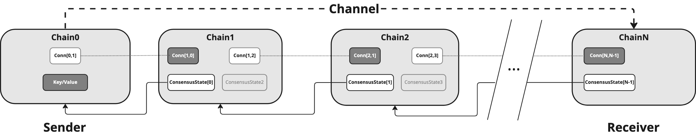
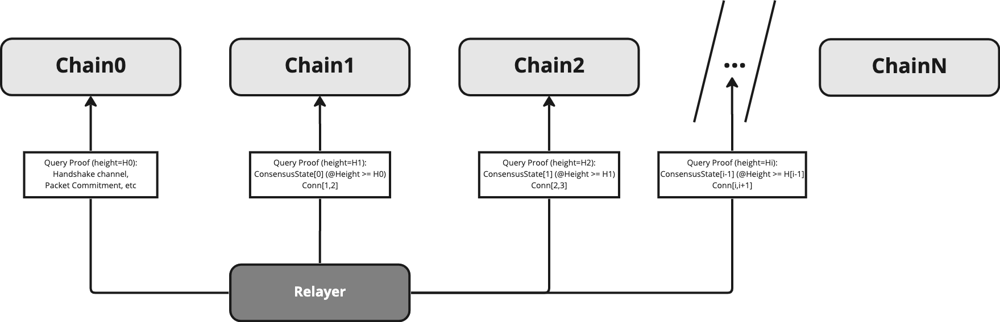
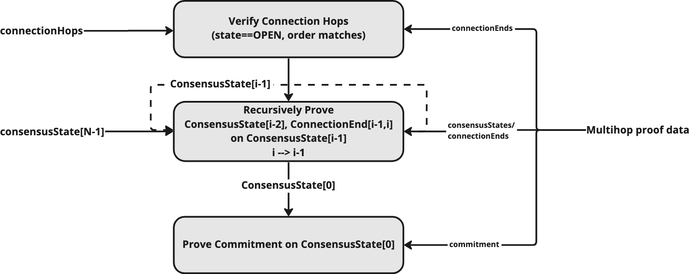

## Synopsis

This document describes a standard for multi-hop IBC channels. Multi-hop channels specifies a way to route messages across a path of IBC enabled blockchains utilizing multiple pre-existing IBC connections.

### Motivation

The current IBC protocol defines messaging in a point-to-point paradigm which allows message passing between two directly connected IBC chains, but as more IBC enabled chains come into existence there becomes a need to relay IBC packets across chains because IBC connections may not exist between the two chains wishing to exchange messages. IBC connections may not exist for a variety of reasons which could include economic inviability since connections require client state to be continuously exchanged between connection ends which carries a cost.

### Definitions

Associated definitions are as defined in referenced prior standards (where the functions are defined), where appropriate.

`Connection` is as defined in [ICS 3](https://github.com/cosmos/ibc/tree/main/spec/core/ics-003-connection-semantics).

`Channel` is as defined in [ICS 4](https://github.com/cosmos/ibc/tree/main/spec/core/ics-004-channel-and-packet-semantics).

`Channel Path` is defined as the path of connection IDs along which a channel is defined.

`Connection Hop` is defined as the connection ID of the connection between two chains along a channel path.

### Desired Properties

- IBC channel handshake and message packets should be able to be utilize pre-existing connections to form a logical proof chain to relay messages between unconnected chains.
- Relaying for a multi connection IBC channel should NOT require additional writes to intermediate hops.
- Minimal additional required state and changes to core and app IBC specs.
- Retain desired properties of connection, channel and packet definitions.
- Retain backwards compatibility for messaging over a single connection hop.

## Technical Specification

The bulk of the spec will be around proof generation and verification. IBC connections remain unchanged. Additionally, channel handshake and packet message types as well as general round trip messaging semantics and flow will remain the same. There is additional work on the verifier side on the destination chain as well as the relayers who need to query for proofs.

Messages passed over multiple hops require proof of the connection path from source chain to destination chain as well as the packet commitment on the source chain. The connection path is proven by verifying the connection state and consensus state of each connection in the path to the destination chain. On a high level, this can be thought of as a channel path proof chain where the destination chain can prove a key/value on the source chain by iteratively proving each connection and consensus state in the channel path starting with the consensus state associated with the final client on the destination chain. Each subsequent consensus state and connection is proven until the source chain's consensus state is proven which can then be used to prove the desired key/value on the source chain.

### Channel Handshake and Packet Messages

For both channel handshake and packet messages, additional connection hops are defined in the pre-existing `connectionHops` field. The connection IDs along the channel path must be pre-existing and in the `OPEN` state to guarantee delivery to the correct recipient. See `Path Forgery Protection` for more info.

The spec for channel handshakes and packets remains the same. See [ICS 4](https://github.com/cosmos/ibc/tree/main/spec/core/ics-004-channel-and-packet-semantics).

In terms of connection topology, a user would be able to determine a viable channel path from source -> destination using information from the [chain registry](https://github.com/cosmos/chain-registry). They can also independently verify this information via network queries.

### Multihop Relaying

Relayers would deliver channel handshake and IBC packets as they currently do except that they are required to provide proof of the channel path. Relayers would scan packet events for the connectionHops field and determine if the packet is multi-hop by checking the number of hops in the field. If the number of hops is greater than one then the packet is a multi-hop packet and will need extra proof data.

For each multi-hop channel (detailed proof logic below):

1. Scan source chain for IBC messages to relay.
2. Read the connectionHops field in from the scanned message to determine the channel path.
3. Lookup connection endpoints via chain registry configuration and ensure each connection in the channel path is updated to include the key/value to be proven on the source chain.
4. Query for proof of connection, and consensus state for each intermediate connection in the channel path to the destination connection.
5. Query proof of packet commitment or handshake message commitment on source chain.
6. Submit proofs and data to RPC endpoint on destination chain.

Relayers are connection topology aware with configurations sourced from the [chain registry](https://github.com/cosmos/chain-registry).

### Proof Generation & Verification

Graphical depiction of proof generation.



Relayer multi-hop proof queries.



Multi-hop proof verfication logic.



Pseudocode proof generation for a channel between `N` chains `C[0] --> C[i] --> C[N]`

```go

// ProofData is a generic proof struct.
type ProofData struct {
    Key   *MerklePath
    Value []]byte
    Proof []byte
}

// MultihopProof defines set of proofs to verify a multihop message.
// Consensus and Connection proofs are ordered from source to destination but not including the
// chain[N-1] consensus state on chainN (dest) since it is already known on the destination chain.
type MultihopProof struct {
    KeyProofIndex uint32           // the index of the consensus state to prove the key/value on, normally 0
    KeyProof *ProofData            // the key/value proof on the source chain (consensusState[0])
    ConsensusProofs []*ProofData   // array of consensus proofs starting with proof of consensusState[0] on chain1
    ConnectionProofs []*ProofData  // array of connection proofs starting with proof of conn[1,0] on chain1 (consensusState[1])
}

// GenerateMultihopProof generates proof of a key/value at the proofHeight on source chain (chain0). 
func GenerateMultihopProof(chains []*Chain, key string, value []byte, proofHeight exported.Height) *MultihopProof {

    abortTransactionUnless(len(chains) > 2)

    var multihopProof MultihopProof
    chain0 := chains[0] // source chain
    chain1 := chains[1] // first hop chain
 
    height01 := chain1.GetClientStateHeight(chain0) // height of chain0's client state on chain1
    abortTransactionUnless(height01 >= proofHeight) // ensure that chain0's client state is update to date

    // query the key/value proof on the source chain at the proof height
    keyProof, _ := chain0.QueryProofAtHeight([]byte(key), int64(proofHeight.GetRevisionHeight()))

    // assign the key/value proof
    multihopProof.KeyProof = &ProofData{
        Key:   nil,    // key to prove constructed during verification
        Value: nil,    // proven values are constructed during verification
        Proof: proof,
    }

    // generate and assign consensus, clientState, and connection proofs
    multihopProof.ConsensusProofs = GenerateConsensusProofs(chains)
    multihopProof.ConnectionProofs = GenerateConnectionProofs(chains)

    return &multihopProof
}

// GenerateConsensusProofs generates consensus state proofs starting from the source chain to the N-1'th chain.
// Compute proof for each chain 3-tuple starting from the source chain, C0 to the destination chain, CN
// Step 1: |C0 ---> C1 ---> C2| ---> C3 ... ---> CN
//         (i)     (i+1)   (i+2)
// Step 2: C0 ---> |C1 ---> C2 ---> C3| ... ---> CN 
//                 (i)    (i+1)    (i+2)
// Step N-3:  C0 ---> C1 ...  ---> |CN-2 --> CN-1 ---> CN|
//                                   (i)    (i+1)    (i+2)
func GenerateConsensusProofs(chains []*Chain, height) []*ProofData {
    assert(len(chains) > 2)

    var proofs []*ProofData

    // iterate all but the last two chains
    for i := 0; i < len(chains)-2; i++ {
  
        previousChain := chains[i]   // previous chains state root is on currentChain and is the source chain for i==0.
        currentChain  := chains[i+1] // currentChain is where the proof is queried and generated
        nextChain     := chains[i+2] // nextChain holds the state root of the currentChain

        consensusHeight := GetClientStateHeight(currentChain, previousChain.ClientID) // height of previous chain client state on current chain
        nextHeight := GetClientStateHeight(nextChain, currentChain)      // height of current chain state on next chain

        // consensus state of previous chain on current chain at consensusHeight which is the height of previous chain client state on current chain
        consensusState := GetConsensusState(currentChain, prevChain.ClientID, currentHeight)

        // prefixed key for consensus state of previous chain 
        consensusKey := GetPrefixedConsensusStateKey(currentChain, currentHeight)

        // proof of previous chain's consensus state at currentHeight on currentChain at nextHeight
        consensusProof := GetConsensusStateProof(currentChain, nextHeight, currentHeight, currentChain.ClientID)
  
        proofs = append(consStateProofs, &ProofData{
            Key:   &consensusKey,
            Value: consensusState,
            Proof: consensusProof,
        })
    }
     return proofs       
  }

// GenerateConnectionProofs generates connection state proofs starting with C1 -->  starting from the source chain to the N-1'th chain.
// Compute proof for each chain 3-tuple starting from the source chain, C0 to the destination chain, CN
// Step 1: |C0 ---> C1 ---> C2| ---> C3 ... ---> CN
//         (i)     (i+1)   (i+2)
// Step 2: C0 ---> |C1 ---> C2 ---> C3| ... ---> CN 
//                 (i)    (i+1)    (i+2)
// Step N-3:  C0 ---> C1 ...  ---> |CN-2 --> CN-1 ---> CN|
//                                   (i)    (i+1)    (i+2)
func GenerateConnectionProofs(chains []*Chain) []*ProofData {
    assert(len(chains) > 2)

    var proofs []*ProofData

    // iterate all but the last two chains
    for i := 0; i < len(chains)-2; i++ {
  
        previousChain := chains[i]  // previous chains state root is on currentChain and is the source chain for i==0.
        currentChain := chains[i+1] // currentChain is where the proof is queried and generated
        nextChain := chains[i+2]    // nextChain holds the state root of the currentChain

        currentHeight := currentChain.GetClientStateHeight(sourceChain) // height of previous chain state on current chain
        nextHeight := nextChain.GetClientStateHeight(currentChain)      // height of current chain state on next chain

        // prefixed key for the connection from currentChain to prevChain
        connectionKey := GetPrefixedConnectionKey(currentChain)

        // proof of current chain's connection to previous Chain.
        connectionEnd := GetConnection(currentChain)

        // Query proof of the currentChain's connection with the previousChain at nextHeight
        // (currentChain's state root height on nextChain)
        connectionProof := GetConnectionProof(currentChain, nextHeight)
  
        proofs = append(proofs, &ProofData{
            Key:   &connectionKey,
            Value: connectionEnd,
            Proof: connectionProof,
        })
    }
    return proofs       
}
```

### Multi-hop Proof Verification Steps

The following outlines the general proof verification steps specific to a multi-hop IBC message.

1. Unpack the multihop proof bytes into consensus states, connection states and channel/commitment proof data.
2. Check the counterparty client on the receiving end is active and the client height is greater than or equal to the proof height.
3. Iterate through the connections states to determine the maximum `delayPeriod` for the channel path and verify that the counterparty consensus state on the receiving chain satisfies the delay requirement.
4. Iterate through connection state proofs and verify each connectionEnd is in the OPEN state and check that the connection ids match the channel connectionHops.
5. Verify the intermediate state proofs. Starting with known `ConsensusState[N-1]` at the given `proofHeight` on `ChainN` prove the prior chain's consensus and connection state.
6. Verify that the client id in each consensus state proof key matches the client id in the ConnectionEnd in the previous connection state proof.
7. Repeat step 3, proving `ConsensusState[i-1]`, and `Conn[i-1,i]` until `ConsensusState[0]` on the source chain is proven.
   - Start with i = N-1
   - ConsensusState <- ConsensusProof[i-1].Value on Chain[i]
   - ConnectionEnd <- ConnectionProof[i-1].Value on Chain[i]
   - Verify ParseClientID(ConsensusProofs[i].Key) == ConnectionEnd.ClientID
   - ConsensusProofs[i].Proof.VerifyMembership(ConsensusState.GetRoot(), ConsensusProofs[i].Key, ConsensusProofs[i].Value)
   - ConnectionProofs[i].Proof.VerifyMembership(ConsensusState.GetRoot(), ConnectionProofs[i].Key, ConnectionProofs[i].Value)
   - Set ConsensusState from unmarshalled ConsensusProofs[i].Value
8. Finally, prove the expected channel or packet commitment in `ConsensusState[0]`

For more details see [ICS4](https://github.com/cosmos/ibc/tree/main/spec/core/ics-004-channel-and-packet-semantics).

### Multi-hop Proof Verification Pseudo Code

Pseudocode proof generation for a channel between `N` chains `C[0] --> C[i] --> C[N]`

```go
// VerifyMultihopMembership verifies a multihop membership proof.
// Inputs: consensusState - The consensusState for chain[N-1], which is known on the destination chain (chain[N]).
//         connectionHops - The expected connectionHops for the channel from the source chain to the destination chain.
//         proof          - The serialized multihop proof data.
//         prefix         - Merkleprefix to be combined with key to generate Merklepath for the key/value proof verification.
//         key            - The key to prove in the indexed consensus state.
//         value          - The value to prove in the indexed consensus state.
func VerifyMultihopMembership(
    consensusState exported.ConsensusState,
    connectionHops []string,
    proof []byte,
    prefix exported.Prefix,
    key string,
    value []byte,
) {
    // deserialize proof bytes into multihop proofs
    proofs := abortTransactionUnless(Unmarshal(proof))
    abortTransactionUnless(len(proofs.ConsensusProofs) >= 1)
    abortTransactionUnless(len(proofs.ConnectionProofs) == len(proofs.ConsensusProofs))

    // verify connection hop ordering and connections are in OPEN state
    abortTransactionUnless(VerifyConnectionHops(proofs.ConnectionProofs, connectionHops))

    // verify intermediate consensus and connection states from destination --> source
    abortTransactionUnless(VerifyConsensusAndConnectionStates(consensusState, proofs.ConsensusProofs, proofs.ConnectionProofs))

    // verify a key/value proof on source chain's consensus state.
    abortTransactionUnless(VerifyKeyMembership(proofs, prefix, key, value))
}

// VerifyMultihopNonMembership verifies a multihop non-membership proof.
// Inputs: consensusState - The consensusState for chain[N-1], which is known on the destination chain (chain[N]).
//         connectionHops - The expected connectionHops for the channel from the source chain to the destination chain.
//         proof          - The serialized multihop proof data.
//         prefix         - Merkleprefix to be combined with key to generate Merklepath for the key/value proof verification.
//         key            - The key to prove absent in the indexed consensus state
func VerifyMultihopNonMembership(
    consensusState exported.ConsensusState,
    connectionHops []string,
    proof []byte,
    prefix exported.Prefix,
    key string,
) {
    // deserialize proof bytes into multihop proofs
    proofs := abortTransactionUnless(Unmarshal(proof))
    abortTransactionUnless(len(proofs.ConsensusProofs) >= 1)
    abortTransactionUnless(len(proofs.ConnectionProofs) == len(proofs.ConsensusProofs))

    // verify connection hop ordering and connections are in OPEN state
    abortTransactionUnless(VerifyConnectionHops(proofs.ConnectionProofs, connectionHops))

    // verify intermediate consensus and connection states from destination --> source
    abortTransactionUnless(VerifyConsensusAndConnectionStates(consensusState, proofs.ConsensusProofs, proofs.ConnectionProofs))

    // verify a key/value proof on source chain's consensus state.
    abortTransactionUnless(VerifyKeyNonMembership(proofs, prefix, key))
}

// VerifyDelayPeriodPassed will ensure that at least delayTimePeriod amount of time and delayBlockPeriod number of blocks have passed
// since consensus state was submitted before allowing verification to continue.
func VerifyDelayPeriodPassed(
    proofHeight exported.Height,
    timeDelay uint64,
    expectedTimePerBlock uint64,
) error {
    // get time and block delays
    blockDelay := getBlockDelay(timeDelay, expectedTimePerBlock)

    // tendermint client implementation
    return tendermint.VerifyDelayPeriodPassed(proofHeight, timeDelay, blockDelay)
}

// VerifyConnectionHops checks that each connection in the multihop proof is OPEN and matches the connections in connectionHops.
func VerifyConnectionHops(
    connectionProofs []*MultihopProof,
    connectionHops []string,
) {
    // check all connections are in OPEN state and that the connection IDs match and are in the right order
    for i, connData := range connectionProofs {
        connectionEnd := abortTransactionUnless(Unmarshal(connData.Value))

        // Verify the rest of the connectionHops (first hop already verified)
        // 1. check the connectionHop values match the proofs and are in the same order.
        parts := strings.Split(connData.PrefixedKey.GetKeyPath()[len(connData.PrefixedKey.KeyPath)-1], "/")
        abortTransactionUnless(parts[len(parts)-1] == connectionHops[i+1])

        // 2. check that the connectionEnd's are in the OPEN state.
        abortTransactionUnless(connectionEnd.GetState() == int32(connectiontypes.OPEN))
    }
}

// VerifyConsensusAndConnectionStates verifies the state of each intermediate consensus, connection, and
// client state starting from chain[N-1] on the destination (chain[N]) and finally proving the source
// chain consensus, connection, and client state.
func VerifyConsensusAndConnectionStates(
    consensusState exported.ConsensusState,
    consensusProofs []*MultihopProof,
    connectionProofs []*MultihopProof,
) {
    // reverse iterate through proofs to prove from destination to source
    var clientID string
    for i := len(consensusProofs) - 1; i >= 0; i-- {

        // check the clientID from the previous connection is part of the next
        // consensus state's key path.
        abortTransactionUnless(VerifyClientID(clientID, consensusProofs[i].PrefixedKey))

        // prove the consensus state of chain[i] on chain[i+1]
        consensusProof := abortTransactionUnless(Unmarshal(consensusProofs[i].Proof))
        abortTransactionUnless(consensusProof.VerifyMembership(
            commitmenttypes.GetSDKSpecs(),
            consensusState.GetRoot(),
            *consensusProof.PrefixedKey,
            consensusProof.Value,
        ))

        // prove the connection state of chain[i] on chain[i+1]
        connectionProof := abortTransactionUnless(Unmarshal(connectionProofs[i].Proof))
        abortTransactionUnless(connectionProof.VerifyMembership(
            commitmenttypes.GetSDKSpecs(),
            consensusState.GetRoot(),
            *connectionProof.PrefixedKey,
            connectionProof.Value,
        ))

        var connection ConnectionEnd
        abortTransactionUnless(connectionProof.Value, &connection)
        clientID = connection.ClientID

        // update the consensusState to chain[i] to prove the next consensus/connection states
        consensusState = abortTransactionUnless(UnmarshalInterface(consensusProof.Value))
    }
}

// VerifyKeyMembership verifies a key in the indexed chain consensus state.
func VerifyKeyMembership(
    proofs *MsgMultihopProof,
    prefix exported.Prefix,
    key string,
    value []byte,
) {
    // create prefixed key for proof verification
    prefixedKey := abortTransactionUnless(commitmenttypes.ApplyPrefix(prefix, commitmenttypes.NewMerklePath(key)))

    // extract indexed consensus state from consensus proofs
    consensusState := abortTransactionUnless(UnmarshalInterface(proofs.ConsensusProofs[proofs.KeyProofIndex].Value))

    // assign the key proof to verify on the source chain
    keyProof := abortTransactionUnless(Unmarshal(proofs.KeyProof.Proof))

    abortTransactionUnless(keyProof.VerifyMembership(
        commitmenttypes.GetSDKSpecs(),
        consensusState.GetRoot(),
        prefixedKey,
        value,
    ))
   
}

// VerifyKeyNonMembership verifies a key in the indexed chain consensus state.
func VerifyKeyNonMembership(
    proofs *MsgMultihopProof,
    prefix exported.Prefix,
    key string,
) {
    // create prefixed key for proof verification
    prefixedKey := abortTransactionUnless(commitmenttypes.ApplyPrefix(prefix, commitmenttypes.NewMerklePath(key)))

    // extract indexed consensus state from consensus proofs
    consensusState := abortTransactionUnless(UnmarshalInterface(proofs.ConsensusProofs[proofs.KeyProofIndex].Value))

    // assign the key proof to verify on the source chain
    keyProof := abortTransactionUnless(Unmarshal(proofs.KeyProof.Proof))

    abortTransactionUnless(keyProof.VerifyNonMembership(
        commitmenttypes.GetSDKSpecs(),
        consensusState.GetRoot(),
        prefixedKey,
    ))
}

// VerifyClientID verifies that the client id in the provided key matches an expected client id.
func VerifyClientID(expectedClientID string, key string) {
    clientID := strings.Split(key, "/")[1] // /clients/<clientid>/...
    abortTransactionUnless(expectedClientID == clientID)
}
```

### Path Forgery Protection

From the view of a single network, a list of connection IDs describes an unforgeable path of pre-existing connections to a destination chain. This is ensured by atomically incrementing connection IDs.

We must verify a proof that the connection ID of each hop matches the proven connection state provided to the verifier. Additionally we must link the connection state to the consensus state for that hop as well. We are essentially proving out the connection path of the channel.

## Backwards Compatibility

The existing IBC message sending should not be affected. Minor changes to the verification logic would be required to identify a multi-hop packet and apply the proper proof verification logic. Multi-hop packets should be easily identified by the existence of more than one connection ID in the connectionHops field.

## Forwards Compatibility

If a decentralized chain name service is developed for the data currently in the chain registry on github, it may be possible for a calling app to specify only a unique chain name rather than an explicit set of connectionHops. The chain name service would maintain a mapping of chain names to channel paths. The name service could push routing table updates to subscribed chains. This should require fewer writes since routing table updates should be fewer than packets.

## Example Implementation

Coming soon.

## Other Implementations

Coming soon.

## History

Dec 16, 2022 - Revisions to channel spec and proof verification

Nov 11, 2022 - Initial draft

## Copyright

All content herein is licensed under [Apache 2.0](https://www.apache.org/licenses/LICENSE-2.0).
