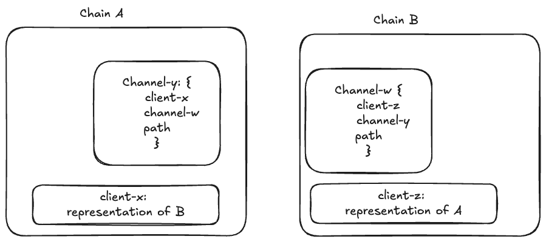

## Synopsis 

This standard defines the channel and packet semantics necessary for state machines implementing the Inter-Blockchain Communication (IBC) protocol version 2 to enable secure, verifiable, and efficient cross-chain messaging.

It specifies the mechanisms to create channels and register them between two distinct state machines (blockchains) where the channels have a semantic link between the chains and their counterparty light client representation, ensuring that both chains can process and verify packets exchanged between them.

The standard then details the processes for sending, receiving, acknowledging, and timing out data packets. The packet-flow semantics guarantee exactly-once packet delivery between chains, utilizing on-chain light clients for state verification and providing efficient routing of packet data to specific IBC applications.

### Motivation

The motivation for this specification is to formalize the semantics for both packet handling and channel creation and registration in the IBC version 2 protocol. These are fundamental components for enabling reliable, secure, and verifiable communication between independent blockchains. 

This specification focuses on defining the mechanisms for creating channels, securely registering them between chains, and ensuring that packets sent across these channels are processed consistently and verifiably. By utilizing on-chain light clients for state verification, it enables chains to exchange data without requiring synchronous communication, ensuring that all packets are delivered exactly once, even in the presence of network delays or reordering.

To standardize both channel creation, registration and packet flow semantics, this document also defines the pre-conditions, error conditions, and post-conditions for each defined function handler. By using a well-defined packet interface and clear handling processes, ICS-04 aims to ensure consistency and security across distinct implementations of the protocol ensuring reliability and security and tries not to impose constraints on the internal workings of the state machines.  

### Definitions

`get`, `set`, `delete`, and module-system related primitives are as defined in [ICS 24](../ics-024-host-requirements).

A `channel` is a data structure that facilitates exactly-once packet delivery between two blockchains acting as a communication pipeline between specific modules registered on separate chains, allowing for secure, verifiable transmission of packets. Channels can be created and registered to establish a semantic link between two chains and their respective light clients, ensuring that both chains can process and verify the packets exchanged. To establish the root of trust for secure interchain communication with a counterparty chain, each chain MUST register a channel maintaining the necessary counterparty information, such as the channel identifier of the counterparty chain, the light client identifier of the counterparty chain and the path used to store packet flow messages.

```typescript
interface Channel {
    clientId: bytes // local light client id of the counterparty chain. 
    counterpartyChannelId: bytes // counterparty channel id.  
    keyPrefix: CommitmentPrefix //  key path that the counterparty will use to prove its store packet flow messages.
}
```

The `Packet`, `Payload`, `Encoding` and the `Acknowledgement` interfaces are as defined in [packet specification](https://github.com/cosmos/ibc/blob/c7b2e6d5184b5310843719b428923e0c5ee5a026/spec/core/v2/ics-004-packet-semantics/PACKET.md). 

For convenience, following we recall their structures.  

A `Packet`, in the interblockchain communication protocol, is a particular interface defined as follows:

```typescript
interface Packet {
    sourceChannelId: bytes, // channel identifier on the source chain. 
    destChannelId: bytes, // channel identifier on the dest chain.
    sequence: uint64, // number that corresponds to the order of sent packets.
    timeout: uint64, // indicates the UNIX timestamp in seconds and is encoded in LittleEndian. It must be passed on the destination chain and once elapsed, will no longer allow the packet processing, and will instead generate a time-out.
    data: [Payload] // data 
}
```

The `Payload` is a particular interface defined as follows:

```typescript
interface Payload {
    sourcePort: bytes, // identifies the source application port
    destPort: bytes, // identifies the dest application port 
    version: string, // application version
    encoding: Encoding, // used encoding - allows the specification of custom data encoding among those agreed in the `Encoding` enum
    appData: bytes, // app specific data 
}

enum Encoding {
  NO_ENCODING_SPECIFIED,
    PROTO_3,
    JSON,
    RLP,
    BCS,
}
```

Note that a `Packet` is never directly serialised. Rather it is an intermediary structure used in certain function calls that may need to be created or processed by modules interacting with the IBC handler.

When the array of payloads, passed-in the packet, is populated with multiple values, the system will handle the packet as a multi-data packet. The multi-data packet handling logic is out of the scope of the current version of this spec. 

An `OpaquePacket` is a packet, but cloaked in an obscuring data type by the host state machine, such that a module cannot act upon it other than to pass it to the IBC handler. The IBC handler can cast a `Packet` to an `OpaquePacket` and vice versa.

```typescript
type OpaquePacket = object
```

The protocol introduces standardized packet receipts that will serve as sentinel values for the receiving chain to explicitly write to its store the outcome of a `receivePacket`.

```typescript
enum PacketReceipt {
  SUCCESSFUL_RECEIPT = byte{0x01},
}
```

The `Acknowledgement` is a particular interface defined as follows: 

```typescript
interface Acknowledgement {
    appAcknowledgement: [bytes] // array of bytes. Each element of the array contains an acknowledgement from a specific application  
}
```

An application may not need to return an acknowledgment after processing relevant data. In this case, implementors may decide to return a sentinel acknowledgement value `SENTINEL_ACKNOWLEDGMENT`, which will be the single byte in the byte array: `bytes(0x01)`. 

If the receiver chain returns the `SENTINEL_ACKNOWLEDGMENT`, the sender chain will execute the `acknowledgePacket` handler without triggering the `onAcknowledgePacket` callback.  

As we will see later, the presence in the provable store of the acknowledgement is a prerequisite for executing the `acknowledgePacket` handler. If the receiver chain does not write the acknowledgement, will be impossible for the sender chain to execute `acknowledgePacket` and delete the packet commitment. 

> **Example**: In the multi-data packet world, if a packet within 3 payloads intended for 3 different application is sent out, the expectation is that each payload is processed in the same order in which it was placed in the packet. Similarly, the `appAcknowledgement` array is expected to be populated within the same order. 

- The `IBCRouter` contains a mapping from the application `portId` and the supported callbacks and as well as a mapping from `clientlId` to the underlying client.

```typescript
type IBCRouter struct {
    callbacks: portId -> [Callback] 
    clients: clientId -> Client // The IBCRouter stores the client under the clientId key
}
```

The registration of the application callbacks in the local `IBCRouter`, is responsibility of the chain modules. 
The registration of the client in the local `IBCRouter` is responsibility of the ICS-02 initialise client procedure. 

> **Note:** The proper configuration of the `IBCRouter` is a prerequisite for starting the stream of packets.  

- The `MAX_TIMEOUT_DELTA` is intendend as the max, absolute, difference between `currentTimestamp` and `timeoutTimestamp` that can be given in input to `sendPacket`. 

```typescript
const MAX_TIMEOUT_DELTA = Implementation specific  // We recommend MAX_TIMEOUT_DELTA = 24h  
```

Additionally, the ICS-04 specification defines a set of conditions that the implementations of the IBC protocol version 2 MUST adhere to. These conditions ensure the proper execution of the function handlers by establishing requirements before execution `pre-conditions`, the conditions that MUST trigger errors during execution `error-conditions`, expected outcomes after succesful execution `post-conditions-on-success`, and expected outcomes after error execution `post-conditions-on-error`.

### Desired Properties

#### Efficiency

- The speed of packet transmission and confirmation should be limited only by the speed of the underlying chains.
- Proofs should be batchable where possible.

#### Exactly-once delivery

- IBC packets sent on one end of a channel should be delivered exactly once to the other end.
- No network synchrony assumptions should be required for exactly-once safety. If one or both of the chains halt, packets may be delivered no more than once, and once the chains resume packets should be able to flow again.

#### Ordering

- IBC version 2 supports only *unordered* communications, thus, packets may be sent and received in any order. Unordered packets, have individual timeouts specified in seconds UNIX timestamp.

#### Permissioning

- Channels should be permissioned to the application registered on the local router. Thus only the modules registered on the local router should be able to send or receive on it.

#### Fungibility conservation 

An application may wish to allow a single tokenized asset to be transferred between and held on multiple blockchains while preserving fungibility and conservation of supply. The application can mint asset vouchers on chain `B` when a particular IBC packet is committed to chain `B`, and require outgoing sends of that packet on chain `A` to escrow an equal amount of the asset on chain `A` until the vouchers are later redeemed back to chain `A` with an IBC packet in the reverse direction. This ordering guarantee along with correct application logic can ensure that total supply is preserved across both chains and that any vouchers minted on chain `B` can later be redeemed back to chain `A`.

## Technical Specification

### Preliminaries

#### Store paths

The ICS-04 use the protocol paths, defined in [ICS-24](../ics-024-host-requirements/README.md), `packetCommitmentPath`, `packetRecepitPath` and `packetAcknowledgementPath`. The paths MUST be used as the referece locations in the provableStore to prove respectilvey the packet commitment, the receipt and the acknowledgment to the counterparty chain. 

Thus, constant-size commitments to packet data fields are stored under the packet sequence number:

```typescript
function packetCommitmentPath(channelSourceId: bytes, sequence: BigEndianUint64): Path {
    return "commitments/channels/{channelSourceId}/sequences/{sequence}"
}
```

Absence of the path in the store is equivalent to a zero-bit.

Packet receipt data are stored under the `packetReceiptPath`. In the case of a successful receive, the destination chain writes a sentinel success value of `SUCCESSFUL_RECEIPT`. 

```typescript
function packetReceiptPath(channelDestId: bytes, sequence: BigEndianUint64): Path {
    return "receipts/channels/{channelDestId}/sequences/{sequence}"
}
```

Packet acknowledgement data are stored under the `packetAcknowledgementPath`:

```typescript
function packetAcknowledgementPath(channelSourceId: bytes, sequence: BigEndianUint64): Path {
    return "acks/channels/{channelSourceId}/sequences/{sequence}"
}
```

#### Private Utility Store

Additionally, the ICS-04 defines the following variables:  `nextSequenceSend` , `channelPath` and `channelCreator`. These variables are defined for the IBC handler and meant to be used locally in the chain, thus, as long as they maintain the semantic value defined with the IBC protocol, the specification of their structure can be arbitrary changed by implementors at their conveinience.  

- The `nextSequenceSend`  tracks the sequence number for the next packet to be sent for a given source channelId.
- The `channelCreator` tracks the channels creator address given the channelId.
- The `storedChannels` tracks the channels paired with the other chains.

```typescript
type nextSequenceSend : channelId -> BigEndianUint64 
type channelCreator : channelId -> address 
type storedChannels : channelId -> Channel

function getChannel(channelId: bytes): Channel {
    return storedChannels[channelId]
}
```

### Sub-protocols

#### Setup

In order to ensure valid communication, each IBC chain MUST be able to identify its counterparty. While a client can prove any key/value path on the counterparty, knowing which identifier the counterparty uses when it sends messages to us is essential to prevent confusion between messages intended for different chains. Thus, to achieve mutual and verifiable identification, IBC version 2 introduces the `createChannel` and `registerCounterparty` procedures. Below the ICS-04 defines the setup process that ensures that both chains recognize and agree on a mutually identified channel that will facilitate packet transmission.

To start the secure packet stream between the chains, chain `A` and chain `B` MUST execute the setup following this set of procedures:  

| **Procedure**               | **Responsible**     | **Outcome**                                                                 |
|-----------------------------|---------------------|-----------------------------------------------------------------------------|
| **Channel Creation**         | Relayer            | A channel is created and linked to an underlying light client on both chains|
| **Channel Registration**     | Relayer            | Registers the `counterpartyChannelId` on both chains, linking the channels  |

The relayer is required to execute `createClient` (as defined in ICS-02) before calling `createChannel`, since the `clientId`, input parameter for `createChannel`, MUST be known at execution time. Eventually, the `createClient` message can be bundled with the `createChannel` message in a single multiMsgTx. 

Calling indipendently `createClient`, `createChannel` and `registerCounterparty` result in a three step setup process.
Bundling `createClient` and `createChannel` into a single operation simplifies this process and reduces the number of interactions required between the relayer and the chains to two.

The setup procedure is a prerequisite for starting the packet stream. If any of the steps has been missed, this would trigger an error during the packet handlers execution. Below we provide the setup sequence diagrams. 


After completing the two- or three-step setup, the system should end up in a similar state. 



Once two chains have set up clients, created channel and registered channels for each other with specific identifiers, they can send IBC packets using the packet interface defined before and the packet handlers that the ICS-04 defines below. The packets will be addressed **directly** with the channels that have semantic link to the underlying counterparty light clients. Thus there are **no** more handshakes necessary. Instead the packet sender must be capable of providing the correct **<channel,channel>** pair. If the setup has been executed correctly, then the correctness and soundness properties of IBC holds and the IBC packet flow is guaranteed to succeed. If a user sends a packet with the wrong destination channel it will be impossible for the intended destination to correctly verify the packet, and the packet will simply time out.

While the above mentioned `createClient` procedure is defined by [ICS-2](../ics-002-client-semantics/README.md), the ICS-04 defines below the `createChannel` and `registerCounterparty` procedures.

##### Channel creation 

The channel creation process enables the creation of the two channels that can be linked to establishes the communication pathway between two chains. 

###### Execution requirements and outcomes   

Pre-conditions: 

- `createClient` has been previously executed such that the `clientId` that will be provided in input to `createChannel` exist and it's valid. 

| **Condition Type**            | **Description**  | **Code Checks** | 
|-------------------------------|------------------| ----------------|
| **error-conditions**           | 1. Invalid `clientId`<br> 2. `Invalid channelId`<br> 3. Unexpected keyPrefix format | 1. `client==null`<br> 2.1 `validateId(channelId)==False`<br> 2.2 `getChannel(channelId)!=null`<br> 3. `isFormatOk(KeyPrefix)==False`<br> |
| **post-conditions (success)**  | 1. A channel is set in store<br> 2. The creator is set in store<br> 3. `nextSequenceSend` is initialized<br> 4. Event with relevant fields is emitted | 1. `storedChannel[channelId]!=null`<br> 2. `channelCreator[channelId]!=null` <br> 3. `nextSequenceSend[channelId]==1`<br> 4. Check Event Emission |
| **post-conditions (error)**    | None of the post-conditions (success) is true<br>| 1. `storedChannel[channelId]==null`<br> 2. `channelCreator[channelId]==null`<br> 3. `nextSequenceSend[channelId]!=1`<br> 4. No Event is Emitted<br> |

###### Pseudo-Code 

```typescript
function createChannel(
    clientId: bytes,  
    counterpartyKeyPrefix: CommitmentPrefix): bytes {

        // Implementation-Specific Input Validation 
        // All implementations MUST ensure the inputs value are properly validated and compliant with this specification 
        client=getClient(clientId)
        assert(client!==null)
        assert(isFormatOk(counterpartyKeyPrefix))

        // Channel Checks
        channelId = generateIdentifier() 
        abortTransactionUnless(validateIdentifier(channelId))
        abortTransactionUnless(getChannel(channelId)) === null)
        
        // Channel manipulation
        channel = Channel{
            clientId: clientId,
            counterpartyChannelId: "",  // This field it must be a blank field during the creation as it may be not known at the creation time. 
            keyPrefix: counterpartyKeyPrefix
        }

        // Local stores 
        // Store channel info 
        storedChannels[channelId]=channel
        // Store creator address info 
        channelCreator[channelId]=msg.signer()
        // Initialise the nextSequenceSend 
        nextSequenceSend[channelId]=1
        
        // Event Emission 
    emitLogEntry("createChannel", {
      channelId: channelId, 
      channel: channel, 
      creatorAddress: msg.signer(),
    })

    return channelId
}
```

##### Channel registration and counterparty idenfitifcation  

IBC version 2 introduces a `registerCounterparty` procedure. The channel registration procedure ensures both chains have a mutually recognized channel that facilitates the packet transmission.

This process stores the `counterpartyChannelId` in the local channel structure, ensuring both chains have mirrored **<channel, channel>** pairs. With the correct registration, the unique clients on each side provide an authenticated stream of packet data. Social consensus outside the protocol is relied upon to ensure only valid **<channel, channel>** pairs are used, representing connections between the correct chains. 

Pre-conditions:

- The `createChannel` has been previously executed such that the `channelId` that will be provided in input to `registerCounterparty` exist and it's valid.

###### Execution requirements and outcomes  

| **Condition Type**            | **Description** | **Code Checks** |
|-------------------------------|-----------------------------------|----------------------------|
| **error-conditions**           | 1. Invalid `channelId`<br> 2. Creator authentication failed | 1.1 `validateId(channelId)==False`<br> 1.2 `getChannel(channelId)==null`<br> 2. `channelCreator[channelId]!=msg.signer()`<br> |
| **post-conditions (success)**  | 1. The channel in store contains the `counterpartyChannelId` information<br> 2. An event with relevant information has been emitted | 1. `storedChannel[channelId].counterpartyChannelId!=null`<br> 2. Check Event Emission |
| **post-conditions (error)**    | 1. On the first call, the channel in store contains the `counterpartyChannelId` as an empty field<br> 2. No Event is Emitted<br> | 1. `storedChannel[channelId].counterpartyChannelId==null`<br> 2. Check No Event is Emitted<br>|
 
###### Pseudo-Code 

```typescript
function registerCounterparty(
    channelId: bytes, // local chain channel identifier
    counterpartyChannelId: bytes, // the counterparty's channel identifier
) {
    // Implementation-Specific Input Validation 
    // All implementations MUST ensure the inputs value are properly validated and compliant with this specification

    // Channel Checks
    abortTransactionUnless(validatedIdentifier(channelId))
    channel=getChannel(channelId) 
    abortTransactionUnless(channel !== null)
    
    // Creator Address Checks
    abortTransactionUnless(msg.signer()===channelCreator[channelId])

    // Channel manipulation
    channel.counterpartyChannelId=counterpartyChannelId

    // Local Store
    storedChannels[channelId]=channel

    // log that a packet can be safely sent
    // Event Emission 
    emitLogEntry("registerCounterparty", {
      channelId: channelId, 
      channel: channel, 
      creatorAddress: msg.signer(),
    })
}
```

The protocol uses as an authentication mechanisms checking that the `registerCounterparty` message is sent by the same relayer that initialized the client such that the `msg.signer()==channelCreator[channelId]`. This would make the client and channel parameters completely initialized by the relayer. Thus, users must verify that the client is pointing to the correct chain and that the counterparty identifier is correct as well before using the <channel,channel> pair.

#### Packet Flow Function Handlers 

In the IBC protocol version 2, the packet flow is managed by four key function handlers, each of which is responsible for a distinct stage in the packet lifecycle:

- `sendPacket`
- `receivePacket`
- `acknowledgePacket`
- `timeoutPacket`

Note that the execution of the four handlers, upon a unique packet, cannot be combined in any arbitrary order. 

Given a scenario where we are sending a packet from a sender chain `A` to a receiver chain `B` the protocol follows the following rules:  

- Sender `A` can call either {`sendPacket`,`acknowledgePacket`,`timeoutPacket`}
- Receiver `B` can call only {`receivePacket`} 
- Receiver `B` can only execute the `receivePacket` if `sendPacket` has been executed by sender `A` 
- Sender `A` can only execute `timeoutPacket` if `sendPacket` has been executed by sender `A` and `receivePacket` has not been executed by receiver `B`.
- Sender `A` can only execute `acknowledgePacket` if `sendPacket` has been executed by sender `A`, `receivePacket` has been executed by receiver `B`, `writeAcknowledgePacket` has been executed by receiver `B`. 

Below we provide the three possible example scenarios described with sequence diagrams. 

---

Scenario execution with synchronous acknowledgement `A` to `B` - set of actions: `A.sendPacket` -> `B.receivePacket` -> `A.acknowledgePacket`  


---

Scenario execution with asynchronous acknowledgement `A` to `B` - set of actions: `A.sendPacket` -> `B.receivePacket` -> `A.acknowledgePacket`  

Note that the key difference with the synchronous scenario is that the `writeAcknowledgement` function is called after that `receivePacket` completes its execution.   


---

Scenario timeout execution `A` to `B` - set of actions: `A.sendPacket` -> `A.timeoutPacket`  


##### Sending packets

The `sendPacket` function is called by the IBC handler when an IBC packet is submitted to the newtwork in order to send *data* in the form of an IBC packet. The `sendPacket` function executes the IBC core logic and atomically triggers the application logic execution via the activation of the `onSendPacket` callback. Indeed ∀ `Payload` included in the `packet.data`, which refers to a specific application, the callbacks are retrieved from the IBC router and the `onSendPacket` is the then triggered on the application specified in the `payload` content. Once all payloads contained in the `packet.data` have been processed, the packet commitment is generated and the sequence number bound to the `channelSourceId` is incremented. 

The `sendPacket` core function MUST execute the applications logic atomically triggering the `onSendPacket` callback ∀ application contained in the `packet.data` payload.

The IBC handler performs the following steps in order:

- Checks that the underlying clients is valid. 
- Checks that the timeout specified has not already passed on the destination chain
- Executes the `onSendPacket` ∀ Payload included in the packet. 
- Stores a constant-size commitment of the packet
- Increments the send sequence counter associated with the channel
- Returns the sequence number of the sent packet

Note that the full packet is not stored in the state of the chain - merely a short hash-commitment to the data & timeout value. The packet data can be calculated from the transaction execution and possibly returned as log output which relayers can index.

###### Execution requirements and outcomes  

Pre-conditions: 

- The `IBCRouters` and the `channels` have been properly configured on both chains.
- Sender and receiver chains are assumed to be in a setup final state

| **Condition Type**            |**Description** | **Code Checks**|
|-------------------------------|--------------------------------------------------------|------------------------|
| **Error-Conditions**           | 1. Invalid `clientId`<br> 2. Invalid `channelId`<br> 3. Invalid `timeoutTimestamp`<br> 4. Unsuccessful payload execution. | 1. `router.clients[channel.clientId]==null`<br> 2. `getChannel(sourceChannelId)==null`<br> 3.1 `timeoutTimestamp==0`<br> 3.2 `timeoutTimestamp < currentTimestamp()`<br> 3.3 `timeoutTimestamp > currentTimestamp() + MAX_TIMEOUT_DELTA`<br> 4. `onSendPacket(..)==False`<br> |
| **Post-Conditions (Success)**  | 1. `onSendPacket` is executed and the application state is modified<br> 2. The `packetCommitment` is generated and stored under the expected `packetCommitmentPath`<br> 3. The sequence number bound to `sourceId` is incremented by 1<br> 4. Event with relevant information is emitted | 1. `onSendPacket(..)==True; app.State(beforeSendPacket)!=app.State(afterSendPacket)`<br> 2. `commitment=commitV2Packet(packet), provableStore.get(packetCommitmentPath(sourceChannelId, sequence))==commitment`<br> 3. `nextSequenceSend(beforeSendPacket[sourecChannelId])+1==SendPacket(..)`<br> 4. Check Event Emission | 
| **Post-Conditions (Error)**    | 1. if `onSendPacket` fails the application state is unchanged<br> 2. No `packetCommitment` has been generated<br> 3. The sequence number bound to `sourceId` is unchanged <br> 4. No Event Emission | 1. `app.State(beforeSendPacket)==app.State(afterSendPacket)`<br> 2. `commitment=commitV2Packet(packet), provableStore.get(packetCommitmentPath(sourceChannelId, sequence))==commitment`<br> 3. `nextSequenceSend[sourecChannelId]==nextSequenceSend(beforeSendPacket)` <br> 4. Check No Event is Emitted<br>|

###### Pseudo-Code 

The ICS04 provides an example pseudo-code that enforce the above described conditions so that the following sequence of steps must occur for a packet to be sent from module *1* on machine *A* to module *2* on machine *B*, starting from scratch.
 
```typescript
function sendPacket(
    sourceChannelId: bytes, 
    timeoutTimestamp: uint64,
    payloads: []byte
    ) : BigEndianUint64 {

    // Setup checks - channel and client 
    channel = getChannel(sourceChannelId)
    assert(channel !== null)
    client = router.clients[channel.clientId]
    assert(client !== null)
    
    // timeoutTimestamp checks
    // disallow packets with a zero timeoutTimestamp
    assert(timeoutTimestamp !== 0) 
    // disallow packet with timeoutTimestamp less than currentTimestamp and timeoutTimestamp value bigger than currentTimestamp + MaxTimeoutDelta 
    assert(currentTimestamp() < timeoutTimestamp < currentTimestamp() + MAX_TIMEOUT_DELTA) 
    
    
    // retrieve sequence
    sequence = nextSequenceSend[sourecChannelId]
    // Check that the Sequence has been correctly initialized before hand. 
    abortTransactionUnless(sequence!==0) 
    
    // Executes Application logic ∀ Payload
    // Currently we support only len(payloads)==1 
    payload=payloads[0]
    cbs = router.callbacks[payload.sourcePort]
    success = cbs.onSendPacket(sourceChannelId,channel.counterpartyChannelId,payload) // Note that payload includes the version. The application is required to inspect the version to route the data to the proper callback
    // IMPORTANT: if the onSendPacket fails, the transaction is aborted and the potential state changes are reverted. 
    // This ensure that the post conditions on error are always respected. 
    // payload execution check  
    abortUnless(success)

    // Construct the packet
    packet = Packet {
            sourceId: sourceChannelId,
            destId: channel.counterpartyChannelId, 
            sequence: sequence,
            timeoutTimestamp: timeoutTimestamp, 
            payloads: payloads
            }

    // store packet commitment using commit function defined in [packet specification](https://github.com/cosmos/ibc/blob/c7b2e6d5184b5310843719b428923e0c5ee5a026/spec/core/v2/ics-004-packet-semantics/PACKET.md)
    commitment=commitV2Packet(packet) 
    provableStore.set(packetCommitmentPath(sourceChannelId, sequence),commitment)
    
    // increment the sequence. Thus there are monotonically increasing sequences for packet flow for a given clientId
    nextSequenceSend[sourceChannelId]=sequence+1
    
    // log that a packet can be safely sent
    // Event Emission 
    emitLogEntry("sendPacket", {
      sourceId: sourceChannelId, 
      destId: channel.counterpartyChannelId, 
      sequence: sequence,
      packet: packet,
      timeoutTimestamp: timeoutTimestamp, 
    })
    
    return sequence
}
```
 
##### Receiving packets

The `recvPacket` function is called by the IBC handler in order to receive an IBC packet sent on the corresponding client on the counterparty chain.

Atomically in conjunction with calling the core `receivePacket`, the modules/application referred in the `packet.data` payload MUST execute the specific application logic callaback.

The IBC handler performs the following steps in order:

- Checks that the client is valid
- Checks that the timeout timestamp is not yet passed on the receiving chain 
- Checks the inclusion proof of packet data commitment in the sender chain's state
- Sets a store path to indicate that the packet has been received
- If the flows supports synchronous acknowledgement, it writes the acknowledgement into the receiver provableStore. 

###### Execution requirements and outcomes  

Pre-conditions: 

- The sender chain has executed `sendPacket` --> stored a verifiable `packetCommitment` 
- `TimeoutTimestamp` is not elapsed on the receiving chain
- `PacketReceipt` for the specific keyPrefix and sequence MUST be empty --> receiver chain has not executed `receivePacket`

| **Condition Type**            | **Description** | **Code Checks** |
|-------------------------------|-----------------------------------------------|-----------------------------------------------|
| **Error-Conditions**           | 1. invalid `packetCommitment`, 2.`packetReceipt` already exists<br> 3. Invalid timeoutTimestamp<br> 4. Unsuccessful payload execution. | 1.1 `verifyMembership(packetCommitment)==false`<br> 1.2 `provableStore.get(packetReceiptPath(packet.channelDestId, packet.sequence))!=null`<br> 3. `timeoutTimestamp === 0`<br> 3.1 `currentTimestamp() < packet.timeoutTimestamp)`<br> 4. `onReceivePacket(..)==False` |
| **Post-Conditions (Success)**  | 1. `onReceivePacket` is executed and the application state is modified<br> 2. The `packetReceipt` is written<br> 3. Event is Emitted<br>  | 1. `onReceivePacket(..)==True; app.State(beforeReceivePacket)!=app.State(afterReceivePacket)`<br> 2. `provableStore.get(packetReceiptPath(packet.channelDestId, packet.sequence))!=null`<br> 3. Check Event Emission<br> |
| **Post-Conditions (Error)**    | 1. if `onReceivePacket` fails the application state is unchanged<br> 2. `packetReceipt is not written`<br> <br> 3. No Event Emission<br> | 1. `app.State(beforeReceivePacket)==app.State(afterReceivePacket)`<br> 2. `provableStore.get(packetReceiptPath(packet.channelDestId, packet.sequence))==null` <br> 3. Check No Event is Emitted<br> |
                                                                                                                          
###### Pseudo-Code 

The ICS-04 provides an example pseudo-code that enforce the above described conditions so that the following sequence of steps SHOULD occur for a packet to be received from module *1* on machine *A* to module *2* on machine *B*.

>**Note:** We pass the address of the `relayer` that signed and submitted the packet to enable a module to optionally provide some rewards. This provides a foundation for fee payment, but can be used for other techniques as well (like calculating a leaderboard).

```typescript
function recvPacket(
  packet: OpaquePacket,
  proof: CommitmentProof,
  proofHeight: Height,
  relayer: string  
  ) {

    // Channel and Client Checks
    channel = getChannel(packet.channelDestId)     
    assert(channel !== null)
    client = router.clients[channel.clientId]  
    assert(client !== null)
    
    // verify timeout
    assert(packet.timeoutTimestamp === 0)  
    assert(currentTimestamp() < packet.timeoutTimestamp)

    // verify the packet receipt for this packet does not exist already 
    packetReceipt = provableStore.get(packetReceiptPath(packet.channelDestId, packet.sequence))
    abortTransactionUnless(packetReceipt === null)

    //////// verify commitment 
    
    // 1. retrieve keys 
    packetPath = packetCommitmentPath(packet.channelDestId, packet.sequence)
    merklePath = applyPrefix(channel.keyPrefix, packetPath)
    
    // 2. reconstruct commit value based on the passed-in packet  
    commit = commitV2Packet(packet) 
    
    // 3. call client verify memership 
    assert(client.verifyMembership(
        client.clientState 
        proofHeight,
        proof,
        merklePath,
        commit))

    
    // Executes Application logic ∀ Payload
    payload=packet.data[0]
    cbs = router.callbacks[payload.destPort]
    ack,success = cbs.onReceivePacket(packet.channelDestId,payload,relayer) // Note that payload includes the version. The application is required to inspect the version to route the data to the proper callback
    abortTransactionUnless(success)
    if ack != nil {
        // NOTE: Synchronous ack. 
        writeAcknowledgement(packet, ack)
    }
    // NOTE No ack || Asynchronous ack. 
    //else: ack is nil and won't be written || ack is nil and will be written asynchronously 

    // Provable Stores 
    // we must set the receipt so it can be verified on the other side
    // it's the sentinel success receipt: []byte{0x01}
    provableStore.set(
        packetReceiptPath(packet.channelDestId, packet.sequence),
        SUCCESSFUL_RECEIPT
    )

    // log that a packet has been received
    // Event Emission
    emitLogEntry("recvPacket", {
      data: packet.data
      timeoutTimestamp: packet.timeoutTimestamp,
      sequence: packet.sequence,
      sourceId: packet.channelSourceId,
      destId: packet.channelDestId,
      relayer: relayer 
    })
    
}
```

##### Writing acknowledgements

> **Note:** The system handles synchronous and asynchronous acknowledgement logic. Writing acknowledgements ensures that application modules callabacks have been triggered and have returned their specific acknowledgment in order to write data which resulted from processing an IBC packet that the sending chain can then verify. Writing acknowledgement serves as a sort of "execution receipt" or "RPC call response".

The `writeAcknowledgement` function can be activated either synchronously by the IBC handler during the `receivePacket` execution or it can be activated asynchronously by an application callback after the `receivePacket` execution. 

Given that the `receivePacket` logic is expected to be executed before the `writeAcknowledgement` is activated, `writeAcknowledgement` *does not* check if the packet being acknowledged was actually received, because this would result in proofs being verified twice for acknowledged packets. This aspect of correctness is the responsibility of the IBC handler.

The IBC handler performs the following steps in order:

- Checks that an acknowledgement for this packet has not yet been written
- Sets the opaque acknowledgement value at a store path unique to the packet

###### Execution requirements and outcomes 

Pre-conditions: 

- `receivePacket` has been called by receiver chain
- `onReceivePacket` application callback has been executed on the receiver chain 
- `writeAcknowledgement` has not been executed yet 

| **Condition Type**            | **Description** | **Code Checks** |
|-------------------------------|------------|------------|
| **Error-Conditions**           | 1. acknowledgement is empty<br> 2. The `packetAcknowledgementPath` stores already a value. | 1. `len(acknowledgement) === 0`<br> 2. `provableStore.get(packetAcknowledgementPath(packet.channelDestId, packet.sequence) !== null` |
| **Post-Conditions (Success)**  | 1. opaque acknowledgement has been written at `packetAcknowledgementPath` <br> 2. Event is Emitted<br> | 1. `provableStore.get(packetAcknowledgementPath(packet.channelDestId, packet.sequence) !== null` <br> 2. Check Event Emission<br> |
| **Post-Conditions (Error)**    | 1. No value is stored at the `packetAcknowledgementPath`. <br> 2. No Event is Emitted<br> | 1. `provableStore.get(packetAcknowledgementPath(packet.channelDestId, packet.sequence) === null`<br> 2. Check No Event is Emitted<br> |

###### Pseudo-Code 

The ICS-04 provides an example pseudo-code that enforce the above described conditions so that the following sequence of steps SHOULD occur when the receiver chain writes the acknowledgement in its provable store.

```typescript
function writeAcknowledgement(
  packet: Packet,
  acknowledgement: Acknowledgement) {
    // acknowledgement must not be empty
    abortTransactionUnless(len(acknowledgement) !== 0)

    // cannot already have written the acknowledgement
    abortTransactionUnless(provableStore.get(packetAcknowledgementPath(packet.channelDestId, packet.sequence) === null))
    
    // create the acknowledgement coomit using the function defined in [packet specification](https://github.com/cosmos/ibc/blob/c7b2e6d5184b5310843719b428923e0c5ee5a026/spec/core/v2/ics-004-packet-semantics/PACKET.md)
    commit=commitV2Acknowledgment(acknowledgement)
    
    provableStore.set(
    packetAcknowledgementPath(packet.channelDestId, packet.sequence),commit)

    // log that a packet has been acknowledged
    // Event Emission
    emitLogEntry("writeAcknowledgement", {
      sequence: packet.sequence,
      sourceId: packet.channelSourceId,
      destId: packet.channelDestId,
      timeoutTimestamp: packet.timeoutTimestamp,
      data: packet.data,
      acknowledgement
    })
}
```

##### Processing acknowledgements

The `acknowledgePacket` function is called by the IBC handler to process the acknowledgement of a packet previously sent by the sender chain that has been received on the receiver chain. The `acknowledgePacket` also cleans up the packet commitment, which is no longer necessary since the packet has been received and acted upon.

The IBC hanlder MUST atomically trigger the callbacks execution of appropriate application acknowledgement-handling logic in conjunction with calling `acknowledgePacket`.

###### Execution requirements and outcomes  

Pre-conditions: 

- Sender chain has sent a packet. 
- Receiver chain has successfully received a packet and has written the acknowledgment --> `packetReceipt` and `acknowledgment` have been written in the provable store. Note that if the `acknowledgment` is written, this implies that `receivePacket` has been executed, thus there is no need to verify the presence of the `packetReceipt`.  
- Sender chain has not cleared out the `packetCommitment`  

| **Condition Type** | **Description** | **Code Checks** |
|-------------------------------|---------------------------------|---------------------------------|
| **Error-Conditions**           | 1. `packetCommitment` already cleared out<br> 2. Unset Acknowledgment<br> 3. Unsuccessful payload execution. | 1. `provableStore.get(packetCommitmentPath(packet.channelSourceId, packet.sequence)) ===  null`<br> 2. `verifyMembership(packetacknowledgementPath,...,) ==  False`<br> 3. `onAcknowledgePacket(packet.channelSourceId,payload, acknowledgement) == False` | 
| **Post-Conditions (Success)**  | 1. `onAcknowledgePacket` is executed and the application state is modified<br> 2. `packetCommitment` has been cleared out <br> 4. Event is Emission<br> | 1. `onAcknowledgePacket(..)==True; app.State(beforeAcknowledgePacket)!=app.State(afterAcknowledgePacket)`<br> 2. `provableStore.get(packetCommitmentPath(packet.channelSourceId, packet.sequence)) === null`, <br> 4. Check Event is Emitted<br> |
| **Post-Conditions (Error)**    | 1. If `onAcknowledgePacket` fails the application state is unchanged<br> 2. `packetCommitment` has not been cleared out<br> 3. acknowledgement is stil in store <br> 4. No Event Emission<br> | 1. `onAcknowledgePacket(..)==False; app.State(beforeAcknowledgePacket)==app.State(afterAcknowledgePacket)`<br> 2. `provableStore.get(packetCommitmentPath(packet.channelSourceId, packet.sequence)) ===  commitV2Packet(packet)` 3. `verifyMembership(packetAcknowledgementPath,...,) ==  True` <br> 4. Check No Event is Emitted<br>|

###### Pseudo-Code 

The ICS04 provides an example pseudo-code that enforce the above described conditions so that the following sequence of steps must occur for a packet to be acknowledged from module *1* on machine *A* to module *2* on machine *B*.

>**Note:** We pass the `relayer` address just as in [Receiving packets](#receiving-packets) to allow for possible incentivization here as well.

```typescript
function acknowledgePacket(
    packet: OpaquePacket,
    acknowledgement: Acknowledgement,
    proof: CommitmentProof,
    proofHeight: Height,
    relayer: string
) {

    // Channel and Client Checks
    channel = getChannel(packet.channelSourceId)
    assert(channel !== null)
    client = router.clients[channel.clientId]
    assert(client !== null)
   
    // verify we sent the packet and haven't cleared it out yet
    assert(provableStore.get(packetCommitmentPath(packet.channelSourceId, packet.sequence)) ===  commitV2Packet(packet))

    // verify that the acknowledgement exist at the desired path  
    ackPath = packetAcknowledgementPath(packet.channelDestId, packet.sequence)
    merklePath = applyPrefix(channel.keyPrefix, ackPath)
    assert(client.verifyMembership(
        client.clientState
        proofHeight,
        proof,
        merklePath,
        acknowledgement
    ))
     
    if(acknowledgement!= SENTINEL_ACKNOWLEDGEMENT){ 
        // Executes Application logic ∀ Payload
        payload=packet.data[0]
        cbs = router.callbacks[payload.sourcePort]
        success= cbs.OnAcknowledgePacket(packet.channelSourceId,payload,acknowledgement, relayer) // Note that payload includes the version. The application is required to inspect the version to route the data to the proper callback
        abortUnless(success) 
    }

    channelStore.delete(packetCommitmentPath(packet.channelSourceId, packet.sequence))
    
    // Event Emission // Check fields
    emitLogEntry("acknowledgePacket", {
      sequence: packet.sequence,
      sourceId: packet.channelSourceId,
      destId: packet.channelDestId,
      timeoutTimestamp: packet.timeoutTimestamp,
      data: packet.data,
      acknowledgement
    })
}
```

##### Acknowledgement Envelope

The acknowledgement returned from the remote chain is defined as arbitrary bytes in the IBC protocol. This data
may either encode a successful execution or a failure (anything besides a timeout). There is no generic way to
distinguish the two cases, which requires that any client-side packet visualiser understands every app-specific protocol
in order to distinguish the case of successful or failed relay. In order to reduce this issue, we offer an additional
specification for acknowledgement formats, which [SHOULD](https://www.ietf.org/rfc/rfc2119.txt) be used by the
app-specific protocols.

```proto
message Acknowledgement {
  oneof response {
    bytes result = 21;
    string error = 22;
  }
}
```

If an application uses a different format for acknowledgement bytes, it MUST not deserialise to a valid protobuf message
of this format. Note that all packets contain exactly one non-empty field, and it must be result or error.  The field
numbers 21 and 22 were explicitly chosen to avoid accidental conflicts with other protobuf message formats used
for acknowledgements. The first byte of any message with this format will be the non-ASCII values `0xaa` (result)
or `0xb2` (error).

#### Timeouts

Application semantics may require some timeout: an upper limit to how long the chain will wait for a transaction to be processed before considering it an error. Since the two chains have different local clocks, this is an obvious attack vector for a double spend - an attacker may delay the relay of the receipt or wait to send the packet until right after the timeout - so applications cannot safely implement naive timeout logic themselves.

Note that in order to avoid any possible "double-spend" attacks, the timeout algorithm requires that the destination chain is running and reachable. One can prove nothing in a complete network partition, and must wait to connect; the timeout must be proven on the recipient chain, not simply the absence of a response on the sending chain.

##### Sending end

The `timeoutPacket` function is called by the IBC hanlder by the chain that attempted to send a packet to a counterparty module,
where the timeout timestamp has passed on the counterparty chain without the packet being committed, to prove that the packet
can no longer be executed and to allow the calling module to safely perform appropriate state transitions.

Calling modules MAY atomically execute appropriate application timeout-handling logic in conjunction with calling `timeoutPacket`.

The `timeoutPacket` checks the absence of the receipt key (which will have been written if the packet was received). 

###### Execution requirements and outcomes  

Pre-conditions: 

- Sender chain has sent a packet
- Receiver chain has not called `receivePacket` --> `packetReceipt` is empty  
- `packetCommitment` has not been cleared out yet
- `timeoutTimestamp` is elapsed on the receiver chain 

| **Condition Type**            | **Description**| **Code Checks**|
|-------------------------------|--------------------|--------------------|
| **Error-Conditions**           | 1. `packetCommitment` already cleared out<br> 2. `packetReceipt` is not empty<br> 3. Unsuccessful payload execution<br> 4. `timeoutTimestamp` not elapsed on the receiving chain| 1. `provableStore.get(packetCommitmentPath(packet.channelSourceId, packet.sequence)) ===  null`<br> 2. `provableStore.get(packetReceiptPath(packet.channelDestId, packet.sequence))!=null`<br> 3. `onTimeoutPacket(packet.channelSourceId,payload) == False`<br> 4.1 `packet.timeoutTimestamp > 0` <br> 4.2 `proofTimestamp = client.getTimestampAtHeight(proofHeight); proofTimestamp >= packet.timeoutTimestamp` |
| **Post-Conditions (Success)**  | 1. `onTimeoutPacket` is executed and the application state is modified <br> 2. `packetCommitment` has been cleared out <br> 3. `packetReceipt` is empty <br> 4. Event is Emitted<br> | 1. `onTimeoutPacket(..)==True; app.State(beforeTimeoutPacket)!=app.State(afterTimeoutPacket)`<br> 2. `provableStore.get(packetCommitmentPath(packet.channelSourceId, packet.sequence)) === null`<br> 3. `provableStore.get(packetReceiptPath(packet.channelDestId, packet.sequence))==null`<br> 4. Check Event is Emitted<br> |
| **Post-Conditions (Error)**    | 1. If `onTimeoutPacket` fails and the application state is unchanged <br> 2. `packetCommitment` is not cleared out <br> 3. No Event Emission<br> | 1. `onTimeoutPacket(..)==True; app.State(beforeTimeoutPacket)!=app.State(afterTimeoutPacket)`<br> 2. `provableStore.get(packetCommitmentPath(packet.channelSourceId, packet.sequence)) === null` <br> 3. Check No Event is Emitted<br>| 

###### Pseudo-Code 

The ICS-04 provides an example pseudo-code that enforce the above described conditions so that the following sequence of steps MUST occur for a packet to be timed-out by the sender chain.

>**Note:** We pass the `relayer` address just as in [Receiving packets](#receiving-packets) to allow for possible incentivization here as well.

```typescript
function timeoutPacket(
    packet: OpaquePacket,
    proof: CommitmentProof,
    proofHeight: Height,
    relayer: string
) { 
    // Channel and Client Checks
    channel = getChannel(packet.channelSourceId)
    assert(client !== null)

    client = router.clients[channel.clientId]
    assert(client !== null)
    
    // verify we sent the packet and haven't cleared it out yet
    assert(provableStore.get(packetCommitmentPath(packet.channelSourceId, packet.sequence))
           === commitV2Packet(packet))

    // get the timestamp from the final consensus state in the channel path
    proofTimestamp = client.getTimestampAtHeight(proofHeight)
    assert(err != nil)

    // check that timeout height or timeout timestamp has passed on the other end
    assert(packet.timeoutTimestamp > 0 && proofTimestamp >= packet.timeoutTimestamp)

    // verify there is no packet receipt --> receivePacket has not been called 
    receiptPath = packetReceiptPath(packet.channelDestId, packet.sequence)
    merklePath = applyPrefix(channel.keyPrefix, receiptPath)
    assert(client.verifyNonMembership(
        client.clientState,
        proofHeight,
        proof,
        merklePath
    ))

    payload=packet.data[0]
    cbs = router.callbacks[payload.sourcePort]
    success=cbs.OnTimeoutPacket(packet.channelSourceId,payload) // Note that payload includes the version. The application is required to inspect the version to route the data to the proper callback
    abortUnless(success)

    channelStore.delete(packetCommitmentPath(packet.channelSourceId, packet.sequence))
    
    // Event Emission // See fields
    emitLogEntry("timeoutPacket", {
      sequence: packet.sequence,
      sourceId: packet.channelSourceId,
      destId: packet.channelDestId,
      timeoutTimestamp: packet.timeoutTimestamp,
      data: packet.data,
      acknowledgement
    })
}
```

##### Cleaning up state

Packets MUST be acknowledged or timed-out in order to be cleaned-up. 

#### Reasoning about race conditions

##### Timeouts / packet confirmation

There is no race condition between a packet timeout and packet confirmation, as the packet will either have passed the timeout height prior to receipt or not.

##### Clients unreachability with in-flight packets

If the source client pointed in the destination chain channel has been frozen while packets are in-flight, the packets can no longer be received on the destination chain and can be timed-out on the source chain.

### Properties 

#### Correctness

Claim: If clients and channels are setup correctly, then a chain can always verify packet flow messages sent by a valid counterparty.

If the clients are properly registered in the channels, then they allow the verification of any key/value membership proof as well as a key non-membership proof.

All packet flow message (SendPacket, RecvPacket, and TimeoutPacket) are sent with the full packet. The packet contains both sender and receiver channels identifiers. Thus on packet flow messages sent to the receiver (RecvPacket), we use the receiver channel identifier in the packet to retrieve our local client and the path the sender stored the packet under. We can thus use our retrieved client to verify a key/value membership proof to validate that the packet was sent by the counterparty.

Similarly, for packet flow messages sent to the sender (AcknowledgePacket, TimeoutPacket); the packet is provided again. This time, we use the sender channel identifier to retrieve the local client and the key path that the receiver must have written to when it received the packet. We can thus use our retrieved client to verify a key/value membership proof to validate that the packet was sent by the counterparty. In the case of timeout, if the packet receipt wasn't written to the receipt path determined by the destination identifier this can be verified by our retrieved client using the key nonmembership proof.

#### Soundness

Claim: If the clients and channels are setup correctly, then a chain cannot mistake a packet flow message intended for a different chain as a valid message from a valid counterparty.

We must note that client and channel identifiers are unique to each chain but are not globally unique. Let us first consider a user that correctly specifies the source and destination channel identifiers in the packet.

We wish to ensure that well-formed packets (i.e. packets with correctly setup channels ids) cannot have packet flow messages succeed on third-party chains. Ill-formed packets (i.e. packets with invalid channel ids) may in some cases complete in invalid states; however we must ensure that any completed state from these packets cannot mix with the state of other valid packets.

We are guaranteed that the source channel identifier is unique on the source chain, the destination channel identifier is unique on the destination chain. Additionally, the destination channel identifier points to a valid client of the source chain, and the source channel identifier points to a valid client of the destination chain.

Suppose the RecvPacket is sent to a chain other than the one identified by the the clientId on the source chain.

In the packet flow messages sent to the receiver (RecvPacket), the packet send is verified using the client and the packet commitment path on the destination chain (retrieved using destination channel identifier) which are linked to the source chain. 
This verification check can only pass if the chain identified by the client stored in the destination channel committed the packet we received under the counterparty keyPrefix path specified in the channel. This is only possible if the destination client is pointing to the original source chain, or if it is pointing to a different chain that committed the exact same packet. Pointing to the original source chain would mean we sent the packet to the correct chain. Since the sender only sends packets intended for the desination chain by setting to a unique source identifier, we can be sure the packet was indeed intended for us. Since our client on the receiver is also correctly pointing to the sender chain, we are verifying the proof against a specific consensus algorithm that we assume to be honest. If the packet is committed to the wrong key path, then we will not accept the packet. Similarly, if the packet is committed by the wrong chain then we will not be able to verify correctly.

## Backwards Compatibility

Not applicable.

## Forwards Compatibility

Future updates of this specification will enable the atomic processing of multiple payloads within a single IBC packet, reducing the number of packet flows. 

## Example Implementations

- Implementation of ICS 04 version 2 in Go can be found in [ibc-go repository](https://github.com/cosmos/ibc-go).
- Implementation of ICS 04 version 2 in Rust can be found in [ibc-rs repository](https://github.com/cosmos/ibc-rs).

## History

Oct 15, 2024 - [Draft submitted](https://github.com/cosmos/ibc/pull/1148)

## Copyright

All content herein is licensed under [Apache 2.0](https://www.apache.org/licenses/LICENSE-2.0).
