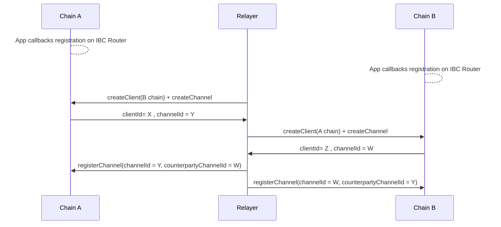
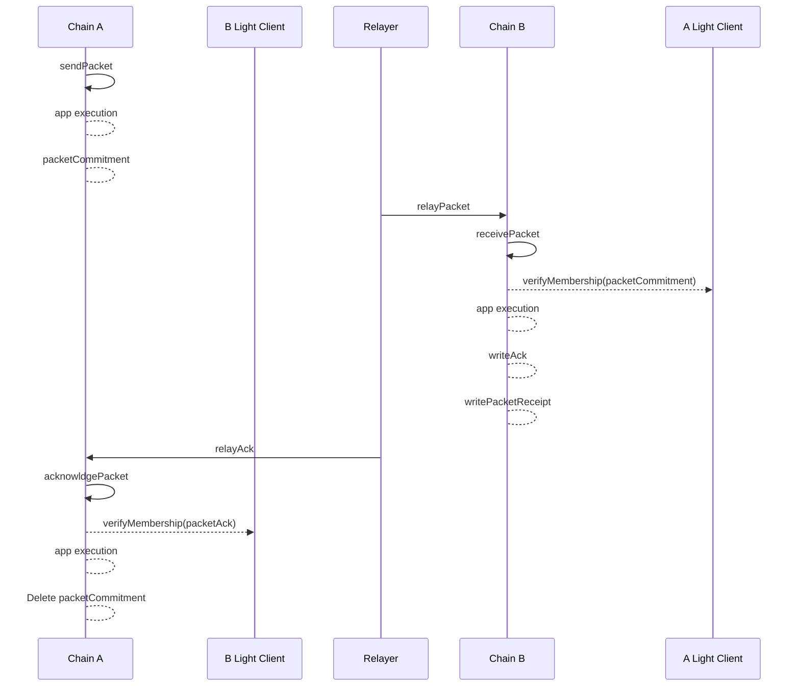
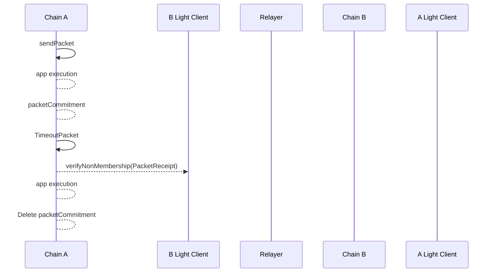

TODO : 

- Synopsis
- Motivation
- Architectural Sketch  
- Race condition reasoning 
- Improve conditions set and presentation 

## Synopsis 

The ICS-04 requires the ICS-02, the ICS-24 and the packet data strcuture including the multi-data packet as defined in [here](https://github.com/cosmos/ibc/pull/1149). // Note change with file location when merged 
It defines the mechanism to create the IBC version 2 protocol channels, to pair two channels on different chains linking them up with the underlying clients to establish the root of trust for the secure packet delivery, the packet-flow semantics, the mechanisms to route the verification to the underlying clients, and how to route packets to their specific IBC applications. 

### Motivation

TODO 

The interblockchain communication protocol uses a cross-chain message passing model. IBC *packets* are relayed from one blockchain to the other by external relayer processes. Chain `A` and chain `B` confirm new blocks independently, and packets from one chain to the other may be delayed, censored, or re-ordered arbitrarily. Packets are visible to relayers and can be read from a blockchain by any relayer process and submitted to any other blockchain. 

> **Example**: An application may wish to allow a single tokenized asset to be transferred between and held on multiple blockchains while preserving fungibility and conservation of supply. The application can mint asset vouchers on chain `B` when a particular IBC packet is committed to chain `B`, and require outgoing sends of that packet on chain `A` to escrow an equal amount of the asset on chain `A` until the vouchers are later redeemed back to chain `A` with an IBC packet in the reverse direction. This ordering guarantee along with correct application logic can ensure that total supply is preserved across both chains and that any vouchers minted on chain `B` can later be redeemed back to chain `A`.

The IBC version 2 will provide packet delivery between two chains communicating and identifying each other by on-chain light clients as specified in ICS-02.

### Definitions

`ConsensusState` is as defined in [ICS 2](../ics-002-client-semantics).

`hash` is a generic collision-resistant hash function, the specifics of which must be agreed on by the modules utilising the channel. `hash` can be defined differently by different chains.

`Identifier`, `get`, `set`, `delete`, `getCurrentHeight`, and module-system related primitives are as defined in [ICS 24](../ics-024-host-requirements).

A `channel` is a pipeline for exactly-once packet delivery between specific modules which are properly registered on separate blockchains, which has at least one end capable of sending packets and one end capable of receiving packets. All channels provide exactly-once packet delivery, meaning that a packet sent on one end of a channel is delivered no more and no less than once, eventually, to the other end. A `channel` is defined as a data structure responsible for maintaining the counterparty information necessary to establish the root of trust for securing the interchain communication: 

```typescript
interface Channel {
    clientId: bytes 
    counterpartyChannelId: bytes 
    keyPrefix: CommitmentPrefix 
}
```

Where :

- `clientId` is the local light client id of the counterparty chain. 
- `counterpartyChannelId` is the counterparty channel id. 
- `keyPrefix` is the key path that the counterparty will use to prove its store packet flow messages.

The `Packet`, `Payload`, `Encoding` and the `Acknowledgement` interfaces are as defined in [packet specification](https://github.com/cosmos/ibc/blob/c7b2e6d5184b5310843719b428923e0c5ee5a026/spec/core/v2/ics-004-packet-semantics/PACKET.md). For convenience, following we recall their structures.  

A `Packet`, in the interblockchain communication protocol, is a particular interface defined as follows:

```typescript
interface Packet {
    sourceId: bytes,
    destId: bytes,
    sequence: uint64
    timeout: uint64,
    data: [Payload]
}
```

- The `sourceId` is the identifier on the source chain.
- The `destId` is the identifier on the dest chain. 
- The `sequence` number corresponds to the order of sent packets.  
- The `timeout` indicates the UNIX timestamp in seconds and is encoded in LittleEndian. It must be passed on the destination chain and once elapsed, will no longer allow the packet processing, and will instead generate a time-out.

The `Payload` is a particular interface defined as follows:

```typescript
interface Payload {
    sourcePort: bytes,
    destPort: bytes,
    version: string,
    encoding: Encoding,
    appData: bytes,
}

enum Encoding {
  NO_ENCODING_SPECIFIED,
    PROTO_3,
    JSON,
    RLP,
    BCS,
}
```

- The `sourcePort` identifies the source application.
- The `destPort` identifies the destination application. 
- The `version` specifies the application version to be used.  
- The `encoding` allows the specification of custom data encoding among those agreed in the `Encoding` enum.   
- The `appData` is defined by the application of the associated modules. 

When the array of payloads, passed-in the packet, is populated with multiple values, the system will handle the packet as a multi-data packet. 

Note that a `Packet` is never directly serialised. Rather it is an intermediary structure used in certain function calls that may need to be created or processed by modules calling the IBC handler.

An `OpaquePacket` is a packet, but cloaked in an obscuring data type by the host state machine, such that a module cannot act upon it other than to pass it to the IBC handler. The IBC handler can cast a `Packet` to an `OpaquePacket` and vice versa.

```typescript
type OpaquePacket = object
```

The protocol introduces standardized packet receipts that will serve as sentinel values for the receiving chain to explicitly write to its store the outcome of a `recvPacket`.

```typescript
enum PacketReceipt {
  SUCCESSFUL_RECEIPT = byte{0x01},
  TIMEOUT_RECEIPT = byte{0x02}, 
}
```

The `Acknowledgement` is a particular interface defined as follows: 

```typescript
interface Acknowledgement {
    appAcknowledgement: [bytes]
}
```

- The `appAcknowledgement` is an array of bytes. Each element of the array identifies the source application acknowledgement. 

An application may not need to return an acknowledgment. In this case, it may return a sentinel acknowledgement value `SENTINEL_ACKNOWLEDGMENT` which will be the single byte in the byte array: `bytes(0x01)`. In this case, the IBC `acknowledgePacket` handler will still do the core IBC acknowledgment logic but it will not call the application's acknowledgePacket callback.

E.g. If a packet within 3 payloads intended for 3 different application is sent out, the expectation is that each of the payload is acted upon in the same order as it has been placed in the packet. Likewise, the array of appAcknowledgement is expected to be populated within the same order. 

- The `IBCRouter` contains a mapping from the application port and the supported callbacks and as well as a mapping from channelId to the underlying client.

```typescript
type IBCRouter struct {
    callbacks: portId -> [Callback]
    // clients: channelId -> Client // Needed? Maybe not anymore
}
```

The IBCRouter struct MUST be set by the application modules during the module setup to carry out the application registration procedure. 

- The `MAX_TIMEOUT_DELTA` is intendend as the max difference between currentTimestamp and timeoutTimestamp that can be given in input. 

```typescript
const MAX_TIMEOUT_DELTA = TBD
```

### Desired Properties

#### Efficiency

- The speed of packet transmission and confirmation should be limited only by the speed of the underlying chains.
- Proofs should be batchable where possible.
- The system MUST be able to process the multiple payloads contained in a single IBC packet, to reduce the amount of packet flows. 

#### Exactly-once delivery

- IBC packets sent on one end of a channel should be delivered exactly once to the other end.
- No network synchrony assumptions should be required for exactly-once safety.
  If one or both of the chains halt, packets may be delivered no more than once, and once the chains resume packets should be able to flow again.

#### Ordering

- IBC version 2 supports only *unordered* communications, thus, packets may be sent and received in any order. Unordered packets, have individual timeouts specified in seconds UNIX timestamp.

#### Permissioning

- Channels should be permissioned to the application registered on the local router. Thus only the modules registered on the local router, and so associated with the channel, should be able to send or receive on it.

## Technical Specification

### Preliminaries

#### Store paths

The ICS-04 use the protocol paths, defined in [ICS-24](../ics-024-host-requirements/README.md), `packetCommitmentPath`, `packetRecepitPath` and `packetAcknowledgementPath`. These paths MUST be used as the referece locations in the provableStore to prove respectilvey the packet commitment, the receipt and the acknowledgment to the counterparty chain. 

Thus Constant-size commitments to packet data fields are stored under the packet sequence number:

```typescript
function packetCommitmentPath(sourceId: bytes, sequence: BigEndianUint64): Path {
    return "commitments/channels/{sourceId}/sequences/{sequence}"
}
```

Absence of the path in the store is equivalent to a zero-bit.

Packet receipt data are stored under the `packetReceiptPath`. In the case of a successful receive, the destination chain writes a sentinel success value of `SUCCESSFUL_RECEIPT`. While in the case of a timeout, the destination chain SHOULD write a sentinel timeout value `TIMEOUT_RECEIPT` if the packet is received after the specified timeout.

```typescript
function packetReceiptPath(sourceId: bytes, sequence: BigEndianUint64): Path {
    return "receipts/channels/{sourceId}/sequences/{sequence}"
}
```

Packet acknowledgement data are stored under the `packetAcknowledgementPath`:

```typescript
function packetAcknowledgementPath(sourceId: bytes, sequence: BigEndianUint64): Path {
    return "acks/channels/{sourceId}/sequences/{sequence}"
}
```

Additionally, the ICS-04 suggests the privateStore paths for the `nextSequenceSend` , `channelPath` and `channelCreator` variable. Private paths are meant to be used locally in the chain. Thus their specification can be arbitrary changed by implementors at their will.  

- The `nextSequenceSend` is stored separately in the privateStore and tracks the sequence number for the next packet to be sent for a given source clientId.

```typescript
function nextSequenceSendPath(sourceId: bytes): Path {
    return "nextSequenceSend/{sourceId}"
}
```

- The `channelPath` is stored separately in the privateStore and tracks the channels paired with the other chains.

```typescript
function channelPath(channelId: Identifier): Path {
    return "channels/{channelId}"
}
```

- The `creatorPath` is stored separately in the privateStore and tracks the channels creator address.

```typescript
function creatorPath(channelId: Identifier, creator: address): Path {
    return "channels/{channelId}/creator/{creator}"
}
```

### Sub-protocols

TODO The architecture of clients, connections, channels and packets:

#### Setup

In order to create the conditions for the IBC version 2 packet stream, chain `A` and chain `B` MUST execute the entire setup following this set of procedures:  

- Application registration: during the application module setup the application callbacks MUST be registered on the local IBC router. 
- Client creation: chain `A` MUST create the `B` light client; `B` MUST create the `A` light client.   
- Channel creation: both chain `A` and chain `B` MUST create local IBC version 2 channels.  
- Channel registration: both chain MUST register their counterpartyId in the channel previously created.   

If any of the steps has been missed, this would result in an incorrect setup error during the packet handlers execution. 

Below we provide the setup sequence diagram. 
Note that as shown in the below setup sequence diagram the `createClient` message (as defined in ICS-02) may be bundled with the `createChannel` message in a single multiMsgTx.



Once the set up is executed the system should be in a similar state: 


While the application callbacks registration MUST be handled by the application module during initialization, and client creation is governed by [ICS-2](.ics-002-client-semantics/README.md), the channel creation and registration procedures are defined by ICS-04 and are detailed below.

##### Channel creation 

The channel creation process establishes the communication pathway between two chains. The procedure ensures both chains have a mutually recognized channel, facilitating packet transmission through authenticated streams.

```typescript
function createChannel(
    clientId: bytes,  
    counterpartyKeyPrefix: CommitmentPrefix) (channelId: bytes){

        // Implementation-Specific Input Validation 
        // All implementations MUST ensure the inputs value are properly validated and compliant with this specification 

        // Channel Checks
        channelId = generateIdentifier() 
        abortTransactionUnless(validateChannelIdentifier(channelId))
        abortTransactionUnless(getChannel(channelId)) === null)
        
        // Channel manipulation
        channel = Channel{
            clientId: clientId,
            counterpartyChannelId: "",  // This field it must be a blank field during the creation as it may be not known at the creation time. 
            keyPrefix: counterpartyKeyPrefix
        }

        // Local stores 
        privateStore.set(channelPath(channelId), channel)
        privateStore.set(creatorPath(channelId,msg.signer()), msg.signer())
        
        return channelId
}
```

Note that `createClient` message (as defined in ICS-02) may be bundled with the `createChannel` message in a single multiMsgTx. Successful execution of these messages on both chains is a prerequisite for the channel registration procedure, described below.

##### Channel registration and counterparty idenfitifcation  

Each IBC chain MUST have the ability to idenfity its counterparty. With a client, we can prove any key/value path on the counterparty. However, without knowing which identifier the counterparty uses when it sends messages to us, we cannot differentiate between messages sent from the counterparty to our chain vs messages sent from the counterparty with other chains. Most implementations will not be able to store the ICS-24 paths directly as a key in the global namespace, but will instead write to a reserved, prefixed keyspace so as not to conflict with other application state writes. 

To provide the chains a mechanism for the mutual and verifiable identification, the IBC version 2 defines the channel registration procedure to complement the store of the counterparty information in the channel that will include both its identifier for our chain and as well as the key prefix under which it will write the provable ICS-24 paths.

Thus, IBC version 2 introduces a new message `registerChannel` that will store the counterpartyChannelId into the local channel structure. Thus, if the `registerChannel` message is submitted to both sides correctly, then both sides have mirrored <channel,channel> pairs. Assuming they are correct, the underlying client on each side associated with the channel is unique and provides an authenticated stream of packet data between the two chains. If the `registerChannel` message submits the wrong counterpartyChannelId, this can lead to invalid behaviour; but this is equivalent to a relayer submitting an invalid channelId in place of a correct channelId for the desired chain. In the simplest case, we can rely on out-of-band social consensus to only send on valid <channel, channel> pairs that represent a connection between the desired chains of the user; just as we currently rely on out-of-band social consensus that a given clientID and channel built on top of it is the valid, canonical identifier of our desired chain.

```typescript
function registerChannel(
    channelId: bytes, // local chain channel identifier
    counterpartyChannelId: bytes, // the counterparty's channel identifier
    authentication: data, // implementation-specific authentication data
) {
    // Implementation-Specific Input Validation 
    // All implementations MUST ensure the inputs value are properly validated and compliant with this specification

    // custom-authentication 
    assert(verify(authentication))

    // Channel Checks
    abortTransactionUnless(validatedIdentifier(channelId))
    channel=getChannel(channelId) 
    abortTransactionUnless(channel !== null)
    
    // Creator Address Checks
    abortTransactionUnless(msg.signer()===getCreator(channelId,msg.signer()))

    // Channel manipulation
    channel.counterpartyChannelId=counterpartyChannelId

    // Client registration on the router 
    //router.clients[sourceChannelId]=channel.clientId  // clients on router removed

    // Local Store
    privateStore.set(channelPath(channelId), channel)

}
```

The `registerChannel` method allows for authentication data that implementations may verify before storing the provided counterparty identifier. The strongest authentication possible is to have a valid clientState and consensus state of our chain in the authentication along with a proof it was stored at the claimed counterparty identifier.
A simpler but weaker authentication would simply be to check that the `registerChannel` message is sent by the same relayer that initialized the client. This would make the client parameters completely initialized by the relayer. Thus, users must verify that the client is pointing to the correct chain and that the counterparty identifier is correct as well before using the lite channel identified by the provided client-client pair.

```typescript
// getChannel retrieves the stored channel given the counterparty channel-id. 
function getChannel(channelId: bytes): Channel {
    return privateStore.get(channelPath(channelId)) 
}
```

```typescript
// getChannel retrieves the stored channel given the counterparty channel-id. 
function getCreator(channelId: bytes, msgSigner: address): address {
    return privateStore.get(creatorPath(channelId,msgSigner)) 
}
```

Thus, once two chains have set up clients, created channel and registered channels for each other with specific Identifiers, they can send IBC packets using the packet interface defined before and the packet handlers that the ICS-04 defines below. 

The packets will be addressed **directly** with the channels that have semantic link to the underlying light clients. Thus there are **no** more handshakes necessary. Instead the packet sender must be capable of providing the correct <channel,channel> pair.

If the setup has been executed correctly, then the correctness and soundness properties of IBC holds. IBC packet flow is guaranteed to succeed. If a user sends a packet with the wrong destination channel, then as we will see it will be impossible for the intended destination to correctly verify the packet thus, the packet will simply time out.

#### Packet Flow Function Handlers 

In the IBC protocol version 2, the packet flow is managed by four key function handlers, each of which is responsible for distinct stages in the packet lifecycle:

- `sendPacket`
- `receivePacket`
- `acknowledgePacket`
- `timeoutPacket`

For each handler, the ICS-04 specification defines a set of conditions that the IBC protocol must adhere to. These conditions ensure the proper execution of the handler by establishing requirements before execution (ante-conditions), possible error states during execution (error-conditions), and expected outcomes after execution (post-conditions). Thus, implementation that wants to comply with the specification of the IBC version 2 protocol MUST adheres to the condition set defined in the specific handler section below.

Note that the execution of the four handler above described, upon a unique packet, cannot be combined in any arbitrary order. We provide the two possible example scenarios described with sequence diagrmas. 

Scenario execution with acknowledgement `A` to `B` - set of actions: `sendPacket` -> `receivePacket` -> `acknowledgePacket`  



Scenario timeout execution `A` to `B` - set of actions: `sendPacket` -> `timeoutPacket`  



Given a configuration where we are sending a packet from `A` to `B` then chain `A` can call either, `sendPacket`,`acknowledgePacket` and `timeoutPacket` while chain `B` can only execute the `receivePacket` handler. 

##### Sending packets

The `sendPacket` function is called by the IBC handler when an IBC packet is submitted to the newtwork in order to send *data* in the form of an IBC packet. ∀ `Payload` included in the `packet.data`, which may refer to a different application, the application specific callbacks are retrieved from the IBC router and the `onSendPacket` is the then triggered on the specified application. The `onSendPacket` executes the application logic. Once all payloads contained in the `packet.data` have been acted upon, the packet commitment is generated and the sequence number bind to the sourceId is incremented. 

The `sendPacket` core function MUST execute the applications logic atomically triggering the `onSendPacket` callback ∀ application contained in the `packet.data` payload.

The IBC handler performs the following steps in order:

- Checks that the underlying clients is properly registered in the IBC router. 
- Checks that the timeout specified has not already passed on the destination chain
- Executes the `onSendPacket` ∀ Payload included in the packet. 
- Stores a constant-size commitment to the packet data & packet timeout
- Increments the send sequence counter associated with the channel
- Returns the sequence number of the sent packet

Note that the full packet is not stored in the state of the chain - merely a short hash-commitment to the data & timeout value. The packet data can be calculated from the transaction execution and possibly returned as log output which relayers can index.

###### Ante-Conditions 

The Ante-Conditions defines what MUST be accomplished before two chains can start sending IBC v2 packets. 

For the `sendPacket` handler, both chains `A` and `B` MUST have executed independently the setup procedure previosuly described. 

###### Error-Conditions 

The Error-Conditions defines the set of condition that MUST trigger an error. For the `sendPacket` handler we can divide the source of errors in three main categories: 

- Incorrect setup
- Invalid timeoutTimestamp
- Unsuccessful payload execution

###### Post-Conditions On Success 

The Post-Conditions on Success defines which state changes MUST have occurred if the `sendPacket` handler has been sucessfully executed.  

- All the application contained in the payload have properly terminated the `onSendPacket` callback execution. 
- The packetCommitment has been generated. 
- The sequence number bind to sourceId MUST have been incremented by 1. 

###### Post-Conditions On Error

The Post-Conditions on Error defines the states that Must be unchanged given an error occurred during the `sendPacket` handler.   

- If one payload fail, then all state changes happened on the sucessfull application execution must be reverted.
- No packetCommitment has been generated.
- The sequence number bind to sourceId MUST be unchanged. 

###### Pseudo-Code 

The ICS04 provides an example pseudo-code that enforce the above described conditions so that the following sequence of steps must occur for a packet to be sent from module *1* on machine *A* to module *2* on machine *B*, starting from scratch.
 
```typescript
function sendPacket(
    sourceChannelId: bytes,
    timeoutTimestamp: uint64,
    payloads: []byte
    ) {

    // Setup checks - channel and client 
    channel = getChannel(sourceChannelId)
    client = channel.clientId // removed client on router --> client = router.clients[sourceChannelId] // can it be client = channel.clientId
    assert(client !== null)
    
    // Evaluate usefulness of this check 
   // assert(client.id === channel.clientId)
    
    // timeoutTimestamp checks
    // disallow packets with a zero timeoutTimestamp
    assert(timeoutTimestamp !== 0) 
    // disallow packet with timeoutTimestamp less than currentTimestamp and timeoutTimestamp value bigger than currentTimestamp + MaxTimeoutDelta 
    assert(currentTimestamp() < timeoutTimestamp < currentTimestamp() + MAX_TIMEOUT_DELTA) // Mmm
    
    // if the sequence doesn't already exist, this call initializes the sequence to 0
    sequence = privateStore.get(nextSequenceSendPath(sourceChannelId))
    
    // Executes Application logic ∀ Payload
    for payload in payloads
        cbs = router.callbacks[payload.sourcePort]
        success = cbs.onSendPacket(sourceChannelId,channel.counterpartyChannelId,payload)
        // IMPORTANT: if the one of the onSendPacket fails, the transaction is aborted and the potential state changes are reverted. This ensure that 
        // the post conditions on error are always respected.  
        
        // payload execution check  
        abortUnless(success)

    packet = Packet {
            sourceId: sourceChannelId,
            destId: channel.counterpartyChannelId, 
            sequence: sequence,
            timeoutTimestamp: timeoutTimestamp, 
            payload: paylodas
            }

    // store packet commitment using commit function defined in [packet specification](https://github.com/cosmos/ibc/blob/c7b2e6d5184b5310843719b428923e0c5ee5a026/spec/core/v2/ics-004-packet-semantics/PACKET.md)
    commitment=commitV2Packet(packet) 

    provableStore.set(packetCommitmentPath(sourceChannelId, sequence),commitment)
    
    // increment the sequence. Thus there are monotonically increasing sequences for packet flow for a given clientId
    privateStore.set(nextSequenceSendPath(sourceChannelId), sequence+1)

    // log that a packet can be safely sent
    // Discussion needed: What we need to emit the log? 
    emitLogEntry("sendPacket", {
      sourceId: sourceChannelId, 
      destId: channel.counterpartyChannelId, 
      sequence: sequence,
      data: data,
      timeoutTimestamp: timeoutTimestamp, 
    })
    
}
```

##### Receiving packets

The `recvPacket` function is called by the IBC handler in order to receive an IBC packet sent on the corresponding client on the counterparty chain.

Atomically in conjunction with calling `recvPacket`, the modules/application referred in the `packet.data` payload MUST execute the specific application logic callaback.

The IBC handler performs the following steps in order:

- Checks that the clients is properly set in IBC router
- Checks that the packet metadata matches the channel & connection information
- Checks that the timeout timestamp is not yet passed
- Checks the inclusion proof of packet data commitment in the outgoing chain's state
- Sets a store path to indicate that the packet has been received
- Write the acknowledgement into the provableStore. 

We pass the address of the `relayer` that signed and submitted the packet to enable a module to optionally provide some rewards. This provides a foundation for fee payment, but can be used for other techniques as well (like calculating a leaderboard).

###### Ante-Conditions 

Given that chain `A` has sucessfully sent a packet, the ante-conditions defines what MUST be accomplished before chain `B` can properly receive the IBC v2 packets. 

- Chain `A` MUST have stored the packetCommitment under the keyPrefix registered in the chain `B` channelEnd. 
- TimeoutTimestamp MUST not have elasped yet. 
- PacketReceipt for the specific keyPrefix and sequence MUST be empty (e.g. receivePacket has not been called yet)

###### Error-Conditions 

The Error-Conditions defines the set of condition that MUST trigger an error. For the `receivePacket` handler we can divide the source of errors in three main categories: 

- Packet Errors: invalid packetCommitment, packetReceipt already exist
- Invalid timeoutTimestamp
- Unsuccessful payload execution

###### Post-Conditions On Success 

The Post-Conditions on Success defines which state changes MUST have occurred if the `receivePacket` handler has been sucessfully executed.  

- All the application pointed in the payload have properly terminated the `onReceivePacket` callback execution. 
- The packetReceipt has been written. 
- The acknowledgemnet has been written. 

###### Post-Conditions On Error

The Post-Conditions on Error defines the states that Must be unchanged given an error occurred during the `onReceivePacket` handler.   

- If one payload fail, then all state changes happened on the sucessfull `onReceivePacket` application callback execution MUST be reverted.
- If timeoutTimestamp has elapsed then no state changes occurred. (Is this true? Shall we write the timeout_sentinel_receipt?)
- mmmm. 

###### Pseudo-Code 

The ICS04 provides an example pseudo-code that enforce the above described conditions so that the following sequence of steps must occur for a packet to be received from module *1* on machine *A* to module *2* on machine *B*.
 
```typescript
function recvPacket(
  packet: OpaquePacket,
  proof: CommitmentProof,
  proofHeight: Height,
  relayer: string) {

    // Channel and Client Checks
    channel = getChannel(packet.destId)     // if I use packet.dest which is a channelId
    client = channel.clientId // removed client on router --> client = router.clients[packet.destId] // client = channel.clientId
    assert(client !== null)
    //assert(client.id === channel.clientId) // useful?
    
    //assert(packet.sourceId == channel.counterpartyChannelId) Unnecessary?

    // verify timeout
    assert(packet.timeoutTimestamp === 0)  
    assert(currentTimestamp() + MAX_TIMEOUT_DELTA < packet.timeoutTimestamp)

    // verify the packet receipt for this packet does not exist already 
    packetReceipt = provableStore.get(packetReceiptPath(packet.destId, packet.sequence))
    abortUnless(packetReceipt === null)

    //////// verify commitment 
    
    // 1. retrieve keys 
    packetPath = packetCommitmentPath(packet.destId, packet.sequence)
    merklePath = applyPrefix(channel.keyPrefix, packetPath)
    
    // 2. reconstruct commit value based on the passed-in packet  
    commit = commitV2Packet(packet) 
    
    // 3. call client verify memership 
    assert(client.verifyMembership(
        client.clientState 
        proofHeight,
        proof,
        merklePath,
        commit))

    multiAck = Acknowledgement {}
    // Executes Application logic ∀ Payload
    for payload in packet.data 
        cbs = router.callbacks[payload.destPort]
        ack = cbs.onReceivePacket(packet.destId,payload)
        // the onReceivePacket returns the ack but does not write it 
        // IMPORTANT: if the ack is error, then the callback reverts its internal state changes, but the entire tx continues
        multiAck.add(ack)

    // NOTE: Currently only process synchronous acks. 
    if multiAck != nil {
        writeAcknowledgement(packet, multiAck)
    }

    // Provable Stores 
    // we must set the receipt so it can be verified on the other side
    // it's the sentinel success receipt: []byte{0x01}
    provableStore.set(
        packetReceiptPath(packet.destId, packet.sequence),
        SUCCESSFUL_RECEIPT
    )

    // log that a packet has been received
    emitLogEntry("recvPacket", {
      data: packet.data
      timeoutTimestamp: packet.timeoutTimestamp,
      sequence: packet.sequence,
      sourceId: packet.sourceId,
      destId: packet.destId,
      relayer: relayer 
    })
    
}
```

##### Writing acknowledgements

NOTE: Currently only process synchronous acks. 

The `writeAcknowledgement` function is called by the IBC handler once all `onRecvPacket` application modules callabacks have been triggered and have returned their specific acknowledgment in order to write data which resulted from processing an IBC packet that the sending chain can then verify, a sort of "execution receipt" or "RPC call response".

This is a synchronous acknowledgement, thus `writeAcknowledgement` MUST be called in the same transaction (atomically) with `recvPacket` and and application callback logic execution.

`writeAcknowledgement` *does not* check if the packet being acknowledged was actually received, because this would result in proofs being verified twice for acknowledged packets. This aspect of correctness is the responsibility of the IBC handler.

The IBC handler performs the following steps in order:

- Checks that an acknowledgement for this packet has not yet been written
- Sets the opaque acknowledgement value at a store path unique to the packet

```typescript
function writeAcknowledgement(
  packet: Packet,
  acknowledgement: Acknowledgement) {
    // acknowledgement must not be empty
    abortTransactionUnless(len(acknowledgement) !== 0)

    // cannot already have written the acknowledgement
    abortTransactionUnless(provableStore.get(packetAcknowledgementPath(packet.destId, packet.sequence) === null))

    // create the acknowledgement coomit using the function defined in [packet specification](https://github.com/cosmos/ibc/blob/c7b2e6d5184b5310843719b428923e0c5ee5a026/spec/core/v2/ics-004-packet-semantics/PACKET.md)
    commit=commitV2Acknowledgment(acknowledgement)
    
    provableStore.set(
    packetAcknowledgementPath(packet.destId, packet.sequence),commit)

    // log that a packet has been acknowledged
    emitLogEntry("writeAcknowledgement", {
      sequence: packet.sequence,
      sourceId: packet.sourceId,
      destId: packet.destId,
      timeoutTimestamp: packet.timeoutTimestamp,
      data: packet.data,
      acknowledgement
    })
}
```

##### Processing acknowledgements

The `acknowledgePacket` function is called by the IBC handler to process the acknowledgement of a packet previously sent by the source chain. 

The `acknowledgePacket` also cleans up the packet commitment, which is no longer necessary since the packet has been received and acted upon.

The IBC hanlder MUST atomically trigger the callbacks execution of appropriate application acknowledgement-handling logic in conjunction with calling `acknowledgePacket`.

We pass the `relayer` address just as in [Receiving packets](#receiving-packets) to allow for possible incentivization here as well.

###### Ante-Conditions 

Given that at this point of the packet flow, chain `B` has sucessfully received a packet, the ante-conditions defines what MUST be accomplished before chain `A` can properly execute the `acknowledgePacket` for the IBC v2 packet. 

- Acknowledgment MUST be set in the ackPath. 
- PacketCommitment has not been cleared out yet. 

###### Error-Conditions 

The Error-Conditions defines the set of condition that MUST trigger an error. For the `acknowledgePacket` handler we can divide the source of errors in three main categories: 

- packetCommitment already clreared out
- Unset Acknowledgment
- Unsuccessful payload execution

###### Post-Conditions On Success 

The Post-Conditions on Success defines which state changes MUST have occurred if the `acknowledgePacket` handler has been sucessfully executed.  

- All the application pointed in the payload have properly terminated the `onAcknowledgePacket` callback execution. 
- The packetCommitment has been cleared out. 

###### Post-Conditions On Error

The Post-Conditions on Error defines the states that Must be unchanged given an error occurred during the `onAcknowledgePacket` handler.   

- If one payload fail, then all state changes happened on the sucessfull `onAcknowledgePacket` application callback execution MUST be reverted.
- The packetCommitment has not been cleared out
- mmmm. 

###### Pseudo-Code 

The ICS04 provides an example pseudo-code that enforce the above described conditions so that the following sequence of steps must occur for a packet to be acknowledged from module *1* on machine *A* to module *2* on machine *B*.

```typescript
function acknowledgePacket(
    packet: OpaquePacket,
    acknowledgement: Acknowledgement,
    proof: CommitmentProof,
    proofHeight: Height,
    relayer: string
) {

    // Channel and Client Checks
    channel = getChannel(packet.sourceId)
    client = channel.clientId //client = router.clients[packet.sourceId]

    assert(client !== null)
    //assert(client.id === channel.clientId)
    
    //assert(packet.destId == channel.counterpartyChannelId)
   
    // verify we sent the packet and haven't cleared it out yet
    assert(provableStore.get(packetCommitmentPath(packet.sourceId, packet.sequence)) ===  commitV2Packet(packet))

    // verify that the acknowledgement exist at the desired path  
    ackPath = packetAcknowledgementPath(packet.destId, packet.sequence)
    merklePath = applyPrefix(channel.keyPrefix, ackPath)
    assert(client.verifyMembership(
        client.clientState
        proofHeight,
        proof,
        merklePath,
        acknowledgement
    ))

     // Executes Application logic ∀ Payload
    nAck=0
    for payload in packet.data
        cbs = router.callbacks[payload.sourcePort]
        success= cbs.OnAcknowledgePacket(packet.sourceId,payload, acknowledgement.appAcknowledgement[nAck])
        abortUnless(success)
        nAck++ 

    channelStore.delete(packetCommitmentPath(packet.sourceId, packet.sequence))
}
```

##### Acknowledgement Envelope

The acknowledgement returned from the remote chain is defined as arbitrary bytes in the IBC protocol. This data
may either encode a successful execution or a failure (anything besides a timeout). There is no generic way to
distinguish the two cases, which requires that any client-side packet visualiser understands every app-specific protocol
in order to distinguish the case of successful or failed relay. In order to reduce this issue, we offer an additional
specification for acknowledgement formats, which [SHOULD](https://www.ietf.org/rfc/rfc2119.txt) be used by the
app-specific protocols.

```proto
message Acknowledgement {
  oneof response {
    bytes result = 21;
    string error = 22;
  }
}
```

If an application uses a different format for acknowledgement bytes, it MUST not deserialise to a valid protobuf message
of this format. Note that all packets contain exactly one non-empty field, and it must be result or error.  The field
numbers 21 and 22 were explicitly chosen to avoid accidental conflicts with other protobuf message formats used
for acknowledgements. The first byte of any message with this format will be the non-ASCII values `0xaa` (result)
or `0xb2` (error).

#### Timeouts

Application semantics may require some timeout: an upper limit to how long the chain will wait for a transaction to be processed before considering it an error. Since the two chains have different local clocks, this is an obvious attack vector for a double spend - an attacker may delay the relay of the receipt or wait to send the packet until right after the timeout - so applications cannot safely implement naive timeout logic themselves.

Note that in order to avoid any possible "double-spend" attacks, the timeout algorithm requires that the destination chain is running and reachable. One can prove nothing in a complete network partition, and must wait to connect; the timeout must be proven on the recipient chain, not simply the absence of a response on the sending chain.

##### Sending end

The `timeoutPacket` function is called by a module which originally attempted to send a packet to a counterparty module,
where the timeout height or timeout timestamp has passed on the counterparty chain without the packet being committed, to prove that the packet
can no longer be executed and to allow the calling module to safely perform appropriate state transitions.

Calling modules MAY atomically execute appropriate application timeout-handling logic in conjunction with calling `timeoutPacket`.

The `timeoutPacket` checks the absence of the receipt key (which will have been written if the packet was received). 
We pass the `relayer` address just as in [Receiving packets](#receiving-packets) to allow for possible incentivization here as well.

###### Ante-Conditions 

The ante-conditions defines what MUST be accomplished before chain `A` can properly execute the `timeoutPacket` for the IBC v2 packet. 

- PacketReceipt MUST be empty. 
- PacketCommitment has not been cleared out yet. 

###### Error-Conditions 

The Error-Conditions defines the set of condition that MUST trigger an error. For the `acknowledgePacket` handler we can divide the source of errors in three main categories: 

- packetCommitment already clreared out
- PacketReceipt is not empty
- Unsuccessful payload execution

###### Post-Conditions On Success 

The Post-Conditions on Success defines which state changes MUST have occurred if the `timeoutPacket` handler has been sucessfully executed.  

- All the application pointed in the payload have properly terminated the `onTimeoutPacket` callback execution, reverting the state changes occured in the `onSendPacket`. 
- The packetCommitment has been cleared out. 

###### Post-Conditions On Error

The Post-Conditions on Error defines the states that Must be unchanged given an error occurred during the `onAcknowledgePacket` handler.   

- If one payload fail, then all state changes happened on the sucessfull `onTimeoutPacket` application callback execution MUST be reverted. Mmm Note that here we may get stucked if one onTimeoutPacket applications always fails. 
- The packetCommitment has not been cleared out

###### Pseudo-Code 

```typescript
function timeoutPacket(
    packet: OpaquePacket,
    proof: CommitmentProof,
    proofHeight: Height,
    relayer: string
) { 
    // Channel and Client Checks
    channel = getChannel(packet.sourceId)
    client = channel.clientId //client = router.clients[packet.sourceId]

    assert(client !== null)
    // assert(client.id === channel.clientId)
    
    //assert(packet.destId == channel.counterpartyChannelId)

    // verify we sent the packet and haven't cleared it out yet
    assert(provableStore.get(packetCommitmentPath(packet.sourceId, packet.sequence))
           === commitV2Packet(packet))

    // get the timestamp from the final consensus state in the channel path
    var proofTimestamp
    proofTimestamp = client.getTimestampAtHeight(proofHeight)
    assert(err != nil)

    // check that timeout height or timeout timestamp has passed on the other end
    asert(packet.timeoutTimestamp > 0 && proofTimestamp >= packet.timeoutTimestamp)

    // verify there is no packet receipt --> receivePacket has not been called 
    receiptPath = packetReceiptPath(packet.destId, packet.sequence)
    merklePath = applyPrefix(channel.keyPrefix, receiptPath)
    assert(client.verifyNonMembership(
        client.clientState,
        proofHeight,
        proof,
        merklePath
    ))

    for payload in packet.data
        cbs = router.callbacks[payload.sourcePort]
        success=cbs.OnTimeoutPacket(packet.sourceId,payload)
        abortUnless(success)

    channelStore.delete(packetCommitmentPath(packet.sourceId, packet.sequence))
}
```

##### Cleaning up state

Packets must be acknowledged in order to be cleaned-up.

### Dataflow visualisation: A day in the life of a packet

TODO 

The bidirectional packet stream can be only started after all the procedure above have been succesfully executed, individually, by both chains. Otherwise, any sent packet cannot be received and will timeout.  

TODO Write Setup. 

TODO Modify Sketch 


#### Reasoning about race conditions

TODO 

##### Identifier allocation

There is an unavoidable race condition on identifier allocation on the destination chain. Modules would be well-advised to utilise pseudo-random, non-valuable identifiers. Managing to claim the identifier that another module wishes to use, however, while annoying, cannot man-in-the-middle a handshake since the receiving module must already own the port to which the handshake was targeted.

##### Timeouts / packet confirmation

There is no race condition between a packet timeout and packet confirmation, as the packet will either have passed the timeout height prior to receipt or not.

##### Man-in-the-middle attacks during handshakes

Verification of cross-chain state prevents man-in-the-middle attacks for both connection handshakes & channel handshakes since all information (source, destination client, channel, etc.) is known by the module which starts the handshake and confirmed prior to handshake completion.

##### Clients unreachability with in-flight packets

If a client has been frozen while packets are in-flight, the packets can no longer be received on the destination chain and can be timed-out on the source chain.

### Properties & Invariants

- Packets are delivered exactly once, assuming that the chains are live within the timeout window, and in case of timeout can be timed-out exactly once on the sending chain.

## Backwards Compatibility

TODO Mmmm ..Not applicable.

## Forwards Compatibility

Data structures & encoding can be versioned at the application level. Core logic is completely agnostic to packet.data formats, which can be changed by the application modules any way they like at any time.

## Example Implementations

- Implementation of ICS 04 in Go can be found in [ibc-go repository](https://github.com/cosmos/ibc-go).
- Implementation of ICS 04 in Rust can be found in [ibc-rs repository](https://github.com/cosmos/ibc-rs).

## History

Oct X, 2024 - [Draft submitted](https://github.com/cosmos/ibc/pull/1148)

## Copyright

All content herein is licensed under [Apache 2.0](https://www.apache.org/licenses/LICENSE-2.0).
