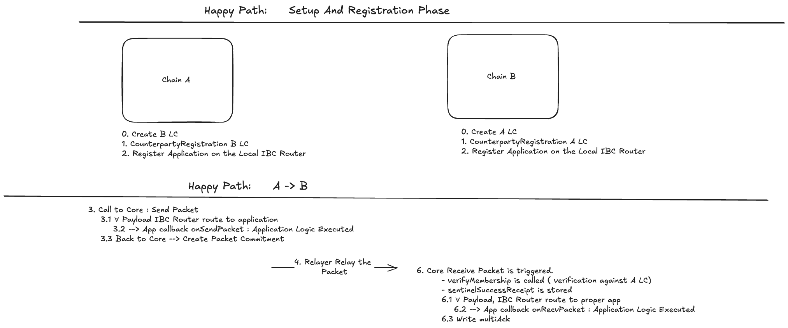

## Synopsis

The ICS-04 defines the mechanism to bidirectionally set up clients for each pair of communicating chains with specific Identifiers to establish the ground truth for the secure packet delivery, the packet data strcuture including the multi-data packet, the packet-flow semantics, the mechanisms to route the verification to the underlying clients, and how to route packets to their specific IBC applications. 

### Motivation

The interblockchain communication protocol uses a cross-chain message passing model. IBC *packets* are relayed from one blockchain to the other by external relayer processes. Chain `A` and chain `B` confirm new blocks independently, and packets from one chain to the other may be delayed, censored, or re-ordered arbitrarily. Packets are visible to relayers and can be read from a blockchain by any relayer process and submitted to any other blockchain. 

> **Example**: An application may wish to allow a single tokenized asset to be transferred between and held on multiple blockchains while preserving fungibility and conservation of supply. The application can mint asset vouchers on chain `B` when a particular IBC packet is committed to chain `B`, and require outgoing sends of that packet on chain `A` to escrow an equal amount of the asset on chain `A` until the vouchers are later redeemed back to chain `A` with an IBC packet in the reverse direction. This ordering guarantee along with correct application logic can ensure that total supply is preserved across both chains and that any vouchers minted on chain `B` can later be redeemed back to chain `A`.

The IBC version 2 will provide packet delivery between two chains communicating and identifying each other by on-chain light clients as specified in ICS-02.

### Definitions

`ConsensusState` is as defined in [ICS 2](../ics-002-client-semantics).
// NOTE what about Port and Capabilities? 
`Port` and `authenticateCapability` are as defined in [ICS 5](../ics-005-port-allocation).

`hash` is a generic collision-resistant hash function, the specifics of which must be agreed on by the modules utilising the channel. `hash` can be defined differently by different chains.

`Identifier`, `get`, `set`, `delete`, `getCurrentHeight`, and module-system related primitives are as defined in [ICS 24](../ics-024-host-requirements).

`Counterparty` is the data structure responsible for maintaining the counterparty information necessary to establish the ground truth for securing the interchain communication.

```typescript
interface Counterparty {
    clientId: bytes 
    channelId: bytes
    keyPrefix: CommitmentPrefix 
}
```

The `Packet`, `Payload`, `Encoding` and the `Acknowledgement` interfaces are as defined in [packet specification](https://github.com/cosmos/ibc/blob/c7b2e6d5184b5310843719b428923e0c5ee5a026/spec/core/v2/ics-004-packet-semantics/PACKET.md). For convenience, following we recall their structures.  

A `Packet`, in the interblockchain communication protocol, is a particular interface defined as follows:

```typescript
interface Packet {
    sourceIdentifier: bytes,
    destIdentifier: bytes,
    sequence: uint64
    timeout: uint64,
    data: [Payload]
}
```

- The `sourceIdentifier` derived from the `clientIdentifier` will tell the IBC router which chain a received packet came from.
- The `destIdentifier` derived from the `clientIdentifier` will tell the IBC router which chain to send the packets to. 
- The `sequence` number corresponds to the order of sends and receives, where a packet with an earlier sequence number MUST be sent and received (NOTE: not sure about received) before a packet with a later sequence number.
- The `timeout` indicates the UNIX timestamp in seconds and is encoded in LittleEndian. It must be passed on the destination chain and once elapsed, will no longer allow the packet processing, and will instead generate a time-out.

The `Payload` is a particular interface defined as follows:

```typescript
interface Payload {
    sourcePort: bytes,
    destPort: bytes,
    version: string,
    encoding: Encoding,
    appData: bytes,
}

enum Encoding {
  NO_ENCODING_SPECIFIED,
    PROTO_3,
    JSON,
    RLP,
    BCS,
}
```

- The `sourcePort` identifies the source application.
- The `destPort` identifies the destination application. 
- The `version` specifies the application version to be used.  
- The `encoding` allows the specification of custom data encoding among those agreed in the `Encoding` enum.   
- The `appData` is defined by the application of the associated modules. 

When the array of payloads, passed-in the packet, is populated with multiple values, the system will handle the packet as a multi-data packet. 

Note that a `Packet` is never directly serialised. Rather it is an intermediary structure used in certain function calls that may need to be created or processed by modules calling the IBC handler.

An `OpaquePacket` is a packet, but cloaked in an obscuring data type by the host state machine, such that a module cannot act upon it other than to pass it to the IBC handler. The IBC handler can cast a `Packet` to an `OpaquePacket` and vice versa.

```typescript
type OpaquePacket = object
```

The protocol introduces standardized packet receipts that will serve as sentinel values for the receiving chain to explicitly write to its store the outcome of a `recvPacket`.

```typescript
enum PacketReceipt {
  SUCCESSFUL_RECEIPT,
  TIMEOUT_RECEIPT,
}
```

The `Acknowledgement` is a particular interface defined as follows: 

```typescript
interface Acknowledgement {
    appAcknowledgement: [bytes]
}
```

- The `appAcknowledgement` is an array of bytes. Each element of the array identifies the source application acknowledgement. 

An application may not need to return an acknowledgment. In this case, it may return a sentinel acknowledgement value `SENTINEL_ACKNOWLEDGMENT` which will be the single byte in the byte array: `bytes(0x01)`. In this case, the IBC `acknowledgePacket` handler will still do the core IBC acknowledgment logic but it will not call the application's acknowledgePacket callback.

E.g. If a packet within 3 payloads intended for 3 different application is sent out, the expectation is that each of the payload is acted upon in the same order as it has been placed in the packet. Likewise, the array of appAcknowledgement is expected to be populated within the same order. 

### Desired Properties

#### Efficiency

- The speed of packet transmission and confirmation should be limited only by the speed of the underlying chains.
- Proofs should be batchable where possible.
- The system MUST be able to process the multiple payloads contained in a single IBC packet, to reduce the amount of packet flows. 

#### Exactly-once delivery

- IBC packets sent on one end of a channel should be delivered exactly once to the other end.
- No network synchrony assumptions should be required for exactly-once safety.
  If one or both of the chains halt, packets may be delivered no more than once, and once the chains resume packets should be able to flow again.

#### Ordering

- IBC version 2 supports only *unordered* communications, thus, packets may be sent and received in any order. Unordered packets, have individual timeouts specified in seconds UNIX timestamp.

#### Permissioning

// NOTE - here what about capabilities and permissions? 

- Channels should be permissioned to one module on each end, determined during the handshake and immutable afterwards (higher-level logic could tokenize channel ownership by tokenising ownership of the port).
  Only the module associated with a channel end should be able to send or receive on it.

## Technical Specification

### Dataflow visualisation

TODO The architecture of clients, connections, channels and packets:


### Preliminaries

#### Store paths

The protocol defines the paths `packetCommitmentPath`, `packetRecepitPath` and `packetAcknowledgementPath` that MUST be used as the referece locations in the provableStore to prove respectilvey the packet commitment, the receipt and the acknowledgment to the counterparty chain. 

Thus Constant-size commitments to packet data fields are stored under the packet sequence number:

```typescript
function packetCommitmentPath(sourceId: bytes, sequence: BigEndianUint64): Path {
    return "commitments/channels/{sourceId}/sequences/{sequence}"
}
```

Absence of the path in the store is equivalent to a zero-bit.

Packet receipt data are stored under the `packetReceiptPath`. In the case of a successful receive, the destination chain writes a sentinel success value of `SUCCESSFUL_RECEIPT`. While in the case of a timeout, the destination chain MAY (May?Must?Should?Mmm) write a sentinel timeout value `TIMEOUT_RECEIPT` if the packet is received after the specified timeout.

```typescript
function packetReceiptPath(sourceId: bytes, sequence: BigEndianUint64): Path {
    return "receipts/channels/{sourceId}/sequences/{sequence}"
}
```

Packet acknowledgement data are stored under the `packetAcknowledgementPath`:

```typescript
function packetAcknowledgementPath(sourceId: bytes, sequence: BigEndianUint64): Path {
    return "acks/channels/{sourceId}/sequences/{sequence}"
}
```

- The `nextSequenceSend` is stored separately in the privateStore and tracks the sequence number for the next packet to be sent for a given source clientId.

```typescript
function nextSequenceSendPath(sourceID: bytes): Path {
    return "nextSequenceSend/clients/{sourceID}
}
```

### Sub-protocols

> Note: If the host state machine is utilising object capability authentication (see [ICS 005](../ics-005-port-allocation)), all functions utilising ports take an additional capability parameter.

#### Counterparty Idenfitifcation and Registration 

A client MUST have the ability to idenfity its counterparty. With a client, we can prove any key/value path on the counterparty. However, without knowing which identifier the counterparty uses when it sends messages to us, we cannot differentiate between messages sent from the counterparty to our chain vs messages sent from the counterparty with other chains. Most implementations will not be able to store the ICS-24 paths directly as a key in the global namespace, but will instead write to a reserved, prefixed keyspace so as not to conflict with other application state writes. Thus the counteparty information we must have includes both its identifier for our chain as well as the key prefix under which it will write the provable ICS-24 paths.

Thus, IBC version 2 introduces a new message `RegisterCounterparty` that will associate the counterparty client of our chain with our client of the counterparty. Thus, if the `RegisterCounterparty` message is submitted to both sides correctly. Then both sides have mirrored <client,client> pairs that can be treated as channel identifiers. Assuming they are correct, the client on each side is unique and provides an authenticated stream of packet data between the two chains. If the `RegisterCounterparty` message submits the wrong clientID, this can lead to invalid behaviour; but this is equivalent to a relayer submitting an invalid client in place of a correct client for the desired chain. In the simplest case, we can rely on out-of-band social consensus to only send on valid <client, client> pairs that represent a connection between the desired chains of the user; just as we currently rely on out-of-band social consensus that a given clientID and channel built on top of it is the valid, canonical identifier of our desired chain.

```typescript
function RegisterCounterparty(
    clientID: bytes, // this will be our own client identifier representing our channel to desired chain
    counterpartyClientId: bytes, // this is the counterparty's identifier of our chain
    counterpartyKeyPrefix: CommitmentPrefix,
    authentication: data, // implementation-specific authentication data
) {
    assert(verify(authentication))

    counterparty = Counterparty{
        clientId: clientId,
        channelId: counterpartyClientId,
        keyPrefix: counterpartyKeyPrefix
    }

    privateStore.set(Map<clientID, counterparty>)
}
```

The `RegisterCounterparty` method allows for authentication data that implementations may verify before storing the provided counterparty identifier. The strongest authentication possible is to have a valid clientState and consensus state of our chain in the authentication along with a proof it was stored at the claimed counterparty identifier.
A simpler but weaker authentication would simply be to check that the `RegisterCounterparty` message is sent by the same relayer that initialized the client. This would make the client parameters completely initialized by the relayer. Thus, users must verify that the client is pointing to the correct chain and that the counterparty identifier is correct as well before using the lite channel identified by the provided client-client pair.

```typescript
// getCounterparty retrieves the stored counterparty identifier
// given the channelIdentifier on our chain once it is provided
function getCounterparty(clientId: bytes): Counterparty {
    return privateStore.get(clientId) // retrieves from map<clientID,counterparty> the counterparty 
}
```

Thus, once two chains have set up clients for each other with specific Identifiers, they can send IBC packets using the packet interface defined before.

Since the packets are addressed **directly** with the underlying light clients, there are **no** more handshakes necessary. Instead the packet sender must be capable of providing the correct <client, client> pair.

Sending a packet with the wrong source client is equivalent to sending a packet with the wrong source channel. Sending a packet on a channel with the wrong provided counterparty is a new source of errors, however this is added to the burden of out-of-band social consensus.

If the client and counterparty identifiers are setup correctly, then the correctness and soundness properties of IBC holds. IBC packet flow is guaranteed to succeed. If a user sends a packet with the wrong destination channel, then as we will see it will be impossible for the intended destination to correctly verify the packet thus, the packet will simply time out.

#### Registering IBC applications on the router

The IBC router contains a mapping from a reserved application port and the supported versions of that application as well as a mapping from channelIdentifiers to channels.

```typescript
type IBCRouter struct {
    callbacks: portId -> [Callback]
    clients: clientId -> Client
}
```

#### Packet Flow through the Router & handling

TODO : Adapt to new flow


##### A day in the life of a packet

TODO Modify Sketch 


TODO Write Setup. 

The following sequence of steps must occur for a packet to be sent from module *1* on machine *A* to module *2* on machine *B*, starting from scratch.

##### Sending packets

The `sendPacket` function is called by the IBC handler when an IBC packet is submitted to the newtwork in order to send *data* in the form of an IBC packet. ∀ `Payload` included in the `packet.data`, which may refer to a different application, the application specific callbacks are retrieved from the the IBC router and the `onSendPacket` is the then triggered on the specified application. The `onSendPacket` executes the application logic. Once all payloads contained in the `packet.data` have been acted upon, the packet commitment is generated and the sequence number specific to the sourceClientId is incremented. 

The `sendPacket` core function MUST execute the applications logic atomically triggering the `onSendPacket` callback ∀ application contained in the `packet.data` payload.

The IBC handler performs the following steps in order:

- Checks that the underlying clients is properly registered in the IBC router. 
- Checks that the timeout specified has not already passed on the destination chain
- Executes the `onSendPacket` ∀ Payload included in the packet. 
- Stores a constant-size commitment to the packet data & packet timeout
- Increments the send sequence counter associated with the channel
- Returns the sequence number of the sent packet

Note that the full packet is not stored in the state of the chain - merely a short hash-commitment to the data & timeout value. The packet data can be calculated from the transaction execution and possibly returned as log output which relayers can index.

```typescript
function sendPacket(
    sourceClientId: bytes,
    destClientId: bytes,
    timeoutTimestamp: uint64,
    packet: []byte
): uint64 {
    // in this specification, the source channel is the clientId
    client = router.clients[packet.sourceClientId]
    assert(client !== null)

    // disallow packets with a zero timeoutHeight and timeoutTimestamp
    assert(timeoutTimestamp !== 0) // Maybe this can be enforced even for unreal timeouts value and not only for 0 
    assert(currentTimestamp()> timeoutTimestamp) // Mmm
    
    // if the sequence doesn't already exist, this call initializes the sequence to 0
    sequence = privateStore.get(nextSequenceSendPath(sourceClientId))
    
    // Executes Application logic ∀ Payload
    for payload in packet.data
        cbs = router.callbacks[payload.sourcePort]
        success = cbs.onSendPacket(version, encoding, appData)
        // IMPORTANT: if the one of the onSendPacket fails, the transaction is aborted and the potential state changes that previosly onSendPacket should apply are automatically reverted.  
        abortUnless(success)


    // store packet commitment using commit function defined in [packet specification](https://github.com/cosmos/ibc/blob/c7b2e6d5184b5310843719b428923e0c5ee5a026/spec/core/v2/ics-004-packet-semantics/PACKET.md)
    commitV2Packet(packet) 

    // increment the sequence. Thus there are monotonically increasing sequences for packet flow for a given clientId
    privateStore.set(nextSequenceSendPath(sourceClientID), sequence+1)

    // log that a packet can be safely sent
    // NOTE introducing sourceID and destID can be useful for monitoring - e.g. if one wants to monitor all packets between sourceID and destID emitting this in the event would simplify his life. 

    emitLogEntry("sendPacket", {
      sourceID: sourceClientId, 
      destID: destClientId, 
      sequence: sequence,
      data: data,
      timeoutTimestamp: timeoutTimestamp
    })

}
```

#### Receiving packets

The `recvPacket` function is called by the IBC handler in order to receive an IBC packet sent on the corresponding client on the counterparty chain.

Atomically in conjunction with calling `recvPacket`, the modules/application referred in the `packet.data` payload MUST execute the specific application logic callaback.

The IBC handler performs the following steps in order:

- Checks that the clients is properly set in IBC router
- Checks that the packet metadata matches the channel & connection information
- Checks that the timeout timestamp is not yet passed
- Checks the inclusion proof of packet data commitment in the outgoing chain's state
- Sets a store path to indicate that the packet has been received

We pass the address of the `relayer` that signed and submitted the packet to enable a module to optionally provide some rewards. This provides a foundation for fee payment, but can be used for other techniques as well (like calculating a leaderboard).

```typescript
function recvPacket(
  packet: OpaquePacket,
  proof: CommitmentProof,
  proofHeight: Height,
  relayer: string): Packet {

    // in this specification, the destination channel is the clientId
    client = router.clients[packet.destClientId]
    assert(client !== null)

    // assert that our counterparty clientId is the packet.sourceClientId
    counterparty = getCounterparty(packet.destClientId)
    assert(packet.sourceClientId == counterparty.clientId)

    // verify timeout
    assert(packet.timeoutTimestamp === 0 || currentTimestamp() < packet.timeoutTimestamp)

    // verify the packet receipt for this packet does not exist already 
    packetReceipt = provableStore.get(packetReceiptPath(packet.sourceClientId, packet.sequence))
    abortUnless(packetReceipt === null)

    // verify commitment 
    packetPath = packetCommitmentPath(packet.sourceClientId, packet.sequence)
    merklePath = applyPrefix(counterparty.keyPrefix, packetPath)
    // DISCUSSION NEEDED: Should we have an in-protocol notion of Prefixing the path
    // or should we make this a concern of the client's VerifyMembership
    // proofPath = applyPrefix(client.counterpartyChannelStoreIdentifier, packetPath)
    assert(client.verifyMembership(
        proofHeight,
        proof,
        merklePath,
        hash(packet.data, packet.timeoutTimestamp)
    ))

    multiAck = Acknowledgement {}
    // Executes Application logic ∀ Payload
    for payload in packet.data 
        cbs = router.callbacks[payload.destPort]
        ack = cbs.onReceivePacket(payaload.version, payload.encoding, payload.appData)
        // the onReceivePacket returns the ack but does not write it 
        // IMPORTANT: if the ack is error, then the callback reverts its internal state changes, but the entire tx continues
        multiAck.add(ack)

    // we must set the receipt so it can be verified on the other side
    // it's the sentinel success receipt: []byte{0x01}
    provableStore.set(
        packetReceiptPath(packet.sourceChannelId, packet.sequence),
        SUCCESSFUL_RECEIPT
    )

    // NOTE: Currently only process synchronous acks. 
    if multiAck != nil {
        writeAcknowledgement(packet, multiAck)
    }

    // log that a packet has been received
    emitLogEntry("recvPacket", {
      data: packet.data
      timeoutTimestamp: packet.timeoutTimestamp,
      sequence: packet.sequence,
      sourceClientId: packet.sourceClientId,
      destClientId: packet.destClientId,
      relayer: relayer 
    })
    
}
```

#### Writing acknowledgements

NOTE: Currently only process synchronous acks. 

The `writeAcknowledgement` function is called by the IBC handler once all `onRecvPacket` application modules callabacks have been triggered and have returned their specific acknowledgment in order to write data which resulted from processing an IBC packet that the sending chain can then verify, a sort of "execution receipt" or "RPC call response".

This is a synchronous acknowledgement, thus `writeAcknowledgement` MUST be called in the same transaction (atomically) with `recvPacket` and and application callback logic execution.

`writeAcknowledgement` *does not* check if the packet being acknowledged was actually received, because this would result in proofs being verified twice for acknowledged packets. This aspect of correctness is the responsibility of the IBC handler.

The IBC handler performs the following steps in order:

- Checks that an acknowledgement for this packet has not yet been written
- Sets the opaque acknowledgement value at a store path unique to the packet

```typescript
function writeAcknowledgement(
  packet: Packet,
  acknowledgement: Acknowledgement) {
    // acknowledgement must not be empty
    abortTransactionUnless(len(acknowledgement) !== 0)

    // cannot already have written the acknowledgement
    abortTransactionUnless(provableStore.get(packetAcknowledgementPath(packet.destChannelId, packet.sequence) === null))

    // write the acknowledgement using commit function defined in [packet specification](https://github.com/cosmos/ibc/blob/c7b2e6d5184b5310843719b428923e0c5ee5a026/spec/core/v2/ics-004-packet-semantics/PACKET.md)
    commitV2Acknowledgment(acknowledgement)
    
    // log that a packet has been acknowledged
    emitLogEntry("writeAcknowledgement", {
      sequence: packet.sequence,
      sourceClientId: packet.sourceClientId,
      destClientId: packet.destClientId,
      timeoutTimestamp: packet.timeoutTimestamp,
      data: packet.data,
      acknowledgement
    })
}
```

#### Processing acknowledgements

The `acknowledgePacket` function is called by the IBC handler to process the acknowledgement of a packet previously sent by the source chain. 

The `acknowledgePacket` also cleans up the packet commitment, which is no longer necessary since the packet has been received and acted upon.

The IBC hanlder MUST atomically trigger the callbacks execution of appropriate application acknowledgement-handling logic in conjunction with calling `acknowledgePacket`.

We pass the `relayer` address just as in [Receiving packets](#receiving-packets) to allow for possible incentivization here as well.

```typescript
function acknowledgePacket(
    packet: OpaquePacket,
    acknowledgement: Acknowledgement,
    proof: CommitmentProof,
    proofHeight: Height,
    relayer: string
) {
    // in this specification, the source channel is the clientId
    client = router.clients[packet.sourceClientId]
    assert(client !== null)

    // assert dest channel is sourceChannel's counterparty channel identifier
    counterparty = getCounterparty(packet.destClientId)
    assert(packet.sourceClientId == counterparty.clientId)
   
    // assert dest port is sourcePort's counterparty port identifier
    assert(packet.destPort == ports[packet.sourcePort])

    // verify we sent the packet and haven't cleared it out yet
    assert(provableStore.get(packetCommitmentPath(packet.sourceClientId, packet.sequence))
           === hash(hash(packet.data), packet.timeoutTimestamp))

    ackPath = packetAcknowledgementPath(packet.destClientId, packet.sequence)
    merklePath = applyPrefix(counterparty.keyPrefix, ackPath)
    assert(client.verifyMembership(
        proofHeight,
        proof,
        merklePath,
        hash(acknowledgement)
    ))

     // Executes Application logic ∀ Payload
    nAck=0
    for payload in packet.data
        cbs = router.callbacks[payload.sourcePort]
        success= cbs.OnAcknowledgePacket(packet, acknowledgement.appAcknowledgement[nAck], relayer)
        abortUnless(success)
        nAck++ 

    channelStore.delete(packetCommitmentPath(packet.sourceClientId, packet.sequence))
}
```

##### Acknowledgement Envelope

The acknowledgement returned from the remote chain is defined as arbitrary bytes in the IBC protocol. This data
may either encode a successful execution or a failure (anything besides a timeout). There is no generic way to
distinguish the two cases, which requires that any client-side packet visualiser understands every app-specific protocol
in order to distinguish the case of successful or failed relay. In order to reduce this issue, we offer an additional
specification for acknowledgement formats, which [SHOULD](https://www.ietf.org/rfc/rfc2119.txt) be used by the
app-specific protocols.

```proto
message Acknowledgement {
  oneof response {
    bytes result = 21;
    string error = 22;
  }
}
```

If an application uses a different format for acknowledgement bytes, it MUST not deserialise to a valid protobuf message
of this format. Note that all packets contain exactly one non-empty field, and it must be result or error.  The field
numbers 21 and 22 were explicitly chosen to avoid accidental conflicts with other protobuf message formats used
for acknowledgements. The first byte of any message with this format will be the non-ASCII values `0xaa` (result)
or `0xb2` (error).

#### Timeouts

Application semantics may require some timeout: an upper limit to how long the chain will wait for a transaction to be processed before considering it an error. Since the two chains have different local clocks, this is an obvious attack vector for a double spend - an attacker may delay the relay of the receipt or wait to send the packet until right after the timeout - so applications cannot safely implement naive timeout logic themselves.

Note that in order to avoid any possible "double-spend" attacks, the timeout algorithm requires that the destination chain is running and reachable. One can prove nothing in a complete network partition, and must wait to connect; the timeout must be proven on the recipient chain, not simply the absence of a response on the sending chain.

##### Sending end

The `timeoutPacket` function is called by a module which originally attempted to send a packet to a counterparty module,
where the timeout height or timeout timestamp has passed on the counterparty chain without the packet being committed, to prove that the packet
can no longer be executed and to allow the calling module to safely perform appropriate state transitions.

Calling modules MAY atomically execute appropriate application timeout-handling logic in conjunction with calling `timeoutPacket`.

In the case of an unordered channel, `timeoutPacket` checks the absence of the receipt key (which will have been written if the packet was received). Unordered channels are expected to continue in the face of timed-out packets.

We pass the `relayer` address just as in [Receiving packets](#receiving-packets) to allow for possible incentivization here as well.

```typescript
function timeoutPacket(
    packet: OpaquePacket,
    proof: CommitmentProof,
    proofHeight: Height,
    relayer: string
) {
    client = router.clients[packet.sourceClientId]
    assert(client !== null)

    // assert dest channel is sourceChannel's counterparty channel identifier
    counterparty = getCounterparty(packet.destClientId)
    assert(packet.sourceClientId == counterparty.channelId)
   
    // assert dest port is sourcePort's counterparty port identifier
    assert(packet.destPort == ports[packet.sourcePort])

    // verify we sent the packet and haven't cleared it out yet
    assert(provableStore.get(packetCommitmentPath(packet.sourceClientId, packet.sequence))
           === hash(hash(packet.data), packet.timeoutTimestamp))

    // get the timestamp from the final consensus state in the channel path
    var proofTimestamp
    proofTimestamp = client.getTimestampAtHeight(proofHeight)
    assert(err != nil)

    // check that timeout height or timeout timestamp has passed on the other end
    asert(packet.timeoutTimestamp > 0 && proofTimestamp >= packet.timeoutTimestamp)

    receiptPath = packetReceiptPath(packet.destClientId, packet.sequence)
    merklePath = applyPrefix(counterparty.keyPrefix, receiptPath)
    assert(client.verifyNonMembership(
        proofHeight
        proof,
        merklePath
    ))

    for payload in packet.data
        cbs = router.callbacks[payload.sourcePort]
        success=cbs.OnTimeoutPacket(packet, relayer)
        abortUnless(success)

    channelStore.delete(packetCommitmentPath(packet.sourceChannelId, packet.sequence))
}
```

##### Cleaning up state

Packets must be acknowledged in order to be cleaned-up.

#### Reasoning about race conditions

TODO 

##### Identifier allocation

There is an unavoidable race condition on identifier allocation on the destination chain. Modules would be well-advised to utilise pseudo-random, non-valuable identifiers. Managing to claim the identifier that another module wishes to use, however, while annoying, cannot man-in-the-middle a handshake since the receiving module must already own the port to which the handshake was targeted.

##### Timeouts / packet confirmation

There is no race condition between a packet timeout and packet confirmation, as the packet will either have passed the timeout height prior to receipt or not.

##### Man-in-the-middle attacks during handshakes

Verification of cross-chain state prevents man-in-the-middle attacks for both connection handshakes & channel handshakes since all information (source, destination client, channel, etc.) is known by the module which starts the handshake and confirmed prior to handshake completion.

##### Clients unreachability with in-flight packets

If a client has been frozen while packets are in-flight, the packets can no longer be received on the destination chain and can be timed-out on the source chain.

### Properties & Invariants

- Packets are delivered exactly once, assuming that the chains are live within the timeout window, and in case of timeout can be timed-out exactly once on the sending chain.

## Backwards Compatibility

TODO Mmmm ..Not applicable.

## Forwards Compatibility

Data structures & encoding can be versioned at the application level. Core logic is completely agnostic to packet.data formats, which can be changed by the application modules any way they like at any time.

## Example Implementations

- Implementation of ICS 04 in Go can be found in [ibc-go repository](https://github.com/cosmos/ibc-go).
- Implementation of ICS 04 in Rust can be found in [ibc-rs repository](https://github.com/cosmos/ibc-rs).

## History

Jun 5, 2019 - Draft submitted

Jul 4, 2019 - Modifications for unordered channels & acknowledgements

Jul 16, 2019 - Alterations for multi-hop routing future compatibility

Jul 29, 2019 - Revisions to handle timeouts after connection closure

Aug 13, 2019 - Various edits

Aug 25, 2019 - Cleanup

Jan 10, 2022 - Add ORDERED_ALLOW_TIMEOUT channel type and appropriate logic

Mar 28, 2023 - Add `writeChannel` function to write channel end after executing application callback

## Copyright

All content herein is licensed under [Apache 2.0](https://www.apache.org/licenses/LICENSE-2.0).

/* NOTE What to do with this? 

#### Identifier validation

Channels are stored under a unique `(portIdentifier, channelIdentifier)` prefix.
The validation function `validatePortIdentifier` MAY be provided.

```typescript
type validateChannelIdentifier = (portIdentifier: Identifier, channelIdentifier: Identifier) => boolean
```

If not provided, the default `validateChannelIdentifier` function will always return `true`.

When the opening handshake is complete, the module which initiates the handshake will own the end of the created channel on the host ledger, and the counterparty module which
it specifies will own the other end of the created channel on the counterparty chain. Once a channel is created, ownership cannot be changed (although higher-level abstractions
could be implemented to provide this).

Chains MUST implement a function `generateIdentifier` which chooses an identifier, e.g. by incrementing a counter:

```typescript
type generateIdentifier = () -> Identifier
```

*/
