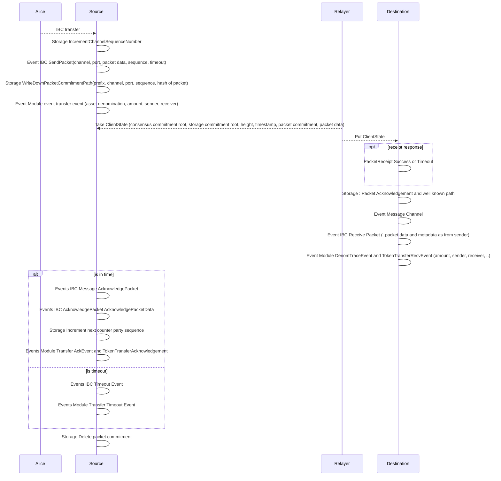

# Overview

This is draft packet correlation algorithm.

It is based on event emissions from [Go](https://github.com/cosmos/ibc-go/blob/main/modules/core/04-channel/keeper/events.go) and [Rust](https://github.com/cosmos/ibc-rs/blob/main/crates/ibc/src/core/ics04_channel/events.rs) implementations of [IBC channels and packet semantics](https://github.com/dzmitry-lahoda-forks/ibc/blob/main/spec/core/ics-004-channel-and-packet-semantics/README.md) with extensions to [parse token transfers](https://github.com/dzmitry-lahoda-forks/ibc/tree/main/spec/app/ics-020-fungible-token-transfer) and [packet forwarding](https://github.com/strangelove-ventures/packet-forward-middleware
) and [Osmosis IBC hooks](https://github.com/osmosis-labs/osmosis/blob/main/x/ibc-hooks/README.md).

## Prerequisites

You are have read or have some understanding of IBC whitepaper.

Requires some level of read side expertise in storage used by consensus engine to be able to understand when to subscribe to relevant commitment prefixes. On [Substrate](https://www.shawntabrizi.com/substrate/substrate-storage-deep-dive/) or in Cosmos SDK.

## Algorithm 

Consists of 2 phases. 

First is indexing low cardinality not so often updated network indexing "registry" as described in IBC specs about clients, connections and channels. After this there is ability to map any packet to relevant "networks" it was send from(source) and to(destination). We are interested here only in successful registrations of networks.

Second is [tracking](./packet.go) packets for proposed tracking algorithm. It concerns with failure scenarios too.

As of now fees, assets and [relayers](https://github.com/informalsystems/chainpulse) and other kinds of middleware tracking is not scoped.

## Notes

Can look into off chain network registry from Cosmos only perspective [here](https://github.com/cosmos/chain-registry/) 

### The diagram

Correlating IBC events and storage updates depends on exact order of things happen in ibc-go and ibc-rs (same order), and on module which data is parsed(transfer at hand, can be other later).

