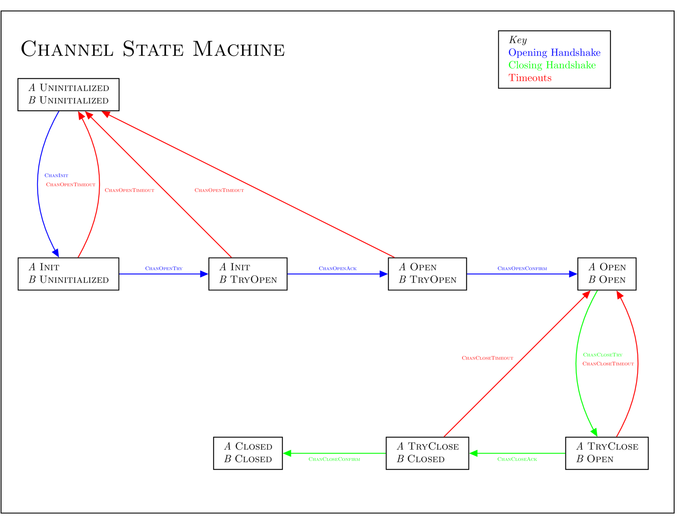
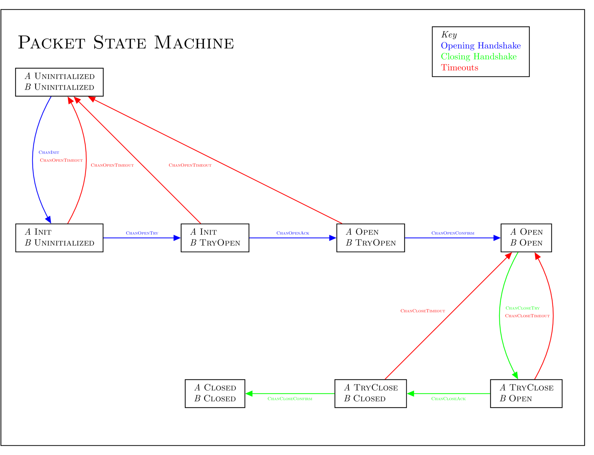

## Synopsis

The "channel" abstraction provides message delivery semantics to the interblockchain communication protocol, in three categories: ordering, exactly-once delivery, and module permissioning. A channel serves as a conduit for packets passing between a module on one chain and a module on another, ensuring that packets are executed only once, delivered in the order in which they were sent (if necessary), and delivered only to the corresponding module owning the other end of the channel on the destination chain. Each channel is associated with a particular connection, and a connection may have any number of associated channels, allowing the use of common identifiers and amortizing the cost of header verification across all the channels utilizing a connection & light client.

Channels are payload-agnostic. The module which receives an IBC packet on chain `B` decides how to act upon the incoming data, and must utilize its own application logic to determine which state transactions to apply according to what data the packet contains. Both chains must only agree that the packet has been received.

### Motivation

The interblockchain communication protocol uses a cross-chain message passing model which makes no assumptions about network synchrony. IBC *packets* are relayed from one blockchain to the other by external relayer processes. Chain `A` and chain `B` confirm new blocks independently, and packets from one chain to the other may be delayed, censored, or re-ordered arbitrarily. Packets are public and can be read from a blockchain by any relayer and submitted to any other blockchain. In order to provide the desired ordering, exactly-once delivery, and module permissioning semantics to the application layer, the interblockchain communication protocol must implement an abstraction to enforce these semantics — channels are this abstraction.

### Definitions

`Connection` is as defined in [ICS 3](../ics-3-connection-semantics).

`Commitment`, `CommitmentProof`, and `CommitmentRoot` are as defined in [ICS 23](../ics-23-vector-commitments).

`commit` is a generic collision-resistant hash function, the specifics of which must be agreed on by the modules utilizing the channel.

`Identifier`, `get`, `set`, `delete`, and module-system related primitives are as defined in [ICS 24](../ics-24-host-requirements).

A *channel* is a pipeline for exactly-once packet delivery between specific modules on separate blockchains, which has at least one send and one receive end.

A *bidirectional* channel is a channel where packets can flow in both directions: from `A` to `B` and from `B` to `A`.

A *unidirectional* channel is a channel where packets can only flow in one direction: from `A` to `B`.

An *ordered* channel is a channel where packets are delivered exactly in the order which they were sent.

An *unordered* channel is a channel where packets can be delivered in any order, which may differ from the order in which they were sent.

Directionality and ordering are independent, so one can speak of a bidirectional unordered channel, a unidirectional ordered channel, etc.

All channels provide exactly-once packet delivery, meaning that a packet sent on one end of a channel is delivered no more than once, eventually, to the other end.

This specification only concerns itself with *bidirectional ordered* channels. *Unidirectional* and *unordered* channels use almost exactly the same protocol and will be outlined in a future ICS.

Channels have a *state*:

```typescript
enum ChannelState {
  INIT,
  OPENTRY,
  OPEN,
  CLOSETRY,
  CLOSED,
}
```

An *end* of a channel is a data structure on one chain storing channel metadata:

```typescript
interface ChannelEnd {
  state: ChannelState
  counterpartyChannelIdentifier: Identifier
  moduleIdentifier: Identifier
  counterpartyModuleIdentifier: Identifier
  nextSequenceSend: uint64
  nextSequenceRecv: uint64
  nextTimeoutHeight: uint64
}
```

An IBC *packet* is a particular datagram, defined as follows:

```typescript
interface Packet {
  sequence: uint64
  timeoutHeight: uint64
  sourceConnection: Identifier
  sourceChannel: Identifier
  destConnection: Identifier
  destChannel: Identifier
  data: bytes
}
```

### Desired Properties

#### Efficiency

- The speed of packet transmission and confirmation should be limited only by the speed of the underlying chains.
  Proofs should be batcheable where possible.

#### Exactly-once delivery

- IBC packets sent on one end of a channel should be delivered exactly once to the other end.
- No network synchrony assumptions should be required for safety of exactly-once delivery.
  If one or both of the chains should halt, packets should be delivered no more than once, and once the chains resume packets should be able to flow again.

#### Ordering

- Packets should be sent and received in the same order: if packet *x* is sent before packet *y* by a channel end on chain `A`, packet *x* must be received before packet *y* by the corresponding channel end on chain `B`.

#### Permissioning

- Channels should be permissioned to one module on each end, determined during the handshake and immutable afterwards (higher-level logic could tokenize channel ownership).
  Only the module associated with a channel end should be able to send or receive on it.

## Technical Specification

#### Reasoning

The ordering and exactly-once delivery guarantees provided by IBC can be used to reason about the combined state of connected modules on two chains. For example, an application may wish to allow a single tokenized asset to be transferred between and held on multiple blockchains while preserving fungibility and conservation of supply. The application can mint asset vouchers on chain `B` when a particular IBC packet is committed to chain `B`, and require outgoing sends of that packet on chain `A` to escrow an equal amount of the asset on chain `A` until the vouchers are later redeemed back to chain `A` with an IBC packet in the reverse direction. This ordering guarantee along with correct application logic can ensure that total supply is preserved across both chains and that any vouchers minted on chain `B` can later be redeemed back to chain `A`.



### Channel opening handshake

```typescript
interface ChanOpenInit {
  connectionIdentifier: Identifier
  channelIdentifier: Identifier
  counterpartyChannelIdentifier: Identifier
  counterpartyModuleIdentifier: Identifier
  nextTimeoutHeight: uint64
}
```

```typescript
function chanOpenInit(
  connectionIdentifier: Identifier, channelIdentifier: Identifier,
  counterpartyChannelIdentifier: Identifier, counterpartyModuleIdentifier: Identifier, nextTimeoutHeight: uint64) {
  moduleIdentifier = getCallingModule()
  assert(get("connections/{connectionIdentifier}/channels/{channelIdentifier}") === null)
  connection = get("connections/{connectionIdentifier}")
  assert(connection.state === OPEN)
  channel = Channel{INIT, moduleIdentifier, counterpartyModuleIdentifier,
                    counterpartyChannelIdentifier, 0, 0, nextTimeoutHeight}
  set("connections/{connectionIdentifier}/channels/{channelIdentifier}", channel)
}
```

```typescript
interface ChanOpenTry {
  connectionIdentifier: Identifier
  channelIdentifier: Identifier
  counterpartyChannelIdentifier: Identifier
  moduleIdentifier: Identifier
  counterpartyModuleIdentifier: Identifier
  timeoutHeight: uint64
  nextTimeoutHeight: uint64
  proofInit: CommitmentProof
}
```

```typescript
function chanOpenTry(
  connectionIdentifier: Identifier, channelIdentifier: Identifier, counterpartyChannelIdentifier: Identifier,
  moduleIdentifier: Identifier, counterpartyModuleIdentifier: Identifier,
  timeoutHeight: uint64, nextTimeoutHeight: uint64, proofInit: CommitmentProof) {
  assert(getConsensusState().getHeight() < timeoutHeight)
  assert(get("connections/{connectionIdentifier}/channels/{channelIdentifier}") === null)
  assert(getCallingModule() === moduleIdentifier)
  connection = get("connections/{connectionIdentifier}")
  assert(connection.state === OPEN)
  consensusState = get("clients/{connection.clientIdentifier}")
  assert(verifyMembership(
    consensusState,
    proofInit,
    "connections/{connection.counterpartyConnectionIdentifier}/channels/{counterpartyChannelIdentifier}",
    Channel{INIT, counterpartyModuleIdentifier, moduleIdentifier, channelIdentifier, 0, 0, timeoutHeight}
  ))
  channel = Channel{OPENTRY, moduleIdentifier, counterpartyModuleIdentifier,
                    counterpartyChannelIdentifier, 0, 0, nextTimeoutHeight}
  set("connections/{connectionIdentifier}/channels/{channelIdentifier}", channel)
}
```

```typescript
interface ChanOpenAck {
  connectionIdentifier: Identifier
  channelIdentifier: Identifier
  timeoutHeight: uint64
  nextTimeoutHeight: uint64
  proofTry: CommitmentProof
}
```

```typescript
function chanOpenAck(
  connectionIdentifier: Identifier, channelIdentifier: Identifier,
  timeoutHeight: uint64, nextTimeoutHeight: uint64, proofTry: CommitmentProof) {
  assert(getConsensusState().getHeight() < timeoutHeight)
  channel = get("connections/{connectionIdentifier}/channels/{channelIdentifier}")
  assert(channel.state === INIT)
  assert(getCallingModule() === channel.moduleIdentifier)
  connection = get("connections/{connectionIdentifier}")
  assert(connection.state === OPEN)
  consensusState = get("clients/{connection.clientIdentifier}")
  assert(verifyMembership(
    consensusState.getRoot(),
    proofTry,
    "connections/{connection.counterpartyConnectionIdentifier}/channels/{channel.counterpartyChannelIdentifier}",
    Channel{OPENTRY, channel.counterpartyModuleIdentifier, channel.moduleIdentifier,
            channelIdentifier, 0, 0, timeoutHeight}
  ))
  channel.state = OPEN
  channel.nextTimeoutHeight = nextTimeoutHeight
  set("connections/{connectionIdentifier}/channels/{channelIdentifier}", channel)
}
```

```typescript
interface ChanOpenConfirm {
  connectionIdentifier: Identifier
  channelIdentifier: Identifier
  timeoutHeight: uint64
  proofAck: CommitmentProof
}
```

```typescript
function chanOpenConfirm(
  connectionIdentifier: Identifier, channelIdentifier: Identifier,
  timeoutHeight: uint64, proofAck: CommitmentProof) {
  assert(getConsensusState().getHeight() < timeoutHeight)
  channel = get("connections/{connectionIdentifier}/channels/{channelIdentifier}")
  assert(channel.state === OPENTRY)
  assert(getCallingModule() === channel.moduleIdentifier)
  connection = get("connections/{connectionIdentifier}")
  assert(connection.state === OPEN)
  consensusState = get("clients/{connection.clientIdentifier}")
  assert(verifyMembership(
    consensusState.getRoot(),
    proofAck,
    "connections/{connection.counterpartyConnectionIdentifier}/channels/{channel.counterpartyChannelIdentifier}",
    Channel{OPEN, channel.counterpartyModuleIdentifier, channel.moduleIdentifier,
            channelIdentifier, 0, 0, timeoutHeight}
  ))
  channel.state = OPEN
  channel.nextTimeoutHeight = 0
  set("connections/{connectionIdentifier}/channels/{channelIdentifier}", channel)
}
```

```typescript
interface ChanOpenTimeout {
  connectionIdentifier: Identifier
  channelIdentifier: Identifier
  timeoutHeight: uint64
  proofTimeout: CommitmentProof
}
```

```typescript
function chanOpenTimeout(
  connectionIdentifier: Identifier, channelIdentifier: Identifier,
  timeoutHeight: uint64, proofTimeout: CommitmentProof) {
  channel = get("connections/{connectionIdentifier}/channels/{channelIdentifier}")
  connection = get("connections/{connectionIdentifier}")
  assert(connection.state === OPEN)
  consensusState = get("clients/{connection.clientIdentifier}/consensusState")
  assert(consensusState.getHeight() >= connection.nextTimeoutHeight)
  switch channel.state {
    case INIT:
      assert(verifyNonMembership(
        consensusState, proofTimeout,
        "connections/{connection.counterpartyIdentifier}/channels/{channel.counterpartyChannelIdentifier}"
      ))
    case OPENTRY:
      assert(
        verifyNonMembership(
          consensusState, proofTimeout,
          "connections/{connection.counterpartyIdentifier}/channels/{channel.counterpartyChannelIdentifier}"
        )
        ||
        verifyMembership(
          consensusState, proofTimeout,
          "connections/{connection.counterpartyIdentifier}/channels/{channel.counterpartyChannelIdentifier}",
          Channel{INIT, channel.counterpartyModuleIdentifier, channel.moduleIdentifier,
                  channelIdentifier, 0, 0, timeoutHeight}
        )
      )
    case OPEN:
      expected = Channel{OPENTRY, channel.counterpartyModuleIdentifier, channel.moduleIdentifier,
                         channelIdentifier, 0, 0, timeoutHeight}
      assert(verifyMembership(
        consensusState, proofTimeout,
        "connections/{connection.counterpartyIdentifier}/channels/{channel.counterpartyChannelIdentifier}",
        expected
      ))
  }
  delete("connections/{connectionIdentifier}/channels/{channelIdentifier}")
}
```

### Channel closing handshake

```typescript
interface ChanCloseInit {
  connectionIdentifier: Identifier
  channelIdentifier: Identifier
  nextTimeoutHeight: uint64
}
```

```typescript
function chanCloseInit(connectionIdentifier: Identifier, channelIdentifier: Identifier, nextTimeoutHeight: uint64) {
  channel = get("connections/{connectionIdentifier}/channels/{channelIdentifier}")
  assert(channel.state === OPEN)
  connection = get("connections/{connectionIdentifier}")
  assert(connection.state === OPEN)
  channel.state = CLOSETRY
  channel.nextTimeoutHeight = nextTimeoutHeight
  set("connections/{connectionIdentifier}/channels/{channelIdentifier}", channel)
}
```

```typescript
interface ChanCloseTry {
  connectionIdentifier: Identifier
  channelIdentifier: Identifier
  timeoutHeight: uint64
  nextTimeoutHeight: uint64
  proofInit: CommitmentProof
}
```

```typescript
function chanCloseTry(
  connectionIdentifier: Identifier, channelIdentifier: Identifier,
  timeoutHeight: uint64, nextTimeoutHeight: uint64, proofInit: CommitmentProof) {
  assert(getConsensusState().getHeight() < timeoutHeight)
  channel = get("connections/{connectionIdentifier}/channels/{channelIdentifier}")
  assert(channel.state === OPEN)
  connection = get("connections/{connectionIdentifier}")
  assert(connection.state === OPEN)
  consensusState = get("clients/{connection.clientIdentifier}/consensusState")
  expected = Channel{INIT, channel.counterpartyModuleIdentifier, channel.moduleIdentifier,
                     channel.channelIdentifier, 0, 0, timeoutHeight}
  assert(verifyMembership(
    consensusState,
    proofInit,
    "connections/{connection.counterpartyIdentifier}/channels/{channel.counterpartyChannelIdentifier}",
    expected
  ))
  channel.state = CLOSED
  channel.nextTimeoutHeight = nextTimeoutHeight
  set("connections/{connectionIdentifier}/channels/{channelIdentifier}", channel)
}
```

```typescript
interface ChanCloseAck {
  connectionIdentifier: Identifier
  channelIdentifier: Identifier
  timeoutHeight: uint64
  proofTry: CommitmentProof
}
```

```typescript
function chanCloseAck(
  connectionIdentifier: Identifier, channelIdentifier: Identifier,
  timeoutHeight: uint64, proofTry: CommitmentProof) {
  assert(getConsensusState().getHeight() < timeoutHeight)
  channel = get("connections/{connectionIdentifier}/channels/{channelIdentifier}")
  assert(channel.state === OPEN)
  connection = get("connections/{connectionIdentifier}")
  assert(connection.state === OPEN)
  consensusState = get("clients/{connection.clientIdentifier}/consensusState")
  expected = Channel{CLOSED, channel.counterpartyModuleIdentifier, channel.moduleIdentifier,
                     channelIdentifier, 0, 0, timeoutHeight}
  assert(verifyMembership(
    consensusState.getRoot(),
    proofInit,
    "connections/{connection.counterpartyIdentifier}/channels/{channel.counterpartyChannelIdentifier}",
    expected
  ))
  channel.state = CLOSED
  channel.nextTimeoutHeight = 0
  set("connections/{connectionIdentifier}/channels/{channelIdentifier}", channel)
}
```

```typescript
interface ChanCloseTimeout {
  connectionIdentifier: Identifier
  channelIdentifier: Identifier
  timeoutHeight: uint64
  proofTimeout: CommitmentProof
}
```

```typescript
function chanCloseTimeout(
  connectionIdentifier: Identifier, channelIdentifier: Identifier,
  timeoutHeight: uint64, proofTimeout: CommitmentProof) {
  channel = get("connections/{connectionIdentifier}/channels/{channelIdentifier}")
  consensusState = get("clients/{connection.clientIdentifier}/consensusState")
  assert(consensusState.getHeight() >= connection.nextTimeoutHeight)
  switch channel.state {
    case CLOSETRY:
      expected = Channel{OPEN, channel.counterpartyModuleIdentifier, channel.moduleIdentifier,
                         channelIdentifier, 0, 0, timeoutHeight}
    case CLOSED:
      expected = Channel{CLOSETRY, channel.counterpartyModuleIdentifier, channel.moduleIdentifier,
                         channelIdentifier, 0, 0, timeoutHeight}
  }
  verifyMembership(
    consensusState,
    proofTimeout,
    "connections/{connectionIdentifier}/channels/{channelIdentifier}",
    expected
  )
  channel.state = OPEN
  channel.nextTimeoutHeight = 0
  set("connections/{connectionIdentifier}/channels/{channelIdentifier}", channel)
}
```

### Sending packets



The `sendPacket` function is called by a module in order to send an IBC packet on a channel end owned by the calling module to the corresponding module the counterparty chain.

Calling modules MUST execute application logic atomically in conjunction with calling `sendPacket`.

The IBC handler performs the following steps in order:
- Checks that the channel & connection are open to send packets
- Checks that the calling module owns the channel end
- Checks that the packet metadata matches the channel & connection information
- Checks that the timeout height specified has not already passed on the destination chain
- Increments the send sequence counter associated with the channel
- Stores a succinct hash commitment to the packet data

Note that the full packet is not stored in the state of the chain - merely a short hash-commitment. The packet data can be calculated from the transaction execution and possibly returned as log output which relayers can index.

```typescript
function sendPacket(packet: Packet) {
  channel = get("connections/{packet.sourceConnection}/channels/{packet.sourceChannel}")
  assert(channel.state === OPEN)
  assert(getCallingModule() === channel.moduleIdentifier)
  assert(packet.destChannel === channel.counterpartyChannelIdentifier)
  connection = get("connections/{packet.sourceConnection}")
  assert(connection.state === OPEN)
  assert(packet.destConnection === connection.counterpartyConnectionIdentifier)
  consensusState = get("clients/{connection.clientIdentifier}")
  assert(consensusState.getHeight() < packet.timeoutHeight)
  assert(packet.sequence === channel.nextSequenceSend)
  channel.nextSequenceSend = channel.nextSequenceSend + 1
  set("connections/{packet.sourceConnection}/channels/{packet.sourceChannel}", channel)
  set("connections/{packet.sourceConnection}/channels/{packet.sourceChannel}/packets/{sequence}", commit(packet.data))
}
```

### Receiving packets

The `recvPacket` function is called by a module in order to receive & process an IBC packet sent on the corresponding channel end on the counterparty chain.

Calling modules MUST execute application logic atomically in conjunction with calling `recvPacket`.

The IBC handler performs the following steps in order:
- Checks that the channel & connection are open to receive packets
- Checks that the calling module owns the channel end
- Checks that the packet metadata matches the channel & connection information
- Checks that the packet sequence is the next sequence the channel end expects to receive
- Checks that the timeout height has not yet passed
- Checks the inclusion proof of packet data commitment in the outgoing chain's state
- Increments the packet receive sequence associated with the channel end

```typescript
function recvPacket(packet: Packet, proof: CommitmentProof) {
  channel = get("connections/{packet.destConnection}/channels/{packet.destChannel}")
  assert(channel.state === OPEN)
  assert(getCallingModule() === channel.moduleIdentifier)
  assert(packet.sourceChannel === channel.counterpartyChannelIdentifier)
  assert(packet.sequence === channel.nextSequenceRecv)
  connection = get("connections/{connectionIdentifier}")
  assert(packet.sourceConnection === connection.counterpartyConnectionIdentifier)
  assert(connection.state === OPEN)
  consensusState = getConsensusState()
  assert(consensusState.getHeight() < packet.timeoutHeight)
  assert(verifyMembership(
    consensusState.getRoot(),
    proof,
    "connections/{packet.sourceConnection}/channels/{packet.sourceChannel}/packets/{sequence}"
    key,
    commit(packet.data)
  ))
  channel.nextSequenceRecv = channel.nextSequenceRecv + 1
  set("connections/{packet.destConnection}/channels/{packet.destChannel}", channel)
}
```

### Timeouts

Application semantics may require some timeout: an upper limit to how long the chain will wait for a transaction to be processed before considering it an error. Since the two chains have different local clocks, this is an obvious attack vector for a double spend - an attacker may delay the relay of the receipt or wait to send the packet until right after the timeout - so applications cannot safely implement naive timeout logic themselves.

Note that in order to avoid any possible "double-spend" attacks, the timeout algorithm requires that the destination chain is running and reachable. One can prove nothing in a complete network partition, and must wait to connect; the timeout must be proven on the recipient chain, not simply the absence of a response on the sending chain.

#### Sending end

The `timeoutPacket` function is called by a module.

Calling modules MUST atomically execute appropriate application timeout-handling logic in conjunction with calling `timeoutPacket`.

```typescript
function timeoutPacket(packet: Packet, proof: CommitmentProof) {
  channel = get("connections/{packet.sourceConnection}/channels/{packet.sourceChannel}")
  assert(channel.state === OPEN)
  assert(getCallingModule() === channel.moduleIdentifier)
  assert(packet.destChannel === channel.counterpartyChannelIdentifier)
  connection = get("connections/{packet.sourceConnection}")
  assert(connection.state === OPEN)
  assert(packet.destConnection === connection.counterpartyIdentifier)


  // check that timeout height has passed on the other end
  consensusState = get("clients/{connection.clientIdentifier}")
  assert(consensusState.getHeight() >= timeoutHeight)

  // verify we actually sent this packet, check the store
  key = "connections/{packet.sourceConnection}/channels/{packet.sourceChannel}/packets/{sequence}"
  assert(get(key) === commit(packet.data))

  // assert we haven't "timed-out" already, TODO

  // check that the recv sequence is as claimed
  assert(verifyMembership(
    consensusState.getRoot(),
    proof,
    "connections/{packet.destConnection}/channels/{packet.destChannel}/nextSequenceRecv",
    nextSequenceRecv
  ))

  // mark the store so we can't "timeout" again" TODO
  set("connections/{packet.sourceConnection}/channels/{packet.sourceChannel}/packets/{sequence}/timedOut", "true")
}
```

If relations are enforced between timeout heights of subsequent packets, safe bulk timeouts of all packets prior to a timed-out packet can be performed.
This specification omits details for now.

#### Receiving end

The `recvTimeoutPacket` function is called by a module in order to process an IBC packet sent on the corresponding channel which has timed out.
This must be done in order to safely increment the received packet sequence and move on to future packets.

Calling modules MUST NOT execute any application logic in conjunction with calling `recvTimeoutPacket`.

```typescript
function recvTimeoutPacket(packet: Packet, proof: CommitmentProof) {
  channel = get("connections/{packet.destConnection}/channels/{packet.destChannel}")
  assert(channel.state === OPEN)
  assert(getCallingModule() === channel.moduleIdentifier)
  assert(packet.sourceChannel === channel.counterpartyChannelIdentifier)
  assert(packet.sequence === channel.nextSequenceRecv)
  connection = get("connections/{connectionIdentifier}")
  assert(packet.sourceConnection === connection.counterpartyConnectionIdentifier)
  assert(connection.state === OPEN)
  consensusState = getConsensusState()
  assert(consensusState.getHeight() >= packet.timeoutHeight)
  assert(verifyMembership(
    consensusState.getRoot(),
    proof,
    "connections/{packet.sourceConnection}/channels/{packet.sourceChannel}/packets/{sequence}"
    key,
    commit(packet.data)
  ))
  channel.nextSequenceRecv = channel.nextSequenceRecv + 1
  set("connections/{packet.destConnection}/channels/{packet.destChannel}", channel)
}
```

### Cleaning up state

`cleanupPacket` can be called by a module to remove a received packet commitment from storage. The receiving end must have already processed the packet (whether regularly or past timeout).

```typescript
function cleanupPacket(packet: Packet, proof: CommitmentProof, nextSequenceRecv: uint64) {
  channel = get("connections/{packet.sourceConnection}/channels/{packet.sourceChannel}")
  assert(channel.state === OPEN)
  assert(getCallingModule() === channel.moduleIdentifier)
  assert(packet.destChannel === channel.counterpartyChannelIdentifier)
  connection = get("connections/{packet.sourceConnection}")
  assert(connection.state === OPEN)
  assert(packet.destConnection === connection.counterpartyIdentifier)

  // assert packet has been received on the other end
  assert(nextSequenceRecv > packet.sequence)

  consensusState = get("clients/{connection.clientIdentifier}")

  // check that the recv sequence is as claimed
  assert(verifyMembership(
    consensusState.getRoot(),
    proof,
    "connections/{packet.destConnection}/channels/{packet.destChannel}/nextSequenceRecv",
    nextSequenceRecv
  ))

  // calculate key
  key = "connections/{packet.sourceConnection}/channels/{packet.sourceChannel}/packets/{sequence}"

  // verify we actually sent the packet, check the store
  assert(get(key) === commit(packet.data))
  
  // clear the store
  delete(key)
}
```

## Backwards Compatibility

Not applicable.

## Forwards Compatibility

Data structures & encoding can be versioned at the connection or channel level.

## Example Implementation

Coming soon.

## Other Implementations

Coming soon.

## History

17 May 2019 - Draft submitted

## Copyright

Copyright and related rights waived via [CC0](https://creativecommons.org/publicdomain/zero/1.0/).
